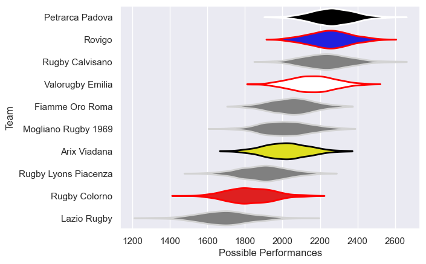

---  
title: "Peroni Top10 2021 Status"  
date: 2025-07-28 6:00:00 -0500  
categories: model review projection  
layout: article  
aside:  
    toc: true  
---
# Current Team Rankings

# Standings

## Current Standings

| Club                 |   Played |   Wins |   Point Differential |   Losing Bonus Points | Try Bonus Points   |   Competition Points |
|:---------------------|---------:|-------:|---------------------:|----------------------:|:-------------------|---------------------:|
| Petrarca Padova      |       17 |     13 |                  269 |                     3 |                    |                   57 |
| Rovigo               |       16 |     12 |                  221 |                     2 |                    |                   52 |
| Rugby Calvisano      |       15 |     10 |                  155 |                     2 |                    |                   46 |
| Valorugby Emilia     |       16 |     10 |                  117 |                     3 |                    |                   45 |
| Arix Viadana         |       12 |      7 |                   16 |                     1 |                    |                   31 |
| Mogliano Rugby 1969  |       13 |      5 |                  -33 |                     4 |                    |                   26 |
| Fiamme Oro Roma      |       13 |      4 |                    7 |                     4 |                    |                   22 |
| Rugby Lyons Piacenza |       11 |      3 |                 -177 |                     1 |                    |                   13 |
| Rugby Colorno        |       12 |      1 |                 -233 |                     2 |                    |                    6 |
| Lazio Rugby          |       15 |      1 |                 -342 |                     2 |                    |                    6 |

# Completed Match Review

| Model | Percent Correct Predictions | Spread Error |
| ------ | ------ | ------ |
| Club Level | 81.4% | 9.7 |
| Player Level: Lineup | nan% | nan |
| Player Level: Minutes | nan% | nan |

