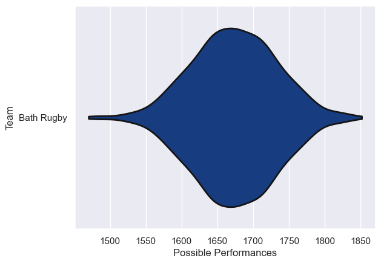
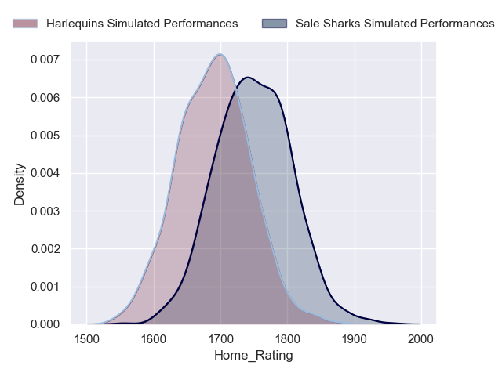
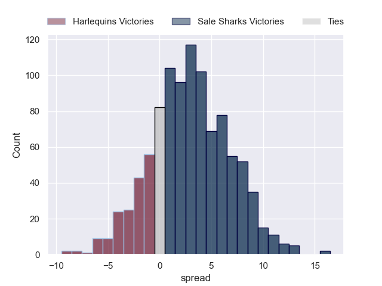
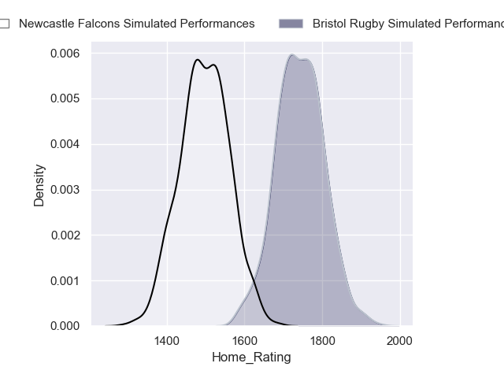
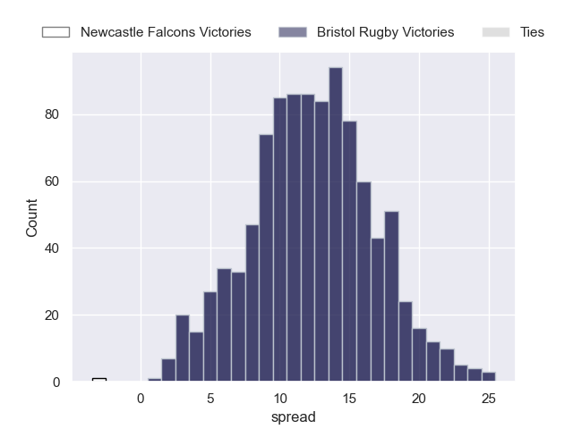

---  
title: "Premiership Rugby 2024 Status"  
date: 2024-04-15 6:00:00 -0500  
categories: model review projection  
layout: article  
aside:  
    toc: true  
---
# Current Team Rankings

# Standings

## Projected Total Table

| Club              |   Total Matches |   Wins |   Point Differential |   Losing Bonus Points |   Try Bonus Points |   Competition Points |
|:------------------|----------------:|-------:|---------------------:|----------------------:|-------------------:|---------------------:|
| Bristol Rugby     |               1 |    1   |             11.9489  |                   0   |                0.7 |                  4.7 |
| Sale Sharks       |               1 |    0.8 |              2.71394 |                   0.2 |                0.2 |                  3.5 |
| Harlequins        |               1 |    0.2 |             -2.71394 |                   0.6 |                0.3 |                  1.8 |
| Newcastle Falcons |               1 |    0   |            -11.9489  |                   0.1 |                0.2 |                  0.3 |

# Future Predictions

## Week 1

### Sale Sharks V Harlequins on 2024/04/21

Average Margin: Sale Sharks by 2.7

Average Scoreline: 43-40

### Bristol Rugby V Newcastle Falcons on 2024/04/21

Average Margin: Bristol Rugby by 11.9

Average Scoreline: 44-32

