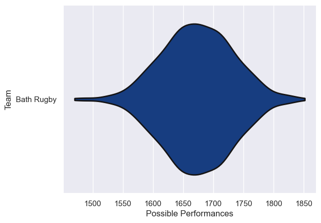
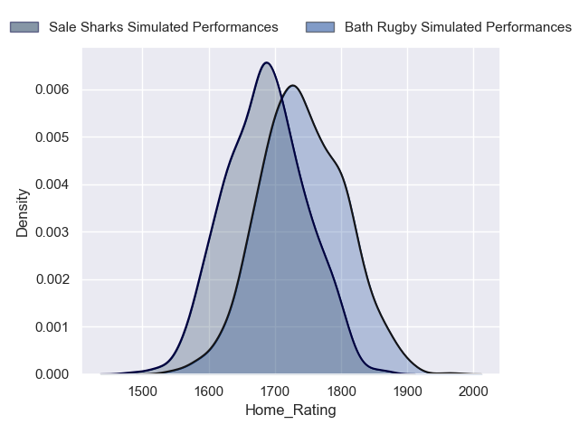
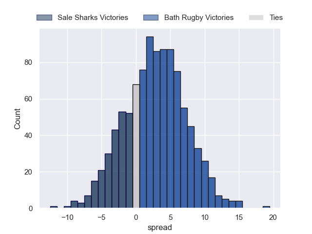

---  
title: "Premiership Rugby 2024 Status"  
date: 2024-03-18 6:00:00 -0500  
categories: model review projection  
layout: article  
aside:  
    toc: true  
---
# Current Team Rankings

# Standings

## Projected Total Table

| Club        |   Total Matches |   Wins |   Point Differential |   Losing Bonus Points |   Try Bonus Points |   Competition Points |
|:------------|----------------:|-------:|---------------------:|----------------------:|-------------------:|---------------------:|
| Bath Rugby  |               1 |    0.7 |              2.79066 |                   0.3 |                0.2 |                  3.4 |
| Sale Sharks |               1 |    0.3 |             -2.79066 |                   0.6 |                0.2 |                  1.8 |

# Future Predictions

## Week 1

### Bath Rugby V Sale Sharks on 2024/03/24

Average Margin: Bath Rugby by 2.8

Average Scoreline: 27-24

