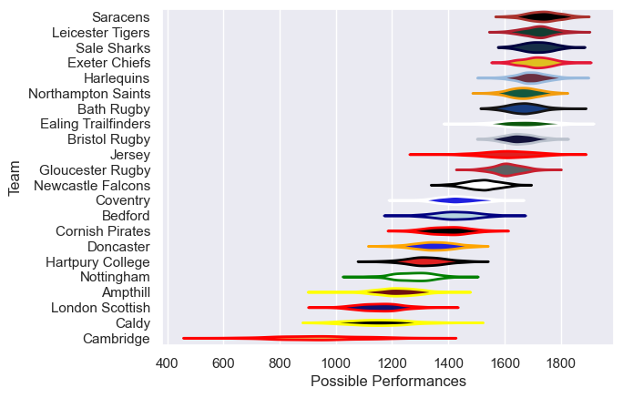

---  
title: "Premiership Rugby Cup 2023 Status"  
date: 2024-03-05 6:00:00 -0500  
categories: model review projection  
layout: article  
aside:  
    toc: true  
---
# Current Team Rankings

# Standings

## Current Standings

| Club                |   Played |   Wins |   Point Differential |   Losing Bonus Points |   Try Bonus Points |   Competition Points |
|:--------------------|---------:|-------:|---------------------:|----------------------:|-------------------:|---------------------:|
| Gloucester Rugby    |        5 |      5 |                   72 |                     0 |                nan |                   20 |
| Exeter Chiefs       |        5 |      4 |                  138 |                     0 |                nan |                   16 |
| Leicester Tigers    |        5 |      4 |                  132 |                     0 |                nan |                   16 |
| Ealing Trailfinders |        4 |      4 |                   79 |                     0 |                nan |                   16 |
| Newcastle Falcons   |        5 |      4 |                   46 |                     0 |                nan |                   16 |
| Harlequins          |        5 |      3 |                   63 |                     0 |                nan |                   14 |
| Sale Sharks         |        5 |      3 |                   99 |                     1 |                nan |                   13 |
| Northampton Saints  |        5 |      3 |                   94 |                     1 |                nan |                   13 |
| Bath Rugby          |        5 |      3 |                   37 |                     1 |                nan |                   13 |
| Coventry            |        5 |      3 |                   29 |                     1 |                nan |                   13 |
| Bristol Rugby       |        5 |      3 |                   10 |                     0 |                nan |                   12 |
| Bedford             |        5 |      3 |                  -13 |                     0 |                nan |                   12 |
| Saracens            |        5 |      2 |                   72 |                     1 |                nan |                    9 |
| Cornish Pirates     |        4 |      2 |                   52 |                     1 |                nan |                    9 |
| Doncaster           |        5 |      2 |                  -59 |                     1 |                nan |                    9 |
| Jersey              |        3 |      2 |                   46 |                     0 |                nan |                    8 |
| Caldy               |        5 |      1 |                 -118 |                     0 |                nan |                    4 |
| Hartpury College    |        5 |      1 |                 -136 |                     0 |                nan |                    4 |
| Nottingham          |        5 |      0 |                 -100 |                     1 |                nan |                    3 |
| Ampthill            |        5 |      0 |                 -146 |                     2 |                nan |                    2 |
| London Scottish     |        5 |      0 |                 -154 |                     1 |                nan |                    1 |
| Cambridge           |        5 |      0 |                 -243 |                     0 |                nan |                    0 |

## Projected Remaining Table

| Club   | Matches Remaining   | Wins   | Point Differential   | Losing Bonus Points   | Try Bonus Points   | Competition Points   |
|--------|---------------------|--------|----------------------|-----------------------|--------------------|----------------------|

## Projected Total Table

| Club                |   Total Matches |   Wins |   Point Differential |   Losing Bonus Points |   Try Bonus Points |   Competition Points |
|:--------------------|----------------:|-------:|---------------------:|----------------------:|-------------------:|---------------------:|
| Gloucester Rugby    |               5 |      5 |                   72 |                     0 |                  0 |                   20 |
| Exeter Chiefs       |               5 |      4 |                  138 |                     0 |                  0 |                   16 |
| Leicester Tigers    |               5 |      4 |                  132 |                     0 |                  0 |                   16 |
| Ealing Trailfinders |               4 |      4 |                   79 |                     0 |                  0 |                   16 |
| Newcastle Falcons   |               5 |      4 |                   46 |                     0 |                  0 |                   16 |
| Harlequins          |               5 |      3 |                   63 |                     0 |                  0 |                   14 |
| Sale Sharks         |               5 |      3 |                   99 |                     1 |                  0 |                   13 |
| Northampton Saints  |               5 |      3 |                   94 |                     1 |                  0 |                   13 |
| Bath Rugby          |               5 |      3 |                   37 |                     1 |                  0 |                   13 |
| Coventry            |               5 |      3 |                   29 |                     1 |                  0 |                   13 |
| Bristol Rugby       |               5 |      3 |                   10 |                     0 |                  0 |                   12 |
| Bedford             |               5 |      3 |                  -13 |                     0 |                  0 |                   12 |
| Saracens            |               5 |      2 |                   72 |                     1 |                  0 |                    9 |
| Cornish Pirates     |               4 |      2 |                   52 |                     1 |                  0 |                    9 |
| Doncaster           |               5 |      2 |                  -59 |                     1 |                  0 |                    9 |
| Jersey              |               3 |      2 |                   46 |                     0 |                  0 |                    8 |
| Caldy               |               5 |      1 |                 -118 |                     0 |                  0 |                    4 |
| Hartpury College    |               5 |      1 |                 -136 |                     0 |                  0 |                    4 |
| Nottingham          |               5 |      0 |                 -100 |                     1 |                  0 |                    3 |
| Ampthill            |               5 |      0 |                 -146 |                     2 |                  0 |                    2 |
| London Scottish     |               5 |      0 |                 -154 |                     1 |                  0 |                    1 |
| Cambridge           |               5 |      0 |                 -243 |                     0 |                  0 |                    0 |

# Completed Match Review

| Model | Percent Correct Predictions | Spread Error |
| ------ | ------ | ------ |
| Club Level | 75.5% | 18.4 |
| Player Level: Lineup | nan% | nan |
| Player Level: Minutes | nan% | nan |

# Future Predictions

## Week 6
