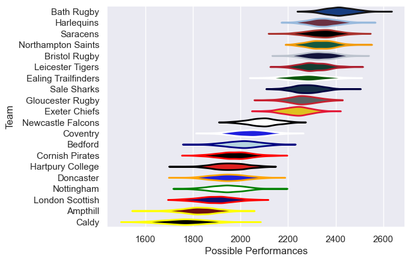

---  
title: "Premiership Rugby Cup 24/25"  
date: 2025-07-29 6:00:00 -0500  
categories: model review projection  
layout: article  
aside:  
    toc: true  
---
# Current Team Rankings

# Standings

## Current Standings

| Club                |   Played |   Wins |   Point Differential |   Losing Bonus Points |   Try Bonus Points |   Competition Points |
|:--------------------|---------:|-------:|---------------------:|----------------------:|-------------------:|---------------------:|
| Bath Rugby          |        9 |      8 |                  244 |                     0 |                  4 |                   36 |
| Exeter Chiefs       |        9 |      7 |                  192 |                     0 |                  5 |                   33 |
| Newcastle Falcons   |        8 |      6 |                  101 |                     1 |                  5 |                   30 |
| Ealing Trailfinders |        8 |      5 |                   68 |                     2 |                  5 |                   27 |
| Northampton Saints  |        7 |      5 |                   52 |                     0 |                  5 |                   25 |
| Harlequins          |        7 |      4 |                   45 |                     2 |                  6 |                   24 |
| Sale Sharks         |        7 |      4 |                   17 |                     2 |                  4 |                   22 |
| Gloucester Rugby    |        7 |      4 |                   -1 |                     1 |                  3 |                   22 |
| Leicester Tigers    |        6 |      4 |                  109 |                     0 |                  4 |                   20 |
| Bristol Rugby       |        6 |      4 |                   84 |                     0 |                  4 |                   20 |
| Saracens            |        6 |      4 |                   64 |                     0 |                  3 |                   19 |
| Doncaster           |        6 |      3 |                   40 |                     2 |                  4 |                   18 |
| Coventry            |        6 |      3 |                   10 |                     0 |                  4 |                   16 |
| Bedford             |        6 |      3 |                  -36 |                     0 |                  2 |                   14 |
| Hartpury College    |        6 |      1 |                  -99 |                     1 |                  2 |                    9 |
| Cornish Pirates     |        6 |      1 |                  -91 |                     1 |                  3 |                    8 |
| Nottingham          |        6 |      0 |                 -188 |                     1 |                  3 |                    4 |
| London Scottish     |        6 |      0 |                 -175 |                     0 |                  2 |                    2 |
| Caldy               |        6 |      0 |                 -201 |                     0 |                    |                    0 |
| Ampthill            |        6 |      0 |                 -235 |                     0 |                    |                    0 |

# Completed Match Review

| Model | Percent Correct Predictions | Spread Error |
| ------ | ------ | ------ |
| Club Level | 79.1% | 17.9 |
| Player Level: Lineup | nan% | nan |
| Player Level: Minutes | nan% | nan |

