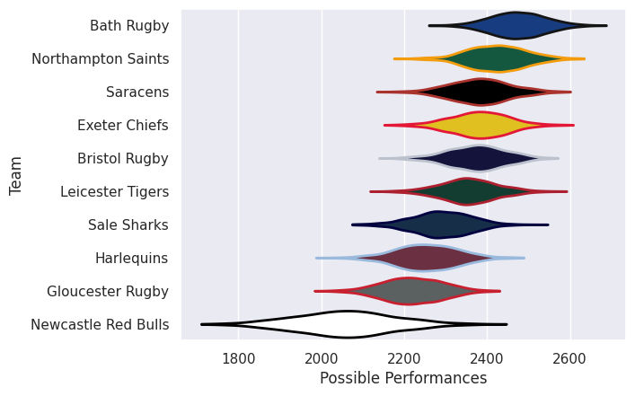

---  
title: "Premiership Rugby Cup 25/26"  
date: 2025-10-20 6:00:00 -0500  
categories: model review projection  
layout: article  
aside:  
    toc: true  
---
# Team Rankings

# Standings

## Current Standings

| Club               |   Played |   Wins |   Point Differential |   Losing Bonus Points |   Try Bonus Points |   Competition Points |
|:-------------------|---------:|-------:|---------------------:|----------------------:|-------------------:|---------------------:|
| Leicester Tigers   |        2 |      2 |                   21 |                     0 |                    |                    8 |
| Gloucester Rugby   |        2 |      1 |                   -2 |                     0 |                  2 |                    6 |
| Northampton Saints |        1 |      1 |                   15 |                     0 |                  1 |                    5 |
| Newcastle Falcons  |        1 |      1 |                   12 |                     0 |                  1 |                    5 |
| Bristol Rugby      |        2 |      1 |                    7 |                     0 |                  1 |                    5 |
| Sale Sharks        |        1 |      1 |                    9 |                     0 |                    |                    4 |
| Exeter Chiefs      |        2 |      1 |                   -5 |                     0 |                    |                    4 |
| Saracens           |        2 |      0 |                  -28 |                     0 |                  1 |                    1 |
| Bath Rugby         |        1 |      0 |                   -9 |                     0 |                    |                    0 |
| Harlequins         |        2 |      0 |                  -20 |                     0 |                    |                    0 |

## Projected Remaining Table

| Club               |   To Play |   Projected Wins |   Projected Differential |   Projected Losing Bonus Points | Projected Try Bonus Points   |   Projected Competition Points |
|:-------------------|----------:|-----------------:|-------------------------:|--------------------------------:|:-----------------------------|-------------------------------:|
| Bath Rugby         |         7 |            4.181 |                   18.689 |                           1.508 |                              |                         18.926 |
| Northampton Saints |         7 |            4.099 |                   18.372 |                           1.508 |                              |                         18.542 |
| Saracens           |         6 |            3.52  |                   16.646 |                           1.281 |                              |                         15.973 |
| Leicester Tigers   |         6 |            3.468 |                   15.233 |                           1.242 |                              |                         15.694 |
| Sale Sharks        |         7 |            3.161 |                   -2.317 |                           1.838 |                              |                         15.184 |
| Bristol Rugby      |         6 |            3.127 |                    4.271 |                           1.403 |                              |                         14.495 |
| Exeter Chiefs      |         6 |            2.91  |                    1.347 |                           1.558 |                              |                         13.812 |
| Harlequins         |         6 |            2.4   |                   -7.974 |                           1.65  |                              |                         11.878 |
| Gloucester Rugby   |         6 |            1.832 |                  -21.99  |                           1.695 |                              |                          9.585 |
| Newcastle Falcons  |         7 |            1.781 |                  -42.277 |                           1.719 |                              |                          9.313 |

## Projected Total Table

| Club               |   Played |   Wins |   Point Differential |   Losing Bonus Points |   Try Bonus Points |   Competition Points |
|:-------------------|---------:|-------:|---------------------:|----------------------:|-------------------:|---------------------:|
| Leicester Tigers   |        8 |  5.468 |               36.233 |                 1.242 |                    |               23.694 |
| Northampton Saints |        8 |  5.099 |               33.372 |                 1.508 |                  1 |               23.542 |
| Bristol Rugby      |        8 |  4.127 |               11.271 |                 1.403 |                  1 |               19.495 |
| Sale Sharks        |        8 |  4.161 |                6.683 |                 1.838 |                    |               19.184 |
| Bath Rugby         |        8 |  4.181 |                9.689 |                 1.508 |                    |               18.926 |
| Exeter Chiefs      |        8 |  3.91  |               -3.653 |                 1.558 |                    |               17.812 |
| Saracens           |        8 |  3.52  |              -11.354 |                 1.281 |                  1 |               16.973 |
| Gloucester Rugby   |        8 |  2.832 |              -23.99  |                 1.695 |                  2 |               15.585 |
| Newcastle Falcons  |        8 |  2.781 |              -30.277 |                 1.719 |                  1 |               14.313 |
| Harlequins         |        8 |  2.4   |              -27.974 |                 1.65  |                    |               11.878 |

# Completed Match Review

| Model | Percent Correct Predictions | Spread Error |
| ------ | ------ | ------ |
| Club Level | 65.0% | 10.0 |
| Player Level: Lineup | nan% | nan |
| Player Level: Minutes | nan% | nan |

# Future Predictions

## Week 3

### Newcastle Falcons V Leicester Tigers on 2025/10/31

Average Margin: Leicester Tigers by 5.4

### Bristol Rugby V Bath Rugby on 2025/10/31

Average Margin: Bath Rugby by 0.8

### Northampton Saints V Harlequins on 2025/11/01

Average Margin: Northampton Saints by 4.7

### Sale Sharks V Gloucester Rugby on 2025/11/02

Average Margin: Sale Sharks by 5.2

## Week 4

### Sale Sharks V Exeter Chiefs on 2025/11/14

Average Margin: Sale Sharks by 3.9

### Gloucester Rugby V Bath Rugby on 2025/11/14

Average Margin: Bath Rugby by 3.0

### Northampton Saints V Newcastle Falcons on 2025/11/15

Average Margin: Northampton Saints by 8.9

### Harlequins V Saracens on 2025/11/16

Average Margin: Saracens by 1.0

## Week 5

### Leicester Tigers V Northampton Saints on 2025/11/21

Average Margin: Leicester Tigers by 3.0

### Exeter Chiefs V Bristol Rugby on 2025/11/22

Average Margin: Exeter Chiefs by 2.0

### Bath Rugby V Sale Sharks on 2025/11/22

Average Margin: Bath Rugby by 5.8

### Saracens V Newcastle Falcons on 2025/11/22

Average Margin: Saracens by 9.3

## Week 6

### Newcastle Falcons V Saracens on 2026/01/30

Average Margin: Saracens by 3.1

### Northampton Saints V Leicester Tigers on 2026/01/31

Average Margin: Northampton Saints by 2.6

### Exeter Chiefs V Sale Sharks on 2026/01/31

Average Margin: Exeter Chiefs by 2.5

### Bristol Rugby V Gloucester Rugby on 2026/02/01

Average Margin: Bristol Rugby by 5.2

## Week 7

### Bristol Rugby V Exeter Chiefs on 2026/02/07

Average Margin: Bristol Rugby by 3.4

### Saracens V Harlequins on 2026/02/07

Average Margin: Saracens by 3.8

### Leicester Tigers V Newcastle Falcons on 2026/02/07

Average Margin: Leicester Tigers by 7.8

### Sale Sharks V Bath Rugby on 2026/02/08

Average Margin: Sale Sharks by 1.0

## Week 8

### Exeter Chiefs V Gloucester Rugby on 2026/02/14

Average Margin: Exeter Chiefs by 3.8

### Harlequins V Northampton Saints on 2026/02/14

Average Margin: Harlequins by 0.5

### Bath Rugby V Bristol Rugby on 2026/02/14

Average Margin: Bath Rugby by 4.3

### Saracens V Leicester Tigers on 2026/02/14

Average Margin: Saracens by 2.6

## Week 9

### Newcastle Falcons V Northampton Saints on 2026/02/20

Average Margin: Northampton Saints by 2.6

### Exeter Chiefs V Bath Rugby on 2026/02/21

Average Margin: Exeter Chiefs by 0.3

### Leicester Tigers V Harlequins on 2026/02/21

Average Margin: Leicester Tigers by 4.2

### Gloucester Rugby V Sale Sharks on 2026/02/21

Average Margin: Gloucester Rugby by 1.4

## Week 10

### Harlequins V Newcastle Falcons on 2026/02/28

Average Margin: Harlequins by 5.2

### Northampton Saints V Saracens on 2026/02/28

Average Margin: Northampton Saints by 3.1

### Bath Rugby V Gloucester Rugby on 2026/02/28

Average Margin: Bath Rugby by 6.1

### Bristol Rugby V Sale Sharks on 2026/03/01

Average Margin: Bristol Rugby by 2.7

