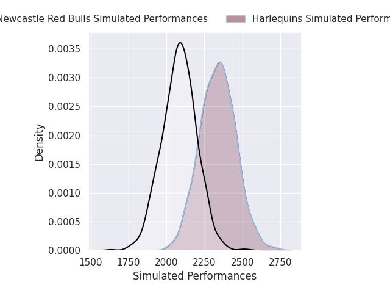
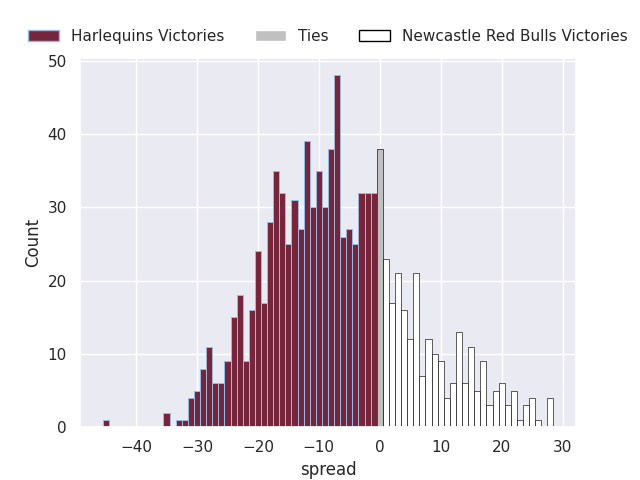
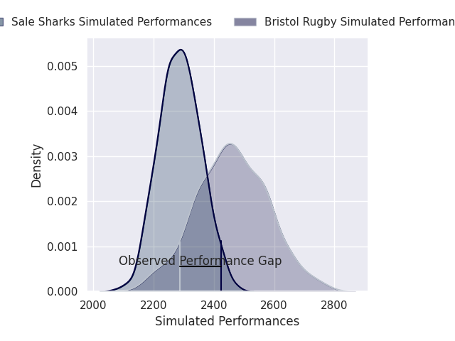
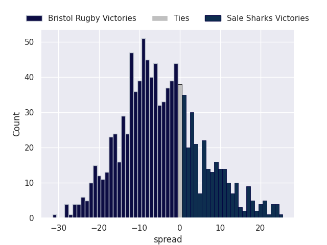

# Team Rankings

# Standings

## Current Standings

| Club                |   Played |   Wins |   Point Differential |   Losing Bonus Points |   Try Bonus Points |   Competition Points |
|:--------------------|---------:|-------:|---------------------:|----------------------:|-------------------:|---------------------:|
| Leicester Tigers    |        8 |      7 |                   37 |                     0 |                  2 |                   30 |
| Exeter Chiefs       |        8 |      6 |                   71 |                     0 |                    |                   24 |
| Gloucester Rugby    |        7 |      5 |                    1 |                     0 |                  3 |                   23 |
| Northampton Saints  |        7 |      5 |                   57 |                     0 |                  2 |                   22 |
| Bath Rugby          |        7 |      4 |                   77 |                     1 |                  2 |                   19 |
| Saracens            |        7 |      3 |                   55 |                     2 |                  2 |                   16 |
| Sale Sharks         |        7 |      2 |                  -93 |                     1 |                  3 |                   12 |
| Newcastle Red Bulls |        7 |      2 |                  -76 |                     1 |                  2 |                   11 |
| Bristol Rugby       |        7 |      1 |                  -56 |                     1 |                  1 |                    6 |
| Harlequins          |        7 |      1 |                  -73 |                     1 |                    |                    5 |

## Projected Remaining Table

| Club                |   To Play |   Projected Wins |   Projected Differential |   Projected Losing Bonus Points | Projected Try Bonus Points   |   Projected Competition Points |
|:--------------------|----------:|-----------------:|-------------------------:|--------------------------------:|:-----------------------------|-------------------------------:|
| Bath Rugby          |         1 |            0.759 |                    8.581 |                           0.116 |                              |                          3.216 |
| Harlequins          |         1 |            0.726 |                    7.168 |                           0.108 |                              |                          3.094 |
| Northampton Saints  |         1 |            0.713 |                    4.874 |                           0.137 |                              |                          3.055 |
| Bristol Rugby       |         1 |            0.689 |                    4.637 |                           0.149 |                              |                          2.981 |
| Sale Sharks         |         1 |            0.273 |                   -4.637 |                           0.269 |                              |                          1.437 |
| Saracens            |         1 |            0.254 |                   -4.874 |                           0.294 |                              |                          1.376 |
| Newcastle Red Bulls |         1 |            0.233 |                   -7.168 |                           0.224 |                              |                          1.238 |
| Gloucester Rugby    |         1 |            0.209 |                   -8.581 |                           0.191 |                              |                          1.091 |

## Projected Total Table

| Club                |   Played |   Wins |   Point Differential |   Losing Bonus Points |   Try Bonus Points |   Competition Points |
|:--------------------|---------:|-------:|---------------------:|----------------------:|-------------------:|---------------------:|
| Leicester Tigers    |        8 |  7     |               37     |                 0     |                  2 |               30     |
| Northampton Saints  |        8 |  5.713 |               61.874 |                 0.137 |                  2 |               25.055 |
| Gloucester Rugby    |        8 |  5.209 |               -7.581 |                 0.191 |                  3 |               24.091 |
| Exeter Chiefs       |        8 |  6     |               71     |                 0     |                    |               24     |
| Bath Rugby          |        8 |  4.759 |               85.581 |                 1.116 |                  2 |               22.216 |
| Saracens            |        8 |  3.254 |               50.126 |                 2.294 |                  2 |               17.376 |
| Sale Sharks         |        8 |  2.273 |              -97.637 |                 1.269 |                  3 |               13.437 |
| Newcastle Red Bulls |        8 |  2.233 |              -83.168 |                 1.224 |                  2 |               12.238 |
| Bristol Rugby       |        8 |  1.689 |              -51.363 |                 1.149 |                  1 |                8.981 |
| Harlequins          |        8 |  1.726 |              -65.832 |                 1.108 |                    |                8.094 |

# Completed Match Review

| Model | Percent Correct Predictions | Spread Error |
| ------ | ------ | ------ |
| Club Level | 67.5% | 14.4 |
| Player Level: Lineup | nan% | nan |
| Player Level: Minutes | nan% | nan |

# Future Predictions

## Week 9

### Harlequins V Newcastle Red Bulls on 2026/02/28

Average Margin: Harlequins by 7.2

### Bristol Rugby V Sale Sharks on 2026/02/28

Average Margin: Bristol Rugby by 4.6

### Northampton Saints V Saracens on 2026/02/28

Average Margin: Northampton Saints by 4.9

### Bath Rugby V Gloucester Rugby on 2026/02/28

Average Margin: Bath Rugby by 8.6

