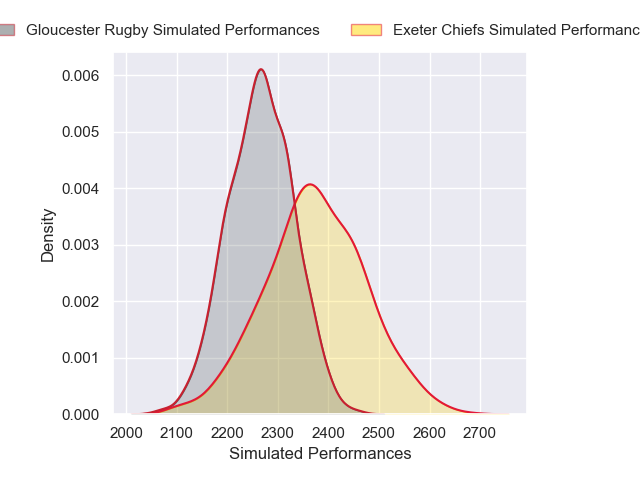
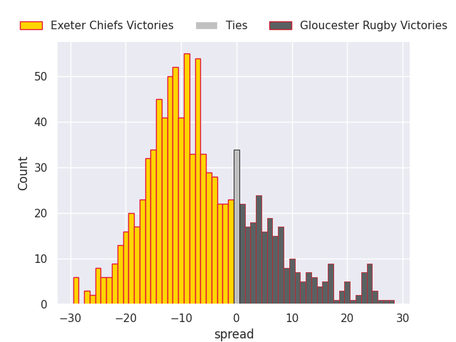
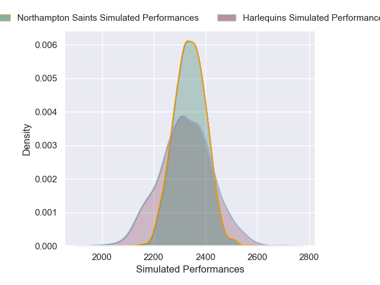
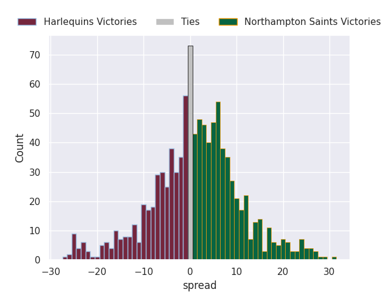
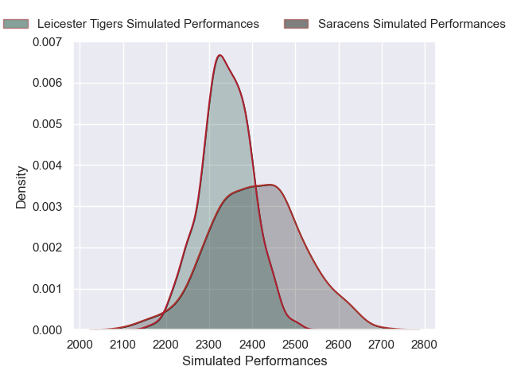
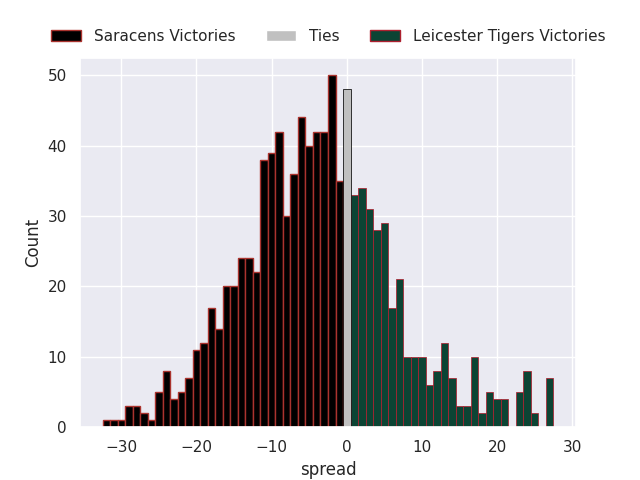
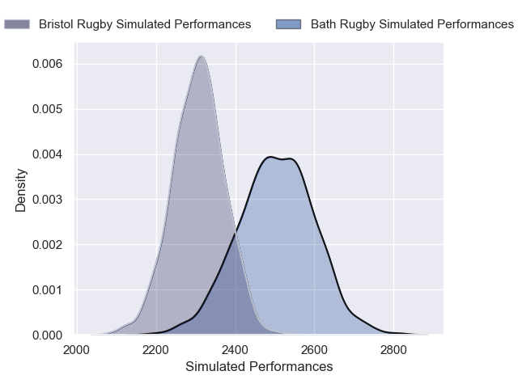
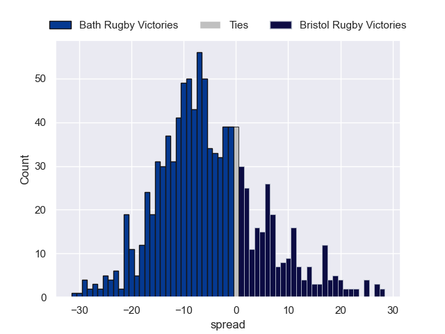

# Team Rankings

# Standings

## Current Standings

| Club                |   Played |   Wins |   Point Differential |   Losing Bonus Points |   Try Bonus Points |   Competition Points |
|:--------------------|---------:|-------:|---------------------:|----------------------:|-------------------:|---------------------:|
| Leicester Tigers    |        6 |      5 |                   26 |                     0 |                  2 |                   22 |
| Gloucester Rugby    |        5 |      4 |                    9 |                     0 |                  3 |                   19 |
| Exeter Chiefs       |        6 |      4 |                   25 |                     0 |                    |                   16 |
| Bath Rugby          |        5 |      3 |                   80 |                     1 |                  2 |                   15 |
| Saracens            |        6 |      3 |                   60 |                     1 |                  2 |                   15 |
| Northampton Saints  |        5 |      3 |                   13 |                     0 |                  2 |                   14 |
| Sale Sharks         |        6 |      2 |                  -67 |                     1 |                  3 |                   12 |
| Newcastle Red Bulls |        6 |      2 |                  -48 |                     1 |                  2 |                   11 |
| Bristol Rugby       |        6 |      1 |                  -47 |                     1 |                  1 |                    6 |
| Harlequins          |        5 |      1 |                  -51 |                     0 |                    |                    4 |

## Projected Remaining Table

| Club                |   To Play |   Projected Wins |   Projected Differential |   Projected Losing Bonus Points | Projected Try Bonus Points   |   Projected Competition Points |
|:--------------------|----------:|-----------------:|-------------------------:|--------------------------------:|:-----------------------------|-------------------------------:|
| Northampton Saints  |         3 |            1.954 |                   12.923 |                           0.559 |                              |                          8.625 |
| Bath Rugby          |         3 |            1.932 |                   15.037 |                           0.527 |                              |                          8.493 |
| Harlequins          |         3 |            1.365 |                    0.899 |                           0.718 |                              |                          6.426 |
| Exeter Chiefs       |         2 |            1.213 |                    7.114 |                           0.383 |                              |                          5.421 |
| Gloucester Rugby    |         3 |            1.065 |                  -13.01  |                           0.562 |                              |                          5.086 |
| Leicester Tigers    |         2 |            0.985 |                    0.57  |                           0.468 |                              |                          4.602 |
| Saracens            |         2 |            0.92  |                   -0.889 |                           0.488 |                              |                          4.348 |
| Bristol Rugby       |         2 |            0.914 |                   -2.472 |                           0.352 |                              |                          4.198 |
| Sale Sharks         |         2 |            0.594 |                   -6.669 |                           0.637 |                              |                          3.263 |
| Newcastle Red Bulls |         2 |            0.524 |                  -13.503 |                           0.424 |                              |                          2.656 |

## Projected Total Table

| Club                |   Played |   Wins |   Point Differential |   Losing Bonus Points |   Try Bonus Points |   Competition Points |
|:--------------------|---------:|-------:|---------------------:|----------------------:|-------------------:|---------------------:|
| Leicester Tigers    |        8 |  5.985 |               26.57  |                 0.468 |                  2 |               26.602 |
| Gloucester Rugby    |        8 |  5.065 |               -4.01  |                 0.562 |                  3 |               24.086 |
| Bath Rugby          |        8 |  4.932 |               95.037 |                 1.527 |                  2 |               23.493 |
| Northampton Saints  |        8 |  4.954 |               25.923 |                 0.559 |                  2 |               22.625 |
| Exeter Chiefs       |        8 |  5.213 |               32.114 |                 0.383 |                    |               21.421 |
| Saracens            |        8 |  3.92  |               59.111 |                 1.488 |                  2 |               19.348 |
| Sale Sharks         |        8 |  2.594 |              -73.669 |                 1.637 |                  3 |               15.263 |
| Newcastle Red Bulls |        8 |  2.524 |              -61.503 |                 1.424 |                  2 |               13.656 |
| Harlequins          |        8 |  2.365 |              -50.101 |                 0.718 |                    |               10.426 |
| Bristol Rugby       |        8 |  1.914 |              -49.472 |                 1.352 |                  1 |               10.198 |

# Completed Match Review

| Model | Percent Correct Predictions | Spread Error |
| ------ | ------ | ------ |
| Club Level | 57.5% | 15.1 |
| Player Level: Lineup | nan% | nan |
| Player Level: Minutes | nan% | nan |

# Future Predictions

## Week 7

### Exeter Chiefs V Gloucester Rugby on 2026/02/14

Average Margin: Exeter Chiefs by 6.6

### Harlequins V Northampton Saints on 2026/02/14

Average Margin: Northampton Saints by 2.2

### Saracens V Leicester Tigers on 2026/02/14

Average Margin: Saracens by 3.5

### Bath Rugby V Bristol Rugby on 2026/02/14

Average Margin: Bath Rugby by 6.7

## Week 8

### Newcastle Red Bulls V Northampton Saints on 2026/02/20

Average Margin: Northampton Saints by 6.3

### Leicester Tigers V Harlequins on 2026/02/21

Average Margin: Leicester Tigers by 4.1

### Exeter Chiefs V Bath Rugby on 2026/02/21

Average Margin: Exeter Chiefs by 0.5

### Gloucester Rugby V Sale Sharks on 2026/02/21

Average Margin: Gloucester Rugby by 2.4

## Week 9

### Bath Rugby V Gloucester Rugby on 2026/02/28

Average Margin: Bath Rugby by 8.9

### Northampton Saints V Saracens on 2026/02/28

Average Margin: Northampton Saints by 4.4

### Harlequins V Newcastle Red Bulls on 2026/02/28

Average Margin: Harlequins by 7.2

### Bristol Rugby V Sale Sharks on 2026/03/01

Average Margin: Bristol Rugby by 4.2

