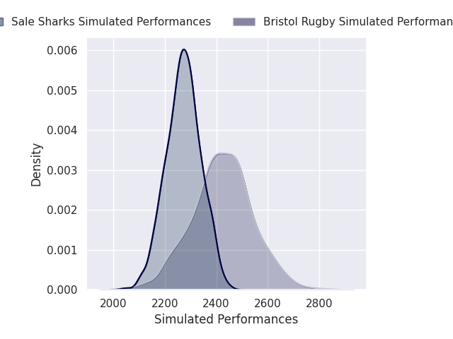
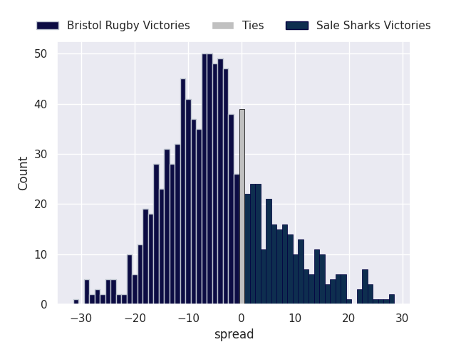

# Team Rankings

# Standings

## Current Standings

| Club                |   Played |   Wins |   Point Differential |   Losing Bonus Points |   Try Bonus Points |   Competition Points |
|:--------------------|---------:|-------:|---------------------:|----------------------:|-------------------:|---------------------:|
| Leicester Tigers    |        8 |      7 |                   37 |                     0 |                  2 |                   30 |
| Exeter Chiefs       |        8 |      6 |                   71 |                     0 |                    |                   24 |
| Gloucester Rugby    |        7 |      5 |                    1 |                     0 |                  3 |                   23 |
| Northampton Saints  |        7 |      5 |                   57 |                     0 |                  2 |                   22 |
| Bath Rugby          |        7 |      4 |                   77 |                     1 |                  2 |                   19 |
| Saracens            |        7 |      3 |                   55 |                     2 |                  2 |                   16 |
| Sale Sharks         |        7 |      2 |                  -93 |                     1 |                  3 |                   12 |
| Newcastle Red Bulls |        7 |      2 |                  -76 |                     1 |                  2 |                   11 |
| Bristol Rugby       |        7 |      1 |                  -56 |                     1 |                  1 |                    6 |
| Harlequins          |        7 |      1 |                  -73 |                     1 |                    |                    5 |

## Projected Remaining Table

| Club                |   To Play |   Projected Wins |   Projected Differential |   Projected Losing Bonus Points | Projected Try Bonus Points   |   Projected Competition Points |
|:--------------------|----------:|-----------------:|-------------------------:|--------------------------------:|:-----------------------------|-------------------------------:|
| Bath Rugby          |         1 |            0.741 |                    8.074 |                           0.116 |                              |                          3.138 |
| Harlequins          |         1 |            0.733 |                    7.288 |                           0.127 |                              |                          3.107 |
| Northampton Saints  |         1 |            0.697 |                    5.044 |                           0.147 |                              |                          3.025 |
| Bristol Rugby       |         1 |            0.7   |                    4.425 |                           0.133 |                              |                          3.011 |
| Sale Sharks         |         1 |            0.261 |                   -4.425 |                           0.308 |                              |                          1.43  |
| Saracens            |         1 |            0.258 |                   -5.044 |                           0.269 |                              |                          1.391 |
| Newcastle Red Bulls |         1 |            0.243 |                   -7.288 |                           0.221 |                              |                          1.241 |
| Gloucester Rugby    |         1 |            0.23  |                   -8.074 |                           0.178 |                              |                          1.156 |

## Projected Total Table

| Club                |   Played |   Wins |   Point Differential |   Losing Bonus Points |   Try Bonus Points |   Competition Points |
|:--------------------|---------:|-------:|---------------------:|----------------------:|-------------------:|---------------------:|
| Leicester Tigers    |        8 |  7     |               37     |                 0     |                  2 |               30     |
| Northampton Saints  |        8 |  5.697 |               62.044 |                 0.147 |                  2 |               25.025 |
| Gloucester Rugby    |        8 |  5.23  |               -7.074 |                 0.178 |                  3 |               24.156 |
| Exeter Chiefs       |        8 |  6     |               71     |                 0     |                    |               24     |
| Bath Rugby          |        8 |  4.741 |               85.074 |                 1.116 |                  2 |               22.138 |
| Saracens            |        8 |  3.258 |               49.956 |                 2.269 |                  2 |               17.391 |
| Sale Sharks         |        8 |  2.261 |              -97.425 |                 1.308 |                  3 |               13.43  |
| Newcastle Red Bulls |        8 |  2.243 |              -83.288 |                 1.221 |                  2 |               12.241 |
| Bristol Rugby       |        8 |  1.7   |              -51.575 |                 1.133 |                  1 |                9.011 |
| Harlequins          |        8 |  1.733 |              -65.712 |                 1.127 |                    |                8.107 |

# Completed Match Review

| Model | Percent Correct Predictions | Spread Error |
| ------ | ------ | ------ |
| Club Level | 65.0% | 15.2 |
| Player Level: Lineup | nan% | nan |
| Player Level: Minutes | nan% | nan |

# Future Predictions

## Week 9

### Northampton Saints V Saracens on 2026/02/28

Average Margin: Northampton Saints by 5.0

### Bath Rugby V Gloucester Rugby on 2026/02/28

Average Margin: Bath Rugby by 8.1

### Harlequins V Newcastle Red Bulls on 2026/02/28

Average Margin: Harlequins by 7.3

### Bristol Rugby V Sale Sharks on 2026/03/01

Average Margin: Bristol Rugby by 4.4

