# Team Rankings

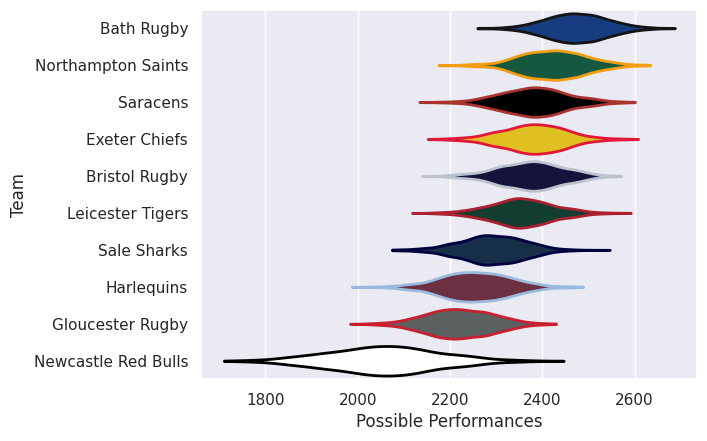
# Standings

## Current Standings

| Club                |   Played |   Wins |   Point Differential |   Losing Bonus Points |   Try Bonus Points |   Competition Points |
|:--------------------|---------:|-------:|---------------------:|----------------------:|-------------------:|---------------------:|
| Leicester Tigers    |        7 |      6 |                   31 |                     0 |                  2 |                   26 |
| Exeter Chiefs       |        7 |      5 |                   59 |                     0 |                    |                   20 |
| Bath Rugby          |        6 |      4 |                   89 |                     1 |                  2 |                   19 |
| Gloucester Rugby    |        6 |      4 |                  -25 |                     0 |                  3 |                   19 |
| Northampton Saints  |        6 |      4 |                   29 |                     0 |                  2 |                   18 |
| Saracens            |        7 |      3 |                   55 |                     2 |                  2 |                   16 |
| Sale Sharks         |        6 |      2 |                  -67 |                     1 |                  3 |                   12 |
| Newcastle Red Bulls |        6 |      2 |                  -48 |                     1 |                  2 |                   11 |
| Bristol Rugby       |        7 |      1 |                  -56 |                     1 |                  1 |                    6 |
| Harlequins          |        6 |      1 |                  -67 |                     0 |                    |                    4 |

## Projected Remaining Table

| Club                |   To Play |   Projected Wins |   Projected Differential |   Projected Losing Bonus Points | Projected Try Bonus Points   |   Projected Competition Points |
|:--------------------|----------:|-----------------:|-------------------------:|--------------------------------:|:-----------------------------|-------------------------------:|
| Northampton Saints  |         2 |            1.381 |                   10.994 |                           0.315 |                              |                          5.987 |
| Bath Rugby          |         2 |            1.167 |                    7.805 |                           0.418 |                              |                          5.246 |
| Harlequins          |         2 |            0.954 |                    1.063 |                           0.394 |                              |                          4.322 |
| Gloucester Rugby    |         2 |            0.797 |                   -7.045 |                           0.4   |                              |                          3.742 |
| Sale Sharks         |         2 |            0.631 |                   -6.502 |                           0.632 |                              |                          3.346 |
| Leicester Tigers    |         1 |            0.73  |                    5.328 |                           0.127 |                              |                          3.093 |
| Bristol Rugby       |         1 |            0.691 |                    4.516 |                           0.149 |                              |                          2.997 |
| Newcastle Red Bulls |         2 |            0.547 |                  -12.456 |                           0.444 |                              |                          2.766 |
| Exeter Chiefs       |         1 |            0.539 |                    1.226 |                           0.261 |                              |                          2.529 |
| Saracens            |         1 |            0.258 |                   -4.929 |                           0.27  |                              |                          1.382 |

## Projected Total Table

| Club                |   Played |   Wins |   Point Differential |   Losing Bonus Points |   Try Bonus Points |   Competition Points |
|:--------------------|---------:|-------:|---------------------:|----------------------:|-------------------:|---------------------:|
| Leicester Tigers    |        8 |  6.73  |               36.328 |                 0.127 |                  2 |               29.093 |
| Bath Rugby          |        8 |  5.167 |               96.805 |                 1.418 |                  2 |               24.246 |
| Northampton Saints  |        8 |  5.381 |               39.994 |                 0.315 |                  2 |               23.987 |
| Gloucester Rugby    |        8 |  4.797 |              -32.045 |                 0.4   |                  3 |               22.742 |
| Exeter Chiefs       |        8 |  5.539 |               60.226 |                 0.261 |                    |               22.529 |
| Saracens            |        8 |  3.258 |               50.071 |                 2.27  |                  2 |               17.382 |
| Sale Sharks         |        8 |  2.631 |              -73.502 |                 1.632 |                  3 |               15.346 |
| Newcastle Red Bulls |        8 |  2.547 |              -60.456 |                 1.444 |                  2 |               13.766 |
| Bristol Rugby       |        8 |  1.691 |              -51.484 |                 1.149 |                  1 |                8.997 |
| Harlequins          |        8 |  1.954 |              -65.937 |                 0.394 |                    |                8.322 |

# Completed Match Review

| Model | Percent Correct Predictions | Spread Error |
| ------ | ------ | ------ |
| Club Level | 67.5% | 14.7 |
| Player Level: Lineup | nan% | nan |
| Player Level: Minutes | nan% | nan |

# Future Predictions

## Week 8

### Newcastle Red Bulls V Northampton Saints on 2026/02/20

Average Margin: Northampton Saints by 6.1

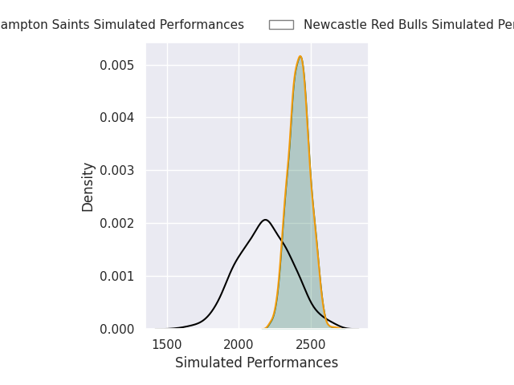
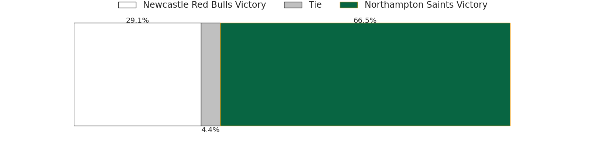
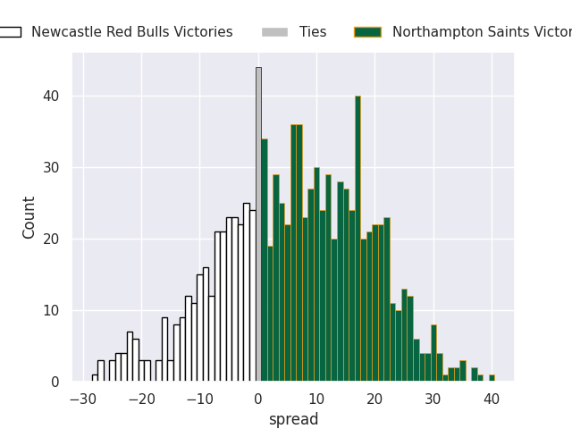

### Leicester Tigers V Harlequins on 2026/02/21

Average Margin: Leicester Tigers by 5.3

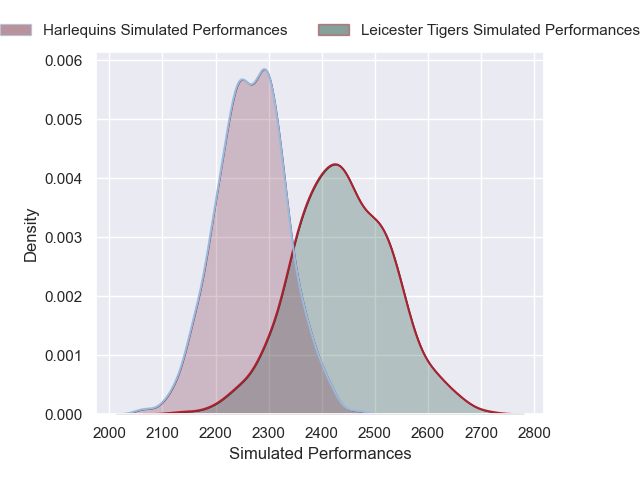

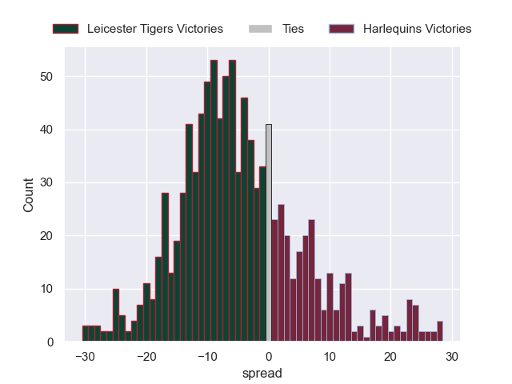

### Exeter Chiefs V Bath Rugby on 2026/02/21

Average Margin: Exeter Chiefs by 1.2

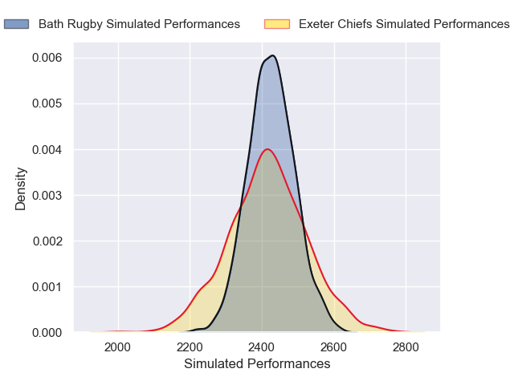

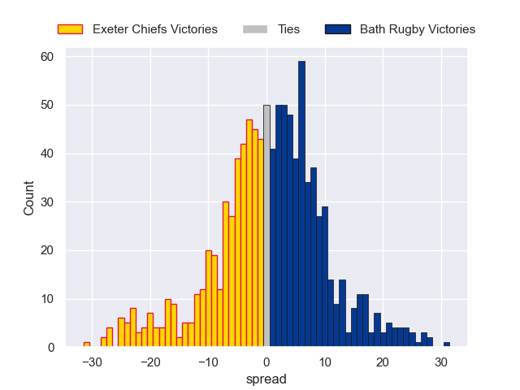

### Gloucester Rugby V Sale Sharks on 2026/02/21

Average Margin: Gloucester Rugby by 2.0

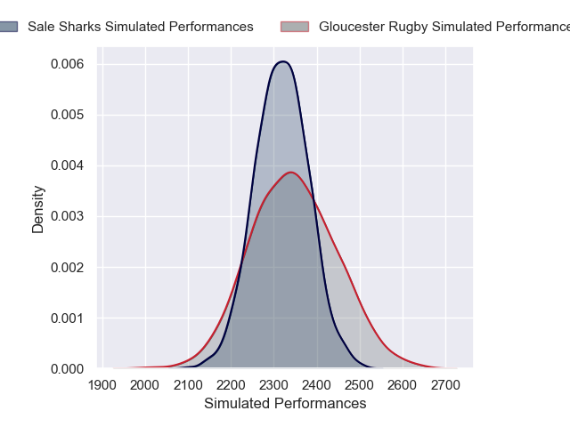

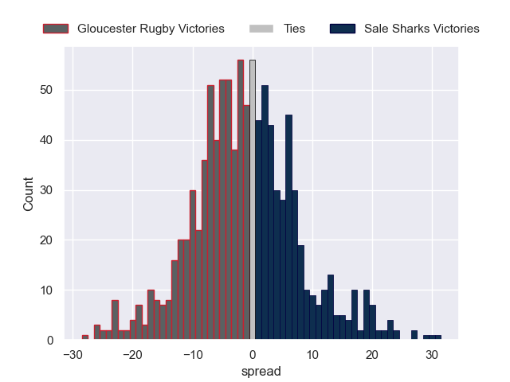

## Week 9

### Harlequins V Newcastle Red Bulls on 2026/02/28

Average Margin: Harlequins by 6.4

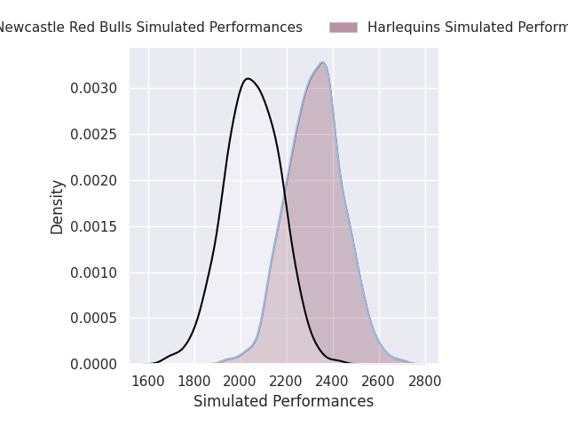

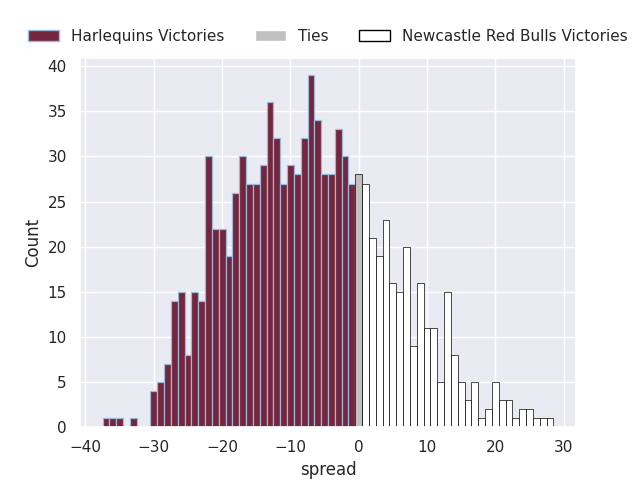

### Bath Rugby V Gloucester Rugby on 2026/02/28

Average Margin: Bath Rugby by 9.0

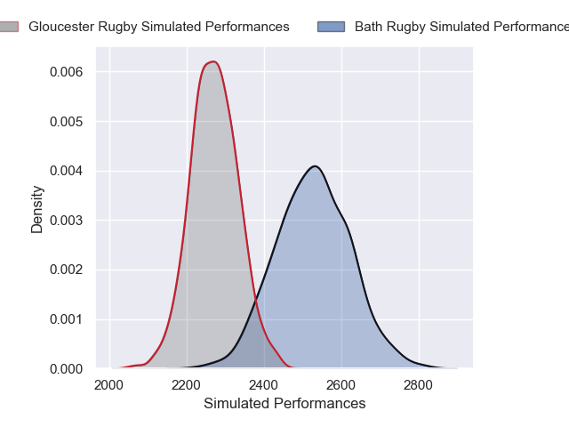

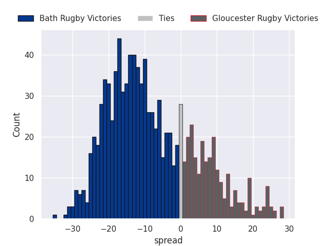

### Northampton Saints V Saracens on 2026/02/28

Average Margin: Northampton Saints by 4.9

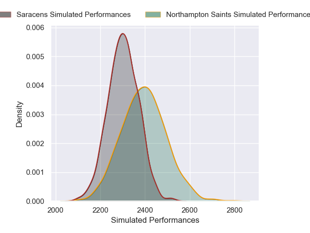

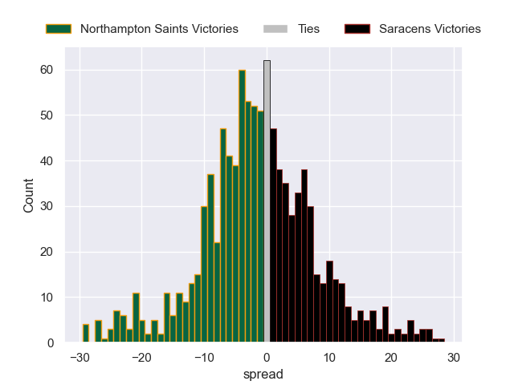

### Bristol Rugby V Sale Sharks on 2026/03/01

Average Margin: Bristol Rugby by 4.5

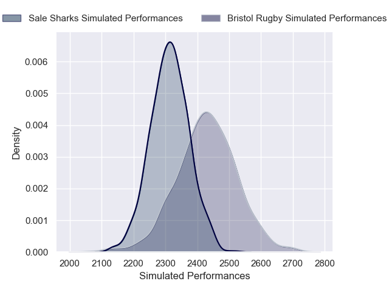

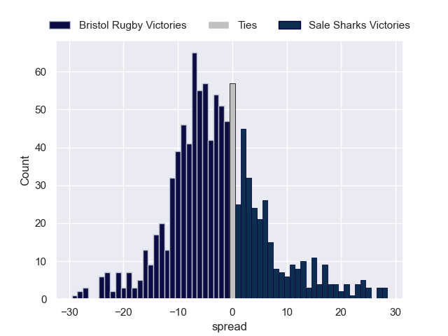

