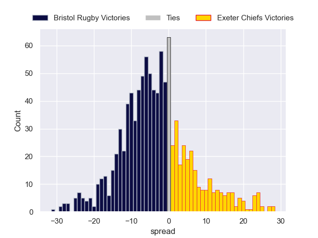
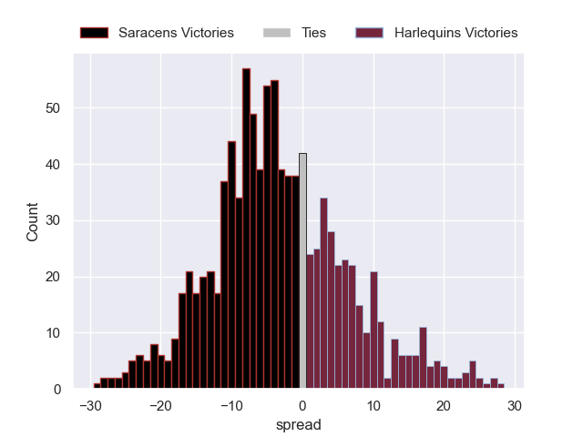
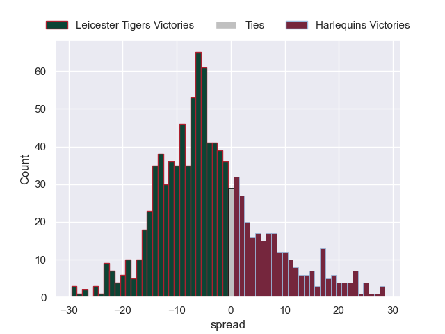
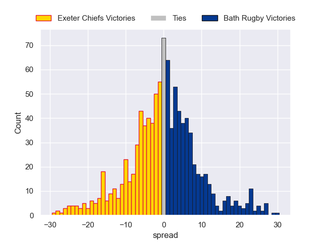

# Team Rankings

# Standings

## Current Standings

| Club                |   Played |   Wins |   Point Differential |   Losing Bonus Points |   Try Bonus Points |   Competition Points |
|:--------------------|---------:|-------:|---------------------:|----------------------:|-------------------:|---------------------:|
| Gloucester Rugby    |        5 |      4 |                    9 |                     0 |                  3 |                   19 |
| Leicester Tigers    |        5 |      4 |                   17 |                     0 |                  2 |                   18 |
| Saracens            |        5 |      3 |                   63 |                     0 |                  2 |                   14 |
| Northampton Saints  |        5 |      3 |                   13 |                     0 |                  2 |                   14 |
| Exeter Chiefs       |        5 |      3 |                   14 |                     0 |                    |                   12 |
| Sale Sharks         |        5 |      2 |                  -26 |                     1 |                  3 |                   12 |
| Bath Rugby          |        4 |      2 |                   39 |                     1 |                  2 |                   11 |
| Newcastle Red Bulls |        5 |      2 |                  -39 |                     1 |                  2 |                   11 |
| Bristol Rugby       |        5 |      1 |                  -36 |                     1 |                  1 |                    6 |
| Harlequins          |        4 |      0 |                  -54 |                     0 |                    |                    0 |

## Projected Remaining Table

| Club                |   To Play |   Projected Wins |   Projected Differential |   Projected Losing Bonus Points | Projected Try Bonus Points   |   Projected Competition Points |
|:--------------------|----------:|-----------------:|-------------------------:|--------------------------------:|:-----------------------------|-------------------------------:|
| Bath Rugby          |         4 |            2.499 |                   14.968 |                           0.757 |                              |                         11.109 |
| Northampton Saints  |         3 |            1.947 |                   13.84  |                           0.533 |                              |                          8.607 |
| Leicester Tigers    |         3 |            1.811 |                   13.412 |                           0.57  |                              |                          7.964 |
| Saracens            |         3 |            1.707 |                    6.574 |                           0.595 |                              |                          7.649 |
| Exeter Chiefs       |         3 |            1.608 |                    5.785 |                           0.701 |                              |                          7.469 |
| Harlequins          |         4 |            1.499 |                   -8.832 |                           0.929 |                              |                          7.255 |
| Bristol Rugby       |         3 |            1.467 |                    0.572 |                           0.676 |                              |                          6.872 |
| Sale Sharks         |         3 |            0.999 |                   -8.836 |                           0.915 |                              |                          5.243 |
| Gloucester Rugby    |         3 |            1.03  |                  -12.489 |                           0.651 |                              |                          5.007 |
| Newcastle Red Bulls |         3 |            0.744 |                  -24.994 |                           0.586 |                              |                          3.738 |

## Projected Total Table

| Club                |   Played |   Wins |   Point Differential |   Losing Bonus Points |   Try Bonus Points |   Competition Points |
|:--------------------|---------:|-------:|---------------------:|----------------------:|-------------------:|---------------------:|
| Leicester Tigers    |        8 |  5.811 |               30.412 |                 0.57  |                  2 |               25.964 |
| Gloucester Rugby    |        8 |  5.03  |               -3.489 |                 0.651 |                  3 |               24.007 |
| Northampton Saints  |        8 |  4.947 |               26.84  |                 0.533 |                  2 |               22.607 |
| Bath Rugby          |        8 |  4.499 |               53.968 |                 1.757 |                  2 |               22.109 |
| Saracens            |        8 |  4.707 |               69.574 |                 0.595 |                  2 |               21.649 |
| Exeter Chiefs       |        8 |  4.608 |               19.785 |                 0.701 |                    |               19.469 |
| Sale Sharks         |        8 |  2.999 |              -34.836 |                 1.915 |                  3 |               17.243 |
| Newcastle Red Bulls |        8 |  2.744 |              -63.994 |                 1.586 |                  2 |               14.738 |
| Bristol Rugby       |        8 |  2.467 |              -35.428 |                 1.676 |                  1 |               12.872 |
| Harlequins          |        8 |  1.499 |              -62.832 |                 0.929 |                    |                7.255 |

# Completed Match Review

| Model | Percent Correct Predictions | Spread Error |
| ------ | ------ | ------ |
| Club Level | 60.0% | 13.2 |
| Player Level: Lineup | nan% | nan |
| Player Level: Minutes | nan% | nan |

# Future Predictions

## Week 6

### Bristol Rugby V Exeter Chiefs on 2026/02/07

Average Margin: Bristol Rugby by 1.5

### Leicester Tigers V Newcastle Red Bulls on 2026/02/07

Average Margin: Leicester Tigers by 11.2

### Saracens V Harlequins on 2026/02/07

Average Margin: Saracens by 6.9

### Sale Sharks V Bath Rugby on 2026/02/08

Average Margin: Bath Rugby by 2.2

## Week 7

### Saracens V Leicester Tigers on 2026/02/14

Average Margin: Saracens by 3.6

### Bath Rugby V Bristol Rugby on 2026/02/14

Average Margin: Bath Rugby by 5.3

### Harlequins V Northampton Saints on 2026/02/14

Average Margin: Northampton Saints by 2.7

### Exeter Chiefs V Gloucester Rugby on 2026/02/14

Average Margin: Exeter Chiefs by 6.3

## Week 8

### Newcastle Red Bulls V Northampton Saints on 2026/02/20

Average Margin: Northampton Saints by 7.2

### Leicester Tigers V Harlequins on 2026/02/21

Average Margin: Leicester Tigers by 5.8

### Gloucester Rugby V Sale Sharks on 2026/02/21

Average Margin: Gloucester Rugby by 2.3

### Exeter Chiefs V Bath Rugby on 2026/02/21

Average Margin: Exeter Chiefs by 1.1

## Week 9

### Northampton Saints V Saracens on 2026/02/28

Average Margin: Northampton Saints by 3.9

### Bath Rugby V Gloucester Rugby on 2026/02/28

Average Margin: Bath Rugby by 8.5

### Harlequins V Newcastle Red Bulls on 2026/02/28

Average Margin: Harlequins by 6.6

### Bristol Rugby V Sale Sharks on 2026/03/01

Average Margin: Bristol Rugby by 4.4

