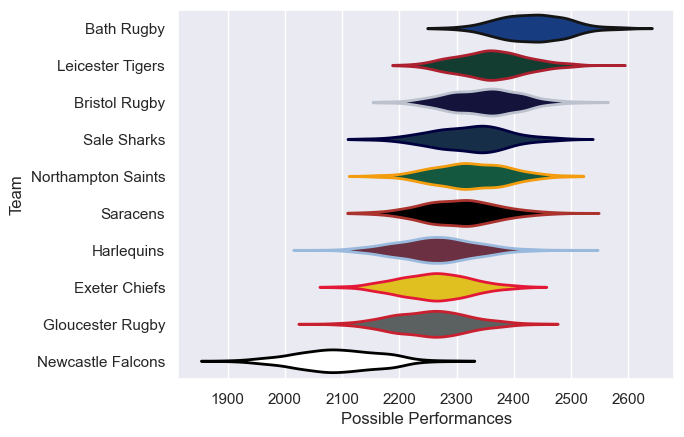

---  
title: "Premiership Rugby Cup 25/26"  
date: 2025-11-17 6:00:00 -0500  
categories: model review projection  
layout: article  
aside:  
    toc: true  
---
# Team Rankings

# Standings

## Current Standings

| Club               |   Played |   Wins |   Point Differential |   Losing Bonus Points |   Try Bonus Points |   Competition Points |
|:-------------------|---------:|-------:|---------------------:|----------------------:|-------------------:|---------------------:|
| Gloucester Rugby   |        4 |      3 |                    1 |                     0 |                  3 |                   15 |
| Leicester Tigers   |        3 |      3 |                   23 |                     0 |                  1 |                   13 |
| Sale Sharks        |        3 |      2 |                   39 |                     1 |                  2 |                   11 |
| Newcastle Falcons  |        3 |      2 |                   27 |                     1 |                  1 |                   10 |
| Northampton Saints |        3 |      2 |                    7 |                     0 |                  2 |                   10 |
| Bath Rugby         |        3 |      1 |                   19 |                     1 |                  1 |                    6 |
| Saracens           |        3 |      1 |                   -3 |                     0 |                  1 |                    5 |
| Bristol Rugby      |        3 |      1 |                  -23 |                     0 |                  1 |                    5 |
| Exeter Chiefs      |        3 |      1 |                  -36 |                     0 |                    |                    4 |
| Harlequins         |        4 |      0 |                  -54 |                     0 |                    |                    0 |

## Projected Remaining Table

| Club               |   To Play |   Projected Wins |   Projected Differential |   Projected Losing Bonus Points | Projected Try Bonus Points   |   Projected Competition Points |
|:-------------------|----------:|-----------------:|-------------------------:|--------------------------------:|:-----------------------------|-------------------------------:|
| Bath Rugby         |         5 |            3.183 |                   19.28  |                           0.92  |                              |                         14.082 |
| Saracens           |         5 |            3.071 |                   17.612 |                           0.971 |                              |                         13.781 |
| Leicester Tigers   |         5 |            2.851 |                   12.211 |                           1.041 |                              |                         12.913 |
| Exeter Chiefs      |         5 |            2.641 |                    5.277 |                           1.21  |                              |                         12.33  |
| Northampton Saints |         5 |            2.46  |                    1.284 |                           1.308 |                              |                         11.684 |
| Bristol Rugby      |         5 |            2.459 |                    0.492 |                           1.148 |                              |                         11.482 |
| Sale Sharks        |         5 |            1.809 |                  -11.591 |                           1.511 |                              |                          9.329 |
| Harlequins         |         4 |            1.684 |                   -4.16  |                           1.046 |                              |                          8.2   |
| Newcastle Falcons  |         5 |            1.339 |                  -26.947 |                           1.25  |                              |                          7.038 |
| Gloucester Rugby   |         4 |            1.289 |                  -13.458 |                           1.093 |                              |                          6.659 |

## Projected Total Table

| Club               |   Played |   Wins |   Point Differential |   Losing Bonus Points |   Try Bonus Points |   Competition Points |
|:-------------------|---------:|-------:|---------------------:|----------------------:|-------------------:|---------------------:|
| Leicester Tigers   |        8 |  5.851 |               35.211 |                 1.041 |                  1 |               25.913 |
| Northampton Saints |        8 |  4.46  |                8.284 |                 1.308 |                  2 |               21.684 |
| Gloucester Rugby   |        8 |  4.289 |              -12.458 |                 1.093 |                  3 |               21.659 |
| Sale Sharks        |        8 |  3.809 |               27.409 |                 2.511 |                  2 |               20.329 |
| Bath Rugby         |        8 |  4.183 |               38.28  |                 1.92  |                  1 |               20.082 |
| Saracens           |        8 |  4.071 |               14.612 |                 0.971 |                  1 |               18.781 |
| Newcastle Falcons  |        8 |  3.339 |                0.053 |                 2.25  |                  1 |               17.038 |
| Bristol Rugby      |        8 |  3.459 |              -22.508 |                 1.148 |                  1 |               16.482 |
| Exeter Chiefs      |        8 |  3.641 |              -30.723 |                 1.21  |                    |               16.33  |
| Harlequins         |        8 |  1.684 |              -58.16  |                 1.046 |                    |                8.2   |

# Completed Match Review

| Model | Percent Correct Predictions | Spread Error |
| ------ | ------ | ------ |
| Club Level | 65.0% | 11.0 |
| Player Level: Lineup | nan% | nan |
| Player Level: Minutes | nan% | nan |

# Future Predictions

## Week 5

### Leicester Tigers V Northampton Saints on 2025/11/21

Average Margin: Leicester Tigers by 4.0

### Exeter Chiefs V Bristol Bears on 2025/11/22

Average Margin: Exeter Chiefs by 2.8

### Saracens V Newcastle Falcons on 2025/11/22

Average Margin: Saracens by 9.4

### Bath Rugby V Sale Sharks on 2025/11/22

Average Margin: Bath Rugby by 6.1

## Week 6

### Newcastle Falcons V Saracens on 2026/01/30

Average Margin: Saracens by 3.3

### Exeter Chiefs V Sale Sharks on 2026/01/31

Average Margin: Exeter Chiefs by 2.2

### Northampton Saints V Leicester Tigers on 2026/01/31

Average Margin: Northampton Saints by 1.8

### Bristol Rugby V Gloucester Rugby on 2026/02/01

Average Margin: Bristol Rugby by 3.9

## Week 7

### Bristol Rugby V Exeter Chiefs on 2026/02/07

Average Margin: Bristol Rugby by 2.9

### Leicester Tigers V Newcastle Falcons on 2026/02/07

Average Margin: Leicester Tigers by 8.0

### Saracens V Harlequins on 2026/02/07

Average Margin: Saracens by 4.2

### Sale Sharks V Bath Rugby on 2026/02/08

Average Margin: Sale Sharks by 0.1

## Week 8

### Saracens V Leicester Tigers on 2026/02/14

Average Margin: Saracens by 2.7

### Exeter Chiefs V Gloucester Rugby on 2026/02/14

Average Margin: Exeter Chiefs by 3.9

### Bath Rugby V Bristol Rugby on 2026/02/14

Average Margin: Bath Rugby by 5.7

### Harlequins V Northampton Saints on 2026/02/14

Average Margin: Harlequins by 0.3

## Week 9

### Newcastle Falcons V Northampton Saints on 2026/02/20

Average Margin: Northampton Saints by 1.9

### Gloucester Rugby V Sale Sharks on 2026/02/21

Average Margin: Gloucester Rugby by 1.3

### Exeter Chiefs V Bath Rugby on 2026/02/21

Average Margin: Bath Rugby by 0.7

### Leicester Tigers V Harlequins on 2026/02/21

Average Margin: Leicester Tigers by 4.6

## Week 10

### Northampton Saints V Saracens on 2026/02/28

Average Margin: Northampton Saints by 2.0

### Bath Rugby V Gloucester Rugby on 2026/02/28

Average Margin: Bath Rugby by 6.9

### Harlequins V Newcastle Falcons on 2026/02/28

Average Margin: Harlequins by 4.3

### Bristol Rugby V Sale Sharks on 2026/03/01

Average Margin: Bristol Rugby by 2.1

