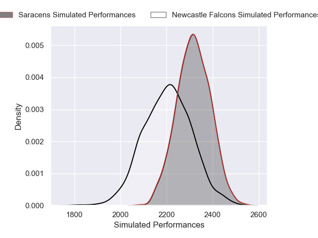
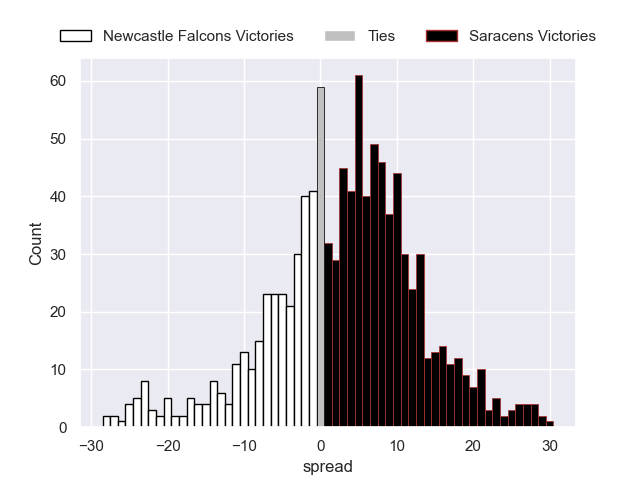
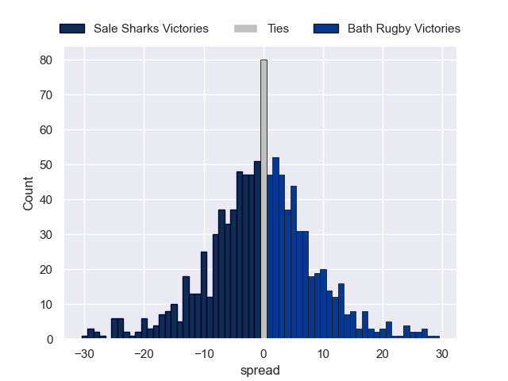
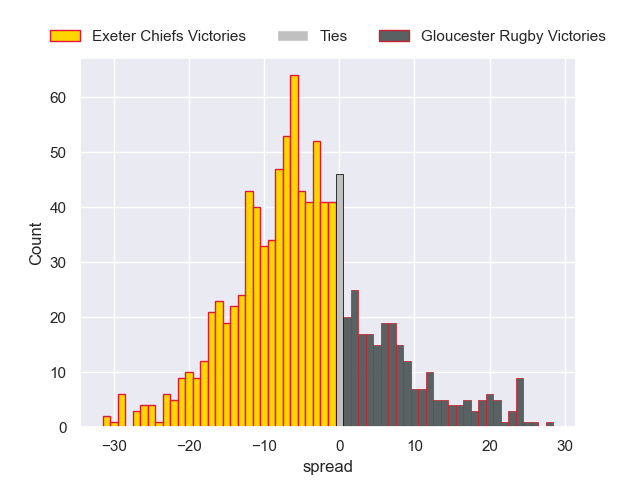
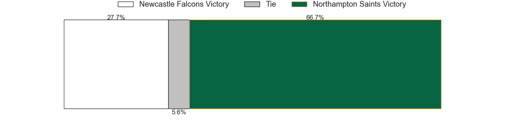

# Team Rankings

# Standings

## Current Standings

| Club               |   Played |   Wins |   Point Differential |   Losing Bonus Points |   Try Bonus Points |   Competition Points |
|:-------------------|---------:|-------:|---------------------:|----------------------:|-------------------:|---------------------:|
| Leicester Tigers   |        4 |      4 |                   35 |                     0 |                  2 |                   18 |
| Gloucester Rugby   |        4 |      3 |                    1 |                     0 |                  3 |                   15 |
| Sale Sharks        |        4 |      2 |                   19 |                     1 |                  3 |                   12 |
| Bath Rugby         |        4 |      2 |                   39 |                     1 |                  2 |                   11 |
| Newcastle Falcons  |        4 |      2 |                  -16 |                     1 |                  2 |                   11 |
| Saracens           |        4 |      2 |                   40 |                     0 |                  2 |                   10 |
| Northampton Saints |        4 |      2 |                   -5 |                     0 |                  2 |                   10 |
| Exeter Chiefs      |        4 |      2 |                  -31 |                     0 |                    |                    8 |
| Bristol Rugby      |        4 |      1 |                  -28 |                     1 |                  1 |                    6 |
| Harlequins         |        4 |      0 |                  -54 |                     0 |                    |                    0 |

## Projected Remaining Table

| Club               |   To Play |   Projected Wins |   Projected Differential |   Projected Losing Bonus Points | Projected Try Bonus Points   |   Projected Competition Points |
|:-------------------|----------:|-----------------:|-------------------------:|--------------------------------:|:-----------------------------|-------------------------------:|
| Northampton Saints |         4 |            2.468 |                   10.768 |                           0.812 |                              |                         11.168 |
| Bath Rugby         |         4 |            2.449 |                   12.592 |                           0.837 |                              |                         11.007 |
| Bristol Rugby      |         4 |            2.343 |                    8.891 |                           0.765 |                              |                         10.507 |
| Saracens           |         4 |            2.299 |                    8.076 |                           0.845 |                              |                         10.469 |
| Exeter Chiefs      |         4 |            2.11  |                    4.703 |                           0.967 |                              |                          9.787 |
| Leicester Tigers   |         4 |            2.105 |                    8.381 |                           0.928 |                              |                          9.726 |
| Sale Sharks        |         4 |            1.446 |                   -7.169 |                           1.347 |                              |                          7.589 |
| Harlequins         |         4 |            1.523 |                   -9.009 |                           0.992 |                              |                          7.462 |
| Gloucester Rugby   |         4 |            1.171 |                  -19.017 |                           0.973 |                              |                          5.999 |
| Newcastle Falcons  |         4 |            1.103 |                  -18.216 |                           1.097 |                              |                          5.849 |

## Projected Total Table

| Club               |   Played |   Wins |   Point Differential |   Losing Bonus Points |   Try Bonus Points |   Competition Points |
|:-------------------|---------:|-------:|---------------------:|----------------------:|-------------------:|---------------------:|
| Leicester Tigers   |        8 |  6.105 |               43.381 |                 0.928 |                  2 |               27.726 |
| Bath Rugby         |        8 |  4.449 |               51.592 |                 1.837 |                  2 |               22.007 |
| Northampton Saints |        8 |  4.468 |                5.768 |                 0.812 |                  2 |               21.168 |
| Gloucester Rugby   |        8 |  4.171 |              -18.017 |                 0.973 |                  3 |               20.999 |
| Saracens           |        8 |  4.299 |               48.076 |                 0.845 |                  2 |               20.469 |
| Sale Sharks        |        8 |  3.446 |               11.831 |                 2.347 |                  3 |               19.589 |
| Exeter Chiefs      |        8 |  4.11  |              -26.297 |                 0.967 |                    |               17.787 |
| Newcastle Falcons  |        8 |  3.103 |              -34.216 |                 2.097 |                  2 |               16.849 |
| Bristol Rugby      |        8 |  3.343 |              -19.109 |                 1.765 |                  1 |               16.507 |
| Harlequins         |        8 |  1.523 |              -63.009 |                 0.992 |                    |                7.462 |

# Completed Match Review

| Model | Percent Correct Predictions | Spread Error |
| ------ | ------ | ------ |
| Club Level | 70.0% | 11.0 |
| Player Level: Lineup | nan% | nan |
| Player Level: Minutes | nan% | nan |

# Future Predictions

## Week 5

### Newcastle Falcons V Saracens on 2026/01/30

Average Margin: Saracens by 2.7

### Exeter Chiefs V Sale Sharks on 2026/01/31

Average Margin: Exeter Chiefs by 3.6

### Northampton Saints V Leicester Tigers on 2026/01/31

Average Margin: Northampton Saints by 3.2

### Bristol Rugby V Gloucester Rugby on 2026/02/01

Average Margin: Bristol Rugby by 6.2

## Week 6

### Bristol Rugby V Exeter Chiefs on 2026/02/07

Average Margin: Bristol Rugby by 3.9

### Leicester Tigers V Newcastle Falcons on 2026/02/07

Average Margin: Leicester Tigers by 7.7

### Saracens V Harlequins on 2026/02/07

Average Margin: Saracens by 6.0

### Sale Sharks V Bath Rugby on 2026/02/08

Average Margin: Bath Rugby by 0.0

## Week 7

### Saracens V Leicester Tigers on 2026/02/14

Average Margin: Saracens by 2.4

### Harlequins V Northampton Saints on 2026/02/14

Average Margin: Northampton Saints by 1.1

### Bath Rugby V Bristol Rugby on 2026/02/14

Average Margin: Bath Rugby by 4.3

### Exeter Chiefs V Gloucester Rugby on 2026/02/14

Average Margin: Exeter Chiefs by 5.5

## Week 8

### Newcastle Falcons V Northampton Saints on 2026/02/20

Average Margin: Northampton Saints by 3.5

### Leicester Tigers V Harlequins on 2026/02/21

Average Margin: Leicester Tigers by 6.2

### Exeter Chiefs V Bath Rugby on 2026/02/21

Average Margin: Bath Rugby by 0.5

### Gloucester Rugby V Sale Sharks on 2026/02/21

Average Margin: Gloucester Rugby by 0.4

## Week 9

### Harlequins V Newcastle Falcons on 2026/02/28

Average Margin: Harlequins by 4.3

### Northampton Saints V Saracens on 2026/02/28

Average Margin: Northampton Saints by 2.9

### Bath Rugby V Gloucester Rugby on 2026/02/28

Average Margin: Bath Rugby by 7.7

### Bristol Rugby V Sale Sharks on 2026/03/01

Average Margin: Bristol Rugby by 3.1

