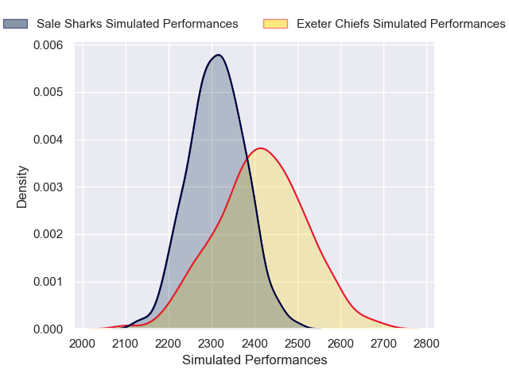
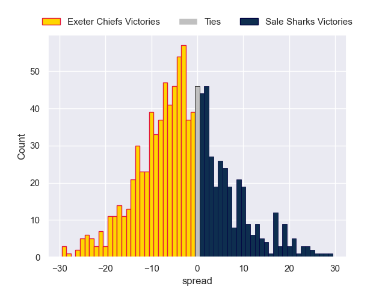
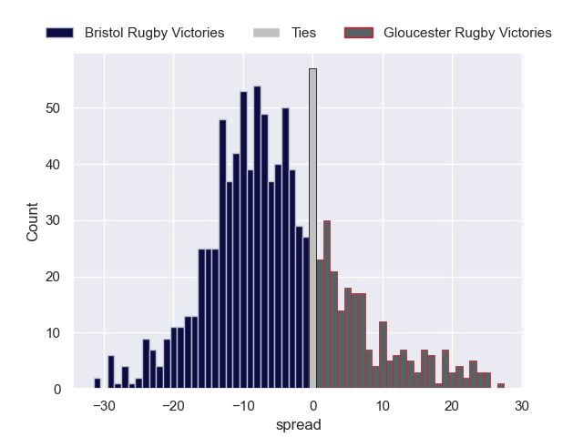
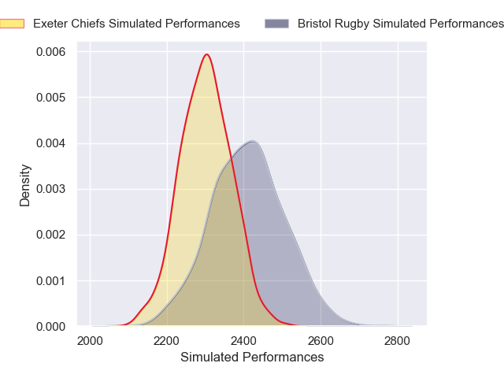
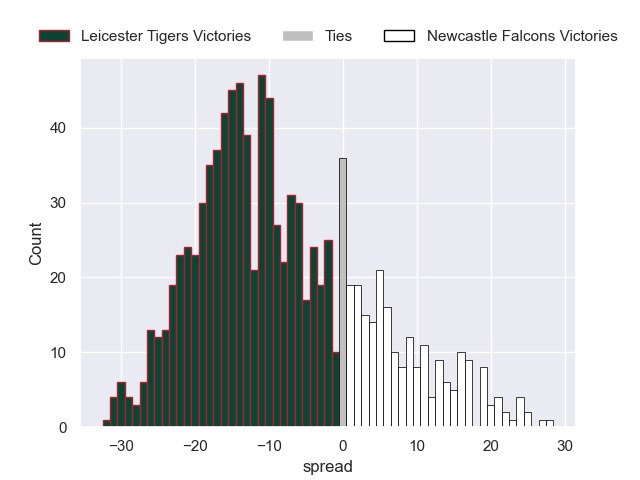
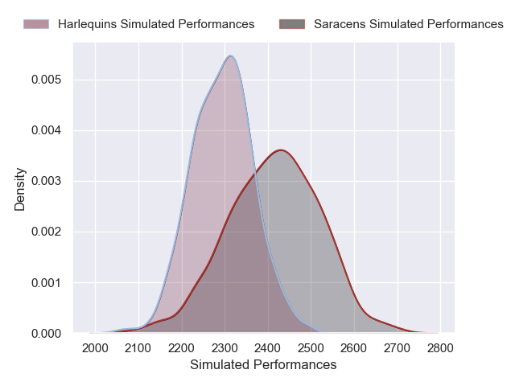
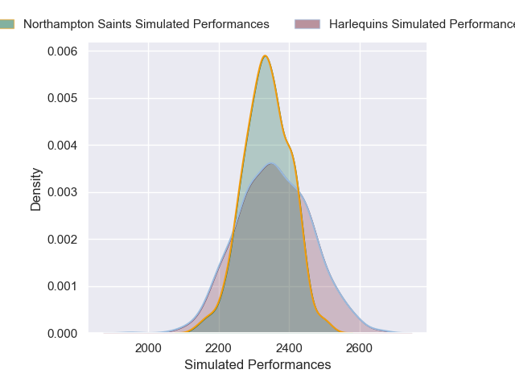
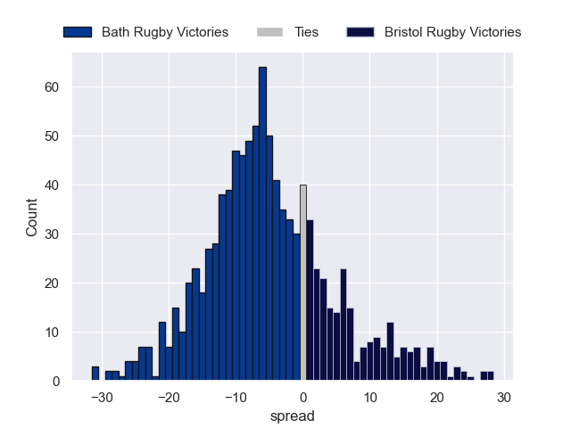
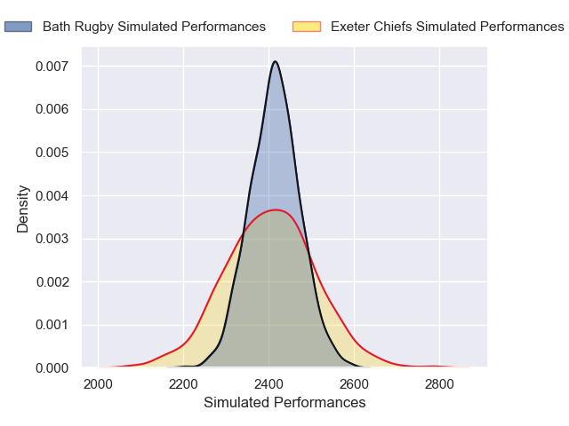

# Team Rankings

# Standings

## Current Standings

| Club               |   Played |   Wins |   Point Differential |   Losing Bonus Points |   Try Bonus Points |   Competition Points |
|:-------------------|---------:|-------:|---------------------:|----------------------:|-------------------:|---------------------:|
| Leicester Tigers   |        4 |      4 |                   35 |                     0 |                  2 |                   18 |
| Gloucester Rugby   |        4 |      3 |                    1 |                     0 |                  3 |                   15 |
| Sale Sharks        |        4 |      2 |                   19 |                     1 |                  3 |                   12 |
| Bath Rugby         |        4 |      2 |                   39 |                     1 |                  2 |                   11 |
| Newcastle Falcons  |        4 |      2 |                  -16 |                     1 |                  2 |                   11 |
| Saracens           |        4 |      2 |                   40 |                     0 |                  2 |                   10 |
| Northampton Saints |        4 |      2 |                   -5 |                     0 |                  2 |                   10 |
| Exeter Chiefs      |        4 |      2 |                  -31 |                     0 |                    |                    8 |
| Bristol Rugby      |        4 |      1 |                  -28 |                     1 |                  1 |                    6 |
| Harlequins         |        4 |      0 |                  -54 |                     0 |                    |                    0 |

## Projected Remaining Table

| Club               |   To Play |   Projected Wins |   Projected Differential |   Projected Losing Bonus Points | Projected Try Bonus Points   |   Projected Competition Points |
|:-------------------|----------:|-----------------:|-------------------------:|--------------------------------:|:-----------------------------|-------------------------------:|
| Northampton Saints |         4 |            2.582 |                   12.378 |                           0.752 |                              |                         11.474 |
| Bath Rugby         |         4 |            2.492 |                   14.472 |                           0.788 |                              |                         11.1   |
| Saracens           |         4 |            2.28  |                    6.587 |                           0.827 |                              |                         10.319 |
| Exeter Chiefs      |         4 |            2.209 |                    7.872 |                           0.974 |                              |                         10.166 |
| Bristol Rugby      |         4 |            2.257 |                    6.139 |                           0.733 |                              |                         10.111 |
| Leicester Tigers   |         4 |            2.06  |                    7.394 |                           0.988 |                              |                          9.542 |
| Harlequins         |         4 |            1.609 |                   -4.966 |                           1.061 |                              |                          7.843 |
| Sale Sharks        |         4 |            1.385 |                   -9.21  |                           1.312 |                              |                          7.292 |
| Gloucester Rugby   |         4 |            1.206 |                  -19.273 |                           0.91  |                              |                          6.048 |
| Newcastle Falcons  |         4 |            1.03  |                  -21.393 |                           0.992 |                              |                          5.442 |

## Projected Total Table

| Club               |   Played |   Wins |   Point Differential |   Losing Bonus Points |   Try Bonus Points |   Competition Points |
|:-------------------|---------:|-------:|---------------------:|----------------------:|-------------------:|---------------------:|
| Leicester Tigers   |        8 |  6.06  |               42.394 |                 0.988 |                  2 |               27.542 |
| Bath Rugby         |        8 |  4.492 |               53.472 |                 1.788 |                  2 |               22.1   |
| Northampton Saints |        8 |  4.582 |                7.378 |                 0.752 |                  2 |               21.474 |
| Gloucester Rugby   |        8 |  4.206 |              -18.273 |                 0.91  |                  3 |               21.048 |
| Saracens           |        8 |  4.28  |               46.587 |                 0.827 |                  2 |               20.319 |
| Sale Sharks        |        8 |  3.385 |                9.79  |                 2.312 |                  3 |               19.292 |
| Exeter Chiefs      |        8 |  4.209 |              -23.128 |                 0.974 |                    |               18.166 |
| Newcastle Falcons  |        8 |  3.03  |              -37.393 |                 1.992 |                  2 |               16.442 |
| Bristol Rugby      |        8 |  3.257 |              -21.861 |                 1.733 |                  1 |               16.111 |
| Harlequins         |        8 |  1.609 |              -58.966 |                 1.061 |                    |                7.843 |

# Completed Match Review

| Model | Percent Correct Predictions | Spread Error |
| ------ | ------ | ------ |
| Club Level | 72.5% | 9.9 |
| Player Level: Lineup | nan% | nan |
| Player Level: Minutes | nan% | nan |

# Future Predictions

## Week 5

### Newcastle Falcons V Saracens on 2026/01/30

Average Margin: Saracens by 3.2

### Exeter Chiefs V Sale Sharks on 2026/01/31

Average Margin: Exeter Chiefs by 4.7

### Northampton Saints V Leicester Tigers on 2026/01/31

Average Margin: Northampton Saints by 3.4

### Bristol Rugby V Gloucester Rugby on 2026/02/01

Average Margin: Bristol Rugby by 5.8

## Week 6

### Bristol Rugby V Exeter Chiefs on 2026/02/07

Average Margin: Bristol Rugby by 2.3

### Leicester Tigers V Newcastle Falcons on 2026/02/07

Average Margin: Leicester Tigers by 8.6

### Saracens V Harlequins on 2026/02/07

Average Margin: Saracens by 4.6

### Sale Sharks V Bath Rugby on 2026/02/08

Average Margin: Bath Rugby by 0.4

## Week 7

### Exeter Chiefs V Gloucester Rugby on 2026/02/14

Average Margin: Exeter Chiefs by 6.0

### Saracens V Leicester Tigers on 2026/02/14

Average Margin: Saracens by 2.7

### Harlequins V Northampton Saints on 2026/02/14

Average Margin: Northampton Saints by 1.1

### Bath Rugby V Bristol Rugby on 2026/02/14

Average Margin: Bath Rugby by 5.6

## Week 8

### Newcastle Falcons V Northampton Saints on 2026/02/20

Average Margin: Northampton Saints by 3.9

### Leicester Tigers V Harlequins on 2026/02/21

Average Margin: Leicester Tigers by 4.8

### Exeter Chiefs V Bath Rugby on 2026/02/21

Average Margin: Bath Rugby by 0.4

### Gloucester Rugby V Sale Sharks on 2026/02/21

Average Margin: Gloucester Rugby by 0.6

## Week 9

### Harlequins V Newcastle Falcons on 2026/02/28

Average Margin: Harlequins by 5.6

### Northampton Saints V Saracens on 2026/02/28

Average Margin: Northampton Saints by 3.9

### Bath Rugby V Gloucester Rugby on 2026/02/28

Average Margin: Bath Rugby by 8.1

### Bristol Rugby V Sale Sharks on 2026/03/01

Average Margin: Bristol Rugby by 3.6

