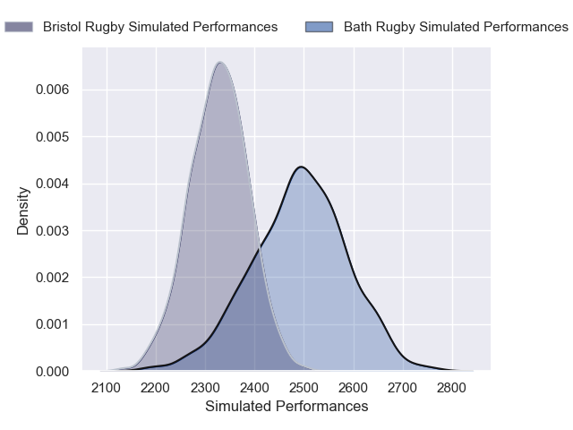
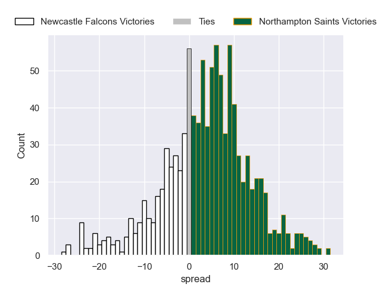
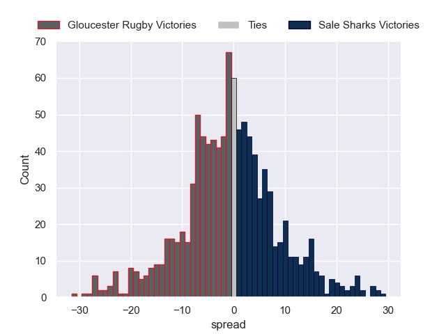
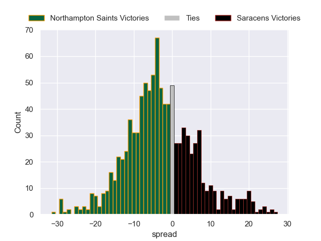
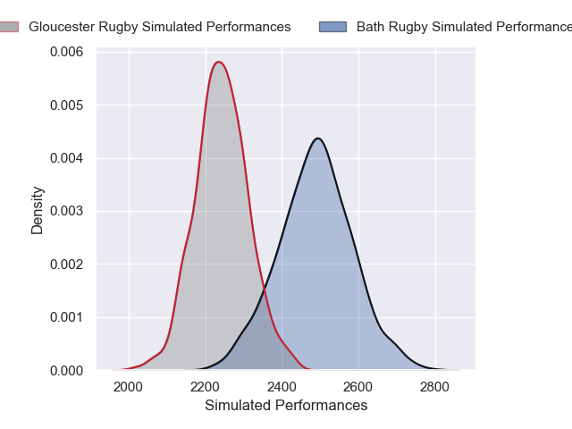

# Team Rankings

# Standings

## Current Standings

| Club               |   Played |   Wins |   Point Differential |   Losing Bonus Points |   Try Bonus Points |   Competition Points |
|:-------------------|---------:|-------:|---------------------:|----------------------:|-------------------:|---------------------:|
| Leicester Tigers   |        4 |      4 |                   35 |                     0 |                  2 |                   18 |
| Gloucester Rugby   |        4 |      3 |                    1 |                     0 |                  3 |                   15 |
| Sale Sharks        |        4 |      2 |                   19 |                     1 |                  3 |                   12 |
| Bath Rugby         |        4 |      2 |                   39 |                     1 |                  2 |                   11 |
| Newcastle Falcons  |        4 |      2 |                  -16 |                     1 |                  2 |                   11 |
| Saracens           |        4 |      2 |                   40 |                     0 |                  2 |                   10 |
| Northampton Saints |        4 |      2 |                   -5 |                     0 |                  2 |                   10 |
| Exeter Chiefs      |        4 |      2 |                  -31 |                     0 |                    |                    8 |
| Bristol Rugby      |        4 |      1 |                  -28 |                     1 |                  1 |                    6 |
| Harlequins         |        4 |      0 |                  -54 |                     0 |                    |                    0 |

## Projected Remaining Table

| Club               |   To Play |   Projected Wins |   Projected Differential |   Projected Losing Bonus Points | Projected Try Bonus Points   |   Projected Competition Points |
|:-------------------|----------:|-----------------:|-------------------------:|--------------------------------:|:-----------------------------|-------------------------------:|
| Northampton Saints |         4 |            2.646 |                   13.302 |                           0.677 |                              |                         11.663 |
| Bath Rugby         |         4 |            2.373 |                   12.049 |                           0.888 |                              |                         10.752 |
| Bristol Rugby      |         4 |            2.255 |                    6.782 |                           0.783 |                              |                         10.183 |
| Saracens           |         4 |            2.21  |                    6.571 |                           0.926 |                              |                         10.122 |
| Exeter Chiefs      |         4 |            2.15  |                    5.812 |                           0.941 |                              |                          9.967 |
| Leicester Tigers   |         4 |            2.107 |                    7.235 |                           0.892 |                              |                          9.61  |
| Sale Sharks        |         4 |            1.538 |                   -6.388 |                           1.269 |                              |                          7.881 |
| Harlequins         |         4 |            1.521 |                   -8.871 |                           0.981 |                              |                          7.419 |
| Gloucester Rugby   |         4 |            1.199 |                  -18.255 |                           0.966 |                              |                          6.064 |
| Newcastle Falcons  |         4 |            1.077 |                  -18.237 |                           1.148 |                              |                          5.81  |

## Projected Total Table

| Club               |   Played |   Wins |   Point Differential |   Losing Bonus Points |   Try Bonus Points |   Competition Points |
|:-------------------|---------:|-------:|---------------------:|----------------------:|-------------------:|---------------------:|
| Leicester Tigers   |        8 |  6.107 |               42.235 |                 0.892 |                  2 |               27.61  |
| Bath Rugby         |        8 |  4.373 |               51.049 |                 1.888 |                  2 |               21.752 |
| Northampton Saints |        8 |  4.646 |                8.302 |                 0.677 |                  2 |               21.663 |
| Gloucester Rugby   |        8 |  4.199 |              -17.255 |                 0.966 |                  3 |               21.064 |
| Saracens           |        8 |  4.21  |               46.571 |                 0.926 |                  2 |               20.122 |
| Sale Sharks        |        8 |  3.538 |               12.612 |                 2.269 |                  3 |               19.881 |
| Exeter Chiefs      |        8 |  4.15  |              -25.188 |                 0.941 |                    |               17.967 |
| Newcastle Falcons  |        8 |  3.077 |              -34.237 |                 2.148 |                  2 |               16.81  |
| Bristol Rugby      |        8 |  3.255 |              -21.218 |                 1.783 |                  1 |               16.183 |
| Harlequins         |        8 |  1.521 |              -62.871 |                 0.981 |                    |                7.419 |

# Completed Match Review

| Model | Percent Correct Predictions | Spread Error |
| ------ | ------ | ------ |
| Club Level | 67.5% | 10.5 |
| Player Level: Lineup | nan% | nan |
| Player Level: Minutes | nan% | nan |

# Future Predictions

## Week 5

### Newcastle Falcons V Saracens on 2026/01/30

Average Margin: Saracens by 2.6

### Northampton Saints V Leicester Tigers on 2026/01/31

Average Margin: Northampton Saints by 3.5

### Exeter Chiefs V Sale Sharks on 2026/01/31

Average Margin: Exeter Chiefs by 3.6

### Bristol Rugby V Gloucester Rugby on 2026/02/01

Average Margin: Bristol Rugby by 5.7

## Week 6

### Leicester Tigers V Newcastle Falcons on 2026/02/07

Average Margin: Leicester Tigers by 7.9

### Saracens V Harlequins on 2026/02/07

Average Margin: Saracens by 5.0

### Bristol Rugby V Exeter Chiefs on 2026/02/07

Average Margin: Bristol Rugby by 3.3

### Sale Sharks V Bath Rugby on 2026/02/08

Average Margin: Sale Sharks by 0.3

## Week 7

### Saracens V Leicester Tigers on 2026/02/14

Average Margin: Saracens by 2.7

### Harlequins V Northampton Saints on 2026/02/14

Average Margin: Northampton Saints by 2.2

### Bath Rugby V Bristol Rugby on 2026/02/14

Average Margin: Bath Rugby by 5.0

### Exeter Chiefs V Gloucester Rugby on 2026/02/14

Average Margin: Exeter Chiefs by 5.2

## Week 8

### Newcastle Falcons V Northampton Saints on 2026/02/20

Average Margin: Northampton Saints by 3.8

### Leicester Tigers V Harlequins on 2026/02/21

Average Margin: Leicester Tigers by 5.5

### Exeter Chiefs V Bath Rugby on 2026/02/21

Average Margin: Exeter Chiefs by 0.3

### Gloucester Rugby V Sale Sharks on 2026/02/21

Average Margin: Gloucester Rugby by 0.3

## Week 9

### Harlequins V Newcastle Falcons on 2026/02/28

Average Margin: Harlequins by 3.9

### Northampton Saints V Saracens on 2026/02/28

Average Margin: Northampton Saints by 3.8

### Bath Rugby V Gloucester Rugby on 2026/02/28

Average Margin: Bath Rugby by 7.7

### Bristol Rugby V Sale Sharks on 2026/03/01

Average Margin: Bristol Rugby by 2.8

