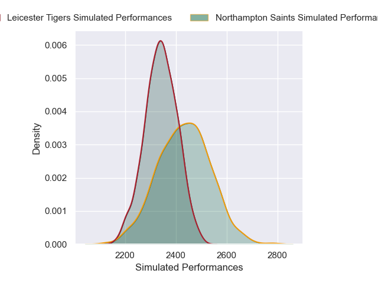
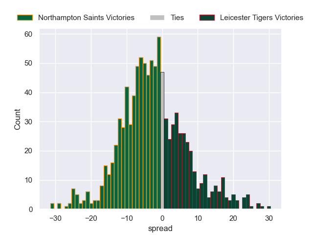
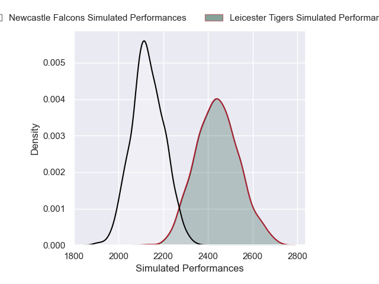
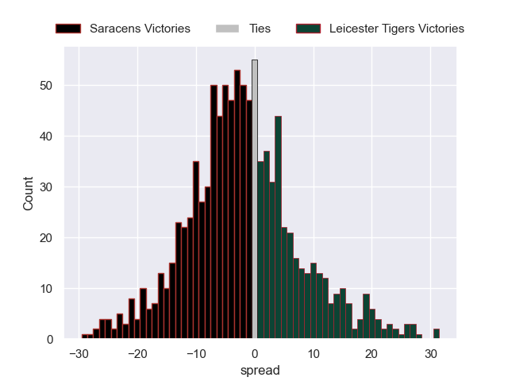
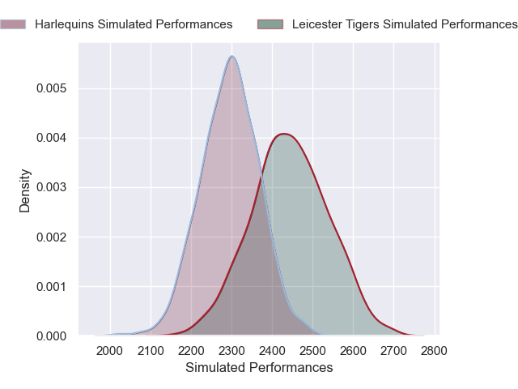
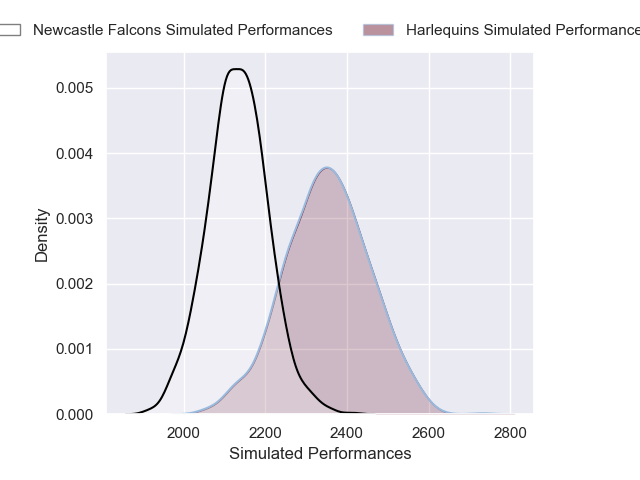
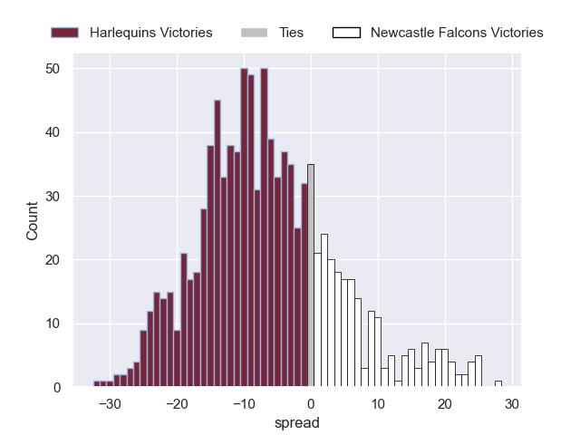
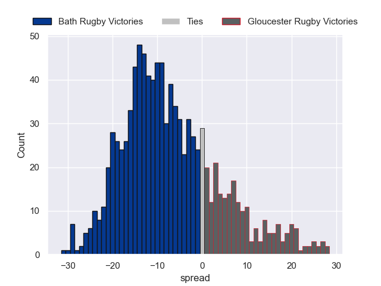
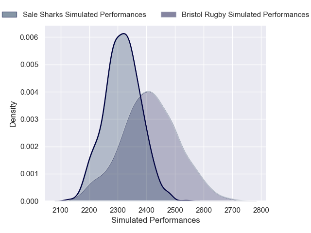

# Team Rankings

# Standings

## Current Standings

| Club               |   Played |   Wins |   Point Differential |   Losing Bonus Points |   Try Bonus Points |   Competition Points |
|:-------------------|---------:|-------:|---------------------:|----------------------:|-------------------:|---------------------:|
| Leicester Tigers   |        4 |      4 |                   35 |                     0 |                  2 |                   18 |
| Gloucester Rugby   |        4 |      3 |                    1 |                     0 |                  3 |                   15 |
| Sale Sharks        |        4 |      2 |                   19 |                     1 |                  3 |                   12 |
| Bath Rugby         |        4 |      2 |                   39 |                     1 |                  2 |                   11 |
| Newcastle Falcons  |        4 |      2 |                  -16 |                     1 |                  2 |                   11 |
| Saracens           |        4 |      2 |                   40 |                     0 |                  2 |                   10 |
| Northampton Saints |        4 |      2 |                   -5 |                     0 |                  2 |                   10 |
| Exeter Chiefs      |        4 |      2 |                  -31 |                     0 |                    |                    8 |
| Bristol Rugby      |        4 |      1 |                  -28 |                     1 |                  1 |                    6 |
| Harlequins         |        4 |      0 |                  -54 |                     0 |                    |                    0 |

## Projected Remaining Table

| Club               |   To Play |   Projected Wins |   Projected Differential |   Projected Losing Bonus Points | Projected Try Bonus Points   |   Projected Competition Points |
|:-------------------|----------:|-----------------:|-------------------------:|--------------------------------:|:-----------------------------|-------------------------------:|
| Northampton Saints |         4 |            2.585 |                   13.072 |                           0.702 |                              |                         11.488 |
| Bath Rugby         |         4 |            2.454 |                   14.577 |                           0.816 |                              |                         11.056 |
| Saracens           |         4 |            2.273 |                    8.018 |                           0.875 |                              |                         10.381 |
| Bristol Rugby      |         4 |            2.282 |                    7.033 |                           0.737 |                              |                         10.243 |
| Exeter Chiefs      |         4 |            2.206 |                    7.509 |                           0.924 |                              |                         10.158 |
| Leicester Tigers   |         4 |            2.115 |                    9.513 |                           0.94  |                              |                          9.746 |
| Harlequins         |         4 |            1.556 |                   -7.873 |                           0.966 |                              |                          7.552 |
| Sale Sharks        |         4 |            1.381 |                   -8.651 |                           1.311 |                              |                          7.261 |
| Gloucester Rugby   |         4 |            1.172 |                  -20.468 |                           0.907 |                              |                          5.977 |
| Newcastle Falcons  |         4 |            1.002 |                  -22.73  |                           1.017 |                              |                          5.333 |

## Projected Total Table

| Club               |   Played |   Wins |   Point Differential |   Losing Bonus Points |   Try Bonus Points |   Competition Points |
|:-------------------|---------:|-------:|---------------------:|----------------------:|-------------------:|---------------------:|
| Leicester Tigers   |        8 |  6.115 |               44.513 |                 0.94  |                  2 |               27.746 |
| Bath Rugby         |        8 |  4.454 |               53.577 |                 1.816 |                  2 |               22.056 |
| Northampton Saints |        8 |  4.585 |                8.072 |                 0.702 |                  2 |               21.488 |
| Gloucester Rugby   |        8 |  4.172 |              -19.468 |                 0.907 |                  3 |               20.977 |
| Saracens           |        8 |  4.273 |               48.018 |                 0.875 |                  2 |               20.381 |
| Sale Sharks        |        8 |  3.381 |               10.349 |                 2.311 |                  3 |               19.261 |
| Exeter Chiefs      |        8 |  4.206 |              -23.491 |                 0.924 |                    |               18.158 |
| Newcastle Falcons  |        8 |  3.002 |              -38.73  |                 2.017 |                  2 |               16.333 |
| Bristol Rugby      |        8 |  3.282 |              -20.967 |                 1.737 |                  1 |               16.243 |
| Harlequins         |        8 |  1.556 |              -61.873 |                 0.966 |                    |                7.552 |

# Completed Match Review

| Model | Percent Correct Predictions | Spread Error |
| ------ | ------ | ------ |
| Club Level | 70.0% | 11.1 |
| Player Level: Lineup | nan% | nan |
| Player Level: Minutes | nan% | nan |

# Future Predictions

## Week 5

### Newcastle Falcons V Saracens on 2026/01/30

Average Margin: Saracens by 4.3

### Exeter Chiefs V Sale Sharks on 2026/01/31

Average Margin: Exeter Chiefs by 4.3

### Northampton Saints V Leicester Tigers on 2026/01/31

Average Margin: Northampton Saints by 3.6

### Bristol Bears V Gloucester Rugby on 2026/02/01

Average Margin: Bristol Rugby by 5.6

## Week 6

### Bristol Rugby V Exeter Chiefs on 2026/02/07

Average Margin: Bristol Rugby by 3.1

### Leicester Tigers V Newcastle Falcons on 2026/02/07

Average Margin: Leicester Tigers by 8.6

### Saracens V Harlequins on 2026/02/07

Average Margin: Saracens by 5.4

### Sale Sharks V Bath Rugby on 2026/02/08

Average Margin: Bath Rugby by 0.8

## Week 7

### Bath Rugby V Bristol Rugby on 2026/02/14

Average Margin: Bath Rugby by 4.9

### Exeter Chiefs V Gloucester Rugby on 2026/02/14

Average Margin: Exeter Chiefs by 6.2

### Saracens V Leicester Tigers on 2026/02/14

Average Margin: Saracens by 1.8

### Harlequins V Northampton Saints on 2026/02/14

Average Margin: Northampton Saints by 1.3

## Week 8

### Newcastle Falcons V Northampton Saints on 2026/02/20

Average Margin: Northampton Saints by 4.7

### Exeter Chiefs V Bath Rugby on 2026/02/21

Average Margin: Exeter Chiefs by 0.2

### Gloucester Rugby V Sale Sharks on 2026/02/21

Average Margin: Gloucester Rugby by 0.4

### Leicester Tigers V Harlequins on 2026/02/21

Average Margin: Leicester Tigers by 6.3

## Week 9

### Northampton Saints V Saracens on 2026/02/28

Average Margin: Northampton Saints by 3.5

### Harlequins V Newcastle Falcons on 2026/02/28

Average Margin: Harlequins by 5.1

### Bath Rugby V Gloucester Rugby on 2026/02/28

Average Margin: Bath Rugby by 9.0

### Bristol Rugby V Sale Sharks on 2026/03/01

Average Margin: Bristol Rugby by 3.2

