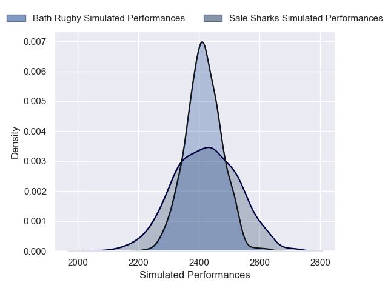
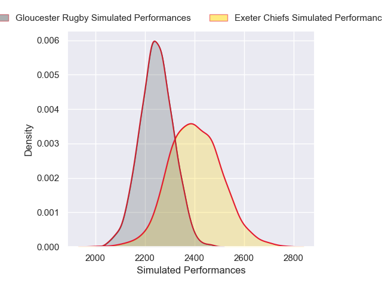
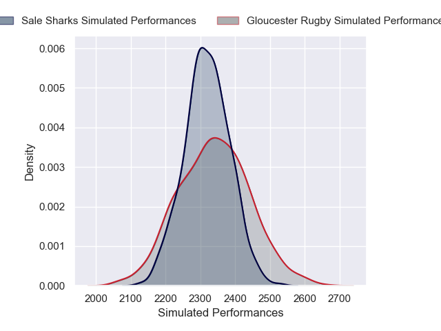
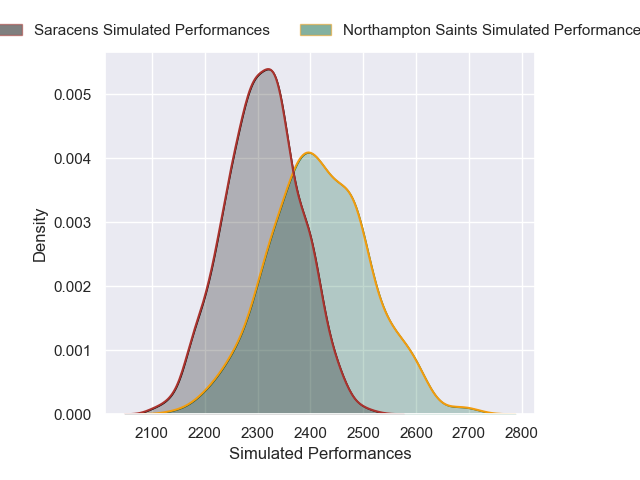
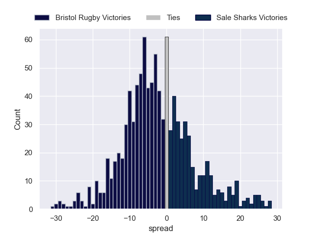

# Team Rankings

# Standings

## Current Standings

| Club                |   Played |   Wins |   Point Differential |   Losing Bonus Points |   Try Bonus Points |   Competition Points |
|:--------------------|---------:|-------:|---------------------:|----------------------:|-------------------:|---------------------:|
| Gloucester Rugby    |        5 |      4 |                    9 |                     0 |                  3 |                   19 |
| Leicester Tigers    |        5 |      4 |                   17 |                     0 |                  2 |                   18 |
| Saracens            |        5 |      3 |                   63 |                     0 |                  2 |                   14 |
| Northampton Saints  |        5 |      3 |                   13 |                     0 |                  2 |                   14 |
| Exeter Chiefs       |        5 |      3 |                   14 |                     0 |                    |                   12 |
| Sale Sharks         |        5 |      2 |                  -26 |                     1 |                  3 |                   12 |
| Bath Rugby          |        4 |      2 |                   39 |                     1 |                  2 |                   11 |
| Newcastle Red Bulls |        5 |      2 |                  -39 |                     1 |                  2 |                   11 |
| Bristol Rugby       |        5 |      1 |                  -36 |                     1 |                  1 |                    6 |
| Harlequins          |        4 |      0 |                  -54 |                     0 |                    |                    0 |

## Projected Remaining Table

| Club                |   To Play |   Projected Wins |   Projected Differential |   Projected Losing Bonus Points | Projected Try Bonus Points   |   Projected Competition Points |
|:--------------------|----------:|-----------------:|-------------------------:|--------------------------------:|:-----------------------------|-------------------------------:|
| Bath Rugby          |         4 |            2.477 |                   15.083 |                           0.763 |                              |                         11.005 |
| Northampton Saints  |         3 |            1.943 |                   12.538 |                           0.522 |                              |                          8.562 |
| Leicester Tigers    |         3 |            1.769 |                   13.105 |                           0.557 |                              |                          7.853 |
| Saracens            |         3 |            1.664 |                    6.09  |                           0.64  |                              |                          7.552 |
| Exeter Chiefs       |         3 |            1.607 |                    5.533 |                           0.717 |                              |                          7.441 |
| Harlequins          |         4 |            1.543 |                   -7.454 |                           0.972 |                              |                          7.438 |
| Bristol Rugby       |         3 |            1.469 |                   -0.317 |                           0.652 |                              |                          6.816 |
| Sale Sharks         |         3 |            1.053 |                   -7.758 |                           0.887 |                              |                          5.399 |
| Gloucester Rugby    |         3 |            1.028 |                  -12.541 |                           0.672 |                              |                          5.03  |
| Newcastle Red Bulls |         3 |            0.773 |                  -24.279 |                           0.559 |                              |                          3.845 |

## Projected Total Table

| Club                |   Played |   Wins |   Point Differential |   Losing Bonus Points |   Try Bonus Points |   Competition Points |
|:--------------------|---------:|-------:|---------------------:|----------------------:|-------------------:|---------------------:|
| Leicester Tigers    |        8 |  5.769 |               30.105 |                 0.557 |                  2 |               25.853 |
| Gloucester Rugby    |        8 |  5.028 |               -3.541 |                 0.672 |                  3 |               24.03  |
| Northampton Saints  |        8 |  4.943 |               25.538 |                 0.522 |                  2 |               22.562 |
| Bath Rugby          |        8 |  4.477 |               54.083 |                 1.763 |                  2 |               22.005 |
| Saracens            |        8 |  4.664 |               69.09  |                 0.64  |                  2 |               21.552 |
| Exeter Chiefs       |        8 |  4.607 |               19.533 |                 0.717 |                    |               19.441 |
| Sale Sharks         |        8 |  3.053 |              -33.758 |                 1.887 |                  3 |               17.399 |
| Newcastle Red Bulls |        8 |  2.773 |              -63.279 |                 1.559 |                  2 |               14.845 |
| Bristol Rugby       |        8 |  2.469 |              -36.317 |                 1.652 |                  1 |               12.816 |
| Harlequins          |        8 |  1.543 |              -61.454 |                 0.972 |                    |                7.438 |

# Completed Match Review

| Model | Percent Correct Predictions | Spread Error |
| ------ | ------ | ------ |
| Club Level | 67.5% | 11.6 |
| Player Level: Lineup | nan% | nan |
| Player Level: Minutes | nan% | nan |

# Future Predictions

## Week 6

### Bristol Rugby V Exeter Chiefs on 2026/02/07

Average Margin: Bristol Rugby by 1.3

### Leicester Tigers V Newcastle Red Bulls on 2026/02/07

Average Margin: Leicester Tigers by 10.8

### Saracens V Harlequins on 2026/02/07

Average Margin: Saracens by 6.2

### Sale Sharks V Bath Rugby on 2026/02/08

Average Margin: Bath Rugby by 2.0

## Week 7

### Harlequins V Northampton Saints on 2026/02/14

Average Margin: Northampton Saints by 2.6

### Exeter Chiefs V Gloucester Rugby on 2026/02/14

Average Margin: Exeter Chiefs by 6.3

### Saracens V Leicester Tigers on 2026/02/14

Average Margin: Saracens by 3.6

### Bath Rugby V Bristol Rugby on 2026/02/14

Average Margin: Bath Rugby by 5.5

## Week 8

### Newcastle Red Bulls V Northampton Saints on 2026/02/20

Average Margin: Northampton Saints by 6.3

### Leicester Tigers V Harlequins on 2026/02/21

Average Margin: Leicester Tigers by 5.9

### Gloucester Rugby V Sale Sharks on 2026/02/21

Average Margin: Gloucester Rugby by 2.0

### Exeter Chiefs V Bath Rugby on 2026/02/21

Average Margin: Exeter Chiefs by 0.5

## Week 9

### Harlequins V Newcastle Red Bulls on 2026/02/28

Average Margin: Harlequins by 7.2

### Northampton Saints V Saracens on 2026/02/28

Average Margin: Northampton Saints by 3.7

### Bath Rugby V Gloucester Rugby on 2026/02/28

Average Margin: Bath Rugby by 8.2

### Bristol Rugby V Sale Sharks on 2026/03/01

Average Margin: Bristol Rugby by 3.8

