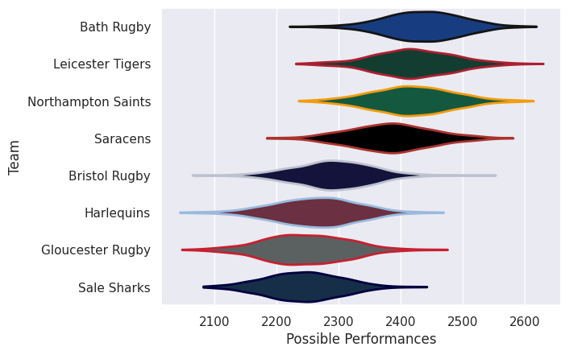
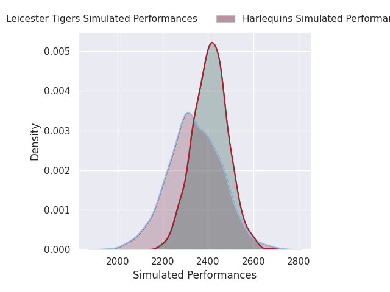
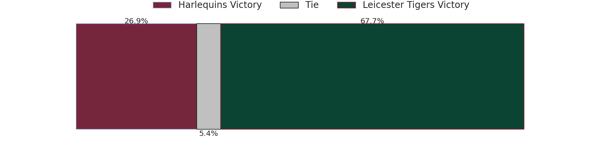
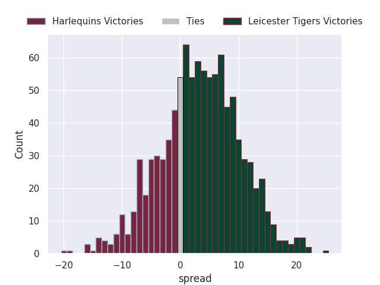
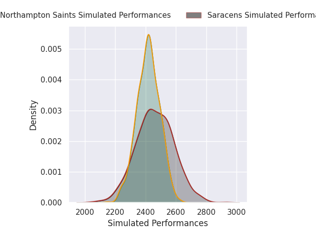
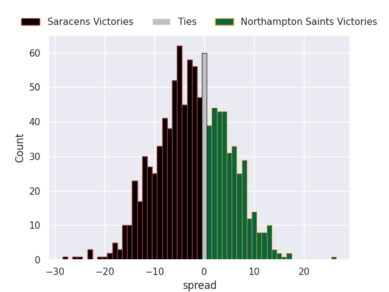
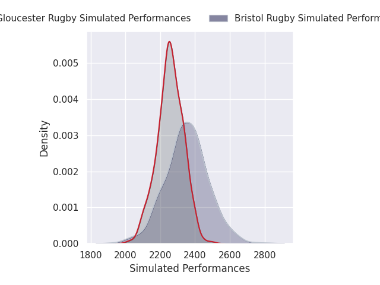
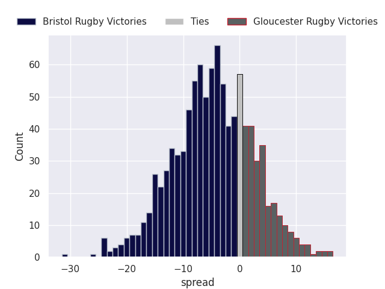
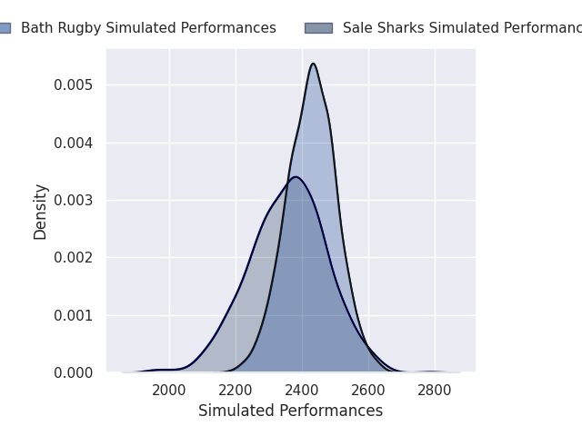
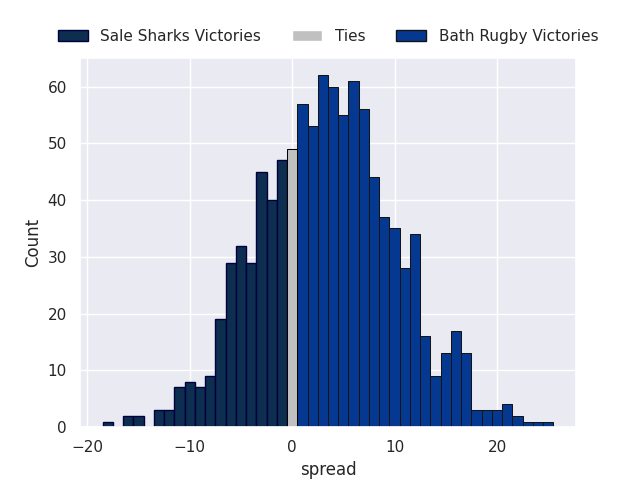

# Team Rankings

# Standings

## Projected Remaining Table

| Club               |   To Play |   Projected Wins |   Projected Differential |   Projected Losing Bonus Points | Projected Try Bonus Points   |   Projected Competition Points |
|:-------------------|----------:|-----------------:|-------------------------:|--------------------------------:|:-----------------------------|-------------------------------:|
| Bristol Rugby      |         1 |            0.711 |                    4.714 |                           0.193 |                              |                          3.151 |
| Leicester Tigers   |         1 |            0.677 |                    3.408 |                           0.214 |                              |                          3.03  |
| Bath Rugby         |         1 |            0.668 |                    3.474 |                           0.241 |                              |                          3.011 |
| Saracens           |         1 |            0.592 |                    2.256 |                           0.258 |                              |                          2.746 |
| Northampton Saints |         1 |            0.348 |                   -2.256 |                           0.358 |                              |                          1.87  |
| Sale Sharks        |         1 |            0.283 |                   -3.474 |                           0.404 |                              |                          1.634 |
| Harlequins         |         1 |            0.269 |                   -3.408 |                           0.403 |                              |                          1.587 |
| Gloucester Rugby   |         1 |            0.232 |                   -4.714 |                           0.374 |                              |                          1.416 |

## Projected Total Table

| Club               |   Played |   Wins |   Point Differential |   Losing Bonus Points | Try Bonus Points   |   Competition Points |
|:-------------------|---------:|-------:|---------------------:|----------------------:|:-------------------|---------------------:|
| Bristol Rugby      |        1 |  0.711 |                4.714 |                 0.193 |                    |                3.151 |
| Leicester Tigers   |        1 |  0.677 |                3.408 |                 0.214 |                    |                3.03  |
| Bath Rugby         |        1 |  0.668 |                3.474 |                 0.241 |                    |                3.011 |
| Saracens           |        1 |  0.592 |                2.256 |                 0.258 |                    |                2.746 |
| Northampton Saints |        1 |  0.348 |               -2.256 |                 0.358 |                    |                1.87  |
| Sale Sharks        |        1 |  0.283 |               -3.474 |                 0.404 |                    |                1.634 |
| Harlequins         |        1 |  0.269 |               -3.408 |                 0.403 |                    |                1.587 |
| Gloucester Rugby   |        1 |  0.232 |               -4.714 |                 0.374 |                    |                1.416 |

# Future Predictions

## Week 1

### Harlequins V Leicester Tigers on 2026/09/05

Average Margin: Leicester Tigers by 3.4

### Saracens V Northampton Saints on 2026/09/05

Average Margin: Saracens by 2.3

### Bristol Rugby V Gloucester Rugby on 2026/09/05

Average Margin: Bristol Rugby by 4.7

### Sale Sharks V Bath Rugby on 2026/09/06

Average Margin: Bath Rugby by 3.5

