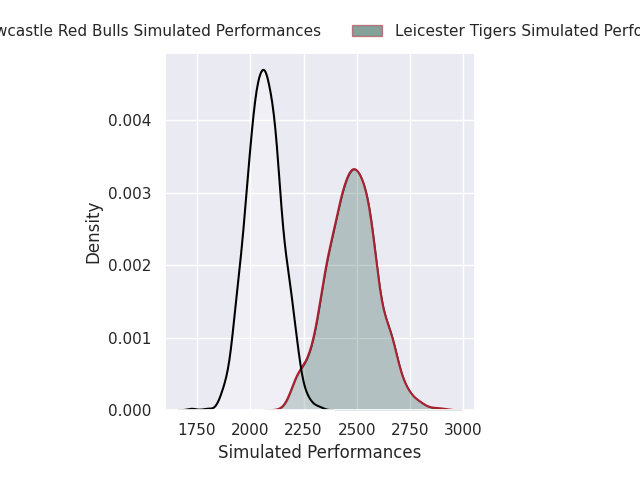
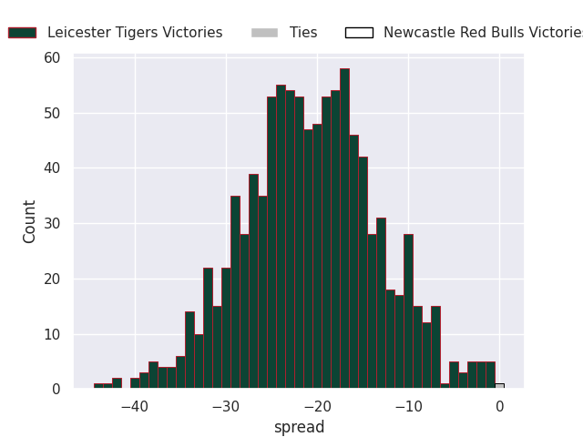
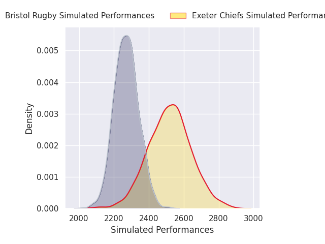
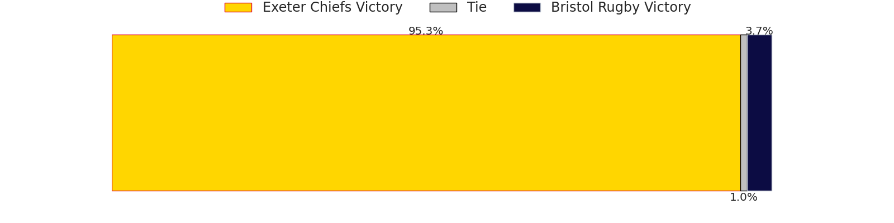
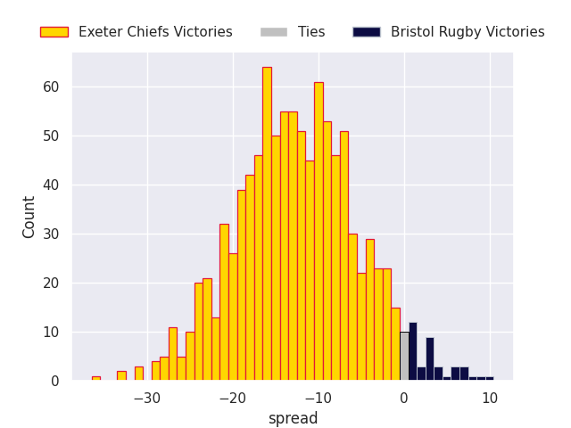
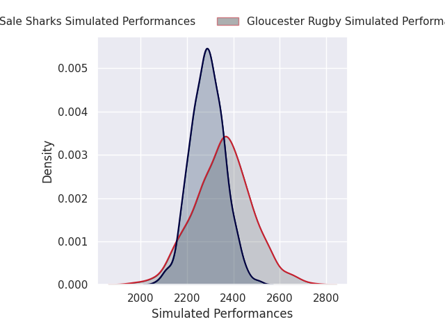
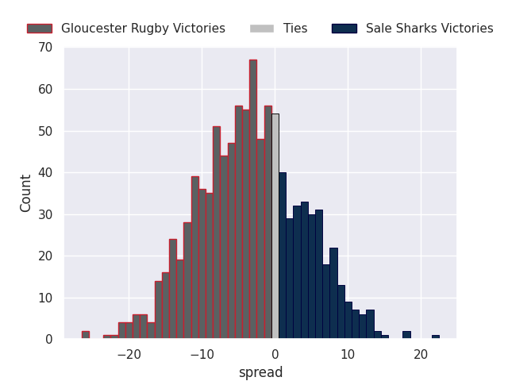

# Team Rankings

# Standings

## Current Standings

| Club               |   Played |   Wins |   Point Differential |   Losing Bonus Points | Try Bonus Points   |   Competition Points |
|:-------------------|---------:|-------:|---------------------:|----------------------:|:-------------------|---------------------:|
| Saracens           |        1 |      1 |                   54 |                     0 |                    |                    4 |
| Harlequins         |        1 |      1 |                   24 |                     0 |                    |                    4 |
| Sale Sharks        |        1 |      1 |                   22 |                     0 |                    |                    4 |
| Bristol Rugby      |        1 |      1 |                    3 |                     0 |                    |                    4 |
| Gloucester Rugby   |        1 |      0 |                   -3 |                     1 |                    |                    1 |
| Bath Rugby         |        1 |      0 |                  -22 |                     0 |                    |                    0 |
| Leicester Tigers   |        1 |      0 |                  -24 |                     0 |                    |                    0 |
| Northampton Saints |        1 |      0 |                  -54 |                     0 |                    |                    0 |

## Projected Remaining Table

| Club                |   To Play |   Projected Wins |   Projected Differential |   Projected Losing Bonus Points | Projected Try Bonus Points   |   Projected Competition Points |
|:--------------------|----------:|-----------------:|-------------------------:|--------------------------------:|:-----------------------------|-------------------------------:|
| Leicester Tigers    |         1 |            0.999 |                   20.675 |                           0     |                              |                          3.998 |
| Exeter Chiefs       |         1 |            0.953 |                   12.434 |                           0.034 |                              |                          3.866 |
| Gloucester Rugby    |         1 |            0.663 |                    3.377 |                           0.213 |                              |                          2.973 |
| Northampton Saints  |         1 |            0.527 |                    1.102 |                           0.325 |                              |                          2.557 |
| Harlequins          |         1 |            0.411 |                   -1.102 |                           0.374 |                              |                          2.142 |
| Sale Sharks         |         1 |            0.283 |                   -3.377 |                           0.373 |                              |                          1.613 |
| Bristol Rugby       |         1 |            0.037 |                  -12.434 |                           0.193 |                              |                          0.361 |
| Newcastle Red Bulls |         1 |            0     |                  -20.675 |                           0.039 |                              |                          0.041 |

## Projected Total Table

| Club                |   Played |   Wins |   Point Differential |   Losing Bonus Points | Try Bonus Points   |   Competition Points |
|:--------------------|---------:|-------:|---------------------:|----------------------:|:-------------------|---------------------:|
| Harlequins          |        2 |  1.411 |               22.898 |                 0.374 |                    |                6.142 |
| Sale Sharks         |        2 |  1.283 |               18.623 |                 0.373 |                    |                5.613 |
| Bristol Rugby       |        2 |  1.037 |               -9.434 |                 0.193 |                    |                4.361 |
| Saracens            |        1 |  1     |               54     |                 0     |                    |                4     |
| Leicester Tigers    |        2 |  0.999 |               -3.325 |                 0     |                    |                3.998 |
| Gloucester Rugby    |        2 |  0.663 |                0.377 |                 1.213 |                    |                3.973 |
| Exeter Chiefs       |        1 |  0.953 |               12.434 |                 0.034 |                    |                3.866 |
| Northampton Saints  |        2 |  0.527 |              -52.898 |                 0.325 |                    |                2.557 |
| Newcastle Red Bulls |        1 |  0     |              -20.675 |                 0.039 |                    |                0.041 |
| Bath Rugby          |        1 |  0     |              -22     |                 0     |                    |                0     |

# Completed Match Review

| Model | Percent Correct Predictions | Spread Error |
| ------ | ------ | ------ |
| Club Level | 62.5% | 17.5 |
| Player Level: Lineup | nan% | nan |
| Player Level: Minutes | nan% | nan |

# Future Predictions

## Week 2

### Leicester Tigers V Newcastle Red Bulls on 2026/09/12

Average Margin: Leicester Tigers by 20.7

### Harlequins V Northampton Saints on 2026/09/12

Average Margin: Northampton Saints by 1.1

### Exeter Chiefs V Bristol Rugby on 2026/09/12

Average Margin: Exeter Chiefs by 12.4

### Gloucester Rugby V Sale Sharks on 2026/09/12

Average Margin: Gloucester Rugby by 3.4

