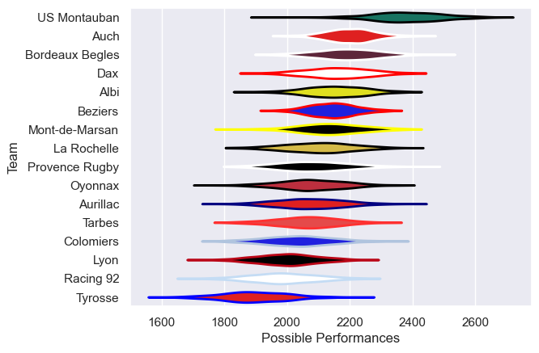

---  
title: "Pro D2 05/06"  
date: 2025-07-29 6:00:00 -0500  
categories: model review projection  
layout: article  
aside:  
    toc: true  
---
# Current Team Rankings

# Standings

## Current Standings

| Club            |   Played |   Wins |   Point Differential |   Losing Bonus Points | Try Bonus Points   |   Competition Points |
|:----------------|---------:|-------:|---------------------:|----------------------:|:-------------------|---------------------:|
| US Montauban    |       30 |     25 |                  391 |                     4 |                    |                  106 |
| Albi            |       32 |     23 |                  165 |                     5 |                    |                   99 |
| Dax             |       32 |     20 |                  221 |                     4 |                    |                   84 |
| Auch            |       31 |     18 |                  151 |                    11 |                    |                   83 |
| Tarbes          |       30 |     18 |                   97 |                     5 |                    |                   79 |
| Beziers         |       31 |     18 |                   95 |                     7 |                    |                   79 |
| Bordeaux Begles |       30 |     15 |                  -38 |                     5 |                    |                   69 |
| La Rochelle     |       30 |     15 |                  -40 |                     5 |                    |                   65 |
| Oyonnax         |       30 |     14 |                  -64 |                     6 |                    |                   64 |
| Colomiers       |       30 |     14 |                 -127 |                     6 |                    |                   62 |
| Mont-de-Marsan  |       30 |     11 |                  -20 |                     8 |                    |                   52 |
| Lyon            |       30 |     11 |                  -95 |                     8 |                    |                   52 |
| Racing 92       |       30 |     11 |                 -177 |                     4 |                    |                   52 |
| Provence Rugby  |       30 |     10 |                 -145 |                     9 |                    |                   51 |
| Aurillac        |       30 |     10 |                 -111 |                     9 |                    |                   49 |
| Tyrosse         |       30 |      5 |                 -303 |                     8 |                    |                   30 |

# Completed Match Review

| Model | Percent Correct Predictions | Spread Error |
| ------ | ------ | ------ |
| Club Level | 70.8% | 9.2 |
| Player Level: Lineup | nan% | nan |
| Player Level: Minutes | nan% | nan |

