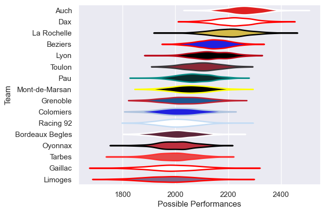

---  
title: "Pro D2 06/07 Status"  
date: 2025-07-28 6:00:00 -0500  
categories: model review projection  
layout: article  
aside:  
    toc: true  
---
# Current Team Rankings

# Standings

## Current Standings

| Club            |   Played |   Wins |   Point Differential |   Losing Bonus Points | Try Bonus Points   |   Competition Points |
|:----------------|---------:|-------:|---------------------:|----------------------:|:-------------------|---------------------:|
| Auch            |       30 |     25 |                  311 |                     3 |                    |                  105 |
| Dax             |       32 |     22 |                  307 |                     7 |                    |                   95 |
| La Rochelle     |       32 |     21 |                  154 |                     4 |                    |                   92 |
| Toulon          |       31 |     19 |                   88 |                     4 |                    |                   80 |
| Beziers         |       31 |     18 |                  129 |                     3 |                    |                   77 |
| Lyon            |       30 |     16 |                  106 |                     9 |                    |                   75 |
| Oyonnax         |       30 |     15 |                  -81 |                     4 |                    |                   68 |
| Pau             |       30 |     13 |                   -6 |                     8 |                    |                   60 |
| Mont-de-Marsan  |       30 |     12 |                 -107 |                    10 |                    |                   60 |
| Bordeaux Begles |       30 |     12 |                 -103 |                    10 |                    |                   58 |
| Gaillac         |       30 |     12 |                 -109 |                     8 |                    |                   58 |
| Tarbes          |       30 |     12 |                 -165 |                     8 |                    |                   56 |
| Racing 92       |       30 |     11 |                  -62 |                    10 |                    |                   54 |
| Grenoble        |       30 |     10 |                  -94 |                    10 |                    |                   54 |
| Limoges         |       30 |     11 |                 -162 |                     7 |                    |                   51 |
| Colomiers       |       30 |      8 |                 -206 |                     6 |                    |                   40 |

# Completed Match Review

| Model | Percent Correct Predictions | Spread Error |
| ------ | ------ | ------ |
| Club Level | 73.7% | 8.7 |
| Player Level: Lineup | nan% | nan |
| Player Level: Minutes | nan% | nan |

