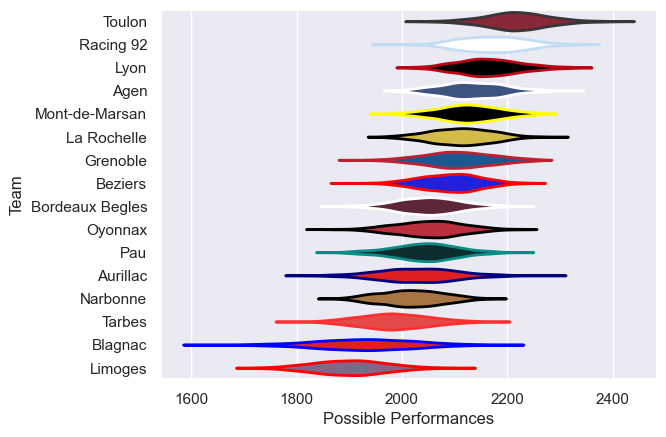

---  
title: "Pro D2 07/08"  
date: 2025-07-29 6:00:00 -0500  
categories: model review projection  
layout: article  
aside:  
    toc: true  
---
# Current Team Rankings

# Standings

## Current Standings

| Club            |   Played |   Wins |   Point Differential |   Losing Bonus Points |   Try Bonus Points |   Competition Points |
|:----------------|---------:|-------:|---------------------:|----------------------:|-------------------:|---------------------:|
| Mont-de-Marsan  |       32 |     21 |                  109 |                     5 |                  1 |                   96 |
| Racing 92       |       32 |     22 |                  254 |                     5 |                    |                   95 |
| Toulon          |       30 |     22 |                  378 |                     4 |                    |                   94 |
| Lyon            |       31 |     17 |                  174 |                    10 |                    |                   78 |
| Beziers         |       30 |     17 |                   51 |                     6 |                    |                   78 |
| Agen            |       30 |     17 |                  145 |                     4 |                    |                   76 |
| La Rochelle     |       31 |     17 |                   91 |                     8 |                    |                   76 |
| Grenoble        |       30 |     16 |                   52 |                     6 |                    |                   74 |
| Oyonnax         |       30 |     16 |                   67 |                     3 |                    |                   67 |
| Pau             |       30 |     14 |                  -43 |                     8 |                    |                   64 |
| Aurillac        |       30 |     14 |                  -82 |                     6 |                    |                   62 |
| Bordeaux Begles |       30 |     12 |                  -58 |                     9 |                    |                   59 |
| Narbonne        |       30 |     12 |                 -123 |                     6 |                    |                   56 |
| Tarbes          |       30 |      8 |                 -277 |                    10 |                    |                   44 |
| Limoges         |       30 |      5 |                 -451 |                     7 |                    |                   31 |
| Blagnac         |       30 |      4 |                 -287 |                     6 |                    |                   26 |

# Completed Match Review

| Model | Percent Correct Predictions | Spread Error |
| ------ | ------ | ------ |
| Club Level | 77.0% | 9.9 |
| Player Level: Lineup | nan% | nan |
| Player Level: Minutes | nan% | nan |

