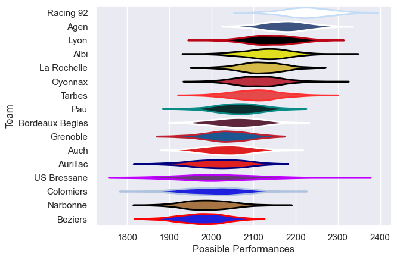

---  
title: "Pro D2 08/09"  
date: 2025-07-29 6:00:00 -0500  
categories: model review projection  
layout: article  
aside:  
    toc: true  
---
# Current Team Rankings

# Standings

## Current Standings

| Club            |   Played |   Wins |   Point Differential |   Losing Bonus Points | Try Bonus Points   |   Competition Points |
|:----------------|---------:|-------:|---------------------:|----------------------:|:-------------------|---------------------:|
| Racing 92       |       30 |     24 |                  285 |                     2 |                    |                   98 |
| Agen            |       31 |     21 |                  253 |                     6 |                    |                   90 |
| Albi            |       32 |     20 |                   78 |                     3 |                    |                   89 |
| Oyonnax         |       32 |     19 |                  168 |                     7 |                    |                   85 |
| La Rochelle     |       31 |     18 |                  145 |                     9 |                    |                   83 |
| Lyon            |       30 |     17 |                  152 |                     8 |                    |                   78 |
| Tarbes          |       30 |     15 |                   68 |                    10 |                    |                   72 |
| Pau             |       30 |     15 |                   16 |                     8 |                    |                   70 |
| Aurillac        |       30 |     16 |                  -35 |                     3 |                    |                   69 |
| Bordeaux Begles |       30 |     13 |                  -48 |                     7 |                    |                   59 |
| Grenoble        |       30 |     11 |                  -53 |                    13 |                    |                   59 |
| Auch            |       30 |     11 |                 -117 |                     8 |                    |                   52 |
| Narbonne        |       30 |      9 |                 -178 |                     6 |                    |                   48 |
| Colomiers       |       30 |      9 |                 -138 |                     5 |                    |                   45 |
| Beziers         |       30 |      8 |                 -290 |                     5 |                    |                   41 |
| US Bressane     |       30 |      8 |                 -306 |                     7 |                    |                   41 |

# Completed Match Review

| Model | Percent Correct Predictions | Spread Error |
| ------ | ------ | ------ |
| Club Level | 74.9% | 9.2 |
| Player Level: Lineup | nan% | nan |
| Player Level: Minutes | nan% | nan |

