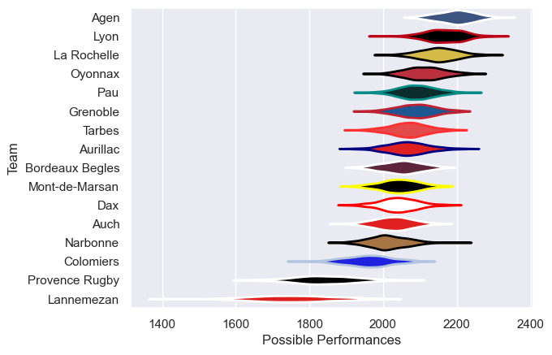

---  
title: "Pro D2 09/10 Status"  
date: 2025-07-28 6:00:00 -0500  
categories: model review projection  
layout: article  
aside:  
    toc: true  
---
# Current Team Rankings

# Standings

## Current Standings

| Club            |   Played |   Wins |   Point Differential |   Losing Bonus Points | Try Bonus Points   |   Competition Points |
|:----------------|---------:|-------:|---------------------:|----------------------:|:-------------------|---------------------:|
| La Rochelle     |       32 |     21 |                  220 |                     9 |                    |                   97 |
| Agen            |       30 |     21 |                  346 |                     6 |                    |                   94 |
| Lyon            |       32 |     19 |                  223 |                     4 |                    |                   92 |
| Oyonnax         |       31 |     20 |                  124 |                     5 |                    |                   85 |
| Pau             |       31 |     16 |                  104 |                     6 |                    |                   80 |
| Grenoble        |       30 |     16 |                  109 |                     5 |                    |                   79 |
| Aurillac        |       30 |     17 |                   57 |                     6 |                    |                   74 |
| Bordeaux Begles |       30 |     15 |                    3 |                     7 |                    |                   69 |
| Tarbes          |       30 |     14 |                    2 |                    11 |                    |                   67 |
| Narbonne        |       30 |     16 |                   -4 |                     3 |                    |                   67 |
| Mont-de-Marsan  |       30 |     14 |                  -26 |                     7 |                    |                   67 |
| Dax             |       30 |     13 |                  -49 |                     6 |                    |                   62 |
| Auch            |       30 |      9 |                  -63 |                    11 |                    |                   49 |
| Colomiers       |       30 |      7 |                 -185 |                     8 |                    |                   44 |
| Provence Rugby  |       30 |      6 |                 -311 |                     7 |                    |                   35 |
| Lannemezan      |       30 |      3 |                 -550 |                     7 |                    |                   19 |

# Completed Match Review

| Model | Percent Correct Predictions | Spread Error |
| ------ | ------ | ------ |
| Club Level | 73.3% | 8.0 |
| Player Level: Lineup | nan% | nan |
| Player Level: Minutes | nan% | nan |

