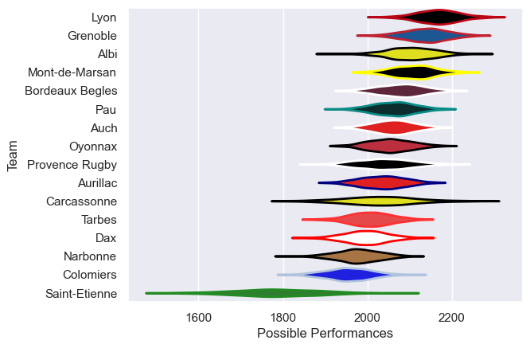

---  
title: "Pro D2 10/11 Status"  
date: 2025-07-28 6:00:00 -0500  
categories: model review projection  
layout: article  
aside:  
    toc: true  
---
# Current Team Rankings

# Standings

## Current Standings

| Club            |   Played |   Wins |   Point Differential |   Losing Bonus Points | Try Bonus Points   |   Competition Points |
|:----------------|---------:|-------:|---------------------:|----------------------:|:-------------------|---------------------:|
| Lyon            |       30 |     21 |                  257 |                     6 |                    |                   94 |
| Albi            |       32 |     20 |                  148 |                     6 |                    |                   92 |
| Grenoble        |       31 |     19 |                  255 |                     6 |                    |                   90 |
| Bordeaux Begles |       32 |     20 |                  163 |                     4 |                    |                   86 |
| Mont-de-Marsan  |       31 |     18 |                  193 |                     9 |                    |                   81 |
| Auch            |       30 |     16 |                    7 |                     8 |                    |                   76 |
| Aurillac        |       30 |     15 |                   18 |                     6 |                    |                   68 |
| Oyonnax         |       30 |     13 |                   42 |                     9 |                    |                   67 |
| Pau             |       30 |     15 |                    2 |                     6 |                    |                   66 |
| Carcassonne     |       30 |     12 |                    4 |                    10 |                    |                   62 |
| Provence Rugby  |       30 |     14 |                  -66 |                     4 |                    |                   62 |
| Tarbes          |       30 |     13 |                  -93 |                     8 |                    |                   62 |
| Narbonne        |       30 |     13 |                 -193 |                     7 |                    |                   59 |
| Colomiers       |       30 |     10 |                 -188 |                     6 |                    |                   54 |
| Dax             |       30 |     10 |                  -61 |                     9 |                    |                   51 |
| Saint-Etienne   |       30 |      1 |                 -488 |                    11 |                    |                   17 |

# Completed Match Review

| Model | Percent Correct Predictions | Spread Error |
| ------ | ------ | ------ |
| Club Level | 71.6% | 9.2 |
| Player Level: Lineup | nan% | nan |
| Player Level: Minutes | nan% | nan |

