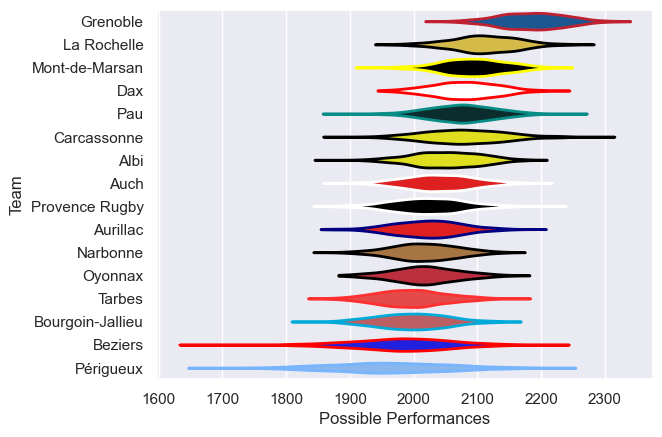

---  
title: "Pro D2 11/12"  
date: 2025-07-29 6:00:00 -0500  
categories: model review projection  
layout: article  
aside:  
    toc: true  
---
# Current Team Rankings

# Standings

## Current Standings

| Club             |   Played |   Wins |   Point Differential |   Losing Bonus Points | Try Bonus Points   |   Competition Points |
|:-----------------|---------:|-------:|---------------------:|----------------------:|:-------------------|---------------------:|
| Grenoble         |       30 |     22 |                  329 |                     5 |                    |                   95 |
| Mont-de-Marsan   |       32 |     21 |                  129 |                     5 |                    |                   89 |
| Pau              |       32 |     20 |                   59 |                     3 |                    |                   85 |
| Dax              |       31 |     18 |                   78 |                     4 |                    |                   82 |
| Carcassonne      |       30 |     17 |                   43 |                     8 |                    |                   80 |
| La Rochelle      |       31 |     18 |                  102 |                     6 |                    |                   78 |
| Albi             |       30 |     14 |                   -3 |                    10 |                    |                   66 |
| Auch             |       30 |     14 |                  -68 |                     7 |                    |                   65 |
| Bourgoin-Jallieu |       30 |     14 |                  -51 |                     8 |                    |                   64 |
| Oyonnax          |       30 |     14 |                    5 |                     5 |                    |                   63 |
| Provence Rugby   |       30 |     12 |                  -23 |                    12 |                    |                   62 |
| Tarbes           |       30 |     13 |                  -85 |                     9 |                    |                   61 |
| Narbonne         |       30 |     12 |                 -104 |                    11 |                    |                   59 |
| Aurillac         |       30 |     12 |                  -40 |                     6 |                    |                   58 |
| Beziers          |       30 |      9 |                 -174 |                     9 |                    |                   45 |
| Périgueux        |       30 |      7 |                 -197 |                    13 |                    |                   41 |

# Completed Match Review

| Model | Percent Correct Predictions | Spread Error |
| ------ | ------ | ------ |
| Club Level | 78.2% | 8.1 |
| Player Level: Lineup | nan% | nan |
| Player Level: Minutes | nan% | nan |

