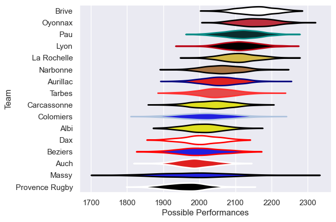

---  
title: "Pro D2 12/13 Status"  
date: 2025-07-28 6:00:00 -0500  
categories: model review projection  
layout: article  
aside:  
    toc: true  
---
# Current Team Rankings

# Standings

## Current Standings

| Club           |   Played |   Wins |   Point Differential |   Losing Bonus Points | Try Bonus Points   |   Competition Points |
|:---------------|---------:|-------:|---------------------:|----------------------:|:-------------------|---------------------:|
| Oyonnax        |       30 |     24 |                  341 |                     3 |                    |                  101 |
| Brive          |       32 |     22 |                  162 |                     4 |                    |                   96 |
| Pau            |       32 |     21 |                  200 |                     6 |                    |                   92 |
| Aurillac       |       31 |     19 |                   21 |                     4 |                    |                   82 |
| La Rochelle    |       31 |     19 |                  135 |                     5 |                    |                   81 |
| Tarbes         |       30 |     17 |                   70 |                     5 |                    |                   75 |
| Carcassonne    |       30 |     15 |                   45 |                     9 |                    |                   71 |
| Narbonne       |       30 |     14 |                    3 |                     9 |                    |                   69 |
| Lyon           |       30 |     13 |                  111 |                     8 |                    |                   66 |
| Colomiers      |       30 |     13 |                  -47 |                     8 |                    |                   64 |
| Albi           |       30 |     12 |                  -50 |                     8 |                    |                   58 |
| Beziers        |       30 |     10 |                 -208 |                     8 |                    |                   50 |
| Auch           |       30 |      8 |                 -170 |                    11 |                    |                   49 |
| Dax            |       30 |     10 |                 -141 |                     5 |                    |                   47 |
| Provence Rugby |       30 |      9 |                 -222 |                     7 |                    |                   43 |
| Massy          |       30 |      6 |                 -250 |                     9 |                    |                   37 |

# Completed Match Review

| Model | Percent Correct Predictions | Spread Error |
| ------ | ------ | ------ |
| Club Level | 75.3% | 9.1 |
| Player Level: Lineup | nan% | nan |
| Player Level: Minutes | nan% | nan |

