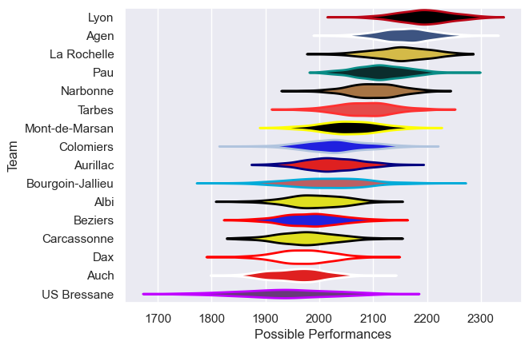

---  
title: "Pro D2 13/14"  
date: 2025-07-29 6:00:00 -0500  
categories: model review projection  
layout: article  
aside:  
    toc: true  
---
# Current Team Rankings

# Standings

## Current Standings

| Club             |   Played |   Wins |   Point Differential |   Losing Bonus Points | Try Bonus Points   |   Competition Points |
|:-----------------|---------:|-------:|---------------------:|----------------------:|:-------------------|---------------------:|
| Lyon             |       30 |     25 |                  395 |                     3 |                    |                  103 |
| La Rochelle      |       32 |     23 |                  273 |                     4 |                    |                   98 |
| Agen             |       32 |     22 |                  239 |                     7 |                    |                   95 |
| Pau              |       31 |     20 |                  115 |                     6 |                    |                   88 |
| Narbonne         |       31 |     18 |                  190 |                     6 |                    |                   80 |
| Tarbes           |       30 |     17 |                   81 |                     5 |                    |                   75 |
| Colomiers        |       30 |     13 |                   36 |                     9 |                    |                   65 |
| Mont-de-Marsan   |       30 |     12 |                   22 |                    10 |                    |                   64 |
| Bourgoin-Jallieu |       30 |     13 |                   -1 |                     7 |                    |                   63 |
| Beziers          |       30 |     11 |                 -167 |                    11 |                    |                   57 |
| Aurillac         |       30 |     12 |                 -107 |                     7 |                    |                   55 |
| Albi             |       30 |     11 |                 -125 |                     5 |                    |                   53 |
| Dax              |       30 |     11 |                 -246 |                     5 |                    |                   53 |
| Carcassonne      |       30 |     10 |                 -215 |                     9 |                    |                   49 |
| Auch             |       30 |      8 |                 -274 |                     4 |                    |                   42 |
| US Bressane      |       30 |      7 |                 -216 |                    11 |                    |                   41 |

# Completed Match Review

| Model | Percent Correct Predictions | Spread Error |
| ------ | ------ | ------ |
| Club Level | 73.7% | 9.0 |
| Player Level: Lineup | nan% | nan |
| Player Level: Minutes | nan% | nan |

