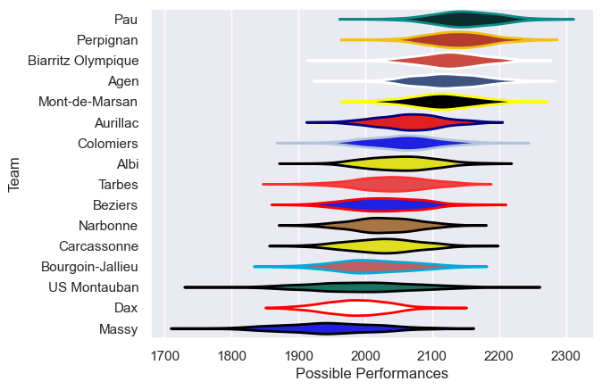

---  
title: "Pro D2 14/15"  
date: 2025-07-29 6:00:00 -0500  
categories: model review projection  
layout: article  
aside:  
    toc: true  
---
# Current Team Rankings

# Standings

## Current Standings

| Club               |   Played |   Wins |   Point Differential |   Losing Bonus Points | Try Bonus Points   |   Competition Points |
|:-------------------|---------:|-------:|---------------------:|----------------------:|:-------------------|---------------------:|
| Pau                |       30 |     20 |                  224 |                     4 |                    |                   86 |
| Mont-de-Marsan     |       32 |     19 |                  158 |                     9 |                    |                   85 |
| Agen               |       32 |     18 |                  122 |                     8 |                    |                   82 |
| Albi               |       31 |     18 |                   31 |                     7 |                    |                   79 |
| Perpignan          |       31 |     17 |                  129 |                     6 |                    |                   78 |
| Biarritz Olympique |       30 |     17 |                   67 |                     4 |                    |                   72 |
| Aurillac           |       30 |     16 |                   71 |                     3 |                    |                   71 |
| Colomiers          |       30 |     16 |                    3 |                     6 |                    |                   70 |
| Carcassonne        |       30 |     15 |                  -18 |                     6 |                    |                   66 |
| Tarbes             |       30 |     13 |                 -115 |                     6 |                    |                   62 |
| Beziers            |       30 |     14 |                  -35 |                     5 |                    |                   61 |
| US Montauban       |       30 |     13 |                  -11 |                     5 |                    |                   59 |
| Bourgoin-Jallieu   |       30 |     11 |                 -104 |                     7 |                    |                   57 |
| Dax                |       30 |     10 |                 -169 |                     8 |                    |                   50 |
| Narbonne           |       30 |     11 |                 -142 |                     3 |                    |                   49 |
| Massy              |       30 |      8 |                 -211 |                    10 |                    |                   42 |

# Completed Match Review

| Model | Percent Correct Predictions | Spread Error |
| ------ | ------ | ------ |
| Club Level | 74.1% | 9.8 |
| Player Level: Lineup | nan% | nan |
| Player Level: Minutes | nan% | nan |

