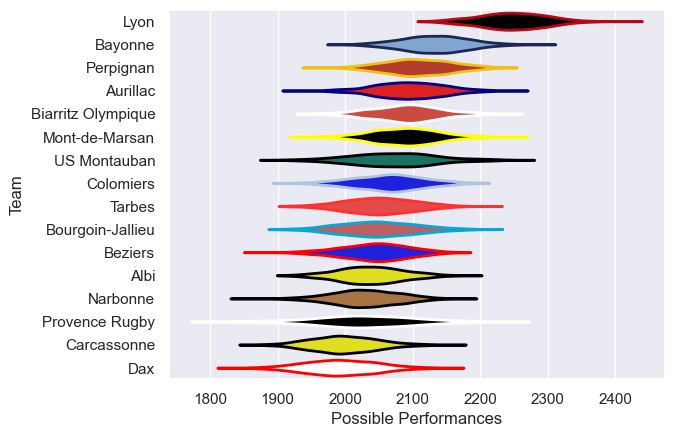

---  
title: "Pro D2 15/16"  
date: 2025-07-29 6:00:00 -0500  
categories: model review projection  
layout: article  
aside:  
    toc: true  
---
# Current Team Rankings

# Standings

## Current Standings

| Club               |   Played |   Wins |   Point Differential |   Losing Bonus Points | Try Bonus Points   |   Competition Points |
|:-------------------|---------:|-------:|---------------------:|----------------------:|:-------------------|---------------------:|
| Lyon               |       30 |     25 |                  478 |                     4 |                    |                  104 |
| Bayonne            |       32 |     21 |                   73 |                     4 |                    |                   90 |
| Aurillac           |       32 |     19 |                  121 |                     4 |                    |                   80 |
| Beziers            |       30 |     17 |                   83 |                     4 |                    |                   74 |
| Mont-de-Marsan     |       31 |     17 |                   29 |                     4 |                    |                   74 |
| Colomiers          |       31 |     16 |                   27 |                     4 |                    |                   74 |
| Perpignan          |       30 |     15 |                   61 |                     8 |                    |                   70 |
| Biarritz Olympique |       30 |     14 |                   18 |                     8 |                    |                   64 |
| Narbonne           |       30 |     13 |                  -51 |                    11 |                    |                   63 |
| Tarbes             |       30 |     13 |                  -87 |                    10 |                    |                   62 |
| Albi               |       30 |     13 |                  -52 |                     5 |                    |                   61 |
| US Montauban       |       30 |     12 |                  -54 |                    12 |                    |                   60 |
| Bourgoin-Jallieu   |       30 |     12 |                  -47 |                     9 |                    |                   57 |
| Carcassonne        |       30 |     11 |                 -257 |                     6 |                    |                   50 |
| Provence Rugby     |       30 |     10 |                 -167 |                     8 |                    |                   48 |
| Dax                |       30 |     10 |                 -175 |                     6 |                    |                   48 |

# Completed Match Review

| Model | Percent Correct Predictions | Spread Error |
| ------ | ------ | ------ |
| Club Level | 77.8% | 9.3 |
| Player Level: Lineup | nan% | nan |
| Player Level: Minutes | nan% | nan |

