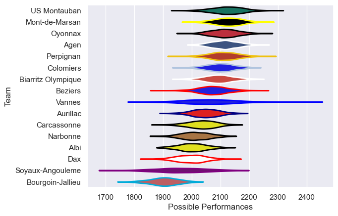

---  
title: "Pro D2 16/17"  
date: 2025-07-29 6:00:00 -0500  
categories: model review projection  
layout: article  
aside:  
    toc: true  
---
# Current Team Rankings

# Standings

## Current Standings

| Club               |   Played |   Wins |   Point Differential |   Losing Bonus Points |   Try Bonus Points |   Competition Points |
|:-------------------|---------:|-------:|---------------------:|----------------------:|-------------------:|---------------------:|
| Agen               |       32 |     20 |                  189 |                     7 |                  1 |                   92 |
| US Montauban       |       32 |     20 |                  183 |                     5 |                    |                   85 |
| Oyonnax            |       30 |     19 |                  153 |                     8 |                    |                   84 |
| Biarritz Olympique |       31 |     18 |                   83 |                     6 |                    |                   78 |
| Mont-de-Marsan     |       31 |     17 |                  139 |                     9 |                    |                   77 |
| Colomiers          |       30 |     17 |                  165 |                     5 |                    |                   75 |
| Perpignan          |       30 |     16 |                  155 |                     6 |                    |                   72 |
| Aurillac           |       30 |     15 |                  -23 |                     5 |                    |                   65 |
| Carcassonne        |       30 |     14 |                    6 |                     4 |                    |                   62 |
| Vannes             |       30 |     12 |                  -76 |                    10 |                    |                   62 |
| Soyaux-Angouleme   |       30 |     13 |                 -121 |                     8 |                    |                   62 |
| Narbonne           |       30 |     14 |                 -130 |                     2 |                    |                   60 |
| Beziers            |       30 |     13 |                   27 |                     6 |                    |                   58 |
| Dax                |       30 |     13 |                 -198 |                     6 |                    |                   58 |
| Albi               |       30 |     12 |                 -140 |                     5 |                    |                   57 |
| Bourgoin-Jallieu   |       30 |      4 |                 -412 |                     9 |                    |                   27 |

# Completed Match Review

| Model | Percent Correct Predictions | Spread Error |
| ------ | ------ | ------ |
| Club Level | 75.3% | 10.4 |
| Player Level: Lineup | nan% | nan |
| Player Level: Minutes | nan% | nan |

