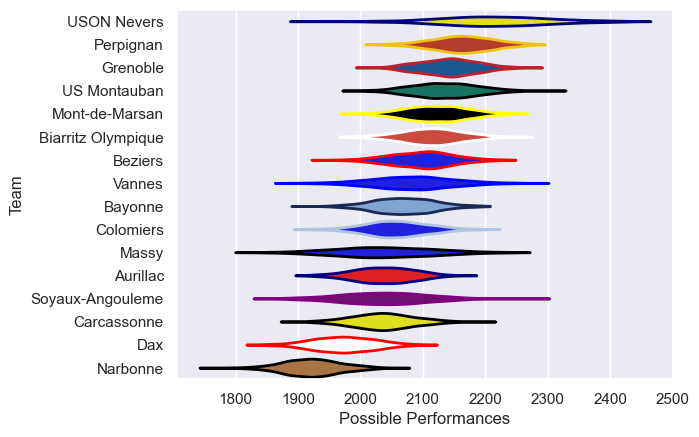

---  
title: "Pro D2 17/18"  
date: 2025-07-29 6:00:00 -0500  
categories: model review projection  
layout: article  
aside:  
    toc: true  
---
# Current Team Rankings

# Standings

## Current Standings

| Club               |   Played |   Wins |   Point Differential |   Losing Bonus Points |   Try Bonus Points |   Competition Points |
|:-------------------|---------:|-------:|---------------------:|----------------------:|-------------------:|---------------------:|
| Perpignan          |       32 |     22 |                  393 |                     3 |                  1 |                   94 |
| Grenoble           |       33 |     22 |                   97 |                     4 |                    |                   94 |
| US Montauban       |       31 |     20 |                  126 |                     5 |                    |                   89 |
| Beziers            |       31 |     19 |                   78 |                     2 |                    |                   80 |
| Mont-de-Marsan     |       32 |     18 |                  201 |                     7 |                    |                   79 |
| Biarritz Olympique |       31 |     17 |                   88 |                     8 |                    |                   76 |
| Bayonne            |       30 |     14 |                  -32 |                     7 |                    |                   65 |
| Colomiers          |       30 |     14 |                  -41 |                     7 |                    |                   65 |
| USON Nevers        |       30 |     15 |                   78 |                     4 |                    |                   64 |
| Aurillac           |       30 |     13 |                  -75 |                     7 |                    |                   61 |
| Vannes             |       30 |     12 |                  -18 |                    12 |                    |                   60 |
| Massy              |       30 |     13 |                  -51 |                     6 |                    |                   58 |
| Soyaux-Angouleme   |       30 |     13 |                  -69 |                     3 |                    |                   57 |
| Carcassonne        |       30 |     11 |                 -182 |                     6 |                    |                   50 |
| Dax                |       30 |      9 |                 -165 |                     6 |                    |                   44 |
| Narbonne           |       30 |      7 |                 -428 |                     1 |                    |                   33 |

# Completed Match Review

| Model | Percent Correct Predictions | Spread Error |
| ------ | ------ | ------ |
| Club Level | 77.1% | 11.5 |
| Player Level: Lineup | nan% | nan |
| Player Level: Minutes | nan% | nan |

