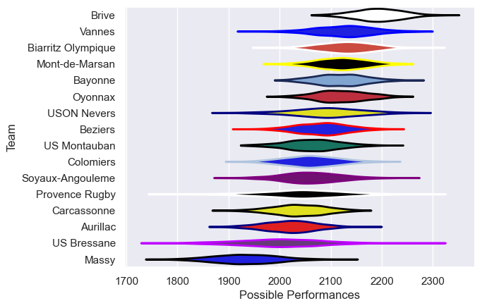

---  
title: "Pro D2 18/19 Status"  
date: 2025-07-28 6:00:00 -0500  
categories: model review projection  
layout: article  
aside:  
    toc: true  
---
# Current Team Rankings

# Standings

## Current Standings

| Club               |   Played |   Wins |   Point Differential |   Losing Bonus Points | Try Bonus Points   |   Competition Points |
|:-------------------|---------:|-------:|---------------------:|----------------------:|:-------------------|---------------------:|
| Brive              |       32 |     20 |                  278 |                     8 |                    |                   90 |
| Bayonne            |       33 |     20 |                  194 |                     8 |                    |                   90 |
| Vannes             |       32 |     18 |                   72 |                     7 |                    |                   81 |
| Oyonnax            |       31 |     17 |                  174 |                     9 |                    |                   79 |
| USON Nevers        |       31 |     16 |                   58 |                     8 |                    |                   74 |
| Mont-de-Marsan     |       31 |     16 |                   42 |                     8 |                    |                   74 |
| Beziers            |       30 |     17 |                  -39 |                     4 |                    |                   74 |
| Biarritz Olympique |       30 |     15 |                  138 |                     8 |                    |                   70 |
| Provence Rugby     |       30 |     15 |                  -48 |                     5 |                    |                   65 |
| Soyaux-Angouleme   |       30 |     14 |                  -32 |                     6 |                    |                   64 |
| US Montauban       |       30 |     13 |                 -110 |                     9 |                    |                   63 |
| Carcassonne        |       30 |     14 |                  -74 |                     6 |                    |                   62 |
| Colomiers          |       30 |     13 |                  -60 |                     7 |                    |                   59 |
| Aurillac           |       30 |     13 |                 -150 |                     7 |                    |                   59 |
| US Bressane        |       30 |     13 |                 -191 |                     3 |                    |                   57 |
| Massy              |       30 |      5 |                 -252 |                     7 |                    |                   29 |

# Completed Match Review

| Model | Percent Correct Predictions | Spread Error |
| ------ | ------ | ------ |
| Club Level | 78.4% | 9.7 |
| Player Level: Lineup | nan% | nan |
| Player Level: Minutes | nan% | nan |

