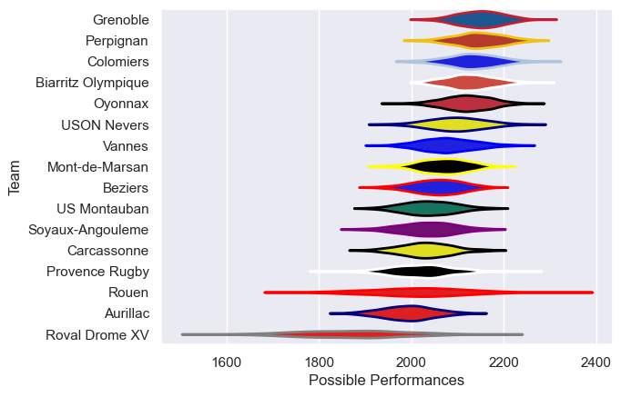

---  
title: "Pro D2 19/20"  
date: 2025-07-29 6:00:00 -0500  
categories: model review projection  
layout: article  
aside:  
    toc: true  
---
# Current Team Rankings

# Standings

## Current Standings

| Club               |   Played |   Wins |   Point Differential |   Losing Bonus Points | Try Bonus Points   |   Competition Points |
|:-------------------|---------:|-------:|---------------------:|----------------------:|:-------------------|---------------------:|
| Colomiers          |       23 |     17 |                  192 |                     4 |                    |                   72 |
| Perpignan          |       23 |     16 |                  245 |                     4 |                    |                   68 |
| Oyonnax            |       23 |     14 |                  175 |                     7 |                    |                   63 |
| Grenoble           |       23 |     14 |                  170 |                     3 |                    |                   61 |
| USON Nevers        |       23 |     14 |                   45 |                     3 |                    |                   61 |
| Biarritz Olympique |       23 |     12 |                   62 |                     7 |                    |                   57 |
| Soyaux-Angouleme   |       23 |     11 |                  -19 |                     4 |                    |                   54 |
| Beziers            |       23 |     12 |                   -3 |                     5 |                    |                   53 |
| Vannes             |       23 |     12 |                  -25 |                     3 |                    |                   51 |
| Mont-de-Marsan     |       23 |     11 |                  -22 |                     5 |                    |                   49 |
| Carcassonne        |       22 |     11 |                  -75 |                     3 |                    |                   49 |
| Provence Rugby     |       22 |     10 |                  -74 |                     3 |                    |                   43 |
| US Montauban       |       22 |      8 |                  -82 |                     6 |                    |                   40 |
| Aurillac           |       23 |      7 |                 -116 |                     8 |                    |                   36 |
| Rouen              |       23 |      6 |                 -213 |                     8 |                    |                   32 |
| Roval Drome XV     |       22 |      3 |                 -260 |                    10 |                    |                   22 |

# Completed Match Review

| Model | Percent Correct Predictions | Spread Error |
| ------ | ------ | ------ |
| Club Level | 72.5% | 10.8 |
| Player Level: Lineup | nan% | nan |
| Player Level: Minutes | nan% | nan |

