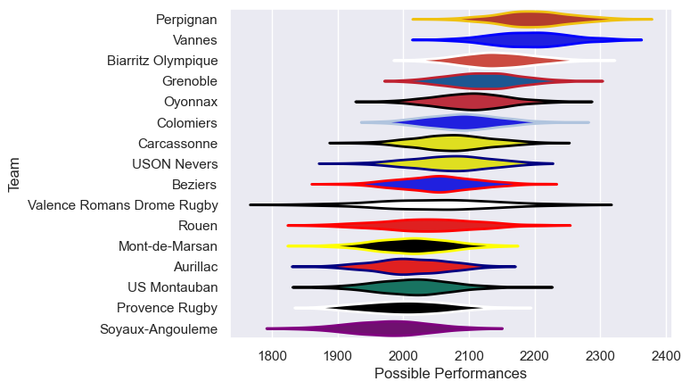

---  
title: "Pro D2 20/21 Status"  
date: 2025-07-28 6:00:00 -0500  
categories: model review projection  
layout: article  
aside:  
    toc: true  
---
# Current Team Rankings

# Standings

## Current Standings

| Club                       |   Played |   Wins |   Point Differential |   Losing Bonus Points | Try Bonus Points   |   Competition Points |
|:---------------------------|---------:|-------:|---------------------:|----------------------:|:-------------------|---------------------:|
| Perpignan                  |       32 |     26 |                  348 |                     3 |                    |                  109 |
| Vannes                     |       31 |     21 |                  208 |                     5 |                    |                   93 |
| Biarritz Olympique         |       33 |     21 |                  131 |                     5 |                    |                   93 |
| Oyonnax                    |       32 |     19 |                  145 |                     5 |                    |                   85 |
| Grenoble                   |       31 |     16 |                   45 |                     7 |                    |                   73 |
| Colomiers                  |       30 |     16 |                   24 |                     7 |                    |                   73 |
| Carcassonne                |       30 |     14 |                  -12 |                     5 |                    |                   63 |
| USON Nevers                |       30 |     13 |                   -2 |                     7 |                    |                   61 |
| US Montauban               |       30 |     14 |                 -135 |                     3 |                    |                   61 |
| Rouen                      |       30 |     11 |                  -53 |                    12 |                    |                   58 |
| Aurillac                   |       30 |     12 |                  -28 |                     7 |                    |                   57 |
| Mont-de-Marsan             |       29 |     11 |                 -112 |                     7 |                    |                   57 |
| Provence Rugby             |       30 |     11 |                 -121 |                     8 |                    |                   56 |
| Beziers                    |       30 |     10 |                  -51 |                    13 |                    |                   55 |
| Valence Romans Drome Rugby |       30 |      9 |                 -157 |                     8 |                    |                   50 |
| Soyaux-Angouleme           |       30 |      8 |                 -230 |                     9 |                    |                   43 |

# Completed Match Review

| Model | Percent Correct Predictions | Spread Error |
| ------ | ------ | ------ |
| Club Level | 66.4% | 9.7 |
| Player Level: Lineup | nan% | nan |
| Player Level: Minutes | nan% | nan |

