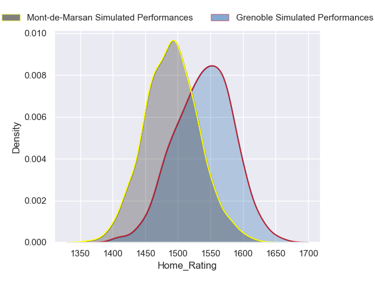
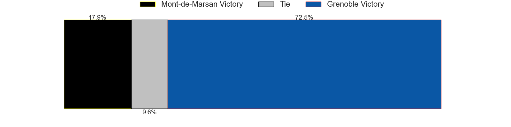
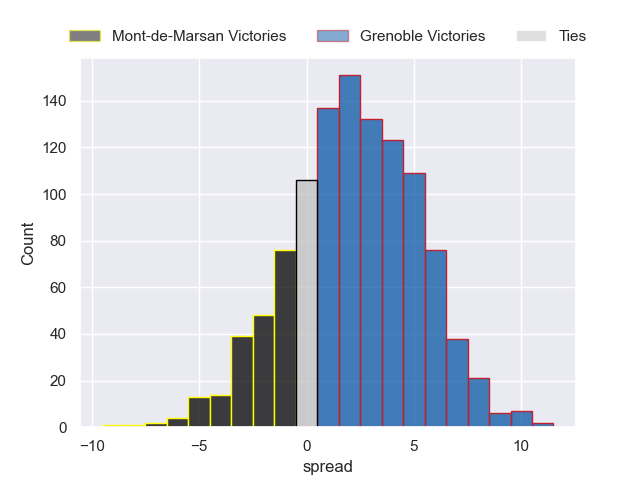
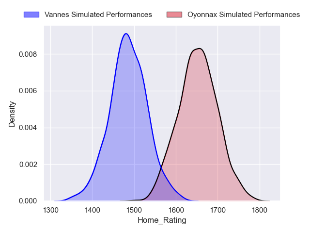
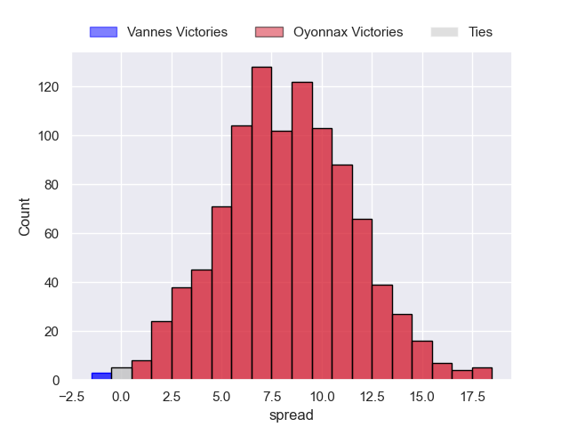

---  
title: "Pro D2 2022 Status"  
date: 2023-05-19 6:00:00 -0500  
categories: model review projection  
layout: article  
aside:  
    toc: true  
---
# Standings

## Current Standings

| Club               |   Played |   Wins |   Point Differential |   Losing Bonus Points |   Try Bonus Points |   Competition Points |
|:-------------------|---------:|-------:|---------------------:|----------------------:|-------------------:|---------------------:|
| Oyonnax            |       30 |     23 |                  449 |                     4 |                 15 |                  113 |
| Mont-de-Marsan     |       31 |     20 |                  128 |                     5 |                  8 |                   93 |
| Vannes             |       31 |     18 |                   88 |                     8 |                 10 |                   92 |
| Grenoble           |       30 |     20 |                   84 |                     3 |                  6 |                   91 |
| Nevers             |       31 |     18 |                  164 |                     7 |                  8 |                   89 |
| Agen               |       31 |     15 |                   57 |                    10 |                  7 |                   79 |
| Colomiers          |       30 |     15 |                   -4 |                     9 |                  6 |                   75 |
| Provence Rugby     |       30 |     15 |                   14 |                     5 |                  5 |                   70 |
| Beziers            |       30 |     13 |                  -18 |                     9 |                  6 |                   69 |
| Biarritz Olympique |       30 |     13 |                   -9 |                     7 |                  9 |                   68 |
| Aurillac           |       30 |     15 |                 -120 |                     3 |                  3 |                   66 |
| Rouen              |       30 |     13 |                 -173 |                     3 |                  5 |                   60 |
| Montauban          |       30 |     12 |                 -106 |                     4 |                  4 |                   58 |
| Soyaux-Angouleme   |       30 |     11 |                 -128 |                    11 |                  2 |                   57 |
| Carcassonne        |       30 |     10 |                 -124 |                     7 |                  2 |                   51 |
| Massy              |       30 |      7 |                 -302 |                     8 |                  6 |                   42 |

## Projected Playoff Results

|                | Reach Semifinals   | Reach Final   | Win Final   |
|:---------------|:-------------------|:--------------|:------------|
| Oyonnax        | 100.0 %            | 99.7 %        | 97.1 %      |
| Grenoble       | 100.0 %            | 80.2 %        | 1.6 %       |
| Mont-de-Marsan | 100.0 %            | 19.8 %        | 1.2 %       |
| Vannes         | 100.0 %            | 0.3 %         | 0.1 %       |

## Projected Promotion and Relegation Results

| Club           | Current Competition   | To Top 14   | To Pro D2   |
|:---------------|:----------------------|:------------|:------------|
| Perpignan      | Top 14                | 87.0 %      | 13.0 %      |
| Brive          | Top 14                | 0.0 %       | 100.0 %     |
| Oyonnax        | Pro D2                | 99.4 %      | 0.3 %       |
| Grenoble       | Pro D2                | 9.6 %       | 70.6 %      |
| Mont-de-Marsan | Pro D2                | 3.8 %       | 16.0 %      |
| Vannes         | Pro D2                | 0.2 %       | 0.1 %       |

# Completed Match Review

| Model | Percent Correct Predictions | Spread Error |
| ------ | ------ | ------ |
| Club Level | 67.8% | 9.8 |
| Player Level: Lineup | 63.2% | 12.1 |
| Player Level: Minutes | 63.2% | 12.6 |

# Future Predictions

## Semifinal

### Grenoble V Mont-de-Marsan on 2023/05/20

Average Margin: Grenoble by 2.4

### Oyonnax V Vannes on 2023/05/20

Average Margin: Oyonnax by 8.3

