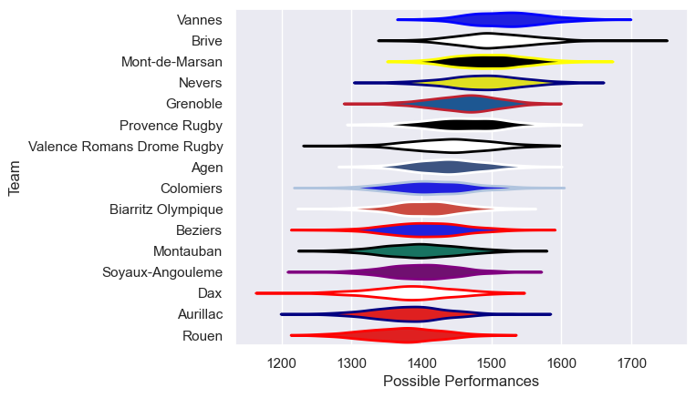
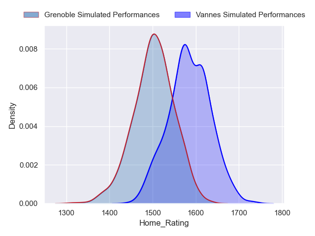
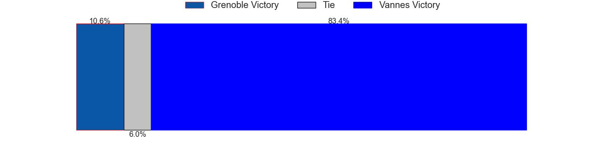
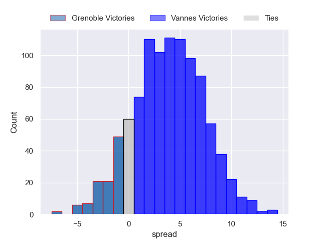

---  
title: "Pro D2 2023 Status"  
date: 2024-06-03 6:00:00 -0500  
categories: model review projection  
layout: article  
aside:  
    toc: true  
---
# Current Team Rankings

# Standings

## Current Standings

| Club                       |   Played |   Wins |   Point Differential |   Losing Bonus Points |   Try Bonus Points |   Competition Points |
|:---------------------------|---------:|-------:|---------------------:|----------------------:|-------------------:|---------------------:|
| Provence Rugby             |       31 |     21 |                  170 |                     4 |                 12 |                  100 |
| Grenoble                   |       32 |     21 |                  181 |                     3 |                 12 |                   99 |
| Vannes                     |       31 |     19 |                  275 |                     8 |                 13 |                   97 |
| Beziers                    |       32 |     18 |                   70 |                     6 |                  9 |                   89 |
| Brive                      |       31 |     16 |                  104 |                     7 |                 10 |                   83 |
| Mont-de-Marsan             |       30 |     15 |                  125 |                     9 |                 10 |                   81 |
| Nevers                     |       30 |     15 |                   72 |                    10 |                  8 |                   78 |
| Dax                        |       31 |     17 |                 -107 |                     2 |                  5 |                   77 |
| Colomiers                  |       30 |     13 |                    6 |                     6 |                  5 |                   65 |
| Agen                       |       30 |     13 |                 -135 |                     5 |                  6 |                   65 |
| Aurillac                   |       30 |     14 |                 -171 |                     4 |                  3 |                   65 |
| Valence Romans Drome Rugby |       30 |     13 |                  -17 |                     6 |                  6 |                   64 |
| Soyaux-Angouleme           |       30 |     14 |                  -53 |                     7 |                  1 |                   64 |
| Montauban                  |       31 |     12 |                 -177 |                     6 |                  4 |                   58 |
| Biarritz Olympique         |       30 |     11 |                 -193 |                     5 |                  9 |                   58 |
| Rouen                      |       30 |      9 |                 -149 |                     9 |                  8 |                   55 |
| Narbonne                   |        1 |      0 |                   -1 |                     1 |                  0 |                    1 |

## Projected Remaining Table

| Club     |   Matches Remaining |   Wins |   Point Differential |   Losing Bonus Points |   Try Bonus Points |   Competition Points |
|:---------|--------------------:|-------:|---------------------:|----------------------:|-------------------:|---------------------:|
| Vannes   |                   1 |    0.9 |              4.12174 |                   0.1 |                0.2 |                  3.9 |
| Grenoble |                   1 |    0.1 |             -4.12174 |                   0.7 |                0.2 |                  1.3 |

## Projected Total Table

| Club                       |   Total Matches |   Wins |   Point Differential |   Losing Bonus Points |   Try Bonus Points |   Competition Points |
|:---------------------------|----------------:|-------:|---------------------:|----------------------:|-------------------:|---------------------:|
| Vannes                     |              32 |   19.9 |              279.122 |                   8.1 |               13.2 |                100.9 |
| Grenoble                   |              33 |   21.1 |              176.878 |                   3.7 |               12.2 |                100.3 |
| Provence Rugby             |              31 |   21   |              170     |                   4   |               12   |                100   |
| Beziers                    |              32 |   18   |               70     |                   6   |                9   |                 89   |
| Brive                      |              31 |   16   |              104     |                   7   |               10   |                 83   |
| Mont-de-Marsan             |              30 |   15   |              125     |                   9   |               10   |                 81   |
| Nevers                     |              30 |   15   |               72     |                  10   |                8   |                 78   |
| Dax                        |              31 |   17   |             -107     |                   2   |                5   |                 77   |
| Colomiers                  |              30 |   13   |                6     |                   6   |                5   |                 65   |
| Agen                       |              30 |   13   |             -135     |                   5   |                6   |                 65   |
| Aurillac                   |              30 |   14   |             -171     |                   4   |                3   |                 65   |
| Valence Romans Drome Rugby |              30 |   13   |              -17     |                   6   |                6   |                 64   |
| Soyaux-Angouleme           |              30 |   14   |              -53     |                   7   |                1   |                 64   |
| Montauban                  |              31 |   12   |             -177     |                   6   |                4   |                 58   |
| Biarritz Olympique         |              30 |   11   |             -193     |                   5   |                9   |                 58   |
| Rouen                      |              30 |    9   |             -149     |                   9   |                8   |                 55   |
| Narbonne                   |               1 |    0   |               -1     |                   1   |                0   |                  1   |

# Completed Match Review

| Model | Percent Correct Predictions | Spread Error |
| ------ | ------ | ------ |
| Club Level | 74.3% | 11.3 |
| Player Level: Lineup | 75.3% | 11.4 |
| Player Level: Minutes | 75.3% | 11.2 |

# Future Predictions

## Week 33

### Vannes V Grenoble on 2024/06/08

Average Margin: Vannes by 4.1

Average Scoreline: 28-24

