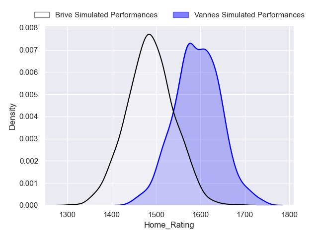
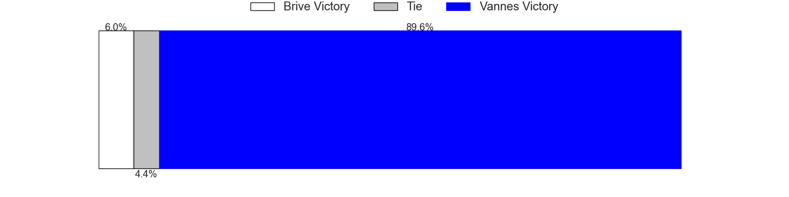
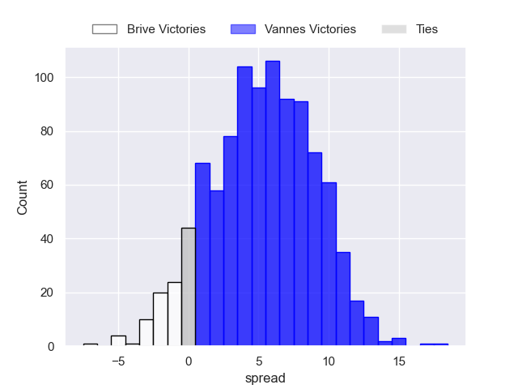

---  
title: "Pro D2 2023 Status"  
date: 2024-05-06 6:00:00 -0500  
categories: model review projection  
layout: article  
aside:  
    toc: true  
---
# Current Team Rankings

# Standings

## Current Standings

| Club                       |   Played |   Wins |   Point Differential |   Losing Bonus Points |   Try Bonus Points |   Competition Points |
|:---------------------------|---------:|-------:|---------------------:|----------------------:|-------------------:|---------------------:|
| Vannes                     |       28 |     18 |                  279 |                     6 |                 13 |                   91 |
| Provence Rugby             |       28 |     19 |                  136 |                     3 |                 11 |                   90 |
| Grenoble                   |       28 |     18 |                  137 |                     3 |                 10 |                   85 |
| Beziers                    |       28 |     16 |                   84 |                     5 |                  9 |                   80 |
| Mont-de-Marsan             |       28 |     14 |                  120 |                     8 |                  9 |                   75 |
| Brive                      |       28 |     14 |                   77 |                     6 |                  9 |                   73 |
| Dax                        |       28 |     16 |                  -61 |                     2 |                  5 |                   73 |
| Nevers                     |       28 |     14 |                   64 |                     9 |                  7 |                   72 |
| Colomiers                  |       28 |     13 |                   34 |                     6 |                  5 |                   65 |
| Soyaux-Angouleme           |       28 |     13 |                  -44 |                     7 |                  1 |                   60 |
| Agen                       |       28 |     12 |                 -126 |                     5 |                  5 |                   60 |
| Valence Romans Drome Rugby |       28 |     12 |                  -21 |                     5 |                  5 |                   58 |
| Biarritz Olympique         |       28 |     11 |                 -158 |                     5 |                  9 |                   58 |
| Aurillac                   |       28 |     12 |                 -181 |                     4 |                  2 |                   56 |
| Montauban                  |       28 |     10 |                 -175 |                     5 |                  4 |                   49 |
| Rouen                      |       28 |      8 |                 -165 |                     8 |                  6 |                   48 |

## Projected Remaining Table

| Club                       |   Matches Remaining |   Wins |   Point Differential |   Losing Bonus Points |   Try Bonus Points |   Competition Points |
|:---------------------------|--------------------:|-------:|---------------------:|----------------------:|-------------------:|---------------------:|
| Mont-de-Marsan             |                   2 |    1.7 |            11.7551   |                   0.3 |                0.7 |                  7.9 |
| Vannes                     |                   2 |    1.7 |             8.28573  |                   0.3 |                0.8 |                  7.9 |
| Provence Rugby             |                   2 |    1.4 |             3.58036  |                   0.6 |                0.6 |                  6.7 |
| Nevers                     |                   2 |    1.2 |             2.78817  |                   0.7 |                0.7 |                  6.1 |
| Grenoble                   |                   2 |    1.2 |             3.35131  |                   0.7 |                0.6 |                  6   |
| Beziers                    |                   2 |    1.1 |             1.06494  |                   0.8 |                0.4 |                  5.6 |
| Soyaux-Angouleme           |                   2 |    1.1 |             1.02399  |                   0.9 |                0.2 |                  5.5 |
| Aurillac                   |                   2 |    1   |            -0.498827 |                   0.7 |                0.8 |                  5.5 |
| Valence Romans Drome Rugby |                   2 |    1   |             0.879305 |                   0.7 |                0.5 |                  5.4 |
| Brive                      |                   2 |    1.1 |             2.3972   |                   0.6 |                0.2 |                  5.1 |
| Dax                        |                   2 |    1   |            -0.63093  |                   0.7 |                0.3 |                  4.9 |
| Colomiers                  |                   2 |    0.9 |            -1.82803  |                   0.7 |                0.5 |                  4.9 |
| Rouen                      |                   2 |    0.6 |            -8.69835  |                   0.7 |                0.4 |                  3.3 |
| Biarritz Olympique         |                   2 |    0.4 |            -8.52366  |                   1   |                0.3 |                  3   |
| Montauban                  |                   2 |    0.3 |            -7.19963  |                   1.3 |                0.2 |                  2.9 |
| Agen                       |                   2 |    0.3 |            -7.74672  |                   1.3 |                0.3 |                  2.8 |

## Projected Total Table

| Club                       |   Total Matches |   Wins |   Point Differential |   Losing Bonus Points |   Try Bonus Points |   Competition Points |
|:---------------------------|----------------:|-------:|---------------------:|----------------------:|-------------------:|---------------------:|
| Vannes                     |              30 |   19.7 |             287.286  |                   6.3 |               13.8 |                 98.9 |
| Provence Rugby             |              30 |   20.4 |             139.58   |                   3.6 |               11.6 |                 96.7 |
| Grenoble                   |              30 |   19.2 |             140.351  |                   3.7 |               10.6 |                 91   |
| Beziers                    |              30 |   17.1 |              85.0649 |                   5.8 |                9.4 |                 85.6 |
| Mont-de-Marsan             |              30 |   15.7 |             131.755  |                   8.3 |                9.7 |                 82.9 |
| Brive                      |              30 |   15.1 |              79.3972 |                   6.6 |                9.2 |                 78.1 |
| Nevers                     |              30 |   15.2 |              66.7882 |                   9.7 |                7.7 |                 78.1 |
| Dax                        |              30 |   17   |             -61.6309 |                   2.7 |                5.3 |                 77.9 |
| Colomiers                  |              30 |   13.9 |              32.172  |                   6.7 |                5.5 |                 69.9 |
| Soyaux-Angouleme           |              30 |   14.1 |             -42.976  |                   7.9 |                1.2 |                 65.5 |
| Valence Romans Drome Rugby |              30 |   13   |             -20.1207 |                   5.7 |                5.5 |                 63.4 |
| Agen                       |              30 |   12.3 |            -133.747  |                   6.3 |                5.3 |                 62.8 |
| Aurillac                   |              30 |   13   |            -181.499  |                   4.7 |                2.8 |                 61.5 |
| Biarritz Olympique         |              30 |   11.4 |            -166.524  |                   6   |                9.3 |                 61   |
| Montauban                  |              30 |   10.3 |            -182.2    |                   6.3 |                4.2 |                 51.9 |
| Rouen                      |              30 |    8.6 |            -173.698  |                   8.7 |                6.4 |                 51.3 |

# Completed Match Review

| Model | Percent Correct Predictions | Spread Error |
| ------ | ------ | ------ |
| Club Level | 75.4% | 11.4 |
| Player Level: Lineup | 76.8% | 11.5 |
| Player Level: Minutes | 76.8% | 11.3 |

# Future Predictions

## Week 29

### Vannes V Brive on 2024/05/09

Average Margin: Vannes by 5.3

Average Scoreline: 28-22

### Valence Romans Drome Rugby V Aurillac on 2024/05/10

Average Margin: Valence Romans Drome Rugby by 5.2

Average Scoreline: 31-26

### Rouen V Soyaux-Angouleme on 2024/05/10

Average Margin: Rouen by 0.5

Average Scoreline: 22-22

### Montauban V Mont-de-Marsan on 2024/05/10

Average Margin: Mont-de-Marsan by 2.5

Average Scoreline: 24-21

### Dax V Agen on 2024/05/10

Average Margin: Dax by 4.8

Average Scoreline: 29-24

### Beziers V Nevers on 2024/05/10

Average Margin: Beziers by 2.6

Average Scoreline: 24-22

### Grenoble V Colomiers on 2024/05/10

Average Margin: Grenoble by 6.1

Average Scoreline: 29-23

### Biarritz Olympique V Provence Rugby on 2024/05/10

Average Margin: Provence Rugby by 0.8

Average Scoreline: 23-22

## Week 30

### Mont-de-Marsan V Rouen on 2024/05/17

Average Margin: Mont-de-Marsan by 9.2

Average Scoreline: 30-20

### Brive V Biarritz Olympique on 2024/05/17

Average Margin: Brive by 7.7

Average Scoreline: 28-20

### Colomiers V Valence Romans Drome Rugby on 2024/05/17

Average Margin: Colomiers by 4.3

Average Scoreline: 27-22

### Aurillac V Montauban on 2024/05/17

Average Margin: Aurillac by 4.7

Average Scoreline: 29-24

### Agen V Vannes on 2024/05/17

Average Margin: Vannes by 3.0

Average Scoreline: 22-19

### Nevers V Dax on 2024/05/17

Average Margin: Nevers by 5.4

Average Scoreline: 27-21

### Provence Rugby V Grenoble on 2024/05/17

Average Margin: Provence Rugby by 2.7

Average Scoreline: 31-28

### Soyaux-Angouleme V Beziers on 2024/05/17

Average Margin: Soyaux-Angouleme by 1.5

Average Scoreline: 22-20

