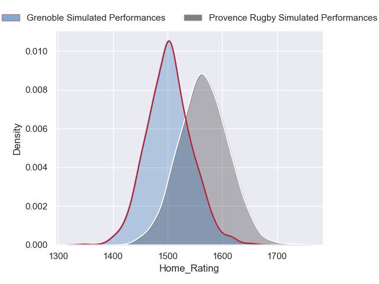
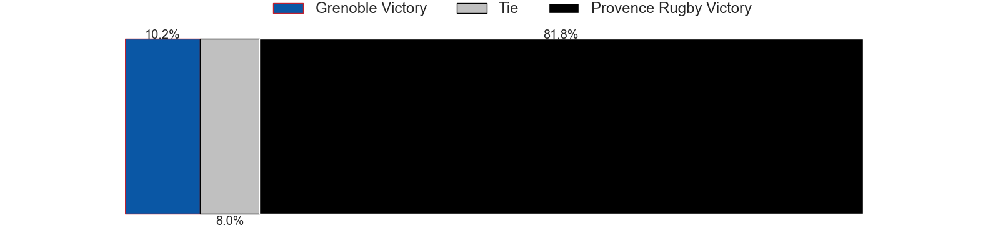
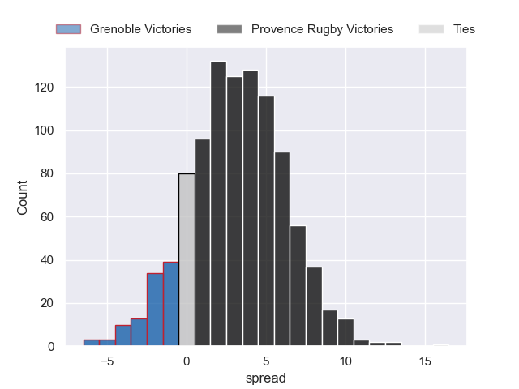
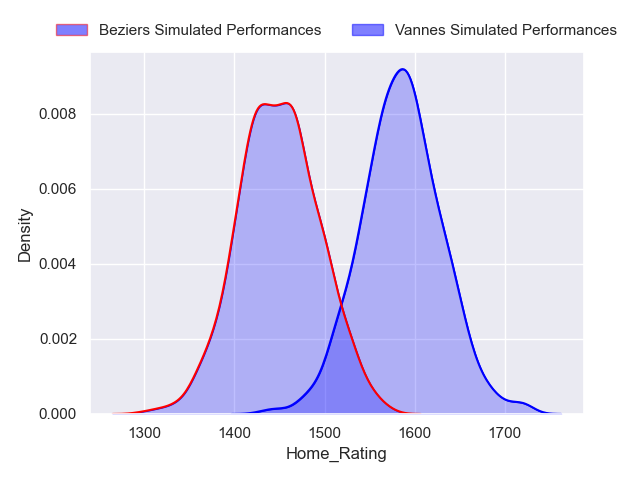
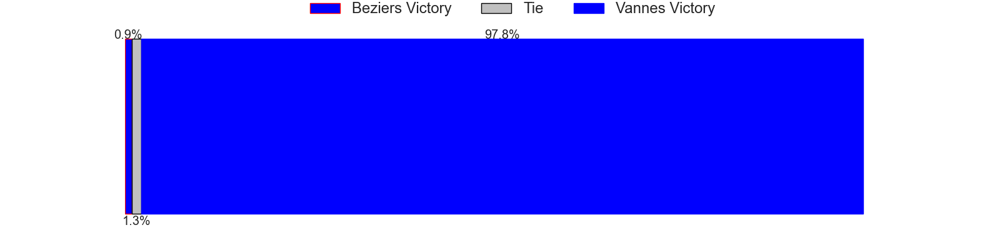
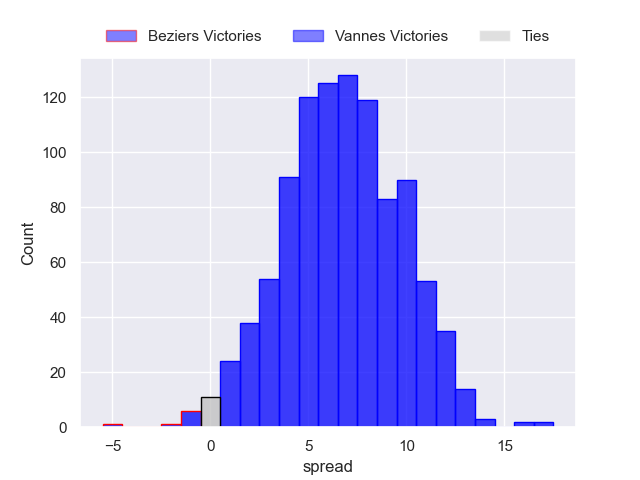

---  
title: "Pro D2 2023 Status"  
date: 2024-05-27 6:00:00 -0500  
categories: model review projection  
layout: article  
aside:  
    toc: true  
---
# Current Team Rankings

# Standings

## Current Standings

| Club                       |   Played |   Wins |   Point Differential |   Losing Bonus Points |   Try Bonus Points |   Competition Points |
|:---------------------------|---------:|-------:|---------------------:|----------------------:|-------------------:|---------------------:|
| Provence Rugby             |       30 |     21 |                  171 |                     3 |                 12 |                   99 |
| Grenoble                   |       31 |     20 |                  180 |                     3 |                nan |                   94 |
| Vannes                     |       30 |     18 |                  269 |                     8 |                 13 |                   93 |
| Beziers                    |       31 |     18 |                   76 |                     5 |                nan |                   88 |
| Brive                      |       31 |     16 |                  104 |                     7 |                nan |                   83 |
| Mont-de-Marsan             |       30 |     15 |                  125 |                     9 |                 10 |                   81 |
| Nevers                     |       30 |     15 |                   72 |                    10 |                  8 |                   78 |
| Dax                        |       31 |     17 |                 -107 |                     2 |                nan |                   77 |
| Colomiers                  |       30 |     13 |                    6 |                     6 |                  5 |                   65 |
| Agen                       |       30 |     13 |                 -135 |                     5 |                  6 |                   65 |
| Aurillac                   |       30 |     14 |                 -171 |                     4 |                  3 |                   65 |
| Valence Romans Drome Rugby |       30 |     13 |                  -17 |                     6 |                  6 |                   64 |
| Soyaux-Angouleme           |       30 |     14 |                  -53 |                     7 |                  1 |                   64 |
| Biarritz Olympique         |       30 |     11 |                 -193 |                     5 |                  9 |                   58 |
| Rouen                      |       30 |      9 |                 -149 |                     9 |                  8 |                   55 |
| Montauban                  |       30 |     11 |                 -178 |                     6 |                  4 |                   54 |

## Projected Remaining Table

| Club           |   Matches Remaining |   Wins |   Point Differential |   Losing Bonus Points |   Try Bonus Points |   Competition Points |
|:---------------|--------------------:|-------:|---------------------:|----------------------:|-------------------:|---------------------:|
| Vannes         |                   1 |    1   |              6.75402 |                   0   |                0.4 |                  4.4 |
| Narbonne       |                   1 |    0.9 |              3.62854 |                   0.1 |                0.5 |                  4   |
| Provence Rugby |                   1 |    0.9 |              3.22326 |                   0.1 |                0.4 |                  4   |
| Montauban      |                   1 |    0.1 |             -3.62854 |                   0.7 |                0.3 |                  1.6 |
| Grenoble       |                   1 |    0.1 |             -3.22326 |                   0.8 |                0.2 |                  1.5 |
| Beziers        |                   1 |    0   |             -6.75402 |                   0.5 |                0.2 |                  0.8 |

## Projected Total Table

| Club                       |   Total Matches |   Wins |   Point Differential |   Losing Bonus Points |   Try Bonus Points |   Competition Points |
|:---------------------------|----------------:|-------:|---------------------:|----------------------:|-------------------:|---------------------:|
| Provence Rugby             |              31 |   21.9 |            174.223   |                   3.1 |               12.4 |                103   |
| Vannes                     |              31 |   19   |            275.754   |                   8   |               13.4 |                 97.4 |
| Grenoble                   |              32 |   20.1 |            176.777   |                   3.8 |                0.2 |                 95.5 |
| Beziers                    |              32 |   18   |             69.246   |                   5.5 |                0.2 |                 88.8 |
| Brive                      |              31 |   16   |            104       |                   7   |                0   |                 83   |
| Mont-de-Marsan             |              30 |   15   |            125       |                   9   |               10   |                 81   |
| Nevers                     |              30 |   15   |             72       |                  10   |                8   |                 78   |
| Dax                        |              31 |   17   |           -107       |                   2   |                0   |                 77   |
| Colomiers                  |              30 |   13   |              6       |                   6   |                5   |                 65   |
| Agen                       |              30 |   13   |           -135       |                   5   |                6   |                 65   |
| Aurillac                   |              30 |   14   |           -171       |                   4   |                3   |                 65   |
| Valence Romans Drome Rugby |              30 |   13   |            -17       |                   6   |                6   |                 64   |
| Soyaux-Angouleme           |              30 |   14   |            -53       |                   7   |                1   |                 64   |
| Biarritz Olympique         |              30 |   11   |           -193       |                   5   |                9   |                 58   |
| Montauban                  |              31 |   11.1 |           -181.629   |                   6.7 |                4.3 |                 55.6 |
| Rouen                      |              30 |    9   |           -149       |                   9   |                8   |                 55   |
| Narbonne                   |               1 |    0.9 |              3.62854 |                   0.1 |                0.5 |                  4   |

# Completed Match Review

| Model | Percent Correct Predictions | Spread Error |
| ------ | ------ | ------ |
| Club Level | 74.8% | 11.4 |
| Player Level: Lineup | 75.9% | 11.5 |
| Player Level: Minutes | 75.9% | 11.3 |

# Future Predictions

## Week 32

### Provence Rugby V Grenoble on 2024/05/30

Average Margin: Provence Rugby by 3.2

Average Scoreline: 33-30

### Vannes V Beziers on 2024/05/31

Average Margin: Vannes by 6.8

Average Scoreline: 31-25

### Narbonne V Montauban on 2024/06/02

Average Margin: Narbonne by 3.6

Average Scoreline: 26-22

