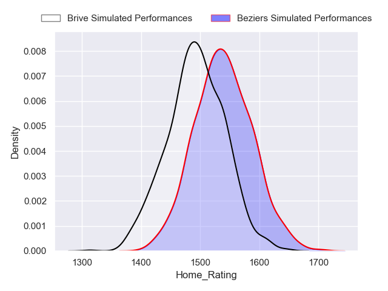
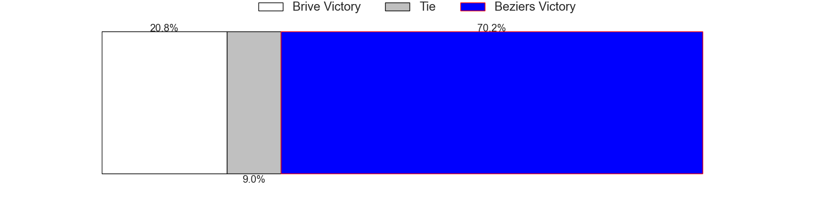
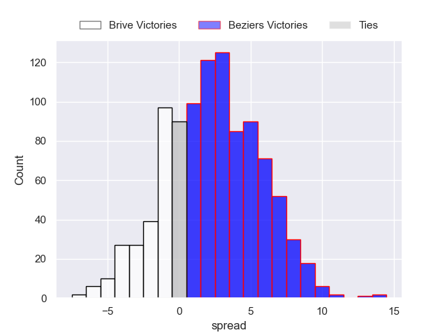

---  
title: "Pro D2 2023 Status"  
date: 2024-02-27 6:00:00 -0500  
categories: model review projection  
layout: article  
aside:  
    toc: true  
---
# Current Team Rankings

# Standings

## Current Standings

| Club                       |   Played |   Wins |   Point Differential |   Losing Bonus Points |   Try Bonus Points |   Competition Points |
|:---------------------------|---------:|-------:|---------------------:|----------------------:|-------------------:|---------------------:|
| Vannes                     |       21 |     13 |                  205 |                     4 |                  9 |                   67 |
| Beziers                    |       21 |     13 |                  107 |                     4 |                  6 |                   64 |
| Provence Rugby             |       21 |     14 |                   53 |                     1 |                  7 |                   64 |
| Mont-de-Marsan             |       21 |     12 |                  101 |                     6 |                  7 |                   61 |
| Nevers                     |       21 |     12 |                   51 |                     4 |                  6 |                   58 |
| Brive                      |       21 |     11 |                   53 |                     6 |                  6 |                   56 |
| Grenoble                   |       21 |     11 |                   10 |                     3 |                  6 |                   53 |
| Colomiers                  |       21 |     10 |                   62 |                     5 |                  3 |                   50 |
| Dax                        |       21 |     11 |                  -82 |                     2 |                  2 |                   50 |
| Agen                       |       21 |     10 |                  -66 |                     3 |                  4 |                   49 |
| Aurillac                   |       21 |     10 |                  -88 |                     3 |                  2 |                   47 |
| Soyaux-Angouleme           |       21 |      8 |                  -28 |                     6 |                  1 |                   41 |
| Montauban                  |       21 |      9 |                 -126 |                     2 |                  3 |                   41 |
| Valence Romans Drome Rugby |       21 |      8 |                   -7 |                     5 |                  3 |                   40 |
| Biarritz Olympique         |       21 |      7 |                 -127 |                     4 |                  4 |                   36 |
| Rouen                      |       21 |      5 |                 -118 |                     7 |                  5 |                   34 |

## Projected Remaining Table

| Club                       |   Matches Remaining |   Wins |   Point Differential |   Losing Bonus Points |   Try Bonus Points |   Competition Points |
|:---------------------------|--------------------:|-------:|---------------------:|----------------------:|-------------------:|---------------------:|
| Vannes                     |                   9 |    8.2 |             53.6543  |                   0.8 |                6.1 |                 39.7 |
| Mont-de-Marsan             |                   9 |    7.1 |             42.8048  |                   1.8 |                4.5 |                 34.8 |
| Nevers                     |                   9 |    6.8 |             28.2273  |                   2.1 |                4.1 |                 33.3 |
| Provence Rugby             |                   9 |    6.1 |             18.636   |                   2.7 |                3.7 |                 30.6 |
| Beziers                    |                   9 |    5.9 |             17.5974  |                   2.9 |                3.7 |                 30.4 |
| Brive                      |                   9 |    5.6 |             18.8587  |                   2.8 |                2.9 |                 28.1 |
| Grenoble                   |                   9 |    5.5 |             15.9558  |                   2.7 |                2.9 |                 27.8 |
| Agen                       |                   9 |    4.1 |             -2.61849 |                   4   |                3.8 |                 24.1 |
| Valence Romans Drome Rugby |                   9 |    3.8 |             -9.33487 |                   4   |                2.8 |                 22.1 |
| Colomiers                  |                   9 |    3.7 |            -10.3853  |                   3.7 |                2.7 |                 21.1 |
| Aurillac                   |                   9 |    3   |            -18.9284  |                   4.5 |                2.4 |                 19   |
| Biarritz Olympique         |                   9 |    3.1 |            -23.2679  |                   3.8 |                3   |                 19   |
| Dax                        |                   9 |    3.1 |            -23.1188  |                   3.6 |                2.1 |                 18.1 |
| Montauban                  |                   9 |    2   |            -30.6185  |                   5.1 |                1.4 |                 14.4 |
| Soyaux-Angouleme           |                   9 |    2.1 |            -31.6875  |                   4.7 |                1   |                 14.1 |
| Rouen                      |                   9 |    1.9 |            -45.7746  |                   3.6 |                2.7 |                 13.8 |

## Projected Total Table

| Club                       |   Total Matches |   Wins |   Point Differential |   Losing Bonus Points |   Try Bonus Points |   Competition Points |
|:---------------------------|----------------:|-------:|---------------------:|----------------------:|-------------------:|---------------------:|
| Vannes                     |              30 |   21.2 |             258.654  |                   4.8 |               15.1 |                106.7 |
| Mont-de-Marsan             |              30 |   19.1 |             143.805  |                   7.8 |               11.5 |                 95.8 |
| Provence Rugby             |              30 |   20.1 |              71.636  |                   3.7 |               10.7 |                 94.6 |
| Beziers                    |              30 |   18.9 |             124.597  |                   6.9 |                9.7 |                 94.4 |
| Nevers                     |              30 |   18.8 |              79.2273 |                   6.1 |               10.1 |                 91.3 |
| Brive                      |              30 |   16.6 |              71.8587 |                   8.8 |                8.9 |                 84.1 |
| Grenoble                   |              30 |   16.5 |              25.9558 |                   5.7 |                8.9 |                 80.8 |
| Agen                       |              30 |   14.1 |             -68.6185 |                   7   |                7.8 |                 73.1 |
| Colomiers                  |              30 |   13.7 |              51.6147 |                   8.7 |                5.7 |                 71.1 |
| Dax                        |              30 |   14.1 |            -105.119  |                   5.6 |                4.1 |                 68.1 |
| Aurillac                   |              30 |   13   |            -106.928  |                   7.5 |                4.4 |                 66   |
| Valence Romans Drome Rugby |              30 |   11.8 |             -16.3349 |                   9   |                5.8 |                 62.1 |
| Montauban                  |              30 |   11   |            -156.618  |                   7.1 |                4.4 |                 55.4 |
| Soyaux-Angouleme           |              30 |   10.1 |             -59.6875 |                  10.7 |                2   |                 55.1 |
| Biarritz Olympique         |              30 |   10.1 |            -150.268  |                   7.8 |                7   |                 55   |
| Rouen                      |              30 |    6.9 |            -163.775  |                  10.6 |                7.7 |                 47.8 |

# Completed Match Review

| Model | Percent Correct Predictions | Spread Error |
| ------ | ------ | ------ |
| Club Level | 77.4% | 11.1 |
| Player Level: Lineup | 78.0% | 11.2 |
| Player Level: Minutes | 77.4% | 11.0 |

# Future Predictions

## Week 22

### Beziers V Brive on 2024/02/29

Average Margin: Beziers by 2.3

Average Scoreline: 28-26

### Aurillac V Nevers on 2024/03/01

Average Margin: Nevers by 0.7

Average Scoreline: 24-23

### Provence Rugby V Colomiers on 2024/03/01

Average Margin: Provence Rugby by 4.0

Average Scoreline: 25-21

### Biarritz Olympique V Vannes on 2024/03/01

Average Margin: Vannes by 3.2

Average Scoreline: 29-26

### Montauban V Agen on 2024/03/01

Average Margin: Montauban by 0.8

Average Scoreline: 27-26

### Mont-de-Marsan V Soyaux-Angouleme on 2024/03/01

Average Margin: Mont-de-Marsan by 8.8

Average Scoreline: 27-19

### Valence Romans Drome Rugby V Dax on 2024/03/01

Average Margin: Valence Romans Drome Rugby by 3.9

Average Scoreline: 27-23

### Grenoble V Rouen on 2024/03/01

Average Margin: Grenoble by 8.7

Average Scoreline: 30-22

## Week 23

### Nevers V Provence Rugby on 2024/03/07

Average Margin: Nevers by 4.3

Average Scoreline: 23-19

### Biarritz Olympique V Montauban on 2024/03/08

Average Margin: Biarritz Olympique by 4.5

Average Scoreline: 29-24

### Vannes V Grenoble on 2024/03/08

Average Margin: Vannes by 6.6

Average Scoreline: 26-20

### Rouen V Aurillac on 2024/03/08

Average Margin: Rouen by 1.2

Average Scoreline: 28-27

### Soyaux-Angouleme V Valence Romans Drome Rugby on 2024/03/08

Average Margin: Soyaux-Angouleme by 2.2

Average Scoreline: 24-22

### Colomiers V Mont-de-Marsan on 2024/03/08

Average Margin: Colomiers by 0.5

Average Scoreline: 28-28

### Dax V Beziers on 2024/03/08

Average Margin: Dax by 0.2

Average Scoreline: 27-27

### Brive V Agen on 2024/03/08

Average Margin: Brive by 6.7

Average Scoreline: 26-19

## Week 24

### Agen V Rouen on 2024/03/29

Average Margin: Agen by 6.8

Average Scoreline: 29-23

### Aurillac V Provence Rugby on 2024/03/29

Average Margin: Aurillac by 0.2

Average Scoreline: 27-27

### Grenoble V Soyaux-Angouleme on 2024/03/29

Average Margin: Grenoble by 6.7

Average Scoreline: 27-20

### Mont-de-Marsan V Brive on 2024/03/29

Average Margin: Mont-de-Marsan by 4.1

Average Scoreline: 24-20

### Beziers V Biarritz Olympique on 2024/03/29

Average Margin: Beziers by 6.9

Average Scoreline: 26-19

### Valence Romans Drome Rugby V Nevers on 2024/03/29

Average Margin: Nevers by 0.1

Average Scoreline: 21-21

### Montauban V Dax on 2024/03/29

Average Margin: Montauban by 1.8

Average Scoreline: 26-25

### Vannes V Colomiers on 2024/03/29

Average Margin: Vannes by 7.7

Average Scoreline: 26-18

## Week 25

### Valence Romans Drome Rugby V Mont-de-Marsan on 2024/04/05

Average Margin: Mont-de-Marsan by 0.9

Average Scoreline: 26-25

### Soyaux-Angouleme V Vannes on 2024/04/05

Average Margin: Vannes by 3.1

Average Scoreline: 27-24

### Rouen V Beziers on 2024/04/05

Average Margin: Beziers by 2.3

Average Scoreline: 29-26

### Nevers V Grenoble on 2024/04/05

Average Margin: Nevers by 4.0

Average Scoreline: 23-19

### Provence Rugby V Montauban on 2024/04/05

Average Margin: Provence Rugby by 7.6

Average Scoreline: 26-18

### Biarritz Olympique V Aurillac on 2024/04/05

Average Margin: Biarritz Olympique by 3.3

Average Scoreline: 28-24

### Colomiers V Agen on 2024/04/05

Average Margin: Colomiers by 4.2

Average Scoreline: 29-25

### Dax V Brive on 2024/04/05

Average Margin: Brive by 0.8

Average Scoreline: 25-24

## Week 26

### Montauban V Nevers on 2024/04/12

Average Margin: Nevers by 2.1

Average Scoreline: 23-21

### Grenoble V Aurillac on 2024/04/12

Average Margin: Grenoble by 6.6

Average Scoreline: 31-24

### Rouen V Provence Rugby on 2024/04/12

Average Margin: Provence Rugby by 1.9

Average Scoreline: 27-26

### Mont-de-Marsan V Biarritz Olympique on 2024/04/12

Average Margin: Mont-de-Marsan by 8.6

Average Scoreline: 32-24

### Agen V Soyaux-Angouleme on 2024/04/12

Average Margin: Agen by 4.8

Average Scoreline: 32-27

### Vannes V Dax on 2024/04/12

Average Margin: Vannes by 9.6

Average Scoreline: 30-20

### Beziers V Valence Romans Drome Rugby on 2024/04/12

Average Margin: Beziers by 6.3

Average Scoreline: 26-20

### Brive V Colomiers on 2024/04/12

Average Margin: Brive by 5.7

Average Scoreline: 24-18

## Week 27

### Biarritz Olympique V Grenoble on 2024/04/19

Average Margin: Biarritz Olympique by 0.1

Average Scoreline: 30-30

### Aurillac V Beziers on 2024/04/19

Average Margin: Beziers by 0.0

Average Scoreline: 25-25

### Soyaux-Angouleme V Brive on 2024/04/19

Average Margin: Brive by 1.3

Average Scoreline: 23-21

### Valence Romans Drome Rugby V Agen on 2024/04/19

Average Margin: Valence Romans Drome Rugby by 2.8

Average Scoreline: 31-28

### Dax V Rouen on 2024/04/19

Average Margin: Dax by 5.8

Average Scoreline: 26-20

### Provence Rugby V Mont-de-Marsan on 2024/04/19

Average Margin: Provence Rugby by 1.2

Average Scoreline: 34-33

### Montauban V Vannes on 2024/04/19

Average Margin: Vannes by 4.3

Average Scoreline: 28-24

### Nevers V Colomiers on 2024/04/19

Average Margin: Nevers by 5.0

Average Scoreline: 24-19

## Week 28

### Mont-de-Marsan V Dax on 2024/04/26

Average Margin: Mont-de-Marsan by 8.4

Average Scoreline: 28-19

### Provence Rugby V Valence Romans Drome Rugby on 2024/04/26

Average Margin: Provence Rugby by 5.7

Average Scoreline: 26-20

### Nevers V Soyaux-Angouleme on 2024/04/26

Average Margin: Nevers by 7.7

Average Scoreline: 26-18

### Vannes V Rouen on 2024/04/26

Average Margin: Vannes by 12.0

Average Scoreline: 32-20

### Brive V Aurillac on 2024/04/26

Average Margin: Brive by 7.9

Average Scoreline: 25-17

### Colomiers V Montauban on 2024/04/26

Average Margin: Colomiers by 6.9

Average Scoreline: 27-20

### Grenoble V Beziers on 2024/04/26

Average Margin: Grenoble by 3.1

Average Scoreline: 35-32

### Agen V Biarritz Olympique on 2024/04/26

Average Margin: Agen by 4.7

Average Scoreline: 33-28

## Week 29

### Vannes V Brive on 2024/05/10

Average Margin: Vannes by 5.2

Average Scoreline: 29-24

### Beziers V Nevers on 2024/05/10

Average Margin: Beziers by 2.8

Average Scoreline: 27-25

### Valence Romans Drome Rugby V Aurillac on 2024/05/10

Average Margin: Valence Romans Drome Rugby by 4.1

Average Scoreline: 28-24

### Rouen V Soyaux-Angouleme on 2024/05/10

Average Margin: Rouen by 1.3

Average Scoreline: 31-29

### Grenoble V Colomiers on 2024/05/10

Average Margin: Grenoble by 4.4

Average Scoreline: 33-28

### Dax V Agen on 2024/05/10

Average Margin: Dax by 2.4

Average Scoreline: 33-31

### Montauban V Mont-de-Marsan on 2024/05/10

Average Margin: Mont-de-Marsan by 3.0

Average Scoreline: 32-29

### Biarritz Olympique V Provence Rugby on 2024/05/10

Average Margin: Biarritz Olympique by 0.3

Average Scoreline: 33-32

## Week 30

### Agen V Vannes on 2024/05/17

Average Margin: Vannes by 1.9

Average Scoreline: 30-28

### Nevers V Dax on 2024/05/17

Average Margin: Nevers by 7.1

Average Scoreline: 27-20

### Aurillac V Montauban on 2024/05/17

Average Margin: Aurillac by 4.6

Average Scoreline: 27-22

### Mont-de-Marsan V Rouen on 2024/05/17

Average Margin: Mont-de-Marsan by 10.7

Average Scoreline: 38-27

### Provence Rugby V Grenoble on 2024/05/17

Average Margin: Provence Rugby by 3.0

Average Scoreline: 34-31

### Colomiers V Valence Romans Drome Rugby on 2024/05/17

Average Margin: Colomiers by 4.9

Average Scoreline: 32-27

### Soyaux-Angouleme V Beziers on 2024/05/17

Average Margin: Beziers by 0.3

Average Scoreline: 29-28

### Brive V Biarritz Olympique on 2024/05/17

Average Margin: Brive by 8.0

Average Scoreline: 29-21

