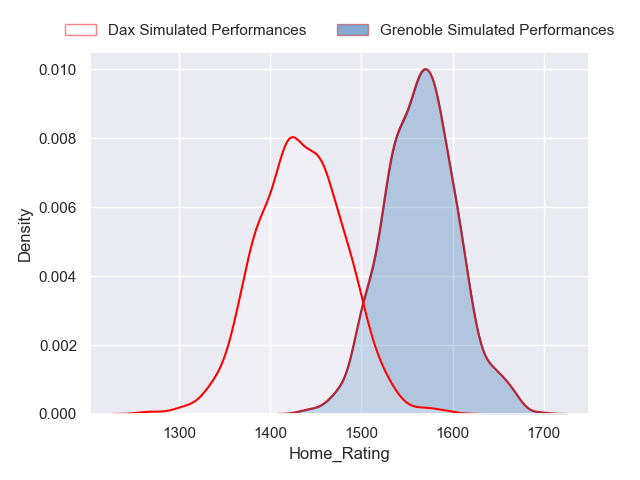
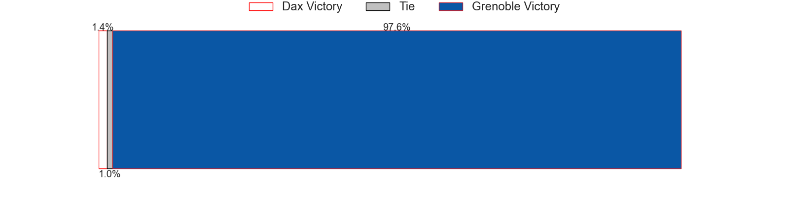
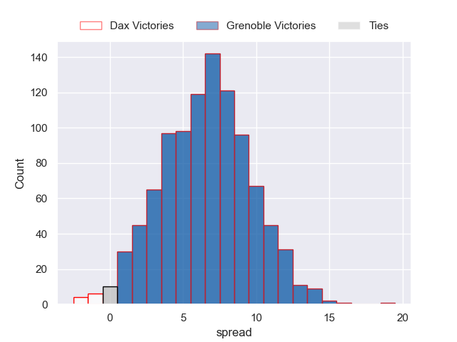
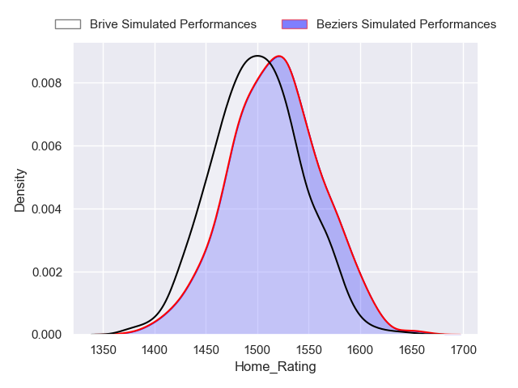
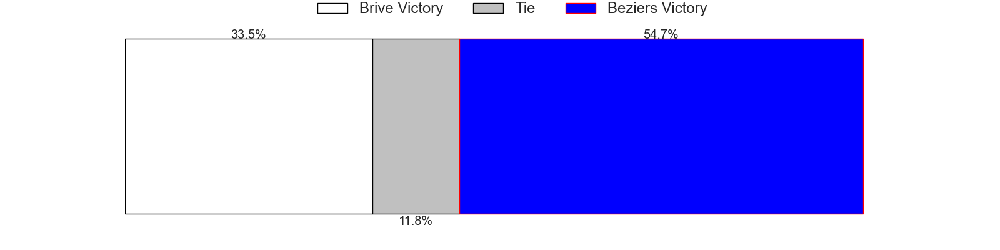
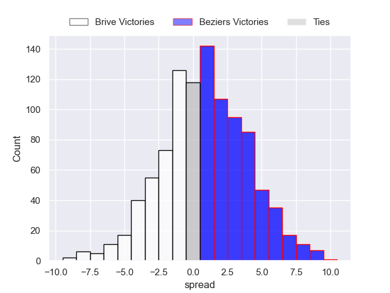
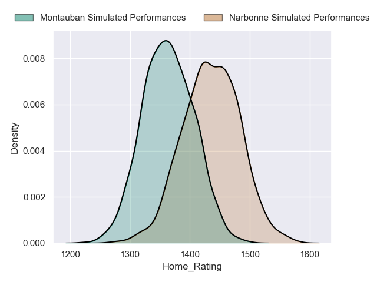
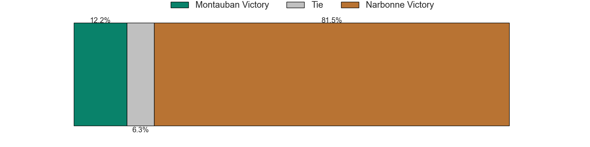
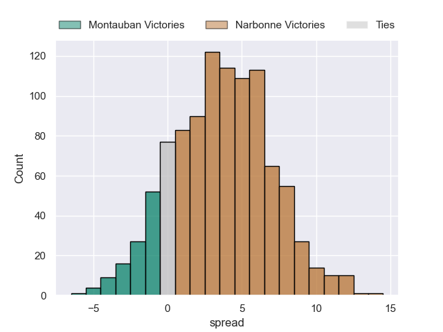

---  
title: "Pro D2 2023 Status"  
date: 2024-05-23 6:00:00 -0500  
categories: model review projection  
layout: article  
aside:  
    toc: true  
---
# Current Team Rankings

# Standings

## Current Standings

| Club                       |   Played |   Wins |   Point Differential |   Losing Bonus Points |   Try Bonus Points |   Competition Points |
|:---------------------------|---------:|-------:|---------------------:|----------------------:|-------------------:|---------------------:|
| Provence Rugby             |       30 |     21 |                  171 |                     3 |                 12 |                   99 |
| Vannes                     |       30 |     18 |                  269 |                     8 |                 13 |                   93 |
| Grenoble                   |       30 |     19 |                  132 |                     3 |                 11 |                   90 |
| Beziers                    |       30 |     17 |                   74 |                     5 |                  9 |                   84 |
| Brive                      |       30 |     16 |                  106 |                     6 |                 10 |                   82 |
| Mont-de-Marsan             |       30 |     15 |                  125 |                     9 |                 10 |                   81 |
| Nevers                     |       30 |     15 |                   72 |                    10 |                  8 |                   78 |
| Dax                        |       30 |     17 |                  -59 |                     2 |                  5 |                   77 |
| Colomiers                  |       30 |     13 |                    6 |                     6 |                  5 |                   65 |
| Agen                       |       30 |     13 |                 -135 |                     5 |                  6 |                   65 |
| Aurillac                   |       30 |     14 |                 -171 |                     4 |                  3 |                   65 |
| Valence Romans Drome Rugby |       30 |     13 |                  -17 |                     6 |                  6 |                   64 |
| Soyaux-Angouleme           |       30 |     14 |                  -53 |                     7 |                  1 |                   64 |
| Biarritz Olympique         |       30 |     11 |                 -193 |                     5 |                  9 |                   58 |
| Rouen                      |       30 |      9 |                 -149 |                     9 |                  8 |                   55 |
| Montauban                  |       30 |     11 |                 -178 |                     6 |                  4 |                   54 |

## Projected Remaining Table

| Club      |   Matches Remaining |   Wins |   Point Differential |   Losing Bonus Points |   Try Bonus Points |   Competition Points |
|:----------|--------------------:|-------:|---------------------:|----------------------:|-------------------:|---------------------:|
| Grenoble  |                   1 |    1   |             6.57453  |                   0   |                0.6 |                  4.5 |
| Narbonne  |                   1 |    0.9 |             3.59321  |                   0.1 |                0.4 |                  4   |
| Beziers   |                   1 |    0.6 |             0.843408 |                   0.4 |                0.3 |                  3.1 |
| Brive     |                   1 |    0.4 |            -0.843408 |                   0.6 |                0.3 |                  2.5 |
| Montauban |                   1 |    0.1 |            -3.59321  |                   0.7 |                0.2 |                  1.5 |
| Dax       |                   1 |    0   |            -6.57453  |                   0.5 |                0.3 |                  0.9 |

## Projected Total Table

| Club                       |   Total Matches |   Wins |   Point Differential |   Losing Bonus Points |   Try Bonus Points |   Competition Points |
|:---------------------------|----------------:|-------:|---------------------:|----------------------:|-------------------:|---------------------:|
| Provence Rugby             |              30 |   21   |            171       |                   3   |               12   |                 99   |
| Grenoble                   |              31 |   20   |            138.575   |                   3   |               11.6 |                 94.5 |
| Vannes                     |              30 |   18   |            269       |                   8   |               13   |                 93   |
| Beziers                    |              31 |   17.6 |             74.8434  |                   5.4 |                9.3 |                 87.1 |
| Brive                      |              31 |   16.4 |            105.157   |                   6.6 |               10.3 |                 84.5 |
| Mont-de-Marsan             |              30 |   15   |            125       |                   9   |               10   |                 81   |
| Nevers                     |              30 |   15   |             72       |                  10   |                8   |                 78   |
| Dax                        |              31 |   17   |            -65.5745  |                   2.5 |                5.3 |                 77.9 |
| Colomiers                  |              30 |   13   |              6       |                   6   |                5   |                 65   |
| Agen                       |              30 |   13   |           -135       |                   5   |                6   |                 65   |
| Aurillac                   |              30 |   14   |           -171       |                   4   |                3   |                 65   |
| Valence Romans Drome Rugby |              30 |   13   |            -17       |                   6   |                6   |                 64   |
| Soyaux-Angouleme           |              30 |   14   |            -53       |                   7   |                1   |                 64   |
| Biarritz Olympique         |              30 |   11   |           -193       |                   5   |                9   |                 58   |
| Montauban                  |              31 |   11.1 |           -181.593   |                   6.7 |                4.2 |                 55.5 |
| Rouen                      |              30 |    9   |           -149       |                   9   |                8   |                 55   |
| Narbonne                   |               1 |    0.9 |              3.59321 |                   0.1 |                0.4 |                  4   |

# Completed Match Review

| Model | Percent Correct Predictions | Spread Error |
| ------ | ------ | ------ |
| Club Level | 74.6% | 11.3 |
| Player Level: Lineup | 76.2% | 11.4 |
| Player Level: Minutes | 76.2% | 11.2 |

# Future Predictions

## Week 31

### Grenoble V Dax on 2024/05/23

Average Margin: Grenoble by 6.6

Average Scoreline: 30-23

### Beziers V Brive on 2024/05/24

Average Margin: Beziers by 0.8

Average Scoreline: 28-27

## Week 32

### Narbonne V Montauban on 2024/06/02

Average Margin: Narbonne by 3.6

Average Scoreline: 30-26

