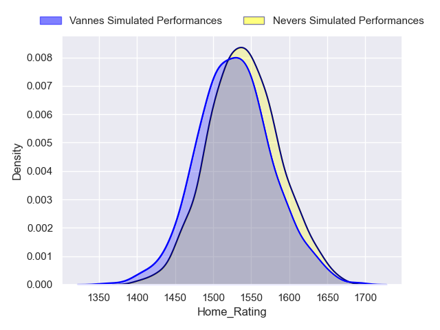
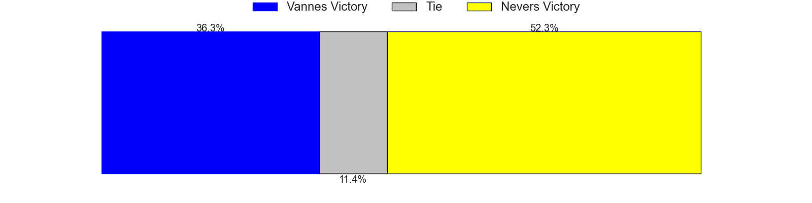
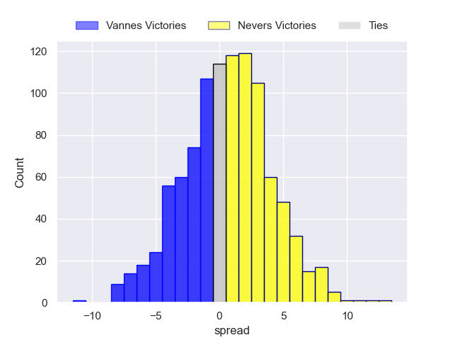

---  
title: "Pro D2 2023 Status"  
date: 2024-01-22 6:00:00 -0500  
categories: model review projection  
layout: article  
aside:  
    toc: true  
---
# Current Team Rankings

# Standings

## Current Standings

| Club                       |   Played |   Wins |   Point Differential |   Losing Bonus Points |   Try Bonus Points |   Competition Points |
|:---------------------------|---------:|-------:|---------------------:|----------------------:|-------------------:|---------------------:|
| Vannes                     |       17 |     11 |                  168 |                     3 |                  7 |                   56 |
| Provence Rugby             |       17 |     12 |                   86 |                     1 |                  6 |                   55 |
| Beziers                    |       17 |     10 |                  108 |                     4 |                  5 |                   51 |
| Mont-de-Marsan             |       17 |     10 |                   79 |                     4 |                  5 |                   49 |
| Grenoble                   |       17 |     10 |                   65 |                     3 |                  5 |                   48 |
| Brive                      |       17 |     10 |                   47 |                     4 |                  4 |                   48 |
| Nevers                     |       17 |      9 |                   31 |                     4 |                  6 |                   46 |
| Agen                       |       17 |      8 |                 -103 |                     2 |                  3 |                   39 |
| Aurillac                   |       17 |      8 |                  -64 |                     2 |                  2 |                   38 |
| Dax                        |       17 |      8 |                 -105 |                     2 |                  1 |                   37 |
| Colomiers                  |       17 |      7 |                   -3 |                     5 |                  1 |                   36 |
| Montauban                  |       17 |      8 |                  -98 |                     1 |                  2 |                   35 |
| Soyaux-Angouleme           |       17 |      6 |                  -29 |                     5 |                  1 |                   32 |
| Valence Romans Drome Rugby |       17 |      6 |                    5 |                     4 |                  3 |                   31 |
| Biarritz Olympique         |       17 |      6 |                  -89 |                     3 |                  4 |                   31 |
| Rouen                      |       17 |      3 |                  -98 |                     7 |                  4 |                   25 |

## Projected Remaining Table

| Club                       |   Matches Remaining |   Wins |   Point Differential |   Losing Bonus Points |   Try Bonus Points |   Competition Points |
|:---------------------------|--------------------:|-------:|---------------------:|----------------------:|-------------------:|---------------------:|
| Vannes                     |                  13 |   11   |            66.5209   |                   2   |                6.6 |                 52.4 |
| Mont-de-Marsan             |                  13 |    9.6 |            46.8086   |                   3.2 |                4.9 |                 46.7 |
| Provence Rugby             |                  13 |    9.2 |            31.0001   |                   3.6 |                4.5 |                 44.9 |
| Beziers                    |                  13 |    8.3 |            20.1265   |                   4.1 |                4.7 |                 42   |
| Nevers                     |                  13 |    8   |            21.4782   |                   4.3 |                4.8 |                 41.3 |
| Grenoble                   |                  13 |    7.6 |            20.8146   |                   4.6 |                5.4 |                 40.4 |
| Brive                      |                  13 |    8.2 |            30.9319   |                   4.1 |                2.8 |                 39.9 |
| Colomiers                  |                  13 |    6.7 |             0.587281 |                   4.3 |                3.6 |                 34.7 |
| Valence Romans Drome Rugby |                  13 |    6   |            -8.64405  |                   5.3 |                4   |                 33.5 |
| Agen                       |                  13 |    4.5 |           -24.6211   |                   6.3 |                5.5 |                 30   |
| Dax                        |                  13 |    5.3 |           -23.6786   |                   4.9 |                3.1 |                 29.2 |
| Biarritz Olympique         |                  13 |    4.5 |           -25.2087   |                   6.1 |                4.1 |                 28.3 |
| Montauban                  |                  13 |    4.2 |           -27.2556   |                   6.8 |                2.3 |                 26.1 |
| Aurillac                   |                  13 |    4   |           -34.9968   |                   6.3 |                3.4 |                 25.7 |
| Soyaux-Angouleme           |                  13 |    3.5 |           -38.727    |                   6.9 |                1.7 |                 22.6 |
| Rouen                      |                  13 |    3.1 |           -55.1363   |                   5.7 |                3.7 |                 21.9 |

## Projected Total Table

| Club                       |   Total Matches |   Wins |   Point Differential |   Losing Bonus Points |   Try Bonus Points |   Competition Points |
|:---------------------------|----------------:|-------:|---------------------:|----------------------:|-------------------:|---------------------:|
| Vannes                     |              30 |   22   |            234.521   |                   5   |               13.6 |                108.4 |
| Provence Rugby             |              30 |   21.2 |            117       |                   4.6 |               10.5 |                 99.9 |
| Mont-de-Marsan             |              30 |   19.6 |            125.809   |                   7.2 |                9.9 |                 95.7 |
| Beziers                    |              30 |   18.3 |            128.126   |                   8.1 |                9.7 |                 93   |
| Grenoble                   |              30 |   17.6 |             85.8146  |                   7.6 |               10.4 |                 88.4 |
| Brive                      |              30 |   18.2 |             77.9319  |                   8.1 |                6.8 |                 87.9 |
| Nevers                     |              30 |   17   |             52.4782  |                   8.3 |               10.8 |                 87.3 |
| Colomiers                  |              30 |   13.7 |             -2.41272 |                   9.3 |                4.6 |                 70.7 |
| Agen                       |              30 |   12.5 |           -127.621   |                   8.3 |                8.5 |                 69   |
| Dax                        |              30 |   13.3 |           -128.679   |                   6.9 |                4.1 |                 66.2 |
| Valence Romans Drome Rugby |              30 |   12   |             -3.64405 |                   9.3 |                7   |                 64.5 |
| Aurillac                   |              30 |   12   |            -98.9968  |                   8.3 |                5.4 |                 63.7 |
| Montauban                  |              30 |   12.2 |           -125.256   |                   7.8 |                4.3 |                 61.1 |
| Biarritz Olympique         |              30 |   10.5 |           -114.209   |                   9.1 |                8.1 |                 59.3 |
| Soyaux-Angouleme           |              30 |    9.5 |            -67.727   |                  11.9 |                2.7 |                 54.6 |
| Rouen                      |              30 |    6.1 |           -153.136   |                  12.7 |                7.7 |                 46.9 |

# Completed Match Review

| Model | Percent Correct Predictions | Spread Error |
| ------ | ------ | ------ |
| Club Level | 74.3% | 11.2 |
| Player Level: Lineup | 75.0% | 11.5 |
| Player Level: Minutes | 75.0% | 11.2 |

# Future Predictions

## Week 18

### Nevers V Vannes on 2024/01/25

Average Margin: Nevers by 0.6

Average Scoreline: 25-25

### Provence Rugby V Brive on 2024/01/26

Average Margin: Provence Rugby by 2.4

Average Scoreline: 29-27

### Beziers V Agen on 2024/01/26

Average Margin: Beziers by 6.4

Average Scoreline: 26-20

### Dax V Biarritz Olympique on 2024/01/26

Average Margin: Dax by 2.7

Average Scoreline: 22-19

### Aurillac V Mont-de-Marsan on 2024/01/26

Average Margin: Mont-de-Marsan by 1.6

Average Scoreline: 26-24

### Valence Romans Drome Rugby V Grenoble on 2024/01/26

Average Margin: Valence Romans Drome Rugby by 0.3

Average Scoreline: 21-21

### Montauban V Soyaux-Angouleme on 2024/01/26

Average Margin: Montauban by 3.3

Average Scoreline: 29-26

### Colomiers V Rouen on 2024/01/26

Average Margin: Colomiers by 7.3

Average Scoreline: 23-16

## Week 19

### Vannes V Aurillac on 2024/02/09

Average Margin: Vannes by 9.9

Average Scoreline: 34-24

### Rouen V Valence Romans Drome Rugby on 2024/02/09

Average Margin: Rouen by 0.3

Average Scoreline: 24-24

### Montauban V Beziers on 2024/02/09

Average Margin: Beziers by 0.8

Average Scoreline: 26-25

### Mont-de-Marsan V Grenoble on 2024/02/09

Average Margin: Mont-de-Marsan by 4.3

Average Scoreline: 22-18

### Soyaux-Angouleme V Biarritz Olympique on 2024/02/09

Average Margin: Soyaux-Angouleme by 2.5

Average Scoreline: 27-25

### Agen V Provence Rugby on 2024/02/09

Average Margin: Provence Rugby by 0.3

Average Scoreline: 25-24

### Colomiers V Dax on 2024/02/09

Average Margin: Colomiers by 5.5

Average Scoreline: 26-21

### Brive V Nevers on 2024/02/09

Average Margin: Brive by 4.5

Average Scoreline: 25-20

## Week 20

### Valence Romans Drome Rugby V Montauban on 2024/02/16

Average Margin: Valence Romans Drome Rugby by 4.8

Average Scoreline: 23-18

### Nevers V Agen on 2024/02/16

Average Margin: Nevers by 6.7

Average Scoreline: 28-21

### Aurillac V Colomiers on 2024/02/16

Average Margin: Aurillac by 1.5

Average Scoreline: 24-22

### Beziers V Mont-de-Marsan on 2024/02/16

Average Margin: Beziers by 1.8

Average Scoreline: 27-25

### Grenoble V Brive on 2024/02/16

Average Margin: Grenoble by 2.6

Average Scoreline: 26-24

### Dax V Soyaux-Angouleme on 2024/02/16

Average Margin: Dax by 3.6

Average Scoreline: 21-17

### Biarritz Olympique V Rouen on 2024/02/16

Average Margin: Biarritz Olympique by 5.6

Average Scoreline: 23-17

### Provence Rugby V Vannes on 2024/02/16

Average Margin: Provence Rugby by 0.8

Average Scoreline: 25-24

## Week 21

### Brive V Valence Romans Drome Rugby on 2024/02/23

Average Margin: Brive by 7.2

Average Scoreline: 25-18

### Vannes V Beziers on 2024/02/23

Average Margin: Vannes by 6.2

Average Scoreline: 23-16

### Colomiers V Biarritz Olympique on 2024/02/23

Average Margin: Colomiers by 4.8

Average Scoreline: 23-19

### Mont-de-Marsan V Nevers on 2024/02/23

Average Margin: Mont-de-Marsan by 4.5

Average Scoreline: 25-21

### Soyaux-Angouleme V Provence Rugby on 2024/02/23

Average Margin: Provence Rugby by 1.0

Average Scoreline: 21-20

### Agen V Grenoble on 2024/02/23

Average Margin: Grenoble by 0.1

Average Scoreline: 19-19

### Rouen V Montauban on 2024/02/23

Average Margin: Rouen by 1.8

Average Scoreline: 26-25

### Dax V Aurillac on 2024/02/23

Average Margin: Dax by 3.2

Average Scoreline: 21-18

## Week 22

### Grenoble V Rouen on 2024/03/01

Average Margin: Grenoble by 9.5

Average Scoreline: 41-32

### Mont-de-Marsan V Soyaux-Angouleme on 2024/03/01

Average Margin: Mont-de-Marsan by 8.7

Average Scoreline: 28-19

### Aurillac V Nevers on 2024/03/01

Average Margin: Nevers by 0.3

Average Scoreline: 21-21

### Provence Rugby V Colomiers on 2024/03/01

Average Margin: Provence Rugby by 5.5

Average Scoreline: 26-20

### Montauban V Agen on 2024/03/01

Average Margin: Montauban by 2.5

Average Scoreline: 31-28

### Valence Romans Drome Rugby V Dax on 2024/03/01

Average Margin: Valence Romans Drome Rugby by 4.3

Average Scoreline: 23-19

### Beziers V Brive on 2024/03/01

Average Margin: Beziers by 2.0

Average Scoreline: 26-24

### Biarritz Olympique V Vannes on 2024/03/01

Average Margin: Vannes by 2.6

Average Scoreline: 25-23

## Week 23

### Colomiers V Mont-de-Marsan on 2024/03/08

Average Margin: Colomiers by 0.3

Average Scoreline: 23-23

### Nevers V Provence Rugby on 2024/03/08

Average Margin: Nevers by 3.0

Average Scoreline: 25-22

### Soyaux-Angouleme V Valence Romans Drome Rugby on 2024/03/08

Average Margin: Soyaux-Angouleme by 1.9

Average Scoreline: 23-21

### Biarritz Olympique V Montauban on 2024/03/08

Average Margin: Biarritz Olympique by 4.5

Average Scoreline: 24-20

### Vannes V Grenoble on 2024/03/08

Average Margin: Vannes by 5.7

Average Scoreline: 27-21

### Brive V Agen on 2024/03/08

Average Margin: Brive by 7.9

Average Scoreline: 27-19

### Rouen V Aurillac on 2024/03/08

Average Margin: Rouen by 1.3

Average Scoreline: 28-27

### Dax V Beziers on 2024/03/08

Average Margin: Beziers by 0.5

Average Scoreline: 20-20

## Week 24

### Beziers V Biarritz Olympique on 2024/03/29

Average Margin: Beziers by 6.6

Average Scoreline: 25-19

### Valence Romans Drome Rugby V Nevers on 2024/03/29

Average Margin: Valence Romans Drome Rugby by 0.7

Average Scoreline: 25-24

### Aurillac V Provence Rugby on 2024/03/29

Average Margin: Provence Rugby by 0.7

Average Scoreline: 23-22

### Mont-de-Marsan V Brive on 2024/03/29

Average Margin: Mont-de-Marsan by 3.2

Average Scoreline: 25-22

### Agen V Rouen on 2024/03/29

Average Margin: Agen by 5.8

Average Scoreline: 30-24

### Grenoble V Soyaux-Angouleme on 2024/03/29

Average Margin: Grenoble by 7.8

Average Scoreline: 33-25

### Montauban V Dax on 2024/03/29

Average Margin: Montauban by 3.1

Average Scoreline: 26-23

### Vannes V Colomiers on 2024/03/29

Average Margin: Vannes by 7.7

Average Scoreline: 31-24

## Week 25

### Provence Rugby V Montauban on 2024/04/05

Average Margin: Provence Rugby by 8.1

Average Scoreline: 28-20

### Soyaux-Angouleme V Vannes on 2024/04/05

Average Margin: Vannes by 3.2

Average Scoreline: 27-24

### Nevers V Grenoble on 2024/04/05

Average Margin: Nevers by 3.0

Average Scoreline: 31-28

### Valence Romans Drome Rugby V Mont-de-Marsan on 2024/04/05

Average Margin: Mont-de-Marsan by 0.7

Average Scoreline: 23-22

### Biarritz Olympique V Aurillac on 2024/04/05

Average Margin: Biarritz Olympique by 3.7

Average Scoreline: 23-20

### Rouen V Beziers on 2024/04/05

Average Margin: Beziers by 2.4

Average Scoreline: 27-25

### Dax V Brive on 2024/04/05

Average Margin: Brive by 1.8

Average Scoreline: 20-18

### Colomiers V Agen on 2024/04/05

Average Margin: Colomiers by 4.8

Average Scoreline: 25-20

## Week 26

### Montauban V Nevers on 2024/04/12

Average Margin: Nevers by 1.0

Average Scoreline: 21-20

### Beziers V Valence Romans Drome Rugby on 2024/04/12

Average Margin: Beziers by 6.1

Average Scoreline: 27-20

### Vannes V Dax on 2024/04/12

Average Margin: Vannes by 10.1

Average Scoreline: 42-32

### Grenoble V Aurillac on 2024/04/12

Average Margin: Grenoble by 7.5

Average Scoreline: 35-27

### Brive V Colomiers on 2024/04/12

Average Margin: Brive by 6.5

Average Scoreline: 24-18

### Agen V Soyaux-Angouleme on 2024/04/12

Average Margin: Agen by 4.1

Average Scoreline: 22-18

### Mont-de-Marsan V Biarritz Olympique on 2024/04/12

Average Margin: Mont-de-Marsan by 7.8

Average Scoreline: 28-20

### Rouen V Provence Rugby on 2024/04/12

Average Margin: Provence Rugby by 2.7

Average Scoreline: 26-23

## Week 27

### Biarritz Olympique V Grenoble on 2024/04/19

Average Margin: Grenoble by 0.4

Average Scoreline: 28-28

### Nevers V Colomiers on 2024/04/19

Average Margin: Nevers by 5.2

Average Scoreline: 26-20

### Provence Rugby V Mont-de-Marsan on 2024/04/19

Average Margin: Provence Rugby by 2.5

Average Scoreline: 25-22

### Aurillac V Beziers on 2024/04/19

Average Margin: Aurillac by 0.1

Average Scoreline: 24-24

### Montauban V Vannes on 2024/04/19

Average Margin: Vannes by 3.6

Average Scoreline: 26-23

### Valence Romans Drome Rugby V Agen on 2024/04/19

Average Margin: Valence Romans Drome Rugby by 3.7

Average Scoreline: 24-20

### Dax V Rouen on 2024/04/19

Average Margin: Dax by 5.0

Average Scoreline: 23-18

### Soyaux-Angouleme V Brive on 2024/04/19

Average Margin: Brive by 2.0

Average Scoreline: 22-19

## Week 28

### Provence Rugby V Valence Romans Drome Rugby on 2024/04/26

Average Margin: Provence Rugby by 6.4

Average Scoreline: 27-20

### Vannes V Rouen on 2024/04/26

Average Margin: Vannes by 11.6

Average Scoreline: 39-28

### Agen V Biarritz Olympique on 2024/04/26

Average Margin: Agen by 3.3

Average Scoreline: 24-20

### Nevers V Soyaux-Angouleme on 2024/04/26

Average Margin: Nevers by 7.3

Average Scoreline: 22-14

### Brive V Aurillac on 2024/04/26

Average Margin: Brive by 8.1

Average Scoreline: 26-17

### Colomiers V Montauban on 2024/04/26

Average Margin: Colomiers by 5.8

Average Scoreline: 25-19

### Grenoble V Beziers on 2024/04/26

Average Margin: Grenoble by 3.8

Average Scoreline: 29-25

### Mont-de-Marsan V Dax on 2024/04/26

Average Margin: Mont-de-Marsan by 8.5

Average Scoreline: 27-19

## Week 29

### Beziers V Nevers on 2024/05/10

Average Margin: Beziers by 3.1

Average Scoreline: 24-21

### Rouen V Soyaux-Angouleme on 2024/05/10

Average Margin: Rouen by 1.6

Average Scoreline: 29-27

### Biarritz Olympique V Provence Rugby on 2024/05/10

Average Margin: Provence Rugby by 0.4

Average Scoreline: 24-24

### Montauban V Mont-de-Marsan on 2024/05/10

Average Margin: Mont-de-Marsan by 2.0

Average Scoreline: 22-20

### Valence Romans Drome Rugby V Aurillac on 2024/05/10

Average Margin: Valence Romans Drome Rugby by 4.3

Average Scoreline: 22-18

### Grenoble V Colomiers on 2024/05/10

Average Margin: Grenoble by 5.6

Average Scoreline: 32-26

### Dax V Agen on 2024/05/10

Average Margin: Dax by 2.8

Average Scoreline: 18-15

### Vannes V Brive on 2024/05/10

Average Margin: Vannes by 4.8

Average Scoreline: 24-20

## Week 30

### Soyaux-Angouleme V Beziers on 2024/05/17

Average Margin: Beziers by 0.7

Average Scoreline: 21-20

### Agen V Vannes on 2024/05/17

Average Margin: Vannes by 2.5

Average Scoreline: 26-24

### Brive V Biarritz Olympique on 2024/05/17

Average Margin: Brive by 7.8

Average Scoreline: 29-21

### Colomiers V Valence Romans Drome Rugby on 2024/05/17

Average Margin: Colomiers by 4.2

Average Scoreline: 26-21

### Nevers V Dax on 2024/05/17

Average Margin: Nevers by 7.2

Average Scoreline: 26-19

### Mont-de-Marsan V Rouen on 2024/05/17

Average Margin: Mont-de-Marsan by 10.2

Average Scoreline: 32-22

### Provence Rugby V Grenoble on 2024/05/17

Average Margin: Provence Rugby by 3.2

Average Scoreline: 24-21

### Aurillac V Montauban on 2024/05/17

Average Margin: Aurillac by 3.9

Average Scoreline: 25-21

