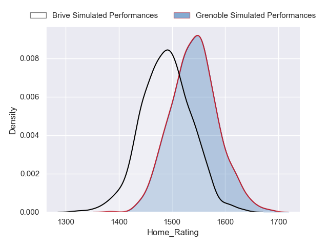
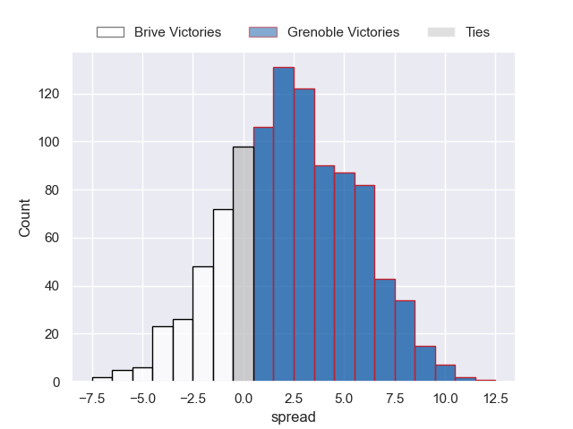
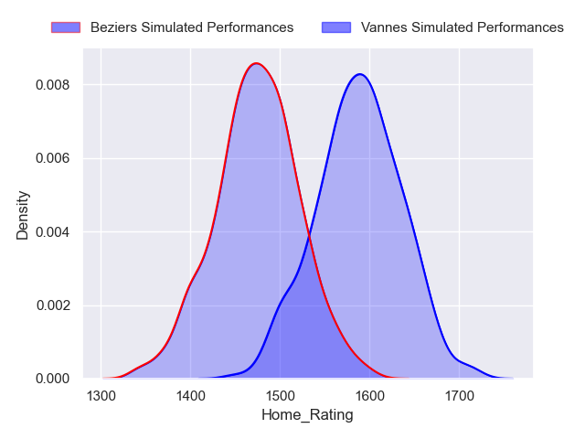
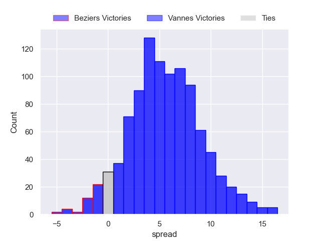

---  
title: "Pro D2 2023 Status"  
date: 2024-02-13 6:00:00 -0500  
categories: model review projection  
layout: article  
aside:  
    toc: true  
---
# Current Team Rankings

# Standings

## Current Standings

| Club                       |   Played |   Wins |   Point Differential |   Losing Bonus Points |   Try Bonus Points |   Competition Points |
|:---------------------------|---------:|-------:|---------------------:|----------------------:|-------------------:|---------------------:|
| Vannes                     |       19 |     12 |                  180 |                     3 |                  8 |                   61 |
| Beziers                    |       19 |     12 |                  130 |                     4 |                  6 |                   60 |
| Provence Rugby             |       19 |     13 |                   68 |                     1 |                  7 |                   60 |
| Mont-de-Marsan             |       19 |     11 |                   96 |                     5 |                  6 |                   55 |
| Nevers                     |       19 |     11 |                   56 |                     4 |                  6 |                   54 |
| Brive                      |       19 |     10 |                   38 |                     6 |                  4 |                   50 |
| Grenoble                   |       19 |     10 |                   36 |                     3 |                  5 |                   48 |
| Colomiers                  |       19 |      9 |                   38 |                     5 |                  2 |                   45 |
| Agen                       |       19 |      9 |                  -98 |                     2 |                  3 |                   43 |
| Aurillac                   |       19 |      9 |                  -95 |                     2 |                  2 |                   42 |
| Montauban                  |       19 |      9 |                  -99 |                     2 |                  3 |                   41 |
| Dax                        |       19 |      9 |                 -108 |                     2 |                  1 |                   41 |
| Soyaux-Angouleme           |       19 |      7 |                  -26 |                     6 |                  1 |                   37 |
| Valence Romans Drome Rugby |       19 |      7 |                   11 |                     5 |                  3 |                   36 |
| Biarritz Olympique         |       19 |      6 |                 -104 |                     4 |                  4 |                   32 |
| Rouen                      |       19 |      4 |                 -123 |                     7 |                  4 |                   29 |

## Projected Remaining Table

| Club                       |   Matches Remaining |   Wins |   Point Differential |   Losing Bonus Points |   Try Bonus Points |   Competition Points |
|:---------------------------|--------------------:|-------:|---------------------:|----------------------:|-------------------:|---------------------:|
| Vannes                     |                  11 |    9.4 |             55.446   |                   1.5 |                5.2 |                 44.5 |
| Mont-de-Marsan             |                  11 |    8.1 |             43.3148  |                   2.7 |                3.7 |                 38.9 |
| Nevers                     |                  11 |    7.9 |             33.19    |                   2.8 |                3.7 |                 38   |
| Provence Rugby             |                  11 |    7.5 |             22.461   |                   3.2 |                3.6 |                 36.8 |
| Beziers                    |                  11 |    7.1 |             17.2785  |                   3.4 |                3.5 |                 35.3 |
| Grenoble                   |                  11 |    6.8 |             20.6788  |                   3.5 |                4   |                 34.8 |
| Brive                      |                  11 |    6.8 |             23.6654  |                   3.6 |                1.7 |                 32.5 |
| Colomiers                  |                  11 |    5   |             -6.46907 |                   4.4 |                2.9 |                 27.3 |
| Valence Romans Drome Rugby |                  11 |    5   |             -7.49893 |                   4.4 |                2.5 |                 26.9 |
| Agen                       |                  11 |    4.4 |            -13.5144  |                   5   |                3.3 |                 25.7 |
| Dax                        |                  11 |    4.5 |            -20.7686  |                   4   |                1.7 |                 23.7 |
| Biarritz Olympique         |                  11 |    4.1 |            -21.3347  |                   4.5 |                2.5 |                 23.5 |
| Aurillac                   |                  11 |    3.5 |            -25.3212  |                   5.7 |                3.1 |                 22.8 |
| Montauban                  |                  11 |    2.6 |            -34.3145  |                   6.2 |                1.7 |                 18.5 |
| Soyaux-Angouleme           |                  11 |    2.7 |            -36.643   |                   5.7 |                1.1 |                 17.8 |
| Rouen                      |                  11 |    2.5 |            -50.1702  |                   4.6 |                2.5 |                 17.2 |

## Projected Total Table

| Club                       |   Total Matches |   Wins |   Point Differential |   Losing Bonus Points |   Try Bonus Points |   Competition Points |
|:---------------------------|----------------:|-------:|---------------------:|----------------------:|-------------------:|---------------------:|
| Vannes                     |              30 |   21.4 |            235.446   |                   4.5 |               13.2 |                105.5 |
| Provence Rugby             |              30 |   20.5 |             90.461   |                   4.2 |               10.6 |                 96.8 |
| Beziers                    |              30 |   19.1 |            147.279   |                   7.4 |                9.5 |                 95.3 |
| Mont-de-Marsan             |              30 |   19.1 |            139.315   |                   7.7 |                9.7 |                 93.9 |
| Nevers                     |              30 |   18.9 |             89.19    |                   6.8 |                9.7 |                 92   |
| Grenoble                   |              30 |   16.8 |             56.6788  |                   6.5 |                9   |                 82.8 |
| Brive                      |              30 |   16.8 |             61.6654  |                   9.6 |                5.7 |                 82.5 |
| Colomiers                  |              30 |   14   |             31.5309  |                   9.4 |                4.9 |                 72.3 |
| Agen                       |              30 |   13.4 |           -111.514   |                   7   |                6.3 |                 68.7 |
| Aurillac                   |              30 |   12.5 |           -120.321   |                   7.7 |                5.1 |                 64.8 |
| Dax                        |              30 |   13.5 |           -128.769   |                   6   |                2.7 |                 64.7 |
| Valence Romans Drome Rugby |              30 |   12   |              3.50107 |                   9.4 |                5.5 |                 62.9 |
| Montauban                  |              30 |   11.6 |           -133.314   |                   8.2 |                4.7 |                 59.5 |
| Biarritz Olympique         |              30 |   10.1 |           -125.335   |                   8.5 |                6.5 |                 55.5 |
| Soyaux-Angouleme           |              30 |    9.7 |            -62.643   |                  11.7 |                2.1 |                 54.8 |
| Rouen                      |              30 |    6.5 |           -173.17    |                  11.6 |                6.5 |                 46.2 |

# Completed Match Review

| Model | Percent Correct Predictions | Spread Error |
| ------ | ------ | ------ |
| Club Level | 75.0% | 11.0 |
| Player Level: Lineup | 76.3% | 11.3 |
| Player Level: Minutes | 75.7% | 11.0 |

# Future Predictions

## Week 20

### Grenoble V Brive on 2024/02/15

Average Margin: Grenoble by 2.6

Average Scoreline: 25-22

### Valence Romans Drome Rugby V Montauban on 2024/02/16

Average Margin: Valence Romans Drome Rugby by 5.3

Average Scoreline: 27-22

### Provence Rugby V Vannes on 2024/02/16

Average Margin: Provence Rugby by 0.7

Average Scoreline: 27-26

### Nevers V Agen on 2024/02/16

Average Margin: Nevers by 7.1

Average Scoreline: 26-19

### Aurillac V Colomiers on 2024/02/16

Average Margin: Aurillac by 1.0

Average Scoreline: 23-22

### Biarritz Olympique V Rouen on 2024/02/16

Average Margin: Biarritz Olympique by 5.9

Average Scoreline: 31-25

### Beziers V Mont-de-Marsan on 2024/02/16

Average Margin: Beziers by 2.2

Average Scoreline: 27-25

### Dax V Soyaux-Angouleme on 2024/02/16

Average Margin: Dax by 3.6

Average Scoreline: 25-21

## Week 21

### Vannes V Beziers on 2024/02/22

Average Margin: Vannes by 5.6

Average Scoreline: 27-22

### Agen V Grenoble on 2024/02/23

Average Margin: Agen by 0.4

Average Scoreline: 24-23

### Dax V Aurillac on 2024/02/23

Average Margin: Dax by 3.3

Average Scoreline: 25-21

### Rouen V Montauban on 2024/02/23

Average Margin: Rouen by 2.1

Average Scoreline: 25-23

### Mont-de-Marsan V Nevers on 2024/02/23

Average Margin: Mont-de-Marsan by 4.1

Average Scoreline: 24-20

### Brive V Valence Romans Drome Rugby on 2024/02/23

Average Margin: Brive by 6.7

Average Scoreline: 25-18

### Colomiers V Biarritz Olympique on 2024/02/23

Average Margin: Colomiers by 5.7

Average Scoreline: 30-24

### Soyaux-Angouleme V Provence Rugby on 2024/02/23

Average Margin: Provence Rugby by 0.3

Average Scoreline: 24-24

## Week 22

### Provence Rugby V Colomiers on 2024/03/01

Average Margin: Provence Rugby by 4.5

Average Scoreline: 30-25

### Aurillac V Nevers on 2024/03/01

Average Margin: Nevers by 1.3

Average Scoreline: 25-23

### Beziers V Brive on 2024/03/01

Average Margin: Beziers by 2.6

Average Scoreline: 25-23

### Grenoble V Rouen on 2024/03/01

Average Margin: Grenoble by 9.1

Average Scoreline: 34-25

### Biarritz Olympique V Vannes on 2024/03/01

Average Margin: Vannes by 2.7

Average Scoreline: 23-20

### Valence Romans Drome Rugby V Dax on 2024/03/01

Average Margin: Valence Romans Drome Rugby by 4.5

Average Scoreline: 29-24

### Mont-de-Marsan V Soyaux-Angouleme on 2024/03/01

Average Margin: Mont-de-Marsan by 8.8

Average Scoreline: 30-21

### Montauban V Agen on 2024/03/01

Average Margin: Montauban by 1.6

Average Scoreline: 29-27

## Week 23

### Vannes V Grenoble on 2024/03/08

Average Margin: Vannes by 5.7

Average Scoreline: 30-25

### Nevers V Provence Rugby on 2024/03/08

Average Margin: Nevers by 4.3

Average Scoreline: 23-18

### Biarritz Olympique V Montauban on 2024/03/08

Average Margin: Biarritz Olympique by 4.4

Average Scoreline: 25-20

### Brive V Agen on 2024/03/08

Average Margin: Brive by 7.1

Average Scoreline: 29-22

### Soyaux-Angouleme V Valence Romans Drome Rugby on 2024/03/08

Average Margin: Soyaux-Angouleme by 2.0

Average Scoreline: 24-22

### Rouen V Aurillac on 2024/03/08

Average Margin: Rouen by 1.2

Average Scoreline: 24-23

### Dax V Beziers on 2024/03/08

Average Margin: Beziers by 0.7

Average Scoreline: 23-22

### Colomiers V Mont-de-Marsan on 2024/03/08

Average Margin: Colomiers by 0.5

Average Scoreline: 25-24

## Week 24

### Vannes V Colomiers on 2024/03/29

Average Margin: Vannes by 7.3

Average Scoreline: 30-23

### Grenoble V Soyaux-Angouleme on 2024/03/29

Average Margin: Grenoble by 7.3

Average Scoreline: 33-25

### Beziers V Biarritz Olympique on 2024/03/29

Average Margin: Beziers by 7.1

Average Scoreline: 29-22

### Agen V Rouen on 2024/03/29

Average Margin: Agen by 6.5

Average Scoreline: 30-23

### Montauban V Dax on 2024/03/29

Average Margin: Montauban by 2.6

Average Scoreline: 26-23

### Aurillac V Provence Rugby on 2024/03/29

Average Margin: Provence Rugby by 0.3

Average Scoreline: 23-23

### Valence Romans Drome Rugby V Nevers on 2024/03/29

Average Margin: Valence Romans Drome Rugby by 0.1

Average Scoreline: 25-25

### Mont-de-Marsan V Brive on 2024/03/29

Average Margin: Mont-de-Marsan by 4.0

Average Scoreline: 23-19

## Week 25

### Nevers V Grenoble on 2024/04/05

Average Margin: Nevers by 4.1

Average Scoreline: 27-23

### Soyaux-Angouleme V Vannes on 2024/04/05

Average Margin: Vannes by 2.9

Average Scoreline: 28-25

### Colomiers V Agen on 2024/04/05

Average Margin: Colomiers by 4.8

Average Scoreline: 30-25

### Biarritz Olympique V Aurillac on 2024/04/05

Average Margin: Biarritz Olympique by 3.7

Average Scoreline: 27-24

### Rouen V Beziers on 2024/04/05

Average Margin: Beziers by 2.9

Average Scoreline: 23-20

### Dax V Brive on 2024/04/05

Average Margin: Brive by 1.4

Average Scoreline: 24-22

### Provence Rugby V Montauban on 2024/04/05

Average Margin: Provence Rugby by 7.8

Average Scoreline: 29-21

### Valence Romans Drome Rugby V Mont-de-Marsan on 2024/04/05

Average Margin: Mont-de-Marsan by 0.6

Average Scoreline: 27-26

## Week 26

### Agen V Soyaux-Angouleme on 2024/04/12

Average Margin: Agen by 4.5

Average Scoreline: 27-23

### Vannes V Dax on 2024/04/12

Average Margin: Vannes by 9.6

Average Scoreline: 30-20

### Beziers V Valence Romans Drome Rugby on 2024/04/12

Average Margin: Beziers by 6.0

Average Scoreline: 28-22

### Mont-de-Marsan V Biarritz Olympique on 2024/04/12

Average Margin: Mont-de-Marsan by 8.3

Average Scoreline: 32-24

### Brive V Colomiers on 2024/04/12

Average Margin: Brive by 5.6

Average Scoreline: 26-20

### Rouen V Provence Rugby on 2024/04/12

Average Margin: Provence Rugby by 2.4

Average Scoreline: 23-21

### Grenoble V Aurillac on 2024/04/12

Average Margin: Grenoble by 7.1

Average Scoreline: 37-30

### Montauban V Nevers on 2024/04/12

Average Margin: Nevers by 1.9

Average Scoreline: 25-23

## Week 27

### Provence Rugby V Mont-de-Marsan on 2024/04/19

Average Margin: Provence Rugby by 1.9

Average Scoreline: 27-25

### Soyaux-Angouleme V Brive on 2024/04/19

Average Margin: Brive by 1.4

Average Scoreline: 25-24

### Dax V Rouen on 2024/04/19

Average Margin: Dax by 5.5

Average Scoreline: 26-20

### Biarritz Olympique V Grenoble on 2024/04/19

Average Margin: Grenoble by 0.0

Average Scoreline: 27-27

### Montauban V Vannes on 2024/04/19

Average Margin: Vannes by 3.8

Average Scoreline: 26-22

### Valence Romans Drome Rugby V Agen on 2024/04/19

Average Margin: Valence Romans Drome Rugby by 3.7

Average Scoreline: 29-25

### Aurillac V Beziers on 2024/04/19

Average Margin: Beziers by 0.9

Average Scoreline: 25-24

### Nevers V Colomiers on 2024/04/19

Average Margin: Nevers by 5.5

Average Scoreline: 27-21

## Week 28

### Vannes V Rouen on 2024/04/26

Average Margin: Vannes by 11.6

Average Scoreline: 38-26

### Colomiers V Montauban on 2024/04/26

Average Margin: Colomiers by 6.6

Average Scoreline: 30-24

### Agen V Biarritz Olympique on 2024/04/26

Average Margin: Agen by 3.9

Average Scoreline: 30-26

### Nevers V Soyaux-Angouleme on 2024/04/26

Average Margin: Nevers by 8.0

Average Scoreline: 30-22

### Brive V Aurillac on 2024/04/26

Average Margin: Brive by 8.0

Average Scoreline: 29-21

### Mont-de-Marsan V Dax on 2024/04/26

Average Margin: Mont-de-Marsan by 8.7

Average Scoreline: 28-20

### Grenoble V Beziers on 2024/04/26

Average Margin: Grenoble by 3.2

Average Scoreline: 35-32

### Provence Rugby V Valence Romans Drome Rugby on 2024/04/26

Average Margin: Provence Rugby by 5.7

Average Scoreline: 28-23

## Week 29

### Rouen V Soyaux-Angouleme on 2024/05/10

Average Margin: Rouen by 1.2

Average Scoreline: 27-26

### Vannes V Brive on 2024/05/10

Average Margin: Vannes by 5.0

Average Scoreline: 27-22

### Beziers V Nevers on 2024/05/10

Average Margin: Beziers by 2.8

Average Scoreline: 27-24

### Biarritz Olympique V Provence Rugby on 2024/05/10

Average Margin: Biarritz Olympique by 0.1

Average Scoreline: 24-24

### Dax V Agen on 2024/05/10

Average Margin: Dax by 2.5

Average Scoreline: 31-29

### Montauban V Mont-de-Marsan on 2024/05/10

Average Margin: Mont-de-Marsan by 2.7

Average Scoreline: 26-24

### Grenoble V Colomiers on 2024/05/10

Average Margin: Grenoble by 4.8

Average Scoreline: 35-30

### Valence Romans Drome Rugby V Aurillac on 2024/05/10

Average Margin: Valence Romans Drome Rugby by 4.5

Average Scoreline: 28-24

## Week 30

### Agen V Vannes on 2024/05/17

Average Margin: Vannes by 2.0

Average Scoreline: 28-26

### Brive V Biarritz Olympique on 2024/05/17

Average Margin: Brive by 7.7

Average Scoreline: 31-23

### Soyaux-Angouleme V Beziers on 2024/05/17

Average Margin: Beziers by 0.8

Average Scoreline: 28-28

### Nevers V Dax on 2024/05/17

Average Margin: Nevers by 8.0

Average Scoreline: 29-21

### Colomiers V Valence Romans Drome Rugby on 2024/05/17

Average Margin: Colomiers by 4.7

Average Scoreline: 26-21

### Mont-de-Marsan V Rouen on 2024/05/17

Average Margin: Mont-de-Marsan by 10.7

Average Scoreline: 38-27

### Aurillac V Montauban on 2024/05/17

Average Margin: Aurillac by 4.0

Average Scoreline: 29-25

### Provence Rugby V Grenoble on 2024/05/17

Average Margin: Provence Rugby by 3.2

Average Scoreline: 29-25

