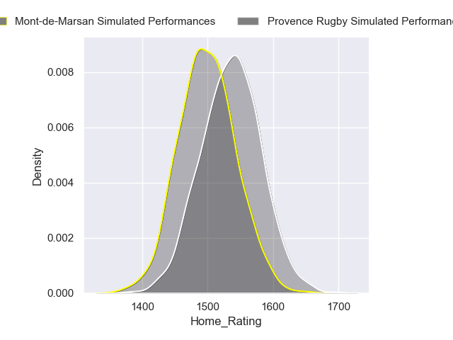
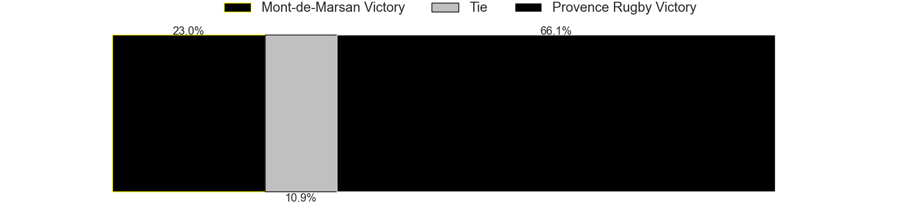
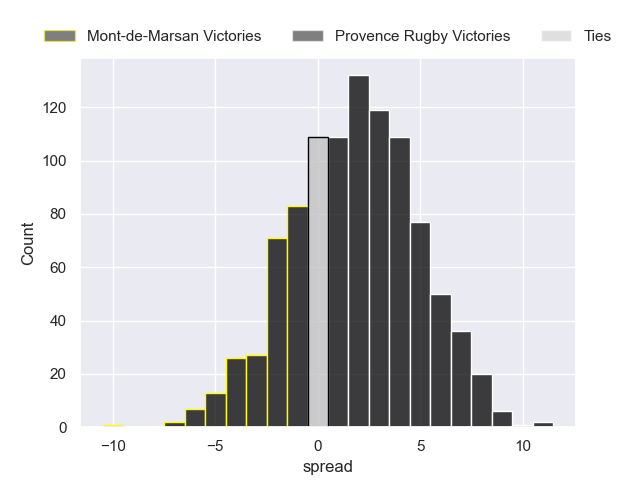
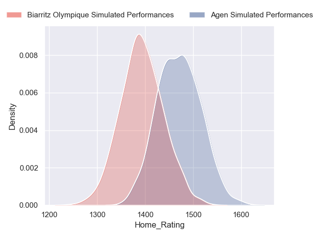
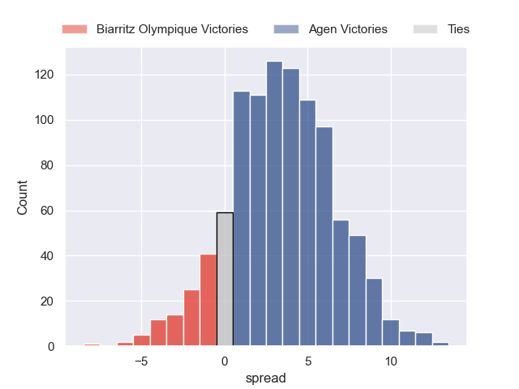

---  
title: "Pro D2 2023 Status"  
date: 2024-04-15 6:00:00 -0500  
categories: model review projection  
layout: article  
aside:  
    toc: true  
---
# Current Team Rankings

# Standings

## Current Standings

| Club                       |   Played |   Wins |   Point Differential |   Losing Bonus Points |   Try Bonus Points |   Competition Points |
|:---------------------------|---------:|-------:|---------------------:|----------------------:|-------------------:|---------------------:|
| Vannes                     |       26 |     16 |                  231 |                     6 |                 11 |                   81 |
| Beziers                    |       26 |     16 |                  119 |                     5 |                  9 |                   80 |
| Provence Rugby             |       26 |     17 |                   77 |                     3 |                  9 |                   80 |
| Grenoble                   |       26 |     16 |                   95 |                     3 |                  8 |                   75 |
| Mont-de-Marsan             |       26 |     14 |                  149 |                     7 |                  9 |                   74 |
| Brive                      |       26 |     13 |                   55 |                     6 |                  8 |                   68 |
| Nevers                     |       26 |     13 |                   46 |                     8 |                  6 |                   66 |
| Dax                        |       26 |     14 |                  -79 |                     2 |                  4 |                   64 |
| Colomiers                  |       26 |     12 |                   49 |                     6 |                  4 |                   60 |
| Agen                       |       26 |     12 |                 -105 |                     4 |                  4 |                   58 |
| Biarritz Olympique         |       26 |     10 |                 -135 |                     5 |                  9 |                   54 |
| Valence Romans Drome Rugby |       26 |     11 |                   -3 |                     5 |                  4 |                   53 |
| Soyaux-Angouleme           |       26 |     11 |                  -55 |                     7 |                  1 |                   52 |
| Aurillac                   |       26 |     11 |                 -169 |                     4 |                  2 |                   52 |
| Rouen                      |       26 |      8 |                 -114 |                     8 |                  6 |                   48 |
| Montauban                  |       26 |     10 |                 -161 |                     4 |                  3 |                   47 |

## Projected Remaining Table

| Club                       |   Matches Remaining |   Wins |   Point Differential |   Losing Bonus Points |   Try Bonus Points |   Competition Points |
|:---------------------------|--------------------:|-------:|---------------------:|----------------------:|-------------------:|---------------------:|
| Vannes                     |                   4 |    3.6 |            22.314    |                   0.4 |                2.1 |                 17   |
| Mont-de-Marsan             |                   4 |    3.1 |            18.6231   |                   0.8 |                1.5 |                 14.9 |
| Provence Rugby             |                   4 |    3   |             9.72822  |                   1   |                1.9 |                 14.9 |
| Nevers                     |                   4 |    3   |            14.0763   |                   0.9 |                1.4 |                 14.4 |
| Grenoble                   |                   4 |    2.7 |             7.54916  |                   1.3 |                1.6 |                 13.5 |
| Brive                      |                   4 |    2.6 |            11.9814   |                   1.1 |                0.9 |                 12.5 |
| Beziers                    |                   4 |    1.9 |            -1.07981  |                   1.9 |                1.4 |                 10.9 |
| Colomiers                  |                   4 |    2   |             2.23134  |                   1.5 |                1.1 |                 10.7 |
| Valence Romans Drome Rugby |                   4 |    2   |            -0.595017 |                   1.5 |                1.1 |                 10.4 |
| Dax                        |                   4 |    1.9 |            -4.139    |                   1.2 |                1.2 |                  9.9 |
| Agen                       |                   4 |    1.3 |            -6.58097  |                   2.3 |                1.1 |                  8.7 |
| Aurillac                   |                   4 |    1.4 |           -10.56     |                   1.6 |                0.8 |                  8   |
| Soyaux-Angouleme           |                   4 |    1.3 |            -8.12808  |                   2.1 |                0.3 |                  7.7 |
| Biarritz Olympique         |                   4 |    1.1 |           -11.3371   |                   2.2 |                0.9 |                  7.5 |
| Rouen                      |                   4 |    0.7 |           -24.2271   |                   1.3 |                1   |                  5.2 |
| Montauban                  |                   4 |    0.3 |           -19.8564   |                   2.6 |                0.5 |                  4.3 |

## Projected Total Table

| Club                       |   Total Matches |   Wins |   Point Differential |   Losing Bonus Points |   Try Bonus Points |   Competition Points |
|:---------------------------|----------------:|-------:|---------------------:|----------------------:|-------------------:|---------------------:|
| Vannes                     |              30 |   19.6 |            253.314   |                   6.4 |               13.1 |                 98   |
| Provence Rugby             |              30 |   20   |             86.7282  |                   4   |               10.9 |                 94.9 |
| Beziers                    |              30 |   17.9 |            117.92    |                   6.9 |               10.4 |                 90.9 |
| Mont-de-Marsan             |              30 |   17.1 |            167.623   |                   7.8 |               10.5 |                 88.9 |
| Grenoble                   |              30 |   18.7 |            102.549   |                   4.3 |                9.6 |                 88.5 |
| Brive                      |              30 |   15.6 |             66.9814  |                   7.1 |                8.9 |                 80.5 |
| Nevers                     |              30 |   16   |             60.0763  |                   8.9 |                7.4 |                 80.4 |
| Dax                        |              30 |   15.9 |            -83.139   |                   3.2 |                5.2 |                 73.9 |
| Colomiers                  |              30 |   14   |             51.2313  |                   7.5 |                5.1 |                 70.7 |
| Agen                       |              30 |   13.3 |           -111.581   |                   6.3 |                5.1 |                 66.7 |
| Valence Romans Drome Rugby |              30 |   13   |             -3.59502 |                   6.5 |                5.1 |                 63.4 |
| Biarritz Olympique         |              30 |   11.1 |           -146.337   |                   7.2 |                9.9 |                 61.5 |
| Aurillac                   |              30 |   12.4 |           -179.56    |                   5.6 |                2.8 |                 60   |
| Soyaux-Angouleme           |              30 |   12.3 |            -63.1281  |                   9.1 |                1.3 |                 59.7 |
| Rouen                      |              30 |    8.7 |           -138.227   |                   9.3 |                7   |                 53.2 |
| Montauban                  |              30 |   10.3 |           -180.856   |                   6.6 |                3.5 |                 51.3 |

# Completed Match Review

| Model | Percent Correct Predictions | Spread Error |
| ------ | ------ | ------ |
| Club Level | 76.0% | 11.2 |
| Player Level: Lineup | 76.9% | 11.2 |
| Player Level: Minutes | 76.9% | 11.0 |

# Future Predictions

## Week 27

### Provence Rugby V Mont-de-Marsan on 2024/04/18

Average Margin: Provence Rugby by 1.8

Average Scoreline: 32-30

### Valence Romans Drome Rugby V Agen on 2024/04/19

Average Margin: Valence Romans Drome Rugby by 4.1

Average Scoreline: 29-25

### Biarritz Olympique V Grenoble on 2024/04/19

Average Margin: Grenoble by 0.7

Average Scoreline: 34-33

### Dax V Rouen on 2024/04/19

Average Margin: Dax by 5.6

Average Scoreline: 27-21

### Aurillac V Beziers on 2024/04/19

Average Margin: Beziers by 0.7

Average Scoreline: 31-30

### Soyaux-Angouleme V Brive on 2024/04/19

Average Margin: Brive by 0.6

Average Scoreline: 23-22

### Nevers V Colomiers on 2024/04/19

Average Margin: Nevers by 4.5

Average Scoreline: 25-21

### Montauban V Vannes on 2024/04/19

Average Margin: Vannes by 4.7

Average Scoreline: 32-28

## Week 28

### Agen V Biarritz Olympique on 2024/04/25

Average Margin: Agen by 3.5

Average Scoreline: 30-26

### Brive V Aurillac on 2024/04/26

Average Margin: Brive by 8.7

Average Scoreline: 27-18

### Grenoble V Beziers on 2024/04/26

Average Margin: Grenoble by 4.3

Average Scoreline: 40-35

### Colomiers V Montauban on 2024/04/26

Average Margin: Colomiers by 7.4

Average Scoreline: 28-21

### Vannes V Rouen on 2024/04/26

Average Margin: Vannes by 10.6

Average Scoreline: 30-19

### Mont-de-Marsan V Dax on 2024/04/26

Average Margin: Mont-de-Marsan by 7.3

Average Scoreline: 37-29

### Nevers V Soyaux-Angouleme on 2024/04/26

Average Margin: Nevers by 6.5

Average Scoreline: 26-19

### Provence Rugby V Valence Romans Drome Rugby on 2024/04/26

Average Margin: Provence Rugby by 5.6

Average Scoreline: 31-25

## Week 29

### Beziers V Nevers on 2024/05/10

Average Margin: Beziers by 3.1

Average Scoreline: 28-25

### Rouen V Soyaux-Angouleme on 2024/05/10

Average Margin: Rouen by 1.6

Average Scoreline: 28-26

### Vannes V Brive on 2024/05/10

Average Margin: Vannes by 4.9

Average Scoreline: 28-23

### Grenoble V Colomiers on 2024/05/10

Average Margin: Grenoble by 5.2

Average Scoreline: 41-36

### Biarritz Olympique V Provence Rugby on 2024/05/10

Average Margin: Biarritz Olympique by 0.4

Average Scoreline: 31-31

### Valence Romans Drome Rugby V Aurillac on 2024/05/10

Average Margin: Valence Romans Drome Rugby by 5.4

Average Scoreline: 30-24

### Dax V Agen on 2024/05/10

Average Margin: Dax by 3.7

Average Scoreline: 29-25

### Montauban V Mont-de-Marsan on 2024/05/10

Average Margin: Mont-de-Marsan by 3.5

Average Scoreline: 31-28

## Week 30

### Nevers V Dax on 2024/05/17

Average Margin: Nevers by 6.2

Average Scoreline: 27-21

### Aurillac V Montauban on 2024/05/17

Average Margin: Aurillac by 4.3

Average Scoreline: 28-24

### Mont-de-Marsan V Rouen on 2024/05/17

Average Margin: Mont-de-Marsan by 9.6

Average Scoreline: 36-26

### Brive V Biarritz Olympique on 2024/05/17

Average Margin: Brive by 7.5

Average Scoreline: 32-24

### Provence Rugby V Grenoble on 2024/05/17

Average Margin: Provence Rugby by 2.6

Average Scoreline: 40-37

### Colomiers V Valence Romans Drome Rugby on 2024/05/17

Average Margin: Colomiers by 4.5

Average Scoreline: 31-27

### Soyaux-Angouleme V Beziers on 2024/05/17

Average Margin: Soyaux-Angouleme by 0.6

Average Scoreline: 32-31

### Agen V Vannes on 2024/05/17

Average Margin: Vannes by 2.2

Average Scoreline: 35-33

