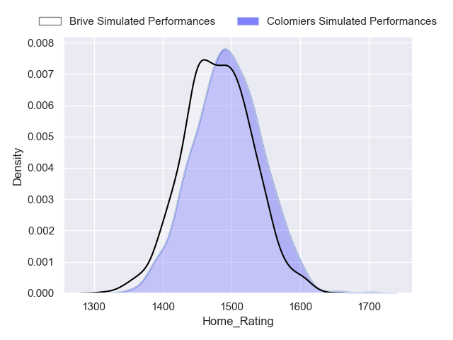
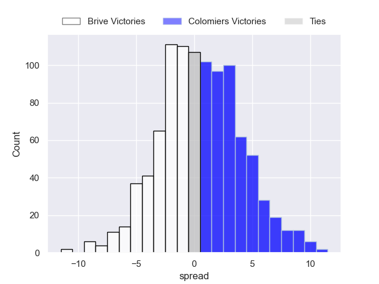
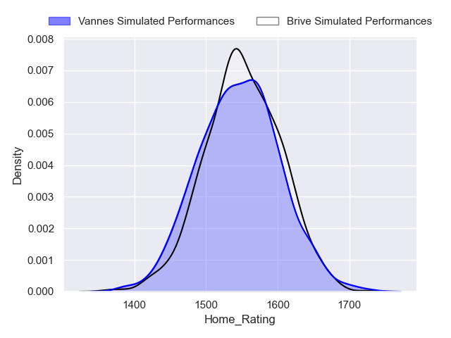
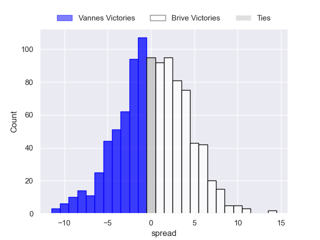

---  
title: "Pro D2 2023 Status"  
date: 2023-12-04 6:00:00 -0500  
categories: model review projection  
layout: article  
aside:  
    toc: true  
---
# Current Team Rankings

# Standings

## Current Standings

| Club                       |   Played |   Wins |   Point Differential |   Losing Bonus Points |   Try Bonus Points |   Competition Points |
|:---------------------------|---------:|-------:|---------------------:|----------------------:|-------------------:|---------------------:|
| Vannes                     |       12 |      9 |                  166 |                     2 |                  5 |                   45 |
| Provence Rugby             |       12 |      8 |                   74 |                     1 |                  4 |                   37 |
| Mont-de-Marsan             |       12 |      7 |                   65 |                     4 |                  4 |                   36 |
| Beziers                    |       12 |      6 |                   52 |                     3 |                  4 |                   33 |
| Grenoble                   |       12 |      7 |                    7 |                     2 |                  3 |                   33 |
| Nevers                     |       12 |      6 |                   65 |                     4 |                  4 |                   32 |
| Brive                      |       12 |      6 |                   -7 |                     3 |                  3 |                   30 |
| Agen                       |       12 |      6 |                  -67 |                     1 |                  3 |                   30 |
| Aurillac                   |       12 |      6 |                  -13 |                     1 |                  1 |                   28 |
| Valence Romans Drome Rugby |       12 |      5 |                   34 |                     2 |                  3 |                   25 |
| Colomiers                  |       12 |      5 |                  -21 |                     2 |                  1 |                   25 |
| Montauban                  |       12 |      6 |                  -85 |                     0 |                  1 |                   25 |
| Dax                        |       12 |      5 |                  -72 |                     2 |                  0 |                   24 |
| Biarritz Olympique         |       12 |      5 |                  -86 |                     1 |                  3 |                   24 |
| Soyaux-Angouleme           |       12 |      3 |                  -29 |                     5 |                  1 |                   20 |
| Rouen                      |       12 |      2 |                  -83 |                     5 |                  3 |                   18 |

## Projected Remaining Table

| Club                       |   Matches Remaining |   Wins |   Point Differential |   Losing Bonus Points |   Try Bonus Points |   Competition Points |
|:---------------------------|--------------------:|-------:|---------------------:|----------------------:|-------------------:|---------------------:|
| Vannes                     |                  18 |   15.5 |            105.358   |                   2.4 |               14.9 |                 79.2 |
| Mont-de-Marsan             |                  18 |   13   |             61.5362  |                   4.4 |               12.3 |                 68.8 |
| Nevers                     |                  18 |   12.1 |             44.0823  |                   5.3 |               11.3 |                 65.1 |
| Brive                      |                  18 |   11.1 |             35.5876  |                   5.8 |               10.3 |                 60.7 |
| Grenoble                   |                  18 |   11   |             30.5918  |                   5.8 |               10.3 |                 60.2 |
| Provence Rugby             |                  18 |   10.6 |             20.6352  |                   6.2 |                9.8 |                 58.4 |
| Beziers                    |                  18 |    9.4 |              3.1714  |                   7.3 |                8.4 |                 53.4 |
| Agen                       |                  18 |    8.4 |             -7.42228 |                   7.5 |                7.7 |                 48.7 |
| Valence Romans Drome Rugby |                  18 |    8.3 |             -7.45872 |                   8.2 |                7.4 |                 48.6 |
| Colomiers                  |                  18 |    8.5 |            -13.5089  |                   6.6 |                7.8 |                 48.3 |
| Dax                        |                  18 |    7.3 |            -33.0771  |                   6.7 |                6.5 |                 42.5 |
| Aurillac                   |                  18 |    6.7 |            -34.2166  |                   8.2 |                5.8 |                 40.7 |
| Biarritz Olympique         |                  18 |    6.6 |            -33.3371  |                   8.2 |                5.8 |                 40.6 |
| Soyaux-Angouleme           |                  18 |    5.9 |            -47.9525  |                   8.1 |                5.2 |                 37.1 |
| Montauban                  |                  18 |    5.7 |            -42.0139  |                   9.3 |                4.8 |                 36.7 |
| Rouen                      |                  18 |    3.8 |            -81.9754  |                   8.3 |                3.2 |                 26.7 |

## Projected Total Table

| Club                       |   Total Matches |   Wins |   Point Differential |   Losing Bonus Points |   Try Bonus Points |   Competition Points |
|:---------------------------|----------------:|-------:|---------------------:|----------------------:|-------------------:|---------------------:|
| Vannes                     |              30 |   24.5 |             271.358  |                   4.4 |               19.9 |                124.2 |
| Mont-de-Marsan             |              30 |   20   |             126.536  |                   8.4 |               16.3 |                104.8 |
| Nevers                     |              30 |   18.1 |             109.082  |                   9.3 |               15.3 |                 97.1 |
| Provence Rugby             |              30 |   18.6 |              94.6352 |                   7.2 |               13.8 |                 95.4 |
| Grenoble                   |              30 |   18   |              37.5918 |                   7.8 |               13.3 |                 93.2 |
| Brive                      |              30 |   17.1 |              28.5876 |                   8.8 |               13.3 |                 90.7 |
| Beziers                    |              30 |   15.4 |              55.1714 |                  10.3 |               12.4 |                 86.4 |
| Agen                       |              30 |   14.4 |             -74.4223 |                   8.5 |               10.7 |                 78.7 |
| Valence Romans Drome Rugby |              30 |   13.3 |              26.5413 |                  10.2 |               10.4 |                 73.6 |
| Colomiers                  |              30 |   13.5 |             -34.5089 |                   8.6 |                8.8 |                 73.3 |
| Aurillac                   |              30 |   12.7 |             -47.2166 |                   9.2 |                6.8 |                 68.7 |
| Dax                        |              30 |   12.3 |            -105.077  |                   8.7 |                6.5 |                 66.5 |
| Biarritz Olympique         |              30 |   11.6 |            -119.337  |                   9.2 |                8.8 |                 64.6 |
| Montauban                  |              30 |   11.7 |            -127.014  |                   9.3 |                5.8 |                 61.7 |
| Soyaux-Angouleme           |              30 |    8.9 |             -76.9525 |                  13.1 |                6.2 |                 57.1 |
| Rouen                      |              30 |    5.8 |            -164.975  |                  13.3 |                6.2 |                 44.7 |

# Completed Match Review

| Model | Percent Correct Predictions | Spread Error |
| ------ | ------ | ------ |
| Club Level | 76.0% | 11.1 |
| Player Level: Lineup | 74.0% | 11.4 |
| Player Level: Minutes | 74.0% | 11.1 |

# Future Predictions

## Week 13

### Colomiers V Brive on 2023/12/07

Average Margin: Colomiers by 0.7

### Vannes V Provence Rugby on 2023/12/08

Average Margin: Vannes by 7.4

### Montauban V Aurillac on 2023/12/08

Average Margin: Montauban by 2.5

### Nevers V Mont-de-Marsan on 2023/12/08

Average Margin: Nevers by 2.8

### Rouen V Grenoble on 2023/12/08

Average Margin: Grenoble by 2.4

### Soyaux-Angouleme V Agen on 2023/12/08

Average Margin: Soyaux-Angouleme by 1.6

### Biarritz Olympique V Beziers on 2023/12/08

Average Margin: Biarritz Olympique by 1.6

### Dax V Valence Romans Drome Rugby on 2023/12/08

Average Margin: Dax by 1.9

## Week 14

### Brive V Vannes on 2023/12/14

Average Margin: Brive by 0.1

### Aurillac V Dax on 2023/12/15

Average Margin: Aurillac by 3.5

### Grenoble V Nevers on 2023/12/15

Average Margin: Grenoble by 2.4

### Provence Rugby V Biarritz Olympique on 2023/12/15

Average Margin: Provence Rugby by 6.3

### Soyaux-Angouleme V Rouen on 2023/12/15

Average Margin: Soyaux-Angouleme by 5.1

### Mont-de-Marsan V Colomiers on 2023/12/15

Average Margin: Mont-de-Marsan by 7.2

### Valence Romans Drome Rugby V Beziers on 2023/12/15

Average Margin: Valence Romans Drome Rugby by 2.5

### Agen V Montauban on 2023/12/15

Average Margin: Agen by 5.1

## Week 15

### Biarritz Olympique V Brive on 2024/01/05

Average Margin: Brive by 0.3

### Beziers V Aurillac on 2024/01/05

Average Margin: Beziers by 5.4

### Grenoble V Provence Rugby on 2024/01/05

Average Margin: Grenoble by 3.3

### Vannes V Soyaux-Angouleme on 2024/01/05

Average Margin: Vannes by 11.1

### Colomiers V Nevers on 2024/01/05

Average Margin: Colomiers by 0.1

### Rouen V Mont-de-Marsan on 2024/01/05

Average Margin: Mont-de-Marsan by 4.0

### Dax V Montauban on 2024/01/05

Average Margin: Dax by 3.7

### Agen V Valence Romans Drome Rugby on 2024/01/05

Average Margin: Agen by 3.2

## Week 16

### Provence Rugby V Dax on 2024/01/12

Average Margin: Provence Rugby by 6.8

### Colomiers V Beziers on 2024/01/12

Average Margin: Colomiers by 2.5

### Nevers V Biarritz Olympique on 2024/01/12

Average Margin: Nevers by 7.3

### Valence Romans Drome Rugby V Vannes on 2024/01/12

Average Margin: Vannes by 2.6

### Mont-de-Marsan V Agen on 2024/01/12

Average Margin: Mont-de-Marsan by 7.1

### Aurillac V Soyaux-Angouleme on 2024/01/12

Average Margin: Aurillac by 4.2

### Brive V Rouen on 2024/01/12

Average Margin: Brive by 9.7

### Montauban V Grenoble on 2024/01/12

Average Margin: Grenoble by 0.5

## Week 17

### Beziers V Provence Rugby on 2024/01/19

Average Margin: Beziers by 2.5

### Biarritz Olympique V Valence Romans Drome Rugby on 2024/01/19

Average Margin: Biarritz Olympique by 2.1

### Rouen V Nevers on 2024/01/19

Average Margin: Nevers by 3.5

### Brive V Montauban on 2024/01/19

Average Margin: Brive by 7.8

### Grenoble V Dax on 2024/01/19

Average Margin: Grenoble by 6.9

### Soyaux-Angouleme V Colomiers on 2024/01/19

Average Margin: Soyaux-Angouleme by 1.4

### Agen V Aurillac on 2024/01/19

Average Margin: Agen by 4.4

### Vannes V Mont-de-Marsan on 2024/01/19

Average Margin: Vannes by 5.5

## Week 18

### Montauban V Soyaux-Angouleme on 2024/01/26

Average Margin: Montauban by 3.3

### Nevers V Vannes on 2024/01/26

Average Margin: Nevers by 0.7

### Valence Romans Drome Rugby V Grenoble on 2024/01/26

Average Margin: Valence Romans Drome Rugby by 1.1

### Dax V Biarritz Olympique on 2024/01/26

Average Margin: Dax by 2.9

### Provence Rugby V Brive on 2024/01/26

Average Margin: Provence Rugby by 2.8

### Aurillac V Mont-de-Marsan on 2024/01/26

Average Margin: Mont-de-Marsan by 1.5

### Beziers V Agen on 2024/01/26

Average Margin: Beziers by 4.3

### Colomiers V Rouen on 2024/01/26

Average Margin: Colomiers by 6.8

## Week 19

### Montauban V Beziers on 2024/02/09

Average Margin: Montauban by 0.6

### Mont-de-Marsan V Grenoble on 2024/02/09

Average Margin: Mont-de-Marsan by 4.8

### Soyaux-Angouleme V Biarritz Olympique on 2024/02/09

Average Margin: Soyaux-Angouleme by 2.4

### Brive V Nevers on 2024/02/09

Average Margin: Brive by 2.9

### Colomiers V Dax on 2024/02/09

Average Margin: Colomiers by 4.6

### Rouen V Valence Romans Drome Rugby on 2024/02/09

Average Margin: Valence Romans Drome Rugby by 0.3

### Vannes V Aurillac on 2024/02/09

Average Margin: Vannes by 10.2

### Agen V Provence Rugby on 2024/02/09

Average Margin: Agen by 1.2

## Week 20

### Beziers V Mont-de-Marsan on 2024/02/16

Average Margin: Beziers by 0.6

### Valence Romans Drome Rugby V Montauban on 2024/02/16

Average Margin: Valence Romans Drome Rugby by 5.2

### Dax V Soyaux-Angouleme on 2024/02/16

Average Margin: Dax by 3.9

### Provence Rugby V Vannes on 2024/02/16

Average Margin: Vannes by 0.5

### Aurillac V Colomiers on 2024/02/16

Average Margin: Aurillac by 2.5

### Nevers V Agen on 2024/02/16

Average Margin: Nevers by 6.5

### Grenoble V Brive on 2024/02/16

Average Margin: Grenoble by 3.0

### Biarritz Olympique V Rouen on 2024/02/16

Average Margin: Biarritz Olympique by 6.1

## Week 21

### Dax V Aurillac on 2024/02/23

Average Margin: Dax by 3.2

### Soyaux-Angouleme V Provence Rugby on 2024/02/23

Average Margin: Provence Rugby by 0.6

### Agen V Grenoble on 2024/02/23

Average Margin: Agen by 1.1

### Rouen V Montauban on 2024/02/23

Average Margin: Rouen by 1.6

### Colomiers V Biarritz Olympique on 2024/02/23

Average Margin: Colomiers by 4.4

### Mont-de-Marsan V Nevers on 2024/02/23

Average Margin: Mont-de-Marsan by 3.9

### Vannes V Beziers on 2024/02/23

Average Margin: Vannes by 8.1

### Brive V Valence Romans Drome Rugby on 2024/02/23

Average Margin: Brive by 5.9

## Week 22

### Aurillac V Nevers on 2024/03/01

Average Margin: Nevers by 1.0

### Provence Rugby V Colomiers on 2024/03/01

Average Margin: Provence Rugby by 5.4

### Biarritz Olympique V Vannes on 2024/03/01

Average Margin: Vannes by 3.3

### Montauban V Agen on 2024/03/01

Average Margin: Montauban by 1.6

### Grenoble V Rouen on 2024/03/01

Average Margin: Grenoble by 9.2

### Mont-de-Marsan V Soyaux-Angouleme on 2024/03/01

Average Margin: Mont-de-Marsan by 9.1

### Beziers V Brive on 2024/03/01

Average Margin: Beziers by 1.7

### Valence Romans Drome Rugby V Dax on 2024/03/01

Average Margin: Valence Romans Drome Rugby by 4.8

## Week 23

### Colomiers V Mont-de-Marsan on 2024/03/08

Average Margin: Mont-de-Marsan by 0.3

### Soyaux-Angouleme V Valence Romans Drome Rugby on 2024/03/08

Average Margin: Soyaux-Angouleme by 1.4

### Rouen V Aurillac on 2024/03/08

Average Margin: Rouen by 0.7

### Brive V Agen on 2024/03/08

Average Margin: Brive by 6.1

### Dax V Beziers on 2024/03/08

Average Margin: Dax by 1.0

### Vannes V Grenoble on 2024/03/08

Average Margin: Vannes by 6.9

### Nevers V Provence Rugby on 2024/03/08

Average Margin: Nevers by 4.7

### Biarritz Olympique V Montauban on 2024/03/08

Average Margin: Biarritz Olympique by 4.3

## Week 24

### Montauban V Dax on 2024/03/29

Average Margin: Montauban by 2.9

### Valence Romans Drome Rugby V Nevers on 2024/03/29

Average Margin: Valence Romans Drome Rugby by 0.4

### Aurillac V Provence Rugby on 2024/03/29

Average Margin: Aurillac by 0.4

### Beziers V Biarritz Olympique on 2024/03/29

Average Margin: Beziers by 5.3

### Mont-de-Marsan V Brive on 2024/03/29

Average Margin: Mont-de-Marsan by 4.4

### Vannes V Colomiers on 2024/03/29

Average Margin: Vannes by 9.4

### Agen V Rouen on 2024/03/29

Average Margin: Agen by 6.8

### Grenoble V Soyaux-Angouleme on 2024/03/29

Average Margin: Grenoble by 7.5

## Week 25

### Rouen V Beziers on 2024/04/05

Average Margin: Beziers by 1.1

### Soyaux-Angouleme V Vannes on 2024/04/05

Average Margin: Vannes by 4.4

### Nevers V Grenoble on 2024/04/05

Average Margin: Nevers by 4.2

### Colomiers V Agen on 2024/04/05

Average Margin: Colomiers by 3.3

### Valence Romans Drome Rugby V Mont-de-Marsan on 2024/04/05

Average Margin: Mont-de-Marsan by 0.3

### Provence Rugby V Montauban on 2024/04/05

Average Margin: Provence Rugby by 7.3

### Biarritz Olympique V Aurillac on 2024/04/05

Average Margin: Biarritz Olympique by 3.3

### Dax V Brive on 2024/04/05

Average Margin: Brive by 0.7

## Week 26

### Agen V Soyaux-Angouleme on 2024/04/12

Average Margin: Agen by 5.1

### Brive V Colomiers on 2024/04/12

Average Margin: Brive by 6.0

### Rouen V Provence Rugby on 2024/04/12

Average Margin: Provence Rugby by 2.2

### Montauban V Nevers on 2024/04/12

Average Margin: Nevers by 1.5

### Vannes V Dax on 2024/04/12

Average Margin: Vannes by 10.5

### Beziers V Valence Romans Drome Rugby on 2024/04/12

Average Margin: Beziers by 4.2

### Mont-de-Marsan V Biarritz Olympique on 2024/04/12

Average Margin: Mont-de-Marsan by 8.1

### Grenoble V Aurillac on 2024/04/12

Average Margin: Grenoble by 6.6

## Week 27

### Biarritz Olympique V Grenoble on 2024/04/19

Average Margin: Biarritz Olympique by 0.1

### Nevers V Colomiers on 2024/04/19

Average Margin: Nevers by 6.5

### Valence Romans Drome Rugby V Agen on 2024/04/19

Average Margin: Valence Romans Drome Rugby by 3.5

### Provence Rugby V Mont-de-Marsan on 2024/04/19

Average Margin: Provence Rugby by 1.6

### Dax V Rouen on 2024/04/19

Average Margin: Dax by 5.4

### Aurillac V Beziers on 2024/04/19

Average Margin: Aurillac by 1.5

### Soyaux-Angouleme V Brive on 2024/04/19

Average Margin: Brive by 1.0

### Montauban V Vannes on 2024/04/19

Average Margin: Vannes by 4.4

## Week 28

### Brive V Aurillac on 2024/04/26

Average Margin: Brive by 7.2

### Colomiers V Montauban on 2024/04/26

Average Margin: Colomiers by 5.1

### Nevers V Soyaux-Angouleme on 2024/04/26

Average Margin: Nevers by 8.5

### Mont-de-Marsan V Dax on 2024/04/26

Average Margin: Mont-de-Marsan by 8.4

### Vannes V Rouen on 2024/04/26

Average Margin: Vannes by 12.8

### Agen V Biarritz Olympique on 2024/04/26

Average Margin: Agen by 4.2

### Provence Rugby V Valence Romans Drome Rugby on 2024/04/26

Average Margin: Provence Rugby by 5.1

### Grenoble V Beziers on 2024/04/26

Average Margin: Grenoble by 4.6

## Week 29

### Dax V Agen on 2024/05/10

Average Margin: Dax by 2.1

### Rouen V Soyaux-Angouleme on 2024/05/10

Average Margin: Rouen by 1.6

### Montauban V Mont-de-Marsan on 2024/05/10

Average Margin: Mont-de-Marsan by 2.3

### Grenoble V Colomiers on 2024/05/10

Average Margin: Grenoble by 5.6

### Biarritz Olympique V Provence Rugby on 2024/05/10

Average Margin: Biarritz Olympique by 0.7

### Vannes V Brive on 2024/05/10

Average Margin: Vannes by 6.5

### Beziers V Nevers on 2024/05/10

Average Margin: Beziers by 1.2

### Valence Romans Drome Rugby V Aurillac on 2024/05/10

Average Margin: Valence Romans Drome Rugby by 4.6

## Week 30

### Colomiers V Valence Romans Drome Rugby on 2024/05/17

Average Margin: Colomiers by 3.2

### Nevers V Dax on 2024/05/17

Average Margin: Nevers by 7.7

### Soyaux-Angouleme V Beziers on 2024/05/17

Average Margin: Soyaux-Angouleme by 0.5

### Mont-de-Marsan V Rouen on 2024/05/17

Average Margin: Mont-de-Marsan by 10.6

### Brive V Biarritz Olympique on 2024/05/17

Average Margin: Brive by 6.9

### Agen V Vannes on 2024/05/17

Average Margin: Vannes by 2.5

### Aurillac V Montauban on 2024/05/17

Average Margin: Aurillac by 4.3

### Provence Rugby V Grenoble on 2024/05/17

Average Margin: Provence Rugby by 3.2

