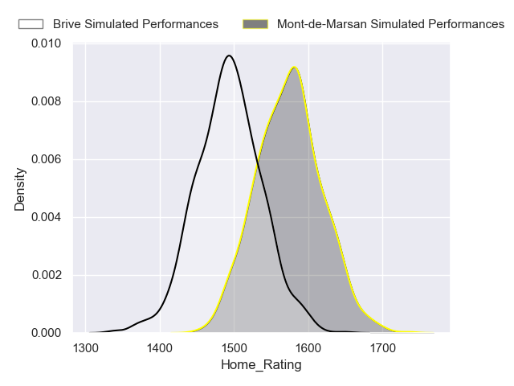
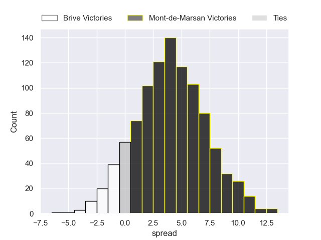
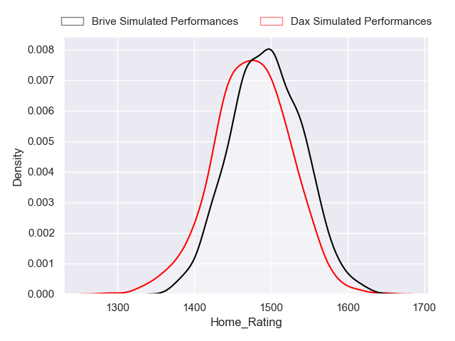
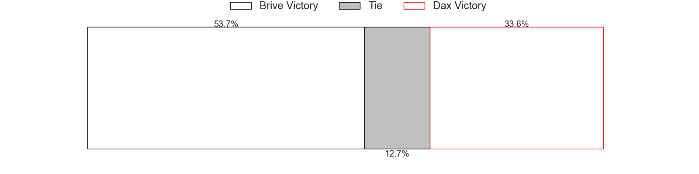
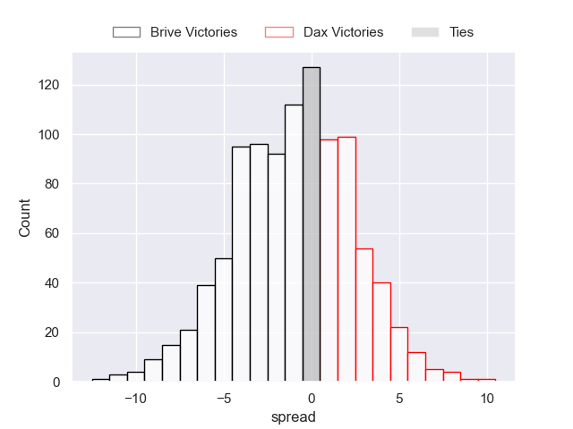
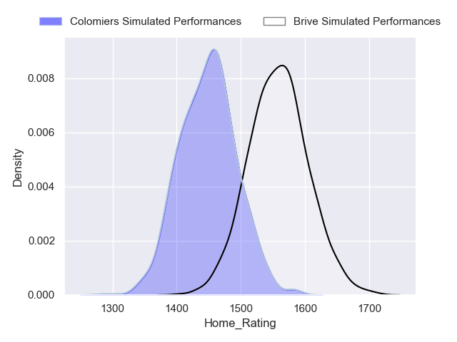
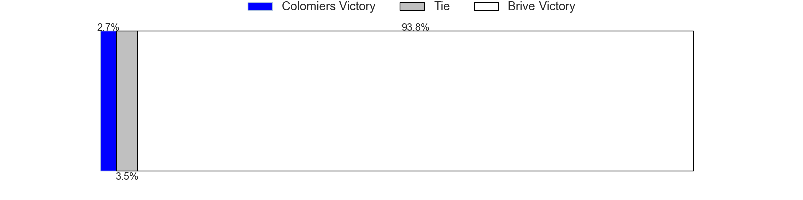
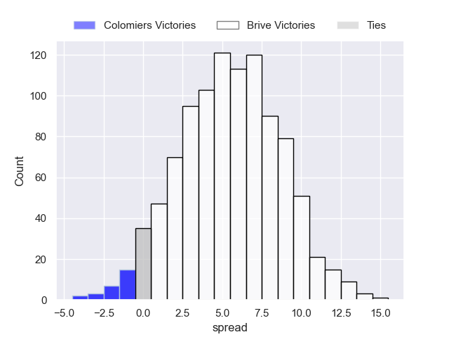

---  
title: "Pro D2 2023 Status"  
date: 2024-03-26 6:00:00 -0500  
categories: model review projection  
layout: article  
aside:  
    toc: true  
---
# Current Team Rankings

# Standings

## Current Standings

| Club                       |   Played |   Wins |   Point Differential |   Losing Bonus Points |   Try Bonus Points |   Competition Points |
|:---------------------------|---------:|-------:|---------------------:|----------------------:|-------------------:|---------------------:|
| Vannes                     |       23 |     13 |                  196 |                     6 |                  9 |                   69 |
| Beziers                    |       23 |     14 |                   89 |                     4 |                  7 |                   69 |
| Provence Rugby             |       23 |     15 |                   57 |                     2 |                  7 |                   69 |
| Mont-de-Marsan             |       23 |     13 |                  139 |                     7 |                  8 |                   67 |
| Nevers                     |       23 |     13 |                   52 |                     5 |                  6 |                   63 |
| Grenoble                   |       23 |     13 |                   44 |                     3 |                  7 |                   62 |
| Brive                      |       23 |     12 |                   60 |                     6 |                  7 |                   61 |
| Dax                        |       23 |     12 |                  -68 |                     2 |                  3 |                   55 |
| Colomiers                  |       23 |     11 |                   60 |                     5 |                  3 |                   54 |
| Agen                       |       23 |     11 |                  -91 |                     3 |                  4 |                   53 |
| Aurillac                   |       23 |     11 |                 -109 |                     3 |                  2 |                   51 |
| Biarritz Olympique         |       23 |      9 |                 -111 |                     4 |                  7 |                   47 |
| Soyaux-Angouleme           |       23 |      9 |                  -63 |                     6 |                  1 |                   45 |
| Valence Romans Drome Rugby |       23 |      9 |                    6 |                     5 |                  3 |                   44 |
| Montauban                  |       23 |      9 |                 -141 |                     3 |                  3 |                   42 |
| Rouen                      |       23 |      6 |                 -120 |                     7 |                  6 |                   39 |

## Projected Remaining Table

| Club                       |   Matches Remaining |   Wins |   Point Differential |   Losing Bonus Points |   Try Bonus Points |   Competition Points |
|:---------------------------|--------------------:|-------:|---------------------:|----------------------:|-------------------:|---------------------:|
| Vannes                     |                   7 |    6.3 |             39.7157  |                   0.7 |                4   |                 29.9 |
| Mont-de-Marsan             |                   7 |    5.7 |             34.134   |                   1.2 |                4.3 |                 28.4 |
| Nevers                     |                   7 |    5.2 |             22.3472  |                   1.7 |                3.2 |                 25.7 |
| Provence Rugby             |                   7 |    5   |             18.8412  |                   1.9 |                3.4 |                 25.4 |
| Grenoble                   |                   7 |    4.7 |             18.2041  |                   2.1 |                3.1 |                 24.1 |
| Beziers                    |                   7 |    4.6 |             13.1798  |                   2.2 |                3.2 |                 23.8 |
| Brive                      |                   7 |    4.4 |             15.2478  |                   2.2 |                2   |                 21.8 |
| Agen                       |                   7 |    3.5 |              2.93831 |                   3   |                3.2 |                 20.3 |
| Valence Romans Drome Rugby |                   7 |    2.9 |             -9.00232 |                   3.2 |                2.2 |                 16.8 |
| Colomiers                  |                   7 |    3   |             -5.35783 |                   2.7 |                1.9 |                 16.7 |
| Dax                        |                   7 |    2.5 |            -17.6948  |                   2.5 |                2.1 |                 14.7 |
| Aurillac                   |                   7 |    2.1 |            -19.6404  |                   3.3 |                2   |                 13.8 |
| Biarritz Olympique         |                   7 |    2   |            -22.7345  |                   3.1 |                2.3 |                 13.4 |
| Rouen                      |                   7 |    1.4 |            -35.55    |                   3   |                2.3 |                 10.8 |
| Soyaux-Angouleme           |                   7 |    1.4 |            -25.8347  |                   4   |                0.7 |                 10.3 |
| Montauban                  |                   7 |    1.2 |            -28.7937  |                   4   |                1   |                  9.8 |

## Projected Total Table

| Club                       |   Total Matches |   Wins |   Point Differential |   Losing Bonus Points |   Try Bonus Points |   Competition Points |
|:---------------------------|----------------:|-------:|---------------------:|----------------------:|-------------------:|---------------------:|
| Vannes                     |              30 |   19.3 |            235.716   |                   6.7 |               13   |                 98.9 |
| Mont-de-Marsan             |              30 |   18.7 |            173.134   |                   8.2 |               12.3 |                 95.4 |
| Provence Rugby             |              30 |   20   |             75.8412  |                   3.9 |               10.4 |                 94.4 |
| Beziers                    |              30 |   18.6 |            102.18    |                   6.2 |               10.2 |                 92.8 |
| Nevers                     |              30 |   18.2 |             74.3472  |                   6.7 |                9.2 |                 88.7 |
| Grenoble                   |              30 |   17.7 |             62.2041  |                   5.1 |               10.1 |                 86.1 |
| Brive                      |              30 |   16.4 |             75.2478  |                   8.2 |                9   |                 82.8 |
| Agen                       |              30 |   14.5 |            -88.0617  |                   6   |                7.2 |                 73.3 |
| Colomiers                  |              30 |   14   |             54.6422  |                   7.7 |                4.9 |                 70.7 |
| Dax                        |              30 |   14.5 |            -85.6948  |                   4.5 |                5.1 |                 69.7 |
| Aurillac                   |              30 |   13.1 |           -128.64    |                   6.3 |                4   |                 64.8 |
| Valence Romans Drome Rugby |              30 |   11.9 |             -3.00232 |                   8.2 |                5.2 |                 60.8 |
| Biarritz Olympique         |              30 |   11   |           -133.734   |                   7.1 |                9.3 |                 60.4 |
| Soyaux-Angouleme           |              30 |   10.4 |            -88.8347  |                  10   |                1.7 |                 55.3 |
| Montauban                  |              30 |   10.2 |           -169.794   |                   7   |                4   |                 51.8 |
| Rouen                      |              30 |    7.4 |           -155.55    |                  10   |                8.3 |                 49.8 |

# Completed Match Review

| Model | Percent Correct Predictions | Spread Error |
| ------ | ------ | ------ |
| Club Level | 77.7% | 11.3 |
| Player Level: Lineup | 78.8% | 11.4 |
| Player Level: Minutes | 78.3% | 11.1 |

# Future Predictions

## Week 24

### Mont-de-Marsan V Brive on 2024/03/28

Average Margin: Mont-de-Marsan by 4.1

Average Scoreline: 28-24

### Agen V Rouen on 2024/03/29

Average Margin: Agen by 6.3

Average Scoreline: 35-28

### Montauban V Dax on 2024/03/29

Average Margin: Montauban by 1.3

Average Scoreline: 28-27

### Vannes V Colomiers on 2024/03/29

Average Margin: Vannes by 6.9

Average Scoreline: 25-18

### Valence Romans Drome Rugby V Nevers on 2024/03/29

Average Margin: Valence Romans Drome Rugby by 0.3

Average Scoreline: 31-31

### Aurillac V Provence Rugby on 2024/03/29

Average Margin: Provence Rugby by 0.0

Average Scoreline: 28-28

### Beziers V Biarritz Olympique on 2024/03/29

Average Margin: Beziers by 6.3

Average Scoreline: 32-26

### Grenoble V Soyaux-Angouleme on 2024/03/29

Average Margin: Grenoble by 7.5

Average Scoreline: 24-16

## Week 25

### Dax V Brive on 2024/04/04

Average Margin: Brive by 1.0

Average Scoreline: 32-31

### Provence Rugby V Montauban on 2024/04/05

Average Margin: Provence Rugby by 8.1

Average Scoreline: 32-24

### Rouen V Beziers on 2024/04/05

Average Margin: Beziers by 1.9

Average Scoreline: 31-29

### Valence Romans Drome Rugby V Mont-de-Marsan on 2024/04/05

Average Margin: Mont-de-Marsan by 0.9

Average Scoreline: 30-30

### Biarritz Olympique V Aurillac on 2024/04/05

Average Margin: Biarritz Olympique by 3.9

Average Scoreline: 33-29

### Nevers V Grenoble on 2024/04/05

Average Margin: Nevers by 3.4

Average Scoreline: 30-27

### Soyaux-Angouleme V Vannes on 2024/04/05

Average Margin: Vannes by 2.7

Average Scoreline: 33-30

### Colomiers V Agen on 2024/04/05

Average Margin: Colomiers by 4.7

Average Scoreline: 30-25

## Week 26

### Brive V Colomiers on 2024/04/11

Average Margin: Brive by 5.5

Average Scoreline: 31-25

### Rouen V Provence Rugby on 2024/04/12

Average Margin: Provence Rugby by 1.6

Average Scoreline: 33-32

### Montauban V Nevers on 2024/04/12

Average Margin: Nevers by 2.2

Average Scoreline: 33-31

### Beziers V Valence Romans Drome Rugby on 2024/04/12

Average Margin: Beziers by 5.8

Average Scoreline: 35-29

### Mont-de-Marsan V Biarritz Olympique on 2024/04/12

Average Margin: Mont-de-Marsan by 8.3

Average Scoreline: 36-28

### Agen V Soyaux-Angouleme on 2024/04/12

Average Margin: Agen by 4.6

Average Scoreline: 27-22

### Grenoble V Aurillac on 2024/04/12

Average Margin: Grenoble by 7.6

Average Scoreline: 31-24

### Vannes V Dax on 2024/04/12

Average Margin: Vannes by 8.8

Average Scoreline: 30-22

## Week 27

### Provence Rugby V Mont-de-Marsan on 2024/04/19

Average Margin: Provence Rugby by 1.2

Average Scoreline: 33-31

### Dax V Rouen on 2024/04/19

Average Margin: Dax by 5.9

Average Scoreline: 35-29

### Aurillac V Beziers on 2024/04/19

Average Margin: Beziers by 0.2

Average Scoreline: 32-32

### Soyaux-Angouleme V Brive on 2024/04/19

Average Margin: Brive by 1.4

Average Scoreline: 28-27

### Biarritz Olympique V Grenoble on 2024/04/19

Average Margin: Grenoble by 0.3

Average Scoreline: 31-30

### Nevers V Colomiers on 2024/04/19

Average Margin: Nevers by 4.9

Average Scoreline: 31-26

### Montauban V Vannes on 2024/04/19

Average Margin: Vannes by 4.2

Average Scoreline: 30-26

### Valence Romans Drome Rugby V Agen on 2024/04/19

Average Margin: Valence Romans Drome Rugby by 3.3

Average Scoreline: 32-29

## Week 28

### Nevers V Soyaux-Angouleme on 2024/04/26

Average Margin: Nevers by 7.7

Average Scoreline: 26-18

### Vannes V Rouen on 2024/04/26

Average Margin: Vannes by 11.1

Average Scoreline: 40-29

### Provence Rugby V Valence Romans Drome Rugby on 2024/04/26

Average Margin: Provence Rugby by 5.6

Average Scoreline: 33-27

### Mont-de-Marsan V Dax on 2024/04/26

Average Margin: Mont-de-Marsan by 8.2

Average Scoreline: 38-30

### Grenoble V Beziers on 2024/04/26

Average Margin: Grenoble by 3.9

Average Scoreline: 33-29

### Agen V Biarritz Olympique on 2024/04/26

Average Margin: Agen by 4.3

Average Scoreline: 32-28

### Colomiers V Montauban on 2024/04/26

Average Margin: Colomiers by 7.4

Average Scoreline: 29-21

### Brive V Aurillac on 2024/04/26

Average Margin: Brive by 8.1

Average Scoreline: 33-25

## Week 29

### Dax V Agen on 2024/05/10

Average Margin: Dax by 2.8

Average Scoreline: 34-32

### Grenoble V Colomiers on 2024/05/10

Average Margin: Grenoble by 4.9

Average Scoreline: 31-26

### Montauban V Mont-de-Marsan on 2024/05/10

Average Margin: Mont-de-Marsan by 3.4

Average Scoreline: 30-27

### Biarritz Olympique V Provence Rugby on 2024/05/10

Average Margin: Biarritz Olympique by 0.3

Average Scoreline: 30-30

### Valence Romans Drome Rugby V Aurillac on 2024/05/10

Average Margin: Valence Romans Drome Rugby by 4.5

Average Scoreline: 35-30

### Rouen V Soyaux-Angouleme on 2024/05/10

Average Margin: Rouen by 1.7

Average Scoreline: 31-29

### Vannes V Brive on 2024/05/10

Average Margin: Vannes by 4.5

Average Scoreline: 23-19

### Beziers V Nevers on 2024/05/10

Average Margin: Beziers by 2.7

Average Scoreline: 32-29

## Week 30

### Soyaux-Angouleme V Beziers on 2024/05/17

Average Margin: Beziers by 0.1

Average Scoreline: 32-31

### Provence Rugby V Grenoble on 2024/05/17

Average Margin: Provence Rugby by 2.6

Average Scoreline: 34-31

### Aurillac V Montauban on 2024/05/17

Average Margin: Aurillac by 4.7

Average Scoreline: 33-28

### Brive V Biarritz Olympique on 2024/05/17

Average Margin: Brive by 7.8

Average Scoreline: 35-27

### Mont-de-Marsan V Rouen on 2024/05/17

Average Margin: Mont-de-Marsan by 10.4

Average Scoreline: 40-30

### Nevers V Dax on 2024/05/17

Average Margin: Nevers by 7.1

Average Scoreline: 32-25

### Agen V Vannes on 2024/05/17

Average Margin: Vannes by 1.6

Average Scoreline: 34-33

### Colomiers V Valence Romans Drome Rugby on 2024/05/17

Average Margin: Colomiers by 4.8

Average Scoreline: 34-29

