---  
title: "Pro D2 2023 Status"  
date: 2023-11-16 6:00:00 -0500  
categories: model review projection  
layout: article  
aside:  
    toc: true  
---
# Current Team Rankings

# Standings

## Current Standings

| Club                       |   Played |   Wins |   Point Differential |   Losing Bonus Points |   Try Bonus Points |   Competition Points |
|:---------------------------|---------:|-------:|---------------------:|----------------------:|-------------------:|---------------------:|
| Vannes                     |       10 |      8 |                  132 |                     1 |                  4 |                   39 |
| Mont-de-Marsan             |       10 |      6 |                   70 |                     3 |                  4 |                   31 |
| Provence Rugby             |       10 |      7 |                   55 |                     0 |                  3 |                   31 |
| Nevers                     |       10 |      5 |                   54 |                     3 |                  3 |                   26 |
| Brive                      |       10 |      5 |                    4 |                     3 |                  3 |                   26 |
| Agen                       |       10 |      5 |                  -49 |                     1 |                  3 |                   26 |
| Colomiers                  |       10 |      5 |                   11 |                     2 |                  1 |                   25 |
| Grenoble                   |       10 |      5 |                   -9 |                     2 |                  3 |                   25 |
| Biarritz Olympique         |       10 |      5 |                  -53 |                     1 |                  3 |                   24 |
| Beziers                    |       10 |      4 |                   -4 |                     3 |                  2 |                   23 |
| Montauban                  |       10 |      5 |                  -66 |                     0 |                  1 |                   21 |
| Valence Romans Drome Rugby |       10 |      4 |                   29 |                     1 |                  3 |                   20 |
| Aurillac                   |       10 |      4 |                  -36 |                     1 |                  1 |                   20 |
| Dax                        |       10 |      4 |                  -53 |                     2 |                  0 |                   20 |
| Soyaux-Angouleme           |       10 |      3 |                  -10 |                     4 |                  1 |                   19 |
| Rouen                      |       10 |      1 |                  -75 |                     5 |                  2 |                   13 |

## Projected Remaining Table

| Club                       |   Matches Remaining |   Wins |   Point Differential |   Losing Bonus Points |   Try Bonus Points |   Competition Points |
|:---------------------------|--------------------:|-------:|---------------------:|----------------------:|-------------------:|---------------------:|
| Vannes                     |                  20 |   16.9 |            109.913   |                   3   |               16.2 |                 86.7 |
| Mont-de-Marsan             |                  20 |   14.8 |             71.8848  |                   4.6 |               14   |                 78   |
| Nevers                     |                  20 |   13.4 |             44.1044  |                   6   |               12.4 |                 71.8 |
| Brive                      |                  20 |   12.3 |             39.5693  |                   6.7 |               11.4 |                 67.3 |
| Grenoble                   |                  20 |   11.6 |             22.7859  |                   7   |               10.9 |                 64.3 |
| Provence Rugby             |                  20 |   10.9 |             13.4523  |                   7.4 |               10   |                 61.1 |
| Colomiers                  |                  20 |   10.1 |              1.11738 |                   7.5 |                9.4 |                 57.5 |
| Beziers                    |                  20 |    9.8 |             -4.24053 |                   8.4 |                8.9 |                 56.5 |
| Valence Romans Drome Rugby |                  20 |    9.5 |             -3.54113 |                   8.8 |                8.6 |                 55.6 |
| Agen                       |                  20 |    9   |            -16.5521  |                   8   |                8.3 |                 52.3 |
| Dax                        |                  20 |    8   |            -35.3597  |                   7.8 |                7.2 |                 47.1 |
| Biarritz Olympique         |                  19 |    7.8 |            -21.8294  |                   8.5 |                7.1 |                 46.7 |
| Aurillac                   |                  20 |    7.4 |            -38.6194  |                   9.2 |                6.5 |                 45.3 |
| Soyaux-Angouleme           |                  20 |    7.2 |            -42.8737  |                   8.9 |                6.4 |                 44.2 |
| Montauban                  |                  19 |    5.9 |            -44.2764  |                   9.8 |                5.1 |                 38.7 |
| Rouen                      |                  20 |    4.2 |            -95.535   |                   8.7 |                3.5 |                 28.9 |

## Projected Total Table

| Club                       |   Total Matches |   Wins |   Point Differential |   Losing Bonus Points |   Try Bonus Points |   Competition Points |
|:---------------------------|----------------:|-------:|---------------------:|----------------------:|-------------------:|---------------------:|
| Vannes                     |              30 |   24.9 |            241.913   |                   4   |               20.2 |                125.7 |
| Mont-de-Marsan             |              30 |   20.8 |            141.885   |                   7.6 |               18   |                109   |
| Nevers                     |              30 |   18.4 |             98.1044  |                   9   |               15.4 |                 97.8 |
| Brive                      |              30 |   17.3 |             43.5693  |                   9.7 |               14.4 |                 93.3 |
| Provence Rugby             |              30 |   17.9 |             68.4523  |                   7.4 |               13   |                 92.1 |
| Grenoble                   |              30 |   16.6 |             13.7859  |                   9   |               13.9 |                 89.3 |
| Colomiers                  |              30 |   15.1 |             12.1174  |                   9.5 |               10.4 |                 82.5 |
| Beziers                    |              30 |   13.8 |             -8.24053 |                  11.4 |               10.9 |                 79.5 |
| Agen                       |              30 |   14   |            -65.5521  |                   9   |               11.3 |                 78.3 |
| Valence Romans Drome Rugby |              30 |   13.5 |             25.4589  |                   9.8 |               11.6 |                 75.6 |
| Biarritz Olympique         |              29 |   12.8 |            -74.8294  |                   9.5 |               10.1 |                 70.7 |
| Dax                        |              30 |   12   |            -88.3597  |                   9.8 |                7.2 |                 67.1 |
| Aurillac                   |              30 |   11.4 |            -74.6194  |                  10.2 |                7.5 |                 65.3 |
| Soyaux-Angouleme           |              30 |   10.2 |            -52.8737  |                  12.9 |                7.4 |                 63.2 |
| Montauban                  |              29 |   10.9 |           -110.276   |                   9.8 |                6.1 |                 59.7 |
| Rouen                      |              30 |    5.2 |           -170.535   |                  13.7 |                5.5 |                 41.9 |

# Completed Match Review

| Model | Percent Correct Predictions | Spread Error |
| ------ | ------ | ------ |
| Club Level | 73.8% | 11.1 |
| Player Level: Lineup | 73.8% | 11.4 |
| Player Level: Minutes | 73.8% | 11.1 |

# Future Predictions

## Week 11

### Rouen V Colomiers on 2023/11/17

Average Margin: Colomiers by 1.1

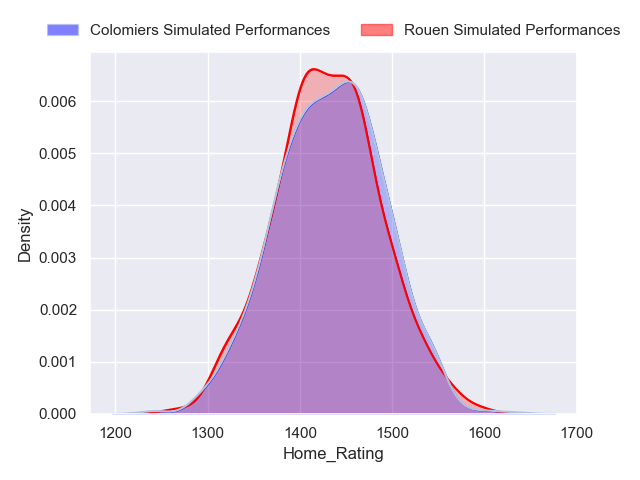

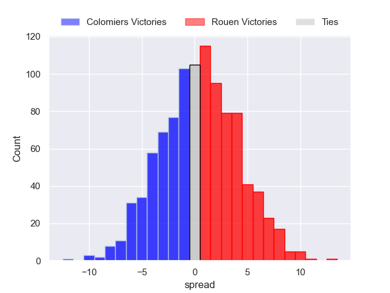

### Nevers V Brive on 2023/11/17

Average Margin: Nevers by 3.2

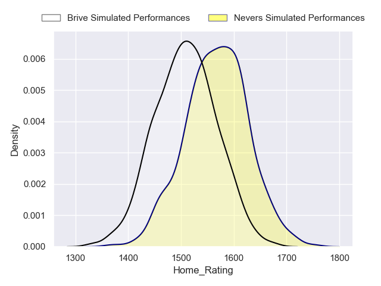
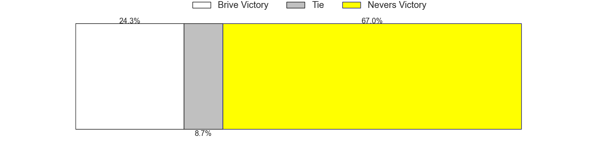
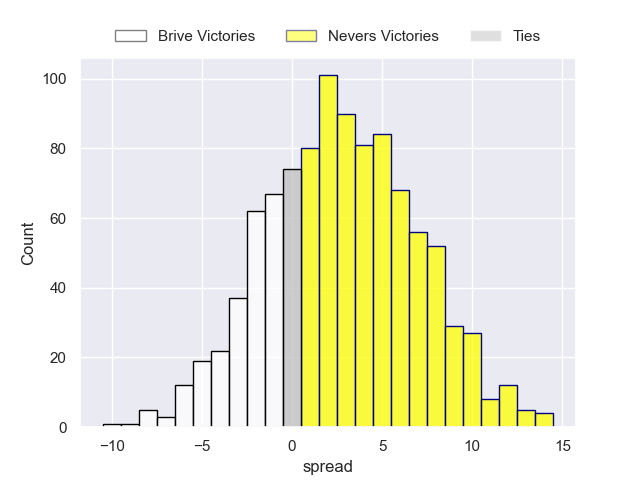

### Vannes V Agen on 2023/11/17

Average Margin: Vannes by 9.3

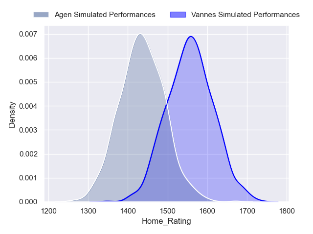

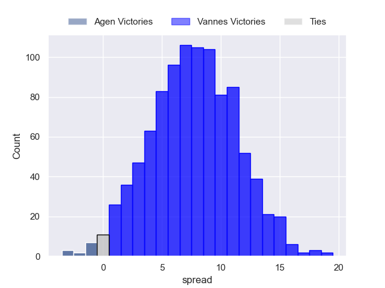

### Beziers V Dax on 2023/11/17

Average Margin: Beziers by 4.5

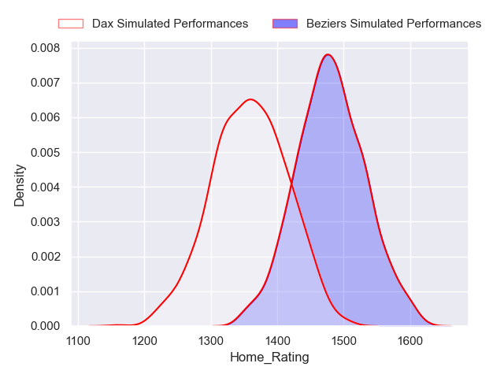
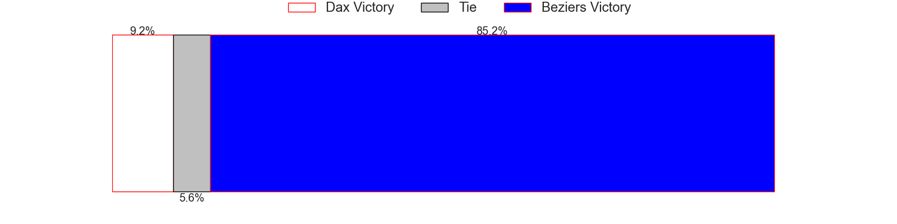
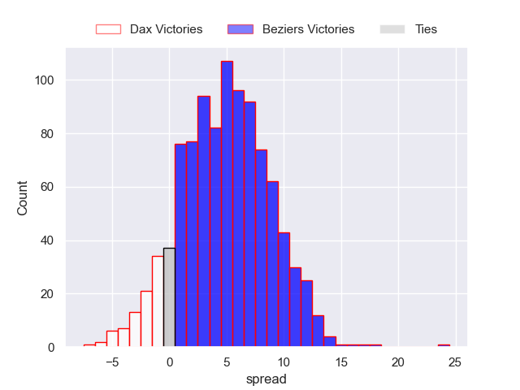

### Aurillac V Valence Romans Drome Rugby on 2023/11/17

Average Margin: Aurillac by 1.6

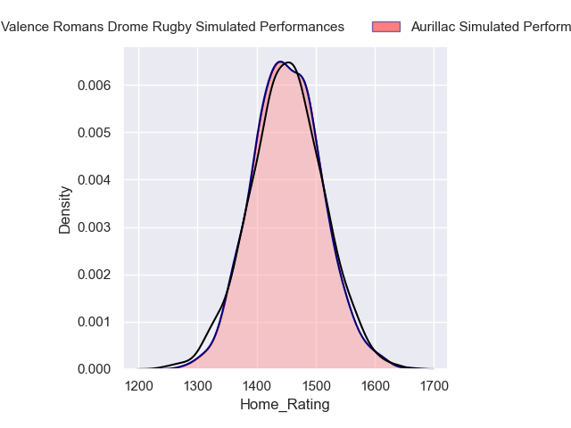
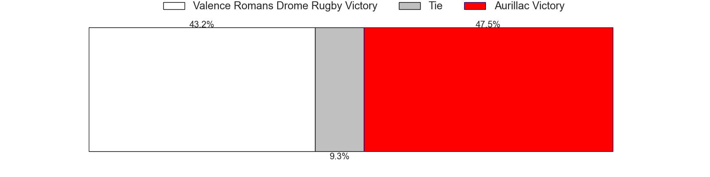
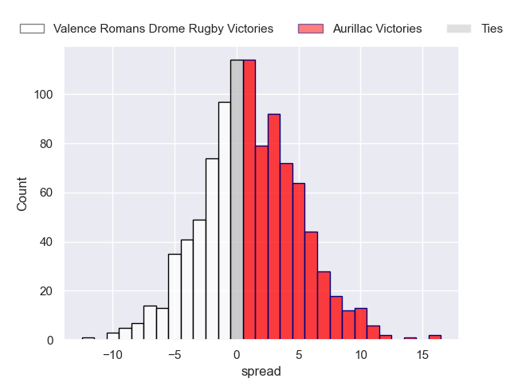

### Mont-de-Marsan V Provence Rugby on 2023/11/17

Average Margin: Mont-de-Marsan by 6.0

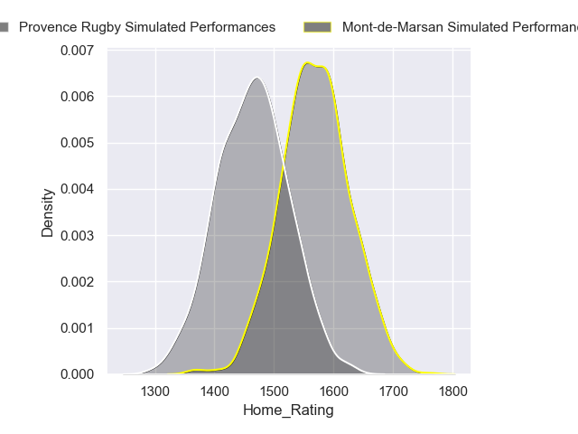
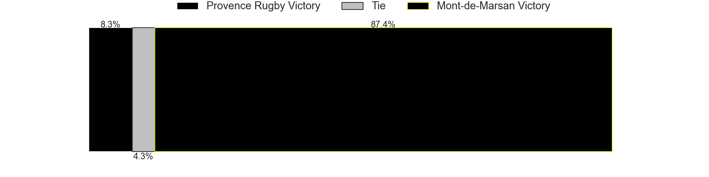
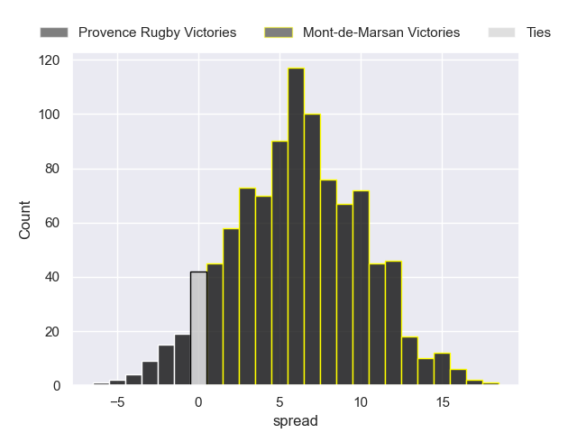

### Soyaux-Angouleme V Grenoble on 2023/11/17

Average Margin: Soyaux-Angouleme by 0.3

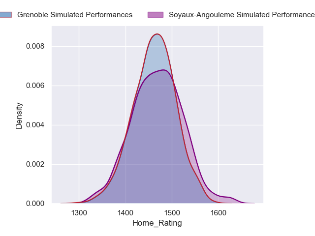

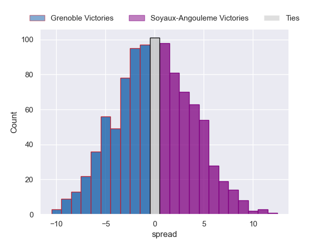

## Week 12

### Valence Romans Drome Rugby V Soyaux-Angouleme on 2023/12/01

Average Margin: Valence Romans Drome Rugby by 5.1

### Agen V Colomiers on 2023/12/01

Average Margin: Agen by 2.3

### Beziers V Montauban on 2023/12/01

Average Margin: Beziers by 5.2

### Grenoble V Vannes on 2023/12/01

Average Margin: Vannes by 0.5

### Aurillac V Biarritz Olympique on 2023/12/01

Average Margin: Aurillac by 2.2

### Brive V Mont-de-Marsan on 2023/12/01

Average Margin: Brive by 2.1

### Dax V Nevers on 2023/12/01

Average Margin: Nevers by 0.9

### Provence Rugby V Rouen on 2023/12/01

Average Margin: Provence Rugby by 8.5

## Week 13

### Vannes V Provence Rugby on 2023/12/08

Average Margin: Vannes by 7.5

### Rouen V Grenoble on 2023/12/08

Average Margin: Grenoble by 2.3

### Soyaux-Angouleme V Agen on 2023/12/08

Average Margin: Soyaux-Angouleme by 2.1

### Colomiers V Brive on 2023/12/08

Average Margin: Colomiers by 1.3

### Dax V Valence Romans Drome Rugby on 2023/12/08

Average Margin: Dax by 1.8

### Montauban V Aurillac on 2023/12/08

Average Margin: Montauban by 3.3

### Biarritz Olympique V Beziers on 2023/12/08

Average Margin: Biarritz Olympique by 3.0

### Nevers V Mont-de-Marsan on 2023/12/08

Average Margin: Nevers by 2.3

## Week 14

### Mont-de-Marsan V Colomiers on 2023/12/15

Average Margin: Mont-de-Marsan by 6.5

### Grenoble V Nevers on 2023/12/15

Average Margin: Grenoble by 2.4

### Agen V Montauban on 2023/12/15

Average Margin: Agen by 4.6

### Brive V Vannes on 2023/12/15

Average Margin: Brive by 0.7

### Provence Rugby V Biarritz Olympique on 2023/12/15

Average Margin: Provence Rugby by 5.1

### Valence Romans Drome Rugby V Beziers on 2023/12/15

Average Margin: Valence Romans Drome Rugby by 3.4

### Soyaux-Angouleme V Rouen on 2023/12/15

Average Margin: Soyaux-Angouleme by 5.8

### Aurillac V Dax on 2023/12/15

Average Margin: Aurillac by 2.9

## Week 15

### Rouen V Mont-de-Marsan on 2024/01/05

Average Margin: Mont-de-Marsan by 4.7

### Dax V Montauban on 2024/01/05

Average Margin: Dax by 3.9

### Biarritz Olympique V Brive on 2024/01/05

Average Margin: Brive by 0.0

### Colomiers V Nevers on 2024/01/05

Average Margin: Colomiers by 1.2

### Grenoble V Provence Rugby on 2024/01/05

Average Margin: Grenoble by 3.6

### Agen V Valence Romans Drome Rugby on 2024/01/05

Average Margin: Agen by 3.2

### Beziers V Aurillac on 2024/01/05

Average Margin: Beziers by 4.9

### Vannes V Soyaux-Angouleme on 2024/01/05

Average Margin: Vannes by 10.4

## Week 16

### Provence Rugby V Dax on 2024/01/12

Average Margin: Provence Rugby by 6.2

### Montauban V Grenoble on 2024/01/12

Average Margin: Grenoble by 0.2

### Nevers V Biarritz Olympique on 2024/01/12

Average Margin: Nevers by 6.9

### Mont-de-Marsan V Agen on 2024/01/12

Average Margin: Mont-de-Marsan by 7.7

### Valence Romans Drome Rugby V Vannes on 2024/01/12

Average Margin: Vannes by 2.1

### Aurillac V Soyaux-Angouleme on 2024/01/12

Average Margin: Aurillac by 3.1

### Brive V Rouen on 2024/01/12

Average Margin: Brive by 10.2

### Colomiers V Beziers on 2024/01/12

Average Margin: Colomiers by 3.9

## Week 17

### Soyaux-Angouleme V Colomiers on 2024/01/19

Average Margin: Soyaux-Angouleme by 1.0

### Rouen V Nevers on 2024/01/19

Average Margin: Nevers by 3.2

### Agen V Aurillac on 2024/01/19

Average Margin: Agen by 4.7

### Beziers V Provence Rugby on 2024/01/19

Average Margin: Beziers by 2.0

### Vannes V Mont-de-Marsan on 2024/01/19

Average Margin: Vannes by 4.9

### Grenoble V Dax on 2024/01/19

Average Margin: Grenoble by 6.4

### Biarritz Olympique V Valence Romans Drome Rugby on 2024/01/19

Average Margin: Biarritz Olympique by 3.1

### Brive V Montauban on 2024/01/19

Average Margin: Brive by 8.0

## Week 18

### Montauban V Soyaux-Angouleme on 2024/01/26

Average Margin: Montauban by 3.0

### Nevers V Vannes on 2024/01/26

Average Margin: Nevers by 0.6

### Dax V Biarritz Olympique on 2024/01/26

Average Margin: Dax by 2.4

### Aurillac V Mont-de-Marsan on 2024/01/26

Average Margin: Mont-de-Marsan by 2.2

### Colomiers V Rouen on 2024/01/26

Average Margin: Colomiers by 7.8

### Valence Romans Drome Rugby V Grenoble on 2024/01/26

Average Margin: Valence Romans Drome Rugby by 1.7

### Beziers V Agen on 2024/01/26

Average Margin: Beziers by 3.5

### Provence Rugby V Brive on 2024/01/26

Average Margin: Provence Rugby by 1.8

## Week 19

### Rouen V Valence Romans Drome Rugby on 2024/02/09

Average Margin: Valence Romans Drome Rugby by 0.5

### Colomiers V Dax on 2024/02/09

Average Margin: Colomiers by 5.4

### Vannes V Aurillac on 2024/02/09

Average Margin: Vannes by 10.4

### Soyaux-Angouleme V Biarritz Olympique on 2024/02/09

Average Margin: Soyaux-Angouleme by 2.2

### Agen V Provence Rugby on 2024/02/09

Average Margin: Agen by 1.8

### Mont-de-Marsan V Grenoble on 2024/02/09

Average Margin: Mont-de-Marsan by 5.8

### Brive V Nevers on 2024/02/09

Average Margin: Brive by 3.4

### Montauban V Beziers on 2024/02/09

Average Margin: Montauban by 1.4

## Week 20

### Beziers V Mont-de-Marsan on 2024/02/16

Average Margin: Mont-de-Marsan by 0.9

### Biarritz Olympique V Rouen on 2024/02/16

Average Margin: Biarritz Olympique by 7.0

### Valence Romans Drome Rugby V Montauban on 2024/02/16

Average Margin: Valence Romans Drome Rugby by 5.0

### Nevers V Agen on 2024/02/16

Average Margin: Nevers by 6.5

### Dax V Soyaux-Angouleme on 2024/02/16

Average Margin: Dax by 3.6

### Aurillac V Colomiers on 2024/02/16

Average Margin: Aurillac by 1.0

### Provence Rugby V Vannes on 2024/02/16

Average Margin: Vannes by 0.8

### Grenoble V Brive on 2024/02/16

Average Margin: Grenoble by 2.1

## Week 21

### Agen V Grenoble on 2024/02/23

Average Margin: Agen by 1.4

### Dax V Aurillac on 2024/02/23

Average Margin: Dax by 3.5

### Vannes V Beziers on 2024/02/23

Average Margin: Vannes by 8.9

### Rouen V Montauban on 2024/02/23

Average Margin: Rouen by 1.3

### Mont-de-Marsan V Nevers on 2024/02/23

Average Margin: Mont-de-Marsan by 4.5

### Brive V Valence Romans Drome Rugby on 2024/02/23

Average Margin: Brive by 6.2

### Colomiers V Biarritz Olympique on 2024/02/23

Average Margin: Colomiers by 4.4

### Soyaux-Angouleme V Provence Rugby on 2024/02/23

Average Margin: Soyaux-Angouleme by 0.5

## Week 22

### Beziers V Brive on 2024/03/01

Average Margin: Beziers by 0.4

### Grenoble V Rouen on 2024/03/01

Average Margin: Grenoble by 8.9

### Mont-de-Marsan V Soyaux-Angouleme on 2024/03/01

Average Margin: Mont-de-Marsan by 8.9

### Valence Romans Drome Rugby V Dax on 2024/03/01

Average Margin: Valence Romans Drome Rugby by 4.6

### Provence Rugby V Colomiers on 2024/03/01

Average Margin: Provence Rugby by 4.1

### Aurillac V Nevers on 2024/03/01

Average Margin: Nevers by 1.2

### Biarritz Olympique V Vannes on 2024/03/01

Average Margin: Vannes by 2.7

### Montauban V Agen on 2024/03/01

Average Margin: Montauban by 1.9

## Week 23

### Soyaux-Angouleme V Valence Romans Drome Rugby on 2024/03/08

Average Margin: Soyaux-Angouleme by 2.0

### Rouen V Aurillac on 2024/03/08

Average Margin: Rouen by 1.1

### Biarritz Olympique V Montauban on 2024/03/08

Average Margin: Biarritz Olympique by 4.9

### Vannes V Grenoble on 2024/03/08

Average Margin: Vannes by 7.1

### Nevers V Provence Rugby on 2024/03/08

Average Margin: Nevers by 4.8

### Brive V Agen on 2024/03/08

Average Margin: Brive by 6.4

### Dax V Beziers on 2024/03/08

Average Margin: Dax by 2.1

### Colomiers V Mont-de-Marsan on 2024/03/08

Average Margin: Mont-de-Marsan by 0.0

## Week 24

### Grenoble V Soyaux-Angouleme on 2024/03/29

Average Margin: Grenoble by 6.6

### Vannes V Colomiers on 2024/03/29

Average Margin: Vannes by 8.2

### Agen V Rouen on 2024/03/29

Average Margin: Agen by 7.0

### Aurillac V Provence Rugby on 2024/03/29

Average Margin: Aurillac by 0.5

### Mont-de-Marsan V Brive on 2024/03/29

Average Margin: Mont-de-Marsan by 4.5

### Valence Romans Drome Rugby V Nevers on 2024/03/29

Average Margin: Valence Romans Drome Rugby by 0.3

### Beziers V Biarritz Olympique on 2024/03/29

Average Margin: Beziers by 3.7

### Montauban V Dax on 2024/03/29

Average Margin: Montauban by 3.0

## Week 25

### Soyaux-Angouleme V Vannes on 2024/04/05

Average Margin: Vannes by 3.7

### Biarritz Olympique V Aurillac on 2024/04/05

Average Margin: Biarritz Olympique by 4.5

### Dax V Brive on 2024/04/05

Average Margin: Brive by 0.8

### Valence Romans Drome Rugby V Mont-de-Marsan on 2024/04/05

Average Margin: Mont-de-Marsan by 0.7

### Colomiers V Agen on 2024/04/05

Average Margin: Colomiers by 4.3

### Nevers V Grenoble on 2024/04/05

Average Margin: Nevers by 4.5

### Provence Rugby V Montauban on 2024/04/05

Average Margin: Provence Rugby by 6.5

### Rouen V Beziers on 2024/04/05

Average Margin: Beziers by 0.4

## Week 26

### Rouen V Provence Rugby on 2024/04/12

Average Margin: Provence Rugby by 1.8

### Mont-de-Marsan V Biarritz Olympique on 2024/04/12

Average Margin: Mont-de-Marsan by 7.6

### Montauban V Nevers on 2024/04/12

Average Margin: Nevers by 1.3

### Grenoble V Aurillac on 2024/04/12

Average Margin: Grenoble by 6.4

### Agen V Soyaux-Angouleme on 2024/04/12

Average Margin: Agen by 4.5

### Beziers V Valence Romans Drome Rugby on 2024/04/12

Average Margin: Beziers by 3.2

### Brive V Colomiers on 2024/04/12

Average Margin: Brive by 5.5

### Vannes V Dax on 2024/04/12

Average Margin: Vannes by 10.2

## Week 27

### Aurillac V Beziers on 2024/04/19

Average Margin: Aurillac by 1.6

### Biarritz Olympique V Grenoble on 2024/04/19

Average Margin: Biarritz Olympique by 1.2

### Provence Rugby V Mont-de-Marsan on 2024/04/19

Average Margin: Provence Rugby by 0.7

### Montauban V Vannes on 2024/04/19

Average Margin: Vannes by 3.9

### Valence Romans Drome Rugby V Agen on 2024/04/19

Average Margin: Valence Romans Drome Rugby by 3.4

### Soyaux-Angouleme V Brive on 2024/04/19

Average Margin: Brive by 0.9

### Nevers V Colomiers on 2024/04/19

Average Margin: Nevers by 5.6

### Dax V Rouen on 2024/04/19

Average Margin: Dax by 6.0

## Week 28

### Mont-de-Marsan V Dax on 2024/04/26

Average Margin: Mont-de-Marsan by 8.4

### Agen V Biarritz Olympique on 2024/04/26

Average Margin: Agen by 3.5

### Nevers V Soyaux-Angouleme on 2024/04/26

Average Margin: Nevers by 7.8

### Vannes V Rouen on 2024/04/26

Average Margin: Vannes by 12.7

### Colomiers V Montauban on 2024/04/26

Average Margin: Colomiers by 6.1

### Brive V Aurillac on 2024/04/26

Average Margin: Brive by 7.9

### Provence Rugby V Valence Romans Drome Rugby on 2024/04/26

Average Margin: Provence Rugby by 4.7

### Grenoble V Beziers on 2024/04/26

Average Margin: Grenoble by 5.2

## Week 29

### Grenoble V Colomiers on 2024/05/10

Average Margin: Grenoble by 4.3

### Rouen V Soyaux-Angouleme on 2024/05/10

Average Margin: Rouen by 1.1

### Biarritz Olympique V Provence Rugby on 2024/05/10

Average Margin: Biarritz Olympique by 1.6

### Montauban V Mont-de-Marsan on 2024/05/10

Average Margin: Mont-de-Marsan by 2.4

### Dax V Agen on 2024/05/10

Average Margin: Dax by 2.2

### Beziers V Nevers on 2024/05/10

Average Margin: Beziers by 0.4

### Vannes V Brive on 2024/05/10

Average Margin: Vannes by 5.9

### Valence Romans Drome Rugby V Aurillac on 2024/05/10

Average Margin: Valence Romans Drome Rugby by 5.0

## Week 30

### Brive V Biarritz Olympique on 2024/05/17

Average Margin: Brive by 6.6

### Mont-de-Marsan V Rouen on 2024/05/17

Average Margin: Mont-de-Marsan by 11.2

### Provence Rugby V Grenoble on 2024/05/17

Average Margin: Provence Rugby by 3.1

### Soyaux-Angouleme V Beziers on 2024/05/17

Average Margin: Soyaux-Angouleme by 1.9

### Agen V Vannes on 2024/05/17

Average Margin: Vannes by 2.3

### Aurillac V Montauban on 2024/05/17

Average Margin: Aurillac by 3.5

### Nevers V Dax on 2024/05/17

Average Margin: Nevers by 7.5

### Colomiers V Valence Romans Drome Rugby on 2024/05/17

Average Margin: Colomiers by 4.0

