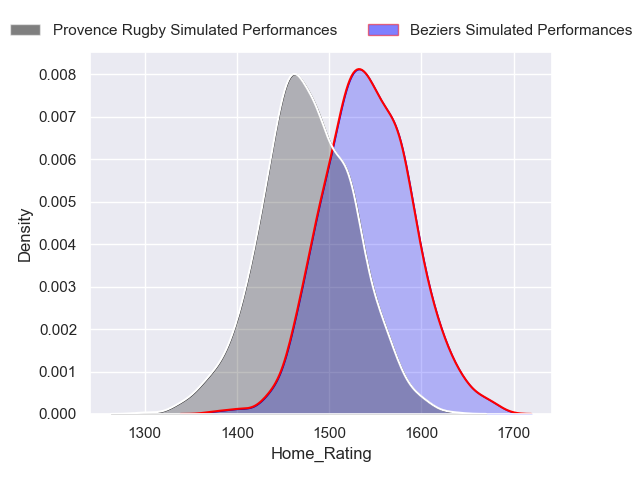
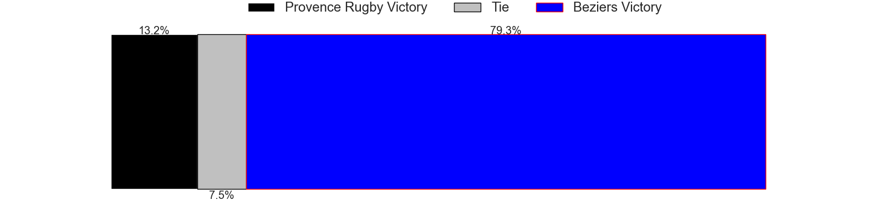
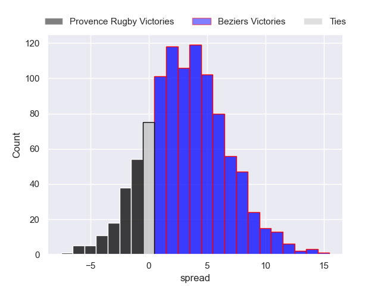

---  
title: "Pro D2 2023 Status"  
date: 2024-01-15 6:00:00 -0500  
categories: model review projection  
layout: article  
aside:  
    toc: true  
---
# Current Team Rankings

# Standings

## Current Standings

| Club                       |   Played |   Wins |   Point Differential |   Losing Bonus Points |   Try Bonus Points |   Competition Points |
|:---------------------------|---------:|-------:|---------------------:|----------------------:|-------------------:|---------------------:|
| Vannes                     |       16 |     10 |                  152 |                     3 |                  6 |                   51 |
| Provence Rugby             |       16 |     11 |                   85 |                     1 |                  6 |                   51 |
| Beziers                    |       16 |     10 |                  109 |                     3 |                  5 |                   50 |
| Mont-de-Marsan             |       16 |     10 |                   95 |                     4 |                  5 |                   49 |
| Grenoble                   |       16 |     10 |                   68 |                     2 |                  5 |                   47 |
| Nevers                     |       16 |      9 |                   61 |                     4 |                  6 |                   46 |
| Brive                      |       16 |      9 |                   22 |                     4 |                  3 |                   43 |
| Aurillac                   |       16 |      8 |                  -62 |                     1 |                  2 |                   37 |
| Colomiers                  |       16 |      7 |                    1 |                     4 |                  1 |                   35 |
| Montauban                  |       16 |      8 |                  -73 |                     1 |                  2 |                   35 |
| Agen                       |       16 |      7 |                 -105 |                     2 |                  3 |                   35 |
| Dax                        |       16 |      7 |                 -108 |                     2 |                  1 |                   33 |
| Valence Romans Drome Rugby |       16 |      6 |                   30 |                     4 |                  3 |                   31 |
| Soyaux-Angouleme           |       16 |      5 |                  -33 |                     5 |                  1 |                   28 |
| Biarritz Olympique         |       16 |      5 |                 -114 |                     3 |                  3 |                   26 |
| Rouen                      |       16 |      2 |                 -128 |                     7 |                  3 |                   20 |

## Projected Remaining Table

| Club                       |   Matches Remaining |   Wins |   Point Differential |   Losing Bonus Points |   Try Bonus Points |   Competition Points |
|:---------------------------|--------------------:|-------:|---------------------:|----------------------:|-------------------:|---------------------:|
| Vannes                     |                  14 |   11.6 |            68.4245   |                   2.3 |                6.2 |                 55   |
| Mont-de-Marsan             |                  14 |    9.9 |            46.2653   |                   3.7 |                5.7 |                 48.9 |
| Grenoble                   |                  14 |    8.9 |            34.9548   |                   4.4 |                7.3 |                 47.4 |
| Nevers                     |                  14 |    9.4 |            33.3495   |                   4.1 |                5.4 |                 47.2 |
| Beziers                    |                  14 |    9.3 |            24.8539   |                   4.1 |                5.3 |                 46.6 |
| Provence Rugby             |                  14 |    9.2 |            25.3701   |                   4.4 |                5.1 |                 46.4 |
| Brive                      |                  14 |    9   |            34.3396   |                   4.3 |                3.4 |                 43.5 |
| Colomiers                  |                  14 |    7   |             0.456277 |                   5   |                4.6 |                 37.6 |
| Valence Romans Drome Rugby |                  14 |    6.6 |            -4.2126   |                   5.9 |                4.8 |                 37.2 |
| Agen                       |                  14 |    5.5 |           -19.0165   |                   6.4 |                5   |                 33.1 |
| Biarritz Olympique         |                  14 |    4.9 |           -27.8412   |                   6.4 |                4.8 |                 31   |
| Dax                        |                  14 |    5.1 |           -37.3258   |                   5   |                3.2 |                 28.5 |
| Montauban                  |                  14 |    4.4 |           -32.327    |                   7.1 |                2.9 |                 27.7 |
| Aurillac                   |                  14 |    4.1 |           -40.404    |                   7   |                3.4 |                 26.7 |
| Soyaux-Angouleme           |                  14 |    4.3 |           -38.0269   |                   6.9 |                2.1 |                 26.2 |
| Rouen                      |                  14 |    2.9 |           -68.8599   |                   6.1 |                3.3 |                 20.9 |

## Projected Total Table

| Club                       |   Total Matches |   Wins |   Point Differential |   Losing Bonus Points |   Try Bonus Points |   Competition Points |
|:---------------------------|----------------:|-------:|---------------------:|----------------------:|-------------------:|---------------------:|
| Vannes                     |              30 |   21.6 |            220.424   |                   5.3 |               12.2 |                106   |
| Mont-de-Marsan             |              30 |   19.9 |            141.265   |                   7.7 |               10.7 |                 97.9 |
| Provence Rugby             |              30 |   20.2 |            110.37    |                   5.4 |               11.1 |                 97.4 |
| Beziers                    |              30 |   19.3 |            133.854   |                   7.1 |               10.3 |                 96.6 |
| Grenoble                   |              30 |   18.9 |            102.955   |                   6.4 |               12.3 |                 94.4 |
| Nevers                     |              30 |   18.4 |             94.3495  |                   8.1 |               11.4 |                 93.2 |
| Brive                      |              30 |   18   |             56.3396  |                   8.3 |                6.4 |                 86.5 |
| Colomiers                  |              30 |   14   |              1.45628 |                   9   |                5.6 |                 72.6 |
| Valence Romans Drome Rugby |              30 |   12.6 |             25.7874  |                   9.9 |                7.8 |                 68.2 |
| Agen                       |              30 |   12.5 |           -124.017   |                   8.4 |                8   |                 68.1 |
| Aurillac                   |              30 |   12.1 |           -102.404   |                   8   |                5.4 |                 63.7 |
| Montauban                  |              30 |   12.4 |           -105.327   |                   8.1 |                4.9 |                 62.7 |
| Dax                        |              30 |   12.1 |           -145.326   |                   7   |                4.2 |                 61.5 |
| Biarritz Olympique         |              30 |    9.9 |           -141.841   |                   9.4 |                7.8 |                 57   |
| Soyaux-Angouleme           |              30 |    9.3 |            -71.0269  |                  11.9 |                3.1 |                 54.2 |
| Rouen                      |              30 |    4.9 |           -196.86    |                  13.1 |                6.3 |                 40.9 |

# Completed Match Review

| Model | Percent Correct Predictions | Spread Error |
| ------ | ------ | ------ |
| Club Level | 75.0% | 11.1 |
| Player Level: Lineup | 75.8% | 11.3 |
| Player Level: Minutes | 75.8% | 11.0 |

# Future Predictions

## Week 17

### Beziers V Provence Rugby on 2024/01/18

Average Margin: Beziers by 3.3

Average Scoreline: 31-27

### Soyaux-Angouleme V Colomiers on 2024/01/19

Average Margin: Soyaux-Angouleme by 1.1

Average Scoreline: 28-27

### Vannes V Mont-de-Marsan on 2024/01/19

Average Margin: Vannes by 4.4

Average Scoreline: 25-21

### Agen V Aurillac on 2024/01/19

Average Margin: Agen by 3.8

Average Scoreline: 27-23

### Rouen V Nevers on 2024/01/19

Average Margin: Nevers by 3.7

Average Scoreline: 30-26

### Brive V Montauban on 2024/01/19

Average Margin: Brive by 8.4

Average Scoreline: 29-21

### Biarritz Olympique V Valence Romans Drome Rugby on 2024/01/19

Average Margin: Biarritz Olympique by 1.9

Average Scoreline: 26-24

### Grenoble V Dax on 2024/01/19

Average Margin: Grenoble by 8.6

Average Scoreline: 33-24

## Week 18

### Montauban V Soyaux-Angouleme on 2024/01/26

Average Margin: Montauban by 3.6

Average Scoreline: 29-26

### Aurillac V Mont-de-Marsan on 2024/01/26

Average Margin: Mont-de-Marsan by 1.9

Average Scoreline: 27-26

### Dax V Biarritz Olympique on 2024/01/26

Average Margin: Dax by 2.7

Average Scoreline: 30-28

### Beziers V Agen on 2024/01/26

Average Margin: Beziers by 6.5

Average Scoreline: 32-25

### Nevers V Vannes on 2024/01/26

Average Margin: Nevers by 1.7

Average Scoreline: 24-22

### Valence Romans Drome Rugby V Grenoble on 2024/01/26

Average Margin: Valence Romans Drome Rugby by 0.5

Average Scoreline: 26-26

### Colomiers V Rouen on 2024/01/26

Average Margin: Colomiers by 8.2

Average Scoreline: 32-24

### Provence Rugby V Brive on 2024/01/26

Average Margin: Provence Rugby by 2.6

Average Scoreline: 31-28

## Week 19

### Brive V Nevers on 2024/02/09

Average Margin: Brive by 3.6

Average Scoreline: 22-18

### Mont-de-Marsan V Grenoble on 2024/02/09

Average Margin: Mont-de-Marsan by 4.1

Average Scoreline: 26-22

### Rouen V Valence Romans Drome Rugby on 2024/02/09

Average Margin: Valence Romans Drome Rugby by 0.9

Average Scoreline: 28-27

### Montauban V Beziers on 2024/02/09

Average Margin: Beziers by 0.5

Average Scoreline: 26-25

### Agen V Provence Rugby on 2024/02/09

Average Margin: Provence Rugby by 0.0

Average Scoreline: 31-31

### Soyaux-Angouleme V Biarritz Olympique on 2024/02/09

Average Margin: Soyaux-Angouleme by 3.0

Average Scoreline: 35-32

### Vannes V Aurillac on 2024/02/09

Average Margin: Vannes by 9.7

Average Scoreline: 31-21

### Colomiers V Dax on 2024/02/09

Average Margin: Colomiers by 5.9

Average Scoreline: 29-23

## Week 20

### Grenoble V Brive on 2024/02/16

Average Margin: Grenoble by 3.1

Average Scoreline: 33-29

### Aurillac V Colomiers on 2024/02/16

Average Margin: Aurillac by 1.5

Average Scoreline: 36-34

### Beziers V Mont-de-Marsan on 2024/02/16

Average Margin: Beziers by 1.9

Average Scoreline: 33-31

### Biarritz Olympique V Rouen on 2024/02/16

Average Margin: Biarritz Olympique by 6.2

Average Scoreline: 31-25

### Provence Rugby V Vannes on 2024/02/16

Average Margin: Provence Rugby by 1.1

Average Scoreline: 28-27

### Dax V Soyaux-Angouleme on 2024/02/16

Average Margin: Dax by 3.3

Average Scoreline: 32-28

### Valence Romans Drome Rugby V Montauban on 2024/02/16

Average Margin: Valence Romans Drome Rugby by 5.2

Average Scoreline: 27-21

### Nevers V Agen on 2024/02/16

Average Margin: Nevers by 7.2

Average Scoreline: 31-24

## Week 21

### Rouen V Montauban on 2024/02/23

Average Margin: Rouen by 1.0

Average Scoreline: 30-29

### Soyaux-Angouleme V Provence Rugby on 2024/02/23

Average Margin: Provence Rugby by 1.0

Average Scoreline: 26-25

### Vannes V Beziers on 2024/02/23

Average Margin: Vannes by 6.0

Average Scoreline: 26-20

### Dax V Aurillac on 2024/02/23

Average Margin: Dax by 2.9

Average Scoreline: 31-28

### Colomiers V Biarritz Olympique on 2024/02/23

Average Margin: Colomiers by 5.3

Average Scoreline: 26-20

### Agen V Grenoble on 2024/02/23

Average Margin: Grenoble by 0.7

Average Scoreline: 34-34

### Mont-de-Marsan V Nevers on 2024/02/23

Average Margin: Mont-de-Marsan by 4.2

Average Scoreline: 27-23

### Brive V Valence Romans Drome Rugby on 2024/02/23

Average Margin: Brive by 6.4

Average Scoreline: 25-18

## Week 22

### Grenoble V Rouen on 2024/03/01

Average Margin: Grenoble by 10.8

Average Scoreline: 43-32

### Mont-de-Marsan V Soyaux-Angouleme on 2024/03/01

Average Margin: Mont-de-Marsan by 9.1

Average Scoreline: 33-24

### Valence Romans Drome Rugby V Dax on 2024/03/01

Average Margin: Valence Romans Drome Rugby by 5.6

Average Scoreline: 28-22

### Aurillac V Nevers on 2024/03/01

Average Margin: Nevers by 1.1

Average Scoreline: 31-30

### Montauban V Agen on 2024/03/01

Average Margin: Montauban by 2.5

Average Scoreline: 37-34

### Biarritz Olympique V Vannes on 2024/03/01

Average Margin: Vannes by 2.8

Average Scoreline: 35-33

### Provence Rugby V Colomiers on 2024/03/01

Average Margin: Provence Rugby by 5.2

Average Scoreline: 27-22

### Beziers V Brive on 2024/03/01

Average Margin: Beziers by 2.4

Average Scoreline: 31-28

## Week 23

### Rouen V Aurillac on 2024/03/08

Average Margin: Rouen by 1.0

Average Scoreline: 31-30

### Vannes V Grenoble on 2024/03/08

Average Margin: Vannes by 5.1

Average Scoreline: 25-20

### Dax V Beziers on 2024/03/08

Average Margin: Beziers by 1.0

Average Scoreline: 34-33

### Colomiers V Mont-de-Marsan on 2024/03/08

Average Margin: Mont-de-Marsan by 0.0

Average Scoreline: 32-32

### Biarritz Olympique V Montauban on 2024/03/08

Average Margin: Biarritz Olympique by 3.7

Average Scoreline: 31-27

### Brive V Agen on 2024/03/08

Average Margin: Brive by 7.3

Average Scoreline: 32-24

### Nevers V Provence Rugby on 2024/03/08

Average Margin: Nevers by 3.7

Average Scoreline: 27-23

### Soyaux-Angouleme V Valence Romans Drome Rugby on 2024/03/08

Average Margin: Soyaux-Angouleme by 1.6

Average Scoreline: 30-28

## Week 24

### Aurillac V Provence Rugby on 2024/03/29

Average Margin: Provence Rugby by 0.7

Average Scoreline: 34-33

### Beziers V Biarritz Olympique on 2024/03/29

Average Margin: Beziers by 6.9

Average Scoreline: 31-24

### Montauban V Dax on 2024/03/29

Average Margin: Montauban by 3.6

Average Scoreline: 31-27

### Grenoble V Soyaux-Angouleme on 2024/03/29

Average Margin: Grenoble by 8.1

Average Scoreline: 36-27

### Vannes V Colomiers on 2024/03/29

Average Margin: Vannes by 7.5

Average Scoreline: 27-20

### Agen V Rouen on 2024/03/29

Average Margin: Agen by 6.7

Average Scoreline: 35-28

### Mont-de-Marsan V Brive on 2024/03/29

Average Margin: Mont-de-Marsan by 3.6

Average Scoreline: 27-23

### Valence Romans Drome Rugby V Nevers on 2024/03/29

Average Margin: Valence Romans Drome Rugby by 0.2

Average Scoreline: 29-29

## Week 25

### Colomiers V Agen on 2024/04/05

Average Margin: Colomiers by 4.7

Average Scoreline: 36-31

### Dax V Brive on 2024/04/05

Average Margin: Brive by 2.0

Average Scoreline: 32-30

### Soyaux-Angouleme V Vannes on 2024/04/05

Average Margin: Vannes by 3.2

Average Scoreline: 36-33

### Valence Romans Drome Rugby V Mont-de-Marsan on 2024/04/05

Average Margin: Mont-de-Marsan by 0.7

Average Scoreline: 36-35

### Nevers V Grenoble on 2024/04/05

Average Margin: Nevers by 3.2

Average Scoreline: 35-32

### Provence Rugby V Montauban on 2024/04/05

Average Margin: Provence Rugby by 7.4

Average Scoreline: 28-20

### Biarritz Olympique V Aurillac on 2024/04/05

Average Margin: Biarritz Olympique by 3.3

Average Scoreline: 33-30

### Rouen V Beziers on 2024/04/05

Average Margin: Beziers by 3.2

Average Scoreline: 34-31

## Week 26

### Rouen V Provence Rugby on 2024/04/12

Average Margin: Provence Rugby by 3.1

Average Scoreline: 34-31

### Vannes V Dax on 2024/04/12

Average Margin: Vannes by 10.0

Average Scoreline: 35-25

### Mont-de-Marsan V Biarritz Olympique on 2024/04/12

Average Margin: Mont-de-Marsan by 8.6

Average Scoreline: 34-26

### Agen V Soyaux-Angouleme on 2024/04/12

Average Margin: Agen by 4.2

Average Scoreline: 29-25

### Montauban V Nevers on 2024/04/12

Average Margin: Nevers by 1.3

Average Scoreline: 33-32

### Grenoble V Aurillac on 2024/04/12

Average Margin: Grenoble by 7.9

Average Scoreline: 37-29

### Brive V Colomiers on 2024/04/12

Average Margin: Brive by 6.0

Average Scoreline: 31-25

### Beziers V Valence Romans Drome Rugby on 2024/04/12

Average Margin: Beziers by 5.6

Average Scoreline: 30-25

## Week 27

### Nevers V Colomiers on 2024/04/19

Average Margin: Nevers by 5.7

Average Scoreline: 31-25

### Soyaux-Angouleme V Brive on 2024/04/19

Average Margin: Brive by 1.4

Average Scoreline: 32-31

### Dax V Rouen on 2024/04/19

Average Margin: Dax by 5.6

Average Scoreline: 26-20

### Aurillac V Beziers on 2024/04/19

Average Margin: Beziers by 0.4

Average Scoreline: 35-35

### Montauban V Vannes on 2024/04/19

Average Margin: Vannes by 3.1

Average Scoreline: 34-31

### Valence Romans Drome Rugby V Agen on 2024/04/19

Average Margin: Valence Romans Drome Rugby by 4.2

Average Scoreline: 28-24

### Provence Rugby V Mont-de-Marsan on 2024/04/19

Average Margin: Provence Rugby by 2.0

Average Scoreline: 31-29

### Biarritz Olympique V Grenoble on 2024/04/19

Average Margin: Grenoble by 1.3

Average Scoreline: 40-38

## Week 28

### Nevers V Soyaux-Angouleme on 2024/04/26

Average Margin: Nevers by 8.1

Average Scoreline: 30-22

### Provence Rugby V Valence Romans Drome Rugby on 2024/04/26

Average Margin: Provence Rugby by 5.7

Average Scoreline: 30-25

### Grenoble V Beziers on 2024/04/26

Average Margin: Grenoble by 4.3

Average Scoreline: 31-26

### Colomiers V Montauban on 2024/04/26

Average Margin: Colomiers by 5.7

Average Scoreline: 32-26

### Vannes V Rouen on 2024/04/26

Average Margin: Vannes by 12.2

Average Scoreline: 38-26

### Agen V Biarritz Olympique on 2024/04/26

Average Margin: Agen by 3.9

Average Scoreline: 35-31

### Mont-de-Marsan V Dax on 2024/04/26

Average Margin: Mont-de-Marsan by 8.9

Average Scoreline: 36-27

### Brive V Aurillac on 2024/04/26

Average Margin: Brive by 8.1

Average Scoreline: 33-24

## Week 29

### Valence Romans Drome Rugby V Aurillac on 2024/05/10

Average Margin: Valence Romans Drome Rugby by 4.8

Average Scoreline: 28-24

### Grenoble V Colomiers on 2024/05/10

Average Margin: Grenoble by 5.8

Average Scoreline: 37-31

### Montauban V Mont-de-Marsan on 2024/05/10

Average Margin: Mont-de-Marsan by 2.2

Average Scoreline: 42-40

### Dax V Agen on 2024/05/10

Average Margin: Dax by 2.3

Average Scoreline: 32-29

### Beziers V Nevers on 2024/05/10

Average Margin: Beziers by 2.8

Average Scoreline: 36-33

### Vannes V Brive on 2024/05/10

Average Margin: Vannes by 5.0

Average Scoreline: 25-20

### Rouen V Soyaux-Angouleme on 2024/05/10

Average Margin: Rouen by 1.1

Average Scoreline: 32-31

### Biarritz Olympique V Provence Rugby on 2024/05/10

Average Margin: Provence Rugby by 0.6

Average Scoreline: 34-34

## Week 30

### Mont-de-Marsan V Rouen on 2024/05/17

Average Margin: Mont-de-Marsan by 11.3

Average Scoreline: 34-22

### Provence Rugby V Grenoble on 2024/05/17

Average Margin: Provence Rugby by 2.9

Average Scoreline: 36-33

### Nevers V Dax on 2024/05/17

Average Margin: Nevers by 8.4

Average Scoreline: 31-23

### Agen V Vannes on 2024/05/17

Average Margin: Vannes by 2.3

Average Scoreline: 33-31

### Colomiers V Valence Romans Drome Rugby on 2024/05/17

Average Margin: Colomiers by 3.7

Average Scoreline: 35-31

### Soyaux-Angouleme V Beziers on 2024/05/17

Average Margin: Beziers by 0.6

Average Scoreline: 33-33

### Aurillac V Montauban on 2024/05/17

Average Margin: Aurillac by 3.6

Average Scoreline: 33-29

### Brive V Biarritz Olympique on 2024/05/17

Average Margin: Brive by 7.9

Average Scoreline: 39-31

