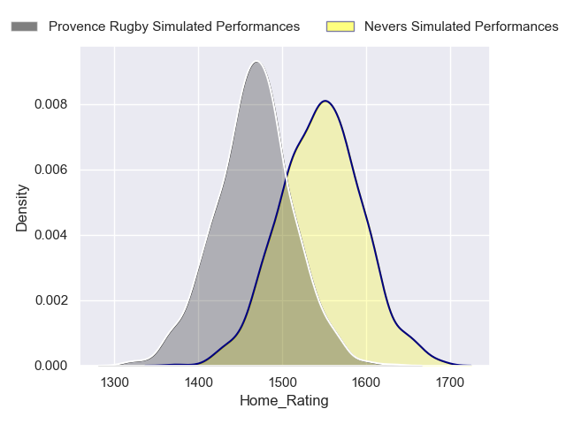
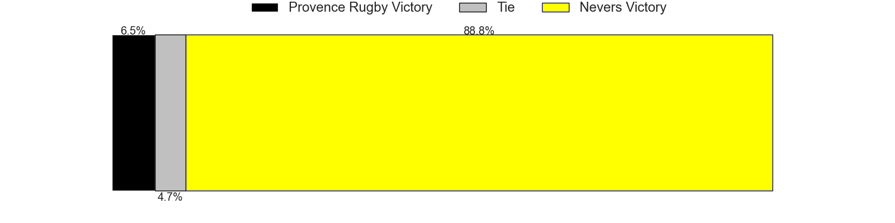
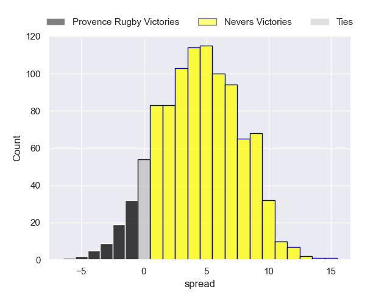

---  
title: "Pro D2 2023 Status"  
date: 2024-03-04 6:00:00 -0500  
categories: model review projection  
layout: article  
aside:  
    toc: true  
---
# Current Team Rankings

# Standings

## Current Standings

| Club                       |   Played |   Wins |   Point Differential |   Losing Bonus Points |   Try Bonus Points |   Competition Points |
|:---------------------------|---------:|-------:|---------------------:|----------------------:|-------------------:|---------------------:|
| Beziers                    |       22 |     14 |                  126 |                     4 |                  7 |                   69 |
| Vannes                     |       22 |     13 |                  203 |                     5 |                  9 |                   68 |
| Provence Rugby             |       22 |     15 |                   62 |                     1 |                  7 |                   68 |
| Mont-de-Marsan             |       22 |     13 |                  146 |                     6 |                  8 |                   66 |
| Nevers                     |       22 |     12 |                   47 |                     5 |                  6 |                   59 |
| Grenoble                   |       22 |     12 |                   37 |                     3 |                  7 |                   58 |
| Brive                      |       22 |     11 |                   34 |                     6 |                  6 |                   56 |
| Agen                       |       22 |     11 |                  -65 |                     3 |                  4 |                   53 |
| Aurillac                   |       22 |     11 |                  -84 |                     3 |                  2 |                   51 |
| Colomiers                  |       22 |     10 |                   53 |                     5 |                  3 |                   50 |
| Dax                        |       22 |     11 |                 -105 |                     2 |                  2 |                   50 |
| Valence Romans Drome Rugby |       22 |      9 |                   16 |                     5 |                  3 |                   44 |
| Montauban                  |       22 |      9 |                 -127 |                     3 |                  3 |                   42 |
| Soyaux-Angouleme           |       22 |      8 |                  -73 |                     6 |                  1 |                   41 |
| Biarritz Olympique         |       22 |      8 |                 -125 |                     4 |                  4 |                   40 |
| Rouen                      |       22 |      5 |                 -145 |                     7 |                  5 |                   34 |

## Projected Remaining Table

| Club                       |   Matches Remaining |   Wins |   Point Differential |   Losing Bonus Points |   Try Bonus Points |   Competition Points |
|:---------------------------|--------------------:|-------:|---------------------:|----------------------:|-------------------:|---------------------:|
| Vannes                     |                   8 |    7.4 |           50.5247    |                   0.6 |                4.4 |                 34.5 |
| Mont-de-Marsan             |                   8 |    6.2 |           36.1044    |                   1.8 |                2.7 |                 29.2 |
| Nevers                     |                   8 |    6   |           25.7909    |                   1.8 |                2.6 |                 28.6 |
| Beziers                    |                   8 |    5.4 |           18.6541    |                   2.4 |                3.2 |                 27.3 |
| Provence Rugby             |                   8 |    5.2 |           15.0815    |                   2.6 |                2.9 |                 26.3 |
| Brive                      |                   8 |    5.4 |           19.9017    |                   2.1 |                1.9 |                 25.4 |
| Grenoble                   |                   8 |    4.6 |            8.97508   |                   2.8 |                2.7 |                 23.8 |
| Agen                       |                   8 |    3.8 |            0.0199075 |                   3.4 |                2.3 |                 20.8 |
| Colomiers                  |                   8 |    3.5 |           -7.04221   |                   3.1 |                1.9 |                 19   |
| Valence Romans Drome Rugby |                   8 |    3.2 |           -9.89068   |                   3.8 |                1.8 |                 18.5 |
| Aurillac                   |                   8 |    2.6 |          -18.1626    |                   4   |                2.8 |                 17.2 |
| Biarritz Olympique         |                   8 |    2.9 |          -20.2356    |                   3.1 |                1.9 |                 16.4 |
| Dax                        |                   8 |    2.8 |          -22.879     |                   3   |                1.4 |                 15.5 |
| Soyaux-Angouleme           |                   8 |    1.9 |          -26.0916    |                   4.4 |                0.8 |                 12.8 |
| Rouen                      |                   8 |    1.8 |          -38.349     |                   3.3 |                1.6 |                 12.2 |
| Montauban                  |                   8 |    1.4 |          -32.4016    |                   4.6 |                0.9 |                 11.1 |

## Projected Total Table

| Club                       |   Total Matches |   Wins |   Point Differential |   Losing Bonus Points |   Try Bonus Points |   Competition Points |
|:---------------------------|----------------:|-------:|---------------------:|----------------------:|-------------------:|---------------------:|
| Vannes                     |              30 |   20.4 |            253.525   |                   5.6 |               13.4 |                102.5 |
| Beziers                    |              30 |   19.4 |            144.654   |                   6.4 |               10.2 |                 96.3 |
| Mont-de-Marsan             |              30 |   19.2 |            182.104   |                   7.8 |               10.7 |                 95.2 |
| Provence Rugby             |              30 |   20.2 |             77.0815  |                   3.6 |                9.9 |                 94.3 |
| Nevers                     |              30 |   18   |             72.7909  |                   6.8 |                8.6 |                 87.6 |
| Grenoble                   |              30 |   16.6 |             45.9751  |                   5.8 |                9.7 |                 81.8 |
| Brive                      |              30 |   16.4 |             53.9017  |                   8.1 |                7.9 |                 81.4 |
| Agen                       |              30 |   14.8 |            -64.9801  |                   6.4 |                6.3 |                 73.8 |
| Colomiers                  |              30 |   13.5 |             45.9578  |                   8.1 |                4.9 |                 69   |
| Aurillac                   |              30 |   13.6 |           -102.163   |                   7   |                4.8 |                 68.2 |
| Dax                        |              30 |   13.8 |           -127.879   |                   5   |                3.4 |                 65.5 |
| Valence Romans Drome Rugby |              30 |   12.2 |              6.10932 |                   8.8 |                4.8 |                 62.5 |
| Biarritz Olympique         |              30 |   10.9 |           -145.236   |                   7.1 |                5.9 |                 56.4 |
| Soyaux-Angouleme           |              30 |    9.9 |            -99.0916  |                  10.4 |                1.8 |                 53.8 |
| Montauban                  |              30 |   10.4 |           -159.402   |                   7.6 |                3.9 |                 53.1 |
| Rouen                      |              30 |    6.8 |           -183.349   |                  10.3 |                6.6 |                 46.2 |

# Completed Match Review

| Model | Percent Correct Predictions | Spread Error |
| ------ | ------ | ------ |
| Club Level | 77.3% | 11.2 |
| Player Level: Lineup | 78.4% | 11.3 |
| Player Level: Minutes | 77.8% | 11.0 |

# Future Predictions

## Week 23

### Nevers V Provence Rugby on 2024/03/07

Average Margin: Nevers by 4.0

Average Scoreline: 22-18

### Biarritz Olympique V Montauban on 2024/03/08

Average Margin: Biarritz Olympique by 4.9

Average Scoreline: 29-24

### Dax V Beziers on 2024/03/08

Average Margin: Beziers by 0.6

Average Scoreline: 23-23

### Rouen V Aurillac on 2024/03/08

Average Margin: Rouen by 0.9

Average Scoreline: 26-25

### Colomiers V Mont-de-Marsan on 2024/03/08

Average Margin: Colomiers by 0.2

Average Scoreline: 24-24

### Vannes V Grenoble on 2024/03/08

Average Margin: Vannes by 6.3

Average Scoreline: 29-22

### Soyaux-Angouleme V Valence Romans Drome Rugby on 2024/03/08

Average Margin: Soyaux-Angouleme by 1.6

Average Scoreline: 20-18

### Brive V Agen on 2024/03/08

Average Margin: Brive by 6.3

Average Scoreline: 25-19

## Week 24

### Montauban V Dax on 2024/03/29

Average Margin: Montauban by 2.1

Average Scoreline: 20-18

### Grenoble V Soyaux-Angouleme on 2024/03/29

Average Margin: Grenoble by 7.3

Average Scoreline: 21-14

### Agen V Rouen on 2024/03/29

Average Margin: Agen by 7.0

Average Scoreline: 29-22

### Mont-de-Marsan V Brive on 2024/03/29

Average Margin: Mont-de-Marsan by 4.4

Average Scoreline: 24-20

### Aurillac V Provence Rugby on 2024/03/29

Average Margin: Aurillac by 0.2

Average Scoreline: 27-26

### Vannes V Colomiers on 2024/03/29

Average Margin: Vannes by 7.6

Average Scoreline: 26-19

### Beziers V Biarritz Olympique on 2024/03/29

Average Margin: Beziers by 7.3

Average Scoreline: 29-22

### Valence Romans Drome Rugby V Nevers on 2024/03/29

Average Margin: Valence Romans Drome Rugby by 0.9

Average Scoreline: 23-22

## Week 25

### Biarritz Olympique V Aurillac on 2024/04/05

Average Margin: Biarritz Olympique by 3.1

Average Scoreline: 33-29

### Nevers V Grenoble on 2024/04/05

Average Margin: Nevers by 3.7

Average Scoreline: 30-26

### Rouen V Beziers on 2024/04/05

Average Margin: Beziers by 3.0

Average Scoreline: 20-17

### Colomiers V Agen on 2024/04/05

Average Margin: Colomiers by 4.1

Average Scoreline: 31-27

### Soyaux-Angouleme V Vannes on 2024/04/05

Average Margin: Vannes by 3.5

Average Scoreline: 28-24

### Valence Romans Drome Rugby V Mont-de-Marsan on 2024/04/05

Average Margin: Mont-de-Marsan by 0.9

Average Scoreline: 23-22

### Provence Rugby V Montauban on 2024/04/05

Average Margin: Provence Rugby by 8.0

Average Scoreline: 29-21

### Dax V Brive on 2024/04/05

Average Margin: Brive by 1.0

Average Scoreline: 24-23

## Week 26

### Montauban V Nevers on 2024/04/12

Average Margin: Nevers by 2.0

Average Scoreline: 23-21

### Beziers V Valence Romans Drome Rugby on 2024/04/12

Average Margin: Beziers by 6.0

Average Scoreline: 29-23

### Rouen V Provence Rugby on 2024/04/12

Average Margin: Provence Rugby by 2.1

Average Scoreline: 24-22

### Mont-de-Marsan V Biarritz Olympique on 2024/04/12

Average Margin: Mont-de-Marsan by 8.7

Average Scoreline: 30-22

### Agen V Soyaux-Angouleme on 2024/04/12

Average Margin: Agen by 5.1

Average Scoreline: 26-21

### Grenoble V Aurillac on 2024/04/12

Average Margin: Grenoble by 6.9

Average Scoreline: 31-24

### Vannes V Dax on 2024/04/12

Average Margin: Vannes by 10.0

Average Scoreline: 34-24

### Brive V Colomiers on 2024/04/12

Average Margin: Brive by 5.6

Average Scoreline: 27-21

## Week 27

### Soyaux-Angouleme V Brive on 2024/04/19

Average Margin: Brive by 1.5

Average Scoreline: 24-22

### Valence Romans Drome Rugby V Agen on 2024/04/19

Average Margin: Valence Romans Drome Rugby by 3.1

Average Scoreline: 28-24

### Nevers V Colomiers on 2024/04/19

Average Margin: Nevers by 5.2

Average Scoreline: 28-23

### Montauban V Vannes on 2024/04/19

Average Margin: Vannes by 4.2

Average Scoreline: 23-19

### Aurillac V Beziers on 2024/04/19

Average Margin: Beziers by 0.4

Average Scoreline: 22-22

### Biarritz Olympique V Grenoble on 2024/04/19

Average Margin: Grenoble by 0.1

Average Scoreline: 34-34

### Provence Rugby V Mont-de-Marsan on 2024/04/19

Average Margin: Provence Rugby by 1.1

Average Scoreline: 26-25

### Dax V Rouen on 2024/04/19

Average Margin: Dax by 5.5

Average Scoreline: 28-23

## Week 28

### Colomiers V Montauban on 2024/04/26

Average Margin: Colomiers by 7.0

Average Scoreline: 28-21

### Provence Rugby V Valence Romans Drome Rugby on 2024/04/26

Average Margin: Provence Rugby by 5.3

Average Scoreline: 31-25

### Grenoble V Beziers on 2024/04/26

Average Margin: Grenoble by 3.1

Average Scoreline: 25-21

### Brive V Aurillac on 2024/04/26

Average Margin: Brive by 7.6

Average Scoreline: 25-18

### Nevers V Soyaux-Angouleme on 2024/04/26

Average Margin: Nevers by 7.7

Average Scoreline: 27-19

### Mont-de-Marsan V Dax on 2024/04/26

Average Margin: Mont-de-Marsan by 8.9

Average Scoreline: 29-20

### Vannes V Rouen on 2024/04/26

Average Margin: Vannes by 11.9

Average Scoreline: 35-23

### Agen V Biarritz Olympique on 2024/04/26

Average Margin: Agen by 4.7

Average Scoreline: 31-26

## Week 29

### Montauban V Mont-de-Marsan on 2024/05/10

Average Margin: Mont-de-Marsan by 3.4

Average Scoreline: 26-22

### Dax V Agen on 2024/05/10

Average Margin: Dax by 1.7

Average Scoreline: 28-26

### Rouen V Soyaux-Angouleme on 2024/05/10

Average Margin: Rouen by 1.5

Average Scoreline: 22-20

### Beziers V Nevers on 2024/05/10

Average Margin: Beziers by 3.3

Average Scoreline: 20-17

### Biarritz Olympique V Provence Rugby on 2024/05/10

Average Margin: Biarritz Olympique by 0.3

Average Scoreline: 29-29

### Grenoble V Colomiers on 2024/05/10

Average Margin: Grenoble by 4.6

Average Scoreline: 28-24

### Valence Romans Drome Rugby V Aurillac on 2024/05/10

Average Margin: Valence Romans Drome Rugby by 4.4

Average Scoreline: 26-22

### Vannes V Brive on 2024/05/10

Average Margin: Vannes by 5.6

Average Scoreline: 27-22

## Week 30

### Mont-de-Marsan V Rouen on 2024/05/17

Average Margin: Mont-de-Marsan by 11.2

Average Scoreline: 33-22

### Soyaux-Angouleme V Beziers on 2024/05/17

Average Margin: Beziers by 1.0

Average Scoreline: 21-20

### Nevers V Dax on 2024/05/17

Average Margin: Nevers by 7.5

Average Scoreline: 27-20

### Brive V Biarritz Olympique on 2024/05/17

Average Margin: Brive by 7.7

Average Scoreline: 30-22

### Provence Rugby V Grenoble on 2024/05/17

Average Margin: Provence Rugby by 3.0

Average Scoreline: 33-30

### Aurillac V Montauban on 2024/05/17

Average Margin: Aurillac by 4.9

Average Scoreline: 29-24

### Agen V Vannes on 2024/05/17

Average Margin: Vannes by 1.6

Average Scoreline: 24-22

### Colomiers V Valence Romans Drome Rugby on 2024/05/17

Average Margin: Colomiers by 4.5

Average Scoreline: 30-26

