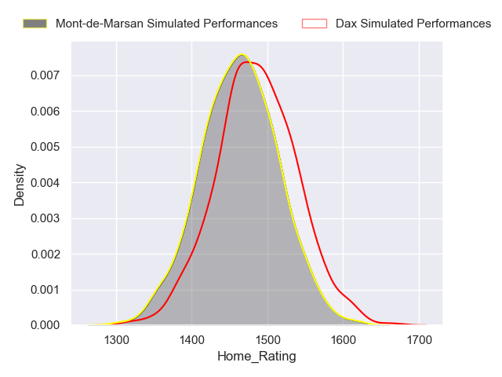
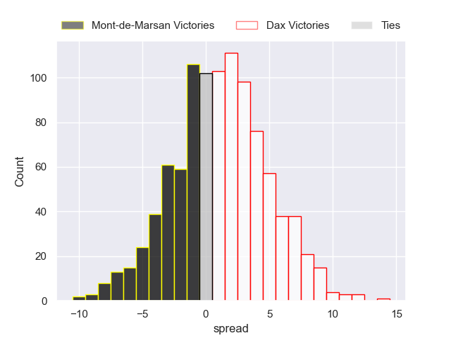

---  
title: "Pro D2 2024 Status"  
date: 2024-11-11 6:00:00 -0500  
categories: model review projection  
layout: article  
aside:  
    toc: true  
---
# Current Team Rankings

# Standings

## Current Standings

| Club                       |   Played |   Wins |   Point Differential |   Losing Bonus Points |   Try Bonus Points |   Competition Points |
|:---------------------------|---------:|-------:|---------------------:|----------------------:|-------------------:|---------------------:|
| Montauban                  |       10 |      7 |                   23 |                     2 |                  4 |                   34 |
| Provence Rugby             |       10 |      6 |                   53 |                     2 |                  3 |                   31 |
| Grenoble                   |       10 |      7 |                   34 |                     1 |                  2 |                   31 |
| Brive                      |       10 |      6 |                   48 |                     2 |                  4 |                   30 |
| Soyaux-Angouleme           |       10 |      6 |                   10 |                     1 |                  3 |                   28 |
| Beziers                    |       10 |      5 |                   61 |                     5 |                  2 |                   27 |
| Biarritz Olympique         |       10 |      6 |                   15 |                     1 |                  2 |                   27 |
| Colomiers                  |       10 |      5 |                  -23 |                     2 |                  1 |                   25 |
| Agen                       |       10 |      4 |                   -2 |                     5 |                  3 |                   24 |
| Dax                        |       10 |      5 |                  -27 |                     2 |                  1 |                   23 |
| Mont-de-Marsan             |       10 |      4 |                   17 |                     4 |                  2 |                   22 |
| Nevers                     |       10 |      4 |                  -49 |                     3 |                  1 |                   20 |
| Oyonnax                    |       10 |      4 |                  -16 |                     2 |                  1 |                   19 |
| Aurillac                   |       10 |      4 |                  -51 |                     2 |                  1 |                   19 |
| Valence Romans Drome Rugby |       10 |      3 |                  -19 |                     5 |                  1 |                   18 |
| Nice                       |       10 |      3 |                  -74 |                     4 |                  1 |                   17 |

## Projected Remaining Table

| Club                       |   Matches Remaining |   Wins |   Point Differential |   Losing Bonus Points |   Try Bonus Points |   Competition Points |
|:---------------------------|--------------------:|-------:|---------------------:|----------------------:|-------------------:|---------------------:|
| Grenoble                   |                  20 |   13.3 |             69.5858  |                   4.3 |                9.4 |                 66.9 |
| Provence Rugby             |                  20 |   12.6 |             55.3915  |                   4.8 |                7.3 |                 62.5 |
| Oyonnax                    |                  20 |   12.4 |             50.3998  |                   4.9 |                7   |                 61.6 |
| Brive                      |                  20 |   12.7 |             55.0114  |                   4.6 |                4.8 |                 60.2 |
| Beziers                    |                  20 |   11.4 |             32.5142  |                   5.4 |                6.4 |                 57.6 |
| Mont-de-Marsan             |                  20 |   10.2 |              5.02706 |                   6.1 |                5.8 |                 52.8 |
| Nevers                     |                  20 |    9.6 |             -7.47824 |                   6.2 |                6   |                 50.7 |
| Agen                       |                  20 |    9.3 |            -12.8172  |                   6.6 |                5.2 |                 49.1 |
| Colomiers                  |                  20 |    9.6 |             -9.87614 |                   6.5 |                4.2 |                 48.9 |
| Biarritz Olympique         |                  20 |    9.1 |            -20.7606  |                   6.5 |                5.2 |                 48   |
| Dax                        |                  20 |    9   |            -20.1943  |                   6.7 |                5.1 |                 47.8 |
| Soyaux-Angouleme           |                  20 |    9.4 |            -13.7065  |                   6.2 |                2.9 |                 46.8 |
| Valence Romans Drome Rugby |                  20 |    8.3 |            -35.2854  |                   6.7 |                4.8 |                 44.9 |
| Nice                       |                  20 |    7.7 |            -48.5598  |                   6.7 |                4.4 |                 42   |
| Montauban                  |                  20 |    7.7 |            -47.7261  |                   6.9 |                4.1 |                 41.8 |
| Aurillac                   |                  20 |    7.5 |            -51.5255  |                   6.9 |                3.8 |                 40.8 |

## Projected Total Table

| Club                       |   Total Matches |   Wins |   Point Differential |   Losing Bonus Points |   Try Bonus Points |   Competition Points |
|:---------------------------|----------------:|-------:|---------------------:|----------------------:|-------------------:|---------------------:|
| Grenoble                   |              30 |   20.3 |            103.586   |                   5.3 |               11.4 |                 97.9 |
| Provence Rugby             |              30 |   18.6 |            108.391   |                   6.8 |               10.3 |                 93.5 |
| Brive                      |              30 |   18.7 |            103.011   |                   6.6 |                8.8 |                 90.2 |
| Beziers                    |              30 |   16.4 |             93.5142  |                  10.4 |                8.4 |                 84.6 |
| Oyonnax                    |              30 |   16.4 |             34.3998  |                   6.9 |                8   |                 80.6 |
| Montauban                  |              30 |   14.7 |            -24.7261  |                   8.9 |                8.1 |                 75.8 |
| Biarritz Olympique         |              30 |   15.1 |             -5.76057 |                   7.5 |                7.2 |                 75   |
| Mont-de-Marsan             |              30 |   14.2 |             22.0271  |                  10.1 |                7.8 |                 74.8 |
| Soyaux-Angouleme           |              30 |   15.4 |             -3.70652 |                   7.2 |                5.9 |                 74.8 |
| Colomiers                  |              30 |   14.6 |            -32.8761  |                   8.5 |                5.2 |                 73.9 |
| Agen                       |              30 |   13.3 |            -14.8172  |                  11.6 |                8.2 |                 73.1 |
| Dax                        |              30 |   14   |            -47.1943  |                   8.7 |                6.1 |                 70.8 |
| Nevers                     |              30 |   13.6 |            -56.4782  |                   9.2 |                7   |                 70.7 |
| Valence Romans Drome Rugby |              30 |   11.3 |            -54.2854  |                  11.7 |                5.8 |                 62.9 |
| Aurillac                   |              30 |   11.5 |           -102.525   |                   8.9 |                4.8 |                 59.8 |
| Nice                       |              30 |   10.7 |           -122.56    |                  10.7 |                5.4 |                 59   |

# Completed Match Review

| Model | Percent Correct Predictions | Spread Error |
| ------ | ------ | ------ |
| Club Level | 61.3% | 9.5 |
| Player Level: Lineup | 67.1% | 11.4 |
| Player Level: Minutes | 68.5% | 11.2 |

# Future Predictions

## Week 11

### Agen V Montauban on 2024/11/14

Average Margin: Agen by 5.0

Average Scoreline: 31-26

### Valence Romans Drome Rugby V Oyonnax on 2024/11/15

Average Margin: Oyonnax by 0.2

Average Scoreline: 24-23

### Colomiers V Beziers on 2024/11/15

Average Margin: Colomiers by 1.7

Average Scoreline: 23-21

### Biarritz Olympique V Provence Rugby on 2024/11/15

Average Margin: Biarritz Olympique by 0.1

Average Scoreline: 23-22

### Aurillac V Nevers on 2024/11/15

Average Margin: Aurillac by 1.0

Average Scoreline: 26-25

### Grenoble V Soyaux-Angouleme on 2024/11/15

Average Margin: Grenoble by 8.0

Average Scoreline: 36-28

### Nice V Brive on 2024/11/15

Average Margin: Nice by 0.3

Average Scoreline: 25-24

### Dax V Mont-de-Marsan on 2024/11/16

Average Margin: Dax by 2.1

Average Scoreline: 22-20

## Week 12

### Beziers V Agen on 2024/11/29

Average Margin: Beziers by 6.7

Average Scoreline: 29-23

### Brive V Montauban on 2024/11/29

Average Margin: Brive by 9.8

Average Scoreline: 33-24

### Oyonnax V Mont-de-Marsan on 2024/11/29

Average Margin: Oyonnax by 5.8

Average Scoreline: 28-22

### Grenoble V Colomiers on 2024/11/29

Average Margin: Grenoble by 7.8

Average Scoreline: 35-27

### Biarritz Olympique V Aurillac on 2024/11/29

Average Margin: Biarritz Olympique by 5.8

Average Scoreline: 29-23

### Nevers V Dax on 2024/11/29

Average Margin: Nevers by 4.8

Average Scoreline: 25-20

### Soyaux-Angouleme V Valence Romans Drome Rugby on 2024/11/29

Average Margin: Soyaux-Angouleme by 5.0

Average Scoreline: 28-23

### Provence Rugby V Nice on 2024/11/29

Average Margin: Provence Rugby by 9.5

Average Scoreline: 35-26

## Week 13

### Aurillac V Valence Romans Drome Rugby on 2024/12/06

Average Margin: Aurillac by 2.4

Average Scoreline: 25-22

### Mont-de-Marsan V Grenoble on 2024/12/06

Average Margin: Mont-de-Marsan by 0.9

Average Scoreline: 30-29

### Nice V Nevers on 2024/12/06

Average Margin: Nice by 1.6

Average Scoreline: 24-23

### Brive V Beziers on 2024/12/06

Average Margin: Brive by 5.1

Average Scoreline: 30-24

### Montauban V Soyaux-Angouleme on 2024/12/06

Average Margin: Montauban by 2.0

Average Scoreline: 27-25

### Colomiers V Provence Rugby on 2024/12/06

Average Margin: Colomiers by 0.2

Average Scoreline: 21-21

### Agen V Oyonnax on 2024/12/06

Average Margin: Agen by 0.6

Average Scoreline: 27-27

### Dax V Biarritz Olympique on 2024/12/06

Average Margin: Dax by 4.0

Average Scoreline: 30-26

## Week 14

### Valence Romans Drome Rugby V Mont-de-Marsan on 2024/12/13

Average Margin: Valence Romans Drome Rugby by 1.1

Average Scoreline: 26-24

### Beziers V Montauban on 2024/12/13

Average Margin: Beziers by 7.8

Average Scoreline: 29-21

### Oyonnax V Soyaux-Angouleme on 2024/12/13

Average Margin: Oyonnax by 7.2

Average Scoreline: 32-24

### Agen V Aurillac on 2024/12/13

Average Margin: Agen by 5.5

Average Scoreline: 29-24

### Dax V Provence Rugby on 2024/12/13

Average Margin: Dax by 0.8

Average Scoreline: 22-21

### Biarritz Olympique V Nice on 2024/12/13

Average Margin: Biarritz Olympique by 4.1

Average Scoreline: 28-24

### Nevers V Colomiers on 2024/12/13

Average Margin: Nevers by 4.2

Average Scoreline: 24-20

### Grenoble V Brive on 2024/12/13

Average Margin: Grenoble by 3.8

Average Scoreline: 30-26

## Week 15

### Brive V Agen on 2024/12/20

Average Margin: Brive by 8.0

Average Scoreline: 32-24

### Montauban V Oyonnax on 2024/12/20

Average Margin: Montauban by 0.7

Average Scoreline: 28-27

### Mont-de-Marsan V Beziers on 2024/12/20

Average Margin: Mont-de-Marsan by 3.5

Average Scoreline: 26-22

### Aurillac V Dax on 2024/12/20

Average Margin: Aurillac by 1.3

Average Scoreline: 27-25

### Colomiers V Biarritz Olympique on 2024/12/20

Average Margin: Colomiers by 4.6

Average Scoreline: 29-24

### Provence Rugby V Valence Romans Drome Rugby on 2024/12/20

Average Margin: Provence Rugby by 9.1

Average Scoreline: 32-23

### Nice V Grenoble on 2024/12/20

Average Margin: Nice by 0.2

Average Scoreline: 30-30

### Soyaux-Angouleme V Nevers on 2024/12/20

Average Margin: Soyaux-Angouleme by 3.9

Average Scoreline: 24-20

## Week 16

### Beziers V Nice on 2025/01/10

Average Margin: Beziers by 8.4

Average Scoreline: 30-22

### Nevers V Mont-de-Marsan on 2025/01/10

Average Margin: Nevers by 2.6

Average Scoreline: 24-22

### Valence Romans Drome Rugby V Colomiers on 2025/01/10

Average Margin: Valence Romans Drome Rugby by 2.5

Average Scoreline: 28-26

### Dax V Brive on 2025/01/10

Average Margin: Dax by 0.5

Average Scoreline: 23-23

### Grenoble V Montauban on 2025/01/10

Average Margin: Grenoble by 9.5

Average Scoreline: 36-27

### Oyonnax V Aurillac on 2025/01/10

Average Margin: Oyonnax by 9.4

Average Scoreline: 35-26

### Biarritz Olympique V Soyaux-Angouleme on 2025/01/10

Average Margin: Biarritz Olympique by 3.0

Average Scoreline: 28-25

### Agen V Provence Rugby on 2025/01/10

Average Margin: Provence Rugby by 0.0

Average Scoreline: 24-24

## Week 17

### Colomiers V Dax on 2025/01/17

Average Margin: Colomiers by 4.0

Average Scoreline: 27-23

### Agen V Biarritz Olympique on 2025/01/17

Average Margin: Agen by 3.6

Average Scoreline: 30-26

### Nice V Oyonnax on 2025/01/17

Average Margin: Nice by 0.7

Average Scoreline: 27-26

### Provence Rugby V Grenoble on 2025/01/17

Average Margin: Provence Rugby by 3.8

Average Scoreline: 35-31

### Soyaux-Angouleme V Beziers on 2025/01/17

Average Margin: Soyaux-Angouleme by 1.6

Average Scoreline: 24-23

### Montauban V Valence Romans Drome Rugby on 2025/01/17

Average Margin: Montauban by 3.5

Average Scoreline: 30-27

### Brive V Nevers on 2025/01/17

Average Margin: Brive by 8.1

Average Scoreline: 35-26

### Aurillac V Mont-de-Marsan on 2025/01/17

Average Margin: Aurillac by 0.2

Average Scoreline: 29-29

## Week 18

### Beziers V Colomiers on 2025/01/24

Average Margin: Beziers by 5.9

Average Scoreline: 30-24

### Soyaux-Angouleme V Dax on 2025/01/24

Average Margin: Soyaux-Angouleme by 5.0

Average Scoreline: 27-22

### Oyonnax V Brive on 2025/01/24

Average Margin: Oyonnax by 2.5

Average Scoreline: 28-26

### Mont-de-Marsan V Montauban on 2025/01/24

Average Margin: Mont-de-Marsan by 6.8

Average Scoreline: 33-26

### Nevers V Agen on 2025/01/24

Average Margin: Nevers by 4.6

Average Scoreline: 26-22

### Valence Romans Drome Rugby V Nice on 2025/01/24

Average Margin: Valence Romans Drome Rugby by 4.6

Average Scoreline: 31-26

### Aurillac V Provence Rugby on 2025/01/24

Average Margin: Aurillac by 0.4

Average Scoreline: 27-27

### Grenoble V Biarritz Olympique on 2025/01/24

Average Margin: Grenoble by 8.4

Average Scoreline: 36-28

## Week 19

### Dax V Valence Romans Drome Rugby on 2025/02/07

Average Margin: Dax by 4.2

Average Scoreline: 33-29

### Biarritz Olympique V Mont-de-Marsan on 2025/02/07

Average Margin: Biarritz Olympique by 1.7

Average Scoreline: 29-27

### Beziers V Oyonnax on 2025/02/07

Average Margin: Beziers by 3.2

Average Scoreline: 31-28

### Nice V Aurillac on 2025/02/07

Average Margin: Nice by 4.4

Average Scoreline: 36-31

### Brive V Soyaux-Angouleme on 2025/02/07

Average Margin: Brive by 7.2

Average Scoreline: 29-22

### Colomiers V Grenoble on 2025/02/07

Average Margin: Colomiers by 0.8

Average Scoreline: 33-32

### Montauban V Agen on 2025/02/07

Average Margin: Montauban by 2.4

Average Scoreline: 31-28

### Provence Rugby V Nevers on 2025/02/07

Average Margin: Provence Rugby by 7.3

Average Scoreline: 27-19

## Week 20

### Mont-de-Marsan V Provence Rugby on 2025/02/14

Average Margin: Mont-de-Marsan by 1.4

Average Scoreline: 27-26

### Soyaux-Angouleme V Colomiers on 2025/02/14

Average Margin: Soyaux-Angouleme by 3.9

Average Scoreline: 27-23

### Oyonnax V Dax on 2025/02/14

Average Margin: Oyonnax by 6.9

Average Scoreline: 35-28

### Brive V Nice on 2025/02/14

Average Margin: Brive by 9.3

Average Scoreline: 34-25

### Grenoble V Aurillac on 2025/02/14

Average Margin: Grenoble by 10.0

Average Scoreline: 39-29

### Agen V Beziers on 2025/02/14

Average Margin: Agen by 1.5

Average Scoreline: 29-28

### Montauban V Nevers on 2025/02/14

Average Margin: Montauban by 1.7

Average Scoreline: 26-24

### Valence Romans Drome Rugby V Biarritz Olympique on 2025/02/14

Average Margin: Valence Romans Drome Rugby by 4.2

Average Scoreline: 31-27

## Week 21

### Nice V Montauban on 2025/02/21

Average Margin: Nice by 3.7

Average Scoreline: 34-30

### Aurillac V Agen on 2025/02/21

Average Margin: Aurillac by 1.9

Average Scoreline: 28-26

### Nevers V Oyonnax on 2025/02/21

Average Margin: Nevers by 1.5

Average Scoreline: 26-24

### Beziers V Valence Romans Drome Rugby on 2025/02/21

Average Margin: Beziers by 7.4

Average Scoreline: 30-23

### Biarritz Olympique V Brive on 2025/02/21

Average Margin: Biarritz Olympique by 1.0

Average Scoreline: 28-27

### Dax V Grenoble on 2025/02/21

Average Margin: Dax by 0.5

Average Scoreline: 31-31

### Provence Rugby V Soyaux-Angouleme on 2025/02/21

Average Margin: Provence Rugby by 8.0

Average Scoreline: 30-22

### Colomiers V Mont-de-Marsan on 2025/02/21

Average Margin: Colomiers by 2.9

Average Scoreline: 26-23

## Week 22

### Montauban V Provence Rugby on 2025/02/28

Average Margin: Montauban by 0.3

Average Scoreline: 30-29

### Mont-de-Marsan V Nice on 2025/02/28

Average Margin: Mont-de-Marsan by 7.5

Average Scoreline: 31-24

### Oyonnax V Biarritz Olympique on 2025/02/28

Average Margin: Oyonnax by 7.6

Average Scoreline: 35-27

### Dax V Nevers on 2025/02/28

Average Margin: Dax by 3.1

Average Scoreline: 29-26

### Grenoble V Beziers on 2025/02/28

Average Margin: Grenoble by 6.3

Average Scoreline: 38-31

### Soyaux-Angouleme V Aurillac on 2025/02/28

Average Margin: Soyaux-Angouleme by 5.6

Average Scoreline: 31-26

### Agen V Valence Romans Drome Rugby on 2025/02/28

Average Margin: Agen by 4.9

Average Scoreline: 31-26

### Colomiers V Brive on 2025/02/28

Average Margin: Colomiers by 0.1

Average Scoreline: 26-26

## Week 23

### Valence Romans Drome Rugby V Aurillac on 2025/03/07

Average Margin: Valence Romans Drome Rugby by 5.4

Average Scoreline: 36-30

### Nice V Agen on 2025/03/07

Average Margin: Nice by 2.4

Average Scoreline: 32-29

### Beziers V Nevers on 2025/03/07

Average Margin: Beziers by 6.1

Average Scoreline: 28-22

### Biarritz Olympique V Dax on 2025/03/07

Average Margin: Biarritz Olympique by 3.9

Average Scoreline: 35-31

### Provence Rugby V Colomiers on 2025/03/07

Average Margin: Provence Rugby by 7.1

Average Scoreline: 32-25

### Brive V Mont-de-Marsan on 2025/03/07

Average Margin: Brive by 5.8

Average Scoreline: 35-29

### Oyonnax V Montauban on 2025/03/07

Average Margin: Oyonnax by 8.6

Average Scoreline: 31-22

### Soyaux-Angouleme V Grenoble on 2025/03/07

Average Margin: Soyaux-Angouleme by 0.2

Average Scoreline: 27-27

## Week 24

### Colomiers V Oyonnax on 2025/03/28

Average Margin: Colomiers by 1.1

Average Scoreline: 27-26

### Mont-de-Marsan V Soyaux-Angouleme on 2025/03/28

Average Margin: Mont-de-Marsan by 5.0

Average Scoreline: 31-26

### Agen V Grenoble on 2025/03/28

Average Margin: Agen by 0.2

Average Scoreline: 29-29

### Nevers V Nice on 2025/03/28

Average Margin: Nevers by 5.6

Average Scoreline: 29-24

### Valence Romans Drome Rugby V Provence Rugby on 2025/03/28

Average Margin: Valence Romans Drome Rugby by 0.8

Average Scoreline: 28-27

### Montauban V Brive on 2025/03/28

Average Margin: Montauban by 0.5

Average Scoreline: 28-27

### Aurillac V Biarritz Olympique on 2025/03/28

Average Margin: Aurillac by 2.6

Average Scoreline: 34-31

### Dax V Beziers on 2025/03/28

Average Margin: Dax by 1.5

Average Scoreline: 33-31

## Week 25

### Colomiers V Nevers on 2025/04/04

Average Margin: Colomiers by 4.0

Average Scoreline: 30-26

### Grenoble V Mont-de-Marsan on 2025/04/04

Average Margin: Grenoble by 6.2

Average Scoreline: 39-32

### Biarritz Olympique V Montauban on 2025/04/04

Average Margin: Biarritz Olympique by 5.0

Average Scoreline: 40-35

### Soyaux-Angouleme V Nice on 2025/04/04

Average Margin: Soyaux-Angouleme by 5.1

Average Scoreline: 31-26

### Brive V Valence Romans Drome Rugby on 2025/04/04

Average Margin: Brive by 8.6

Average Scoreline: 35-26

### Beziers V Aurillac on 2025/04/04

Average Margin: Beziers by 8.5

Average Scoreline: 36-28

### Provence Rugby V Dax on 2025/04/04

Average Margin: Provence Rugby by 8.2

Average Scoreline: 32-24

### Oyonnax V Agen on 2025/04/04

Average Margin: Oyonnax by 6.8

Average Scoreline: 33-27

## Week 26

### Agen V Brive on 2025/04/11

Average Margin: Agen by 1.3

Average Scoreline: 29-28

### Mont-de-Marsan V Oyonnax on 2025/04/11

Average Margin: Mont-de-Marsan by 2.6

Average Scoreline: 29-27

### Nevers V Soyaux-Angouleme on 2025/04/11

Average Margin: Nevers by 4.0

Average Scoreline: 27-23

### Montauban V Dax on 2025/04/11

Average Margin: Montauban by 2.8

Average Scoreline: 33-30

### Valence Romans Drome Rugby V Grenoble on 2025/04/11

Average Margin: Valence Romans Drome Rugby by 0.7

Average Scoreline: 31-30

### Nice V Biarritz Olympique on 2025/04/11

Average Margin: Nice by 2.8

Average Scoreline: 33-30

### Provence Rugby V Beziers on 2025/04/11

Average Margin: Provence Rugby by 5.0

Average Scoreline: 31-26

### Aurillac V Colomiers on 2025/04/11

Average Margin: Aurillac by 2.1

Average Scoreline: 30-28

## Week 27

### Soyaux-Angouleme V Montauban on 2025/04/18

Average Margin: Soyaux-Angouleme by 5.7

Average Scoreline: 36-30

### Oyonnax V Valence Romans Drome Rugby on 2025/04/18

Average Margin: Oyonnax by 8.5

Average Scoreline: 36-28

### Beziers V Mont-de-Marsan on 2025/04/18

Average Margin: Beziers by 4.3

Average Scoreline: 33-29

### Brive V Provence Rugby on 2025/04/18

Average Margin: Brive by 3.3

Average Scoreline: 32-29

### Dax V Aurillac on 2025/04/18

Average Margin: Dax by 6.0

Average Scoreline: 41-35

### Grenoble V Nice on 2025/04/18

Average Margin: Grenoble by 9.2

Average Scoreline: 42-32

### Colomiers V Agen on 2025/04/18

Average Margin: Colomiers by 4.7

Average Scoreline: 32-27

### Nevers V Biarritz Olympique on 2025/04/18

Average Margin: Nevers by 4.5

Average Scoreline: 31-26

## Week 28

### Mont-de-Marsan V Dax on 2025/04/25

Average Margin: Mont-de-Marsan by 5.9

Average Scoreline: 34-28

### Grenoble V Oyonnax on 2025/04/25

Average Margin: Grenoble by 4.2

Average Scoreline: 35-31

### Agen V Soyaux-Angouleme on 2025/04/25

Average Margin: Agen by 3.8

Average Scoreline: 30-26

### Nice V Provence Rugby on 2025/04/25

Average Margin: Nice by 0.4

Average Scoreline: 30-30

### Montauban V Colomiers on 2025/04/25

Average Margin: Montauban by 2.3

Average Scoreline: 34-32

### Biarritz Olympique V Beziers on 2025/04/25

Average Margin: Biarritz Olympique by 1.4

Average Scoreline: 31-30

### Valence Romans Drome Rugby V Nevers on 2025/04/25

Average Margin: Valence Romans Drome Rugby by 2.3

Average Scoreline: 31-29

### Aurillac V Brive on 2025/04/25

Average Margin: Aurillac by 0.4

Average Scoreline: 32-31

## Week 29

### Soyaux-Angouleme V Oyonnax on 2025/05/09

Average Margin: Soyaux-Angouleme by 1.4

Average Scoreline: 31-30

### Provence Rugby V Biarritz Olympique on 2025/05/09

Average Margin: Provence Rugby by 8.1

Average Scoreline: 35-27

### Colomiers V Nice on 2025/05/09

Average Margin: Colomiers by 5.3

Average Scoreline: 33-28

### Montauban V Beziers on 2025/05/09

Average Margin: Montauban by 1.2

Average Scoreline: 31-30

### Nevers V Aurillac on 2025/05/09

Average Margin: Nevers by 6.5

Average Scoreline: 31-25

### Dax V Agen on 2025/05/09

Average Margin: Dax by 3.4

Average Scoreline: 34-30

### Mont-de-Marsan V Valence Romans Drome Rugby on 2025/05/09

Average Margin: Mont-de-Marsan by 5.9

Average Scoreline: 34-28

### Brive V Grenoble on 2025/05/09

Average Margin: Brive by 3.2

Average Scoreline: 29-26

## Week 30

### Agen V Mont-de-Marsan on 2025/05/16

Average Margin: Agen by 1.7

Average Scoreline: 28-26

### Biarritz Olympique V Colomiers on 2025/05/16

Average Margin: Biarritz Olympique by 3.3

Average Scoreline: 34-31

### Beziers V Brive on 2025/05/16

Average Margin: Beziers by 3.0

Average Scoreline: 34-31

### Oyonnax V Provence Rugby on 2025/05/16

Average Margin: Oyonnax by 3.0

Average Scoreline: 35-32

### Nice V Dax on 2025/05/16

Average Margin: Nice by 3.5

Average Scoreline: 32-29

### Valence Romans Drome Rugby V Soyaux-Angouleme on 2025/05/16

Average Margin: Valence Romans Drome Rugby by 2.9

Average Scoreline: 32-29

### Grenoble V Nevers on 2025/05/16

Average Margin: Grenoble by 6.6

Average Scoreline: 33-26

### Aurillac V Montauban on 2025/05/16

Average Margin: Aurillac by 3.1

Average Scoreline: 36-32

